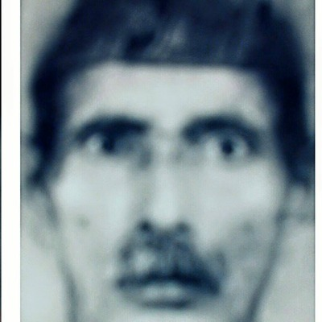
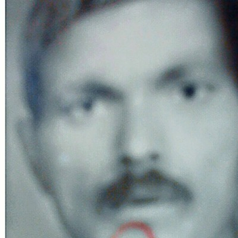
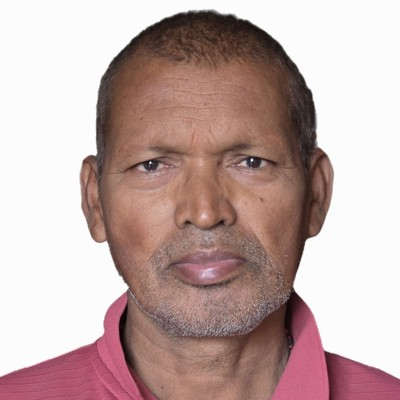
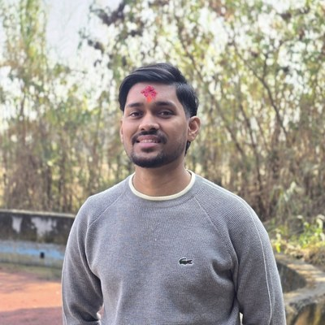
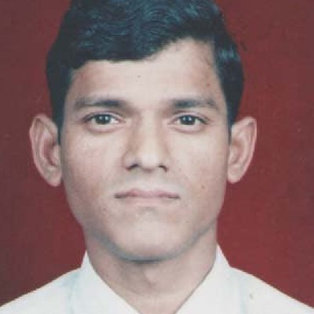
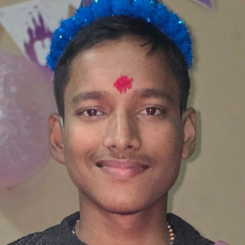

# वंशावली · Family Tree

Seven generations, from **लालजी यादव** down to today. Photographs survive for the last
four generations — the three oldest names are carried by memory alone.

<style>
.ftree{--ft-line:var(--rule,#e3e1dc);--ft-card:var(--surface,#fff);--ft-ink:var(--ink,#1b1b1f);--ft-mut:var(--muted,#6b6b73);--ft-acc:var(--accent,#5b4b9e);--ft-soft:var(--accent-soft,rgba(91,75,158,.10));margin:2rem 0;overflow-x:auto;padding:6px 2px 10px}
.ftree ul{position:relative;display:flex;justify-content:center;gap:14px;margin:0;padding:26px 0 0;list-style:none}
.ftree>ul{padding-top:0}
.ftree li{list-style:none;position:relative;padding:26px 8px 0;text-align:center}
.ftree li::before,.ftree li::after{content:"";position:absolute;top:0;right:50%;width:50%;height:26px;border-top:2px solid var(--ft-line)}
.ftree li::after{right:auto;left:50%;border-left:2px solid var(--ft-line)}
.ftree li:first-child::before,.ftree li:last-child::after{border:0 none}
.ftree li:last-child::before{border-right:2px solid var(--ft-line);border-radius:0 7px 0 0}
.ftree li:first-child::after{border-radius:7px 0 0 0}
.ftree li:only-child::before{display:none}
.ftree li:only-child::after{left:50%;right:auto;width:0;border-top:0;border-radius:0}
.ftree ul ul::before{content:"";position:absolute;top:0;left:50%;width:0;height:26px;border-left:2px solid var(--ft-line)}
.ftree>ul>li{padding-top:0}
.ftree>ul>li::before,.ftree>ul>li::after{display:none}
.ftree .node{display:inline-block}
.ftree .p{display:flex;flex-direction:column;align-items:center;gap:7px;min-width:132px;padding:12px 14px 11px;border:1px solid var(--ft-line);border-radius:16px;background:var(--ft-card);text-decoration:none;color:inherit;transition:transform .18s ease,box-shadow .18s ease,border-color .18s ease}
.ftree a.p:hover{transform:translateY(-3px);border-color:var(--ft-acc);box-shadow:0 10px 26px rgba(0,0,0,.10);text-decoration:none}
.ftree .txt{display:flex;flex-direction:column;align-items:center;gap:2px;min-width:0}
.ftree .ava{width:86px;height:86px;border-radius:50%;overflow:hidden;display:flex;align-items:center;justify-content:center;background:var(--ft-soft);box-shadow:0 0 0 3px var(--ft-card),0 0 0 4px var(--ft-line);transition:box-shadow .18s ease;flex:0 0 auto}
.ftree a.p:hover .ava{box-shadow:0 0 0 3px var(--ft-card),0 0 0 4px var(--ft-acc)}
.ftree .ava img{width:100%;height:100%;object-fit:cover;display:block}
.ftree .mono{font-size:2rem;font-weight:600;color:var(--ft-acc);opacity:.65;background:linear-gradient(145deg,var(--ft-soft),transparent)}
.ftree .nm{font-weight:650;font-size:.97rem;line-height:1.25;color:var(--ft-ink)}
.ftree .rn{font-size:.72rem;color:var(--ft-mut);letter-spacing:.02em}
.ftree .gen{font-size:.6rem;text-transform:uppercase;letter-spacing:.11em;color:var(--ft-mut);opacity:.75}
.ftree .me{border-color:var(--ft-acc);background:var(--ft-soft)}
.ftree .me .ava{box-shadow:0 0 0 3px var(--ft-card),0 0 0 4px var(--ft-acc)}
@media (max-width:700px){
  .ftree{overflow-x:visible;padding:4px 0}
  .ftree ul{display:block;padding:0 0 0 24px;margin:0}
  .ftree>ul{padding-left:0}
  .ftree li{padding:10px 0 0;text-align:left}
  .ftree li::before,.ftree li::after{display:none}
  .ftree ul ul::before{content:"";position:absolute;left:0;top:0;bottom:20px;width:0;height:auto;border-left:2px solid var(--ft-line)}
  .ftree ul ul>li::before{content:"";display:block;position:absolute;left:-24px;top:38px;width:17px;height:0;border-top:2px solid var(--ft-line)}
  .ftree .node{display:block}
  .ftree .p{flex-direction:row;align-items:center;gap:12px;min-width:0;padding:9px 12px;text-align:left;border-radius:14px}
  .ftree a.p:hover{transform:none}
  .ftree .ava{width:54px;height:54px}
  .ftree .mono{font-size:1.35rem}
  .ftree .txt{align-items:flex-start;gap:1px}
  .ftree .nm{font-size:.92rem}
  .ftree .rn{font-size:.68rem}
}
</style>

<div class="ftree"><ul><li><div class="node"><span class="p"><span class="ava mono">ल</span><span class="txt"><span class="nm">लालजी यादव</span><span class="rn">Lalji Yadav</span><span class="gen">पुस्ता १</span></span></span></div><ul><li><div class="node"><span class="p"><span class="ava mono">ब</span><span class="txt"><span class="nm">बरोहन यादव</span><span class="rn">Barohan Yadav</span><span class="gen">पुस्ता २</span></span></span></div><ul><li><div class="node"><span class="p"><span class="ava mono">ग</span><span class="txt"><span class="nm">गढई यादव</span><span class="rn">Gadhai Yadav</span><span class="gen">पुस्ता ३</span></span></span></div><ul><li><div class="node"><a class="p" href="https://www.facebook.com/photo.php?fbid=1727523260868830&amp;set=pb.100008335182748.-2207520000&amp;type=3" target="_blank" rel="noopener"><span class="ava"></span><span class="txt"><span class="nm">राजदेव यादव</span><span class="rn">Rajdev Yadav</span><span class="gen">पुस्ता ४</span></span></a></div><ul><li><div class="node"><a class="p" href="https://www.facebook.com/photo.php?fbid=1727523260868830&amp;set=pb.100008335182748.-2207520000&amp;type=3" target="_blank" rel="noopener"><span class="ava"></span><span class="txt"><span class="nm">जीरेखन यादव</span><span class="rn">Jirekhan Yadav</span><span class="gen">पुस्ता ५</span></span></a></div><ul><li><div class="node"><a class="p" href="https://photos.app.goo.gl/CqfGH989VNPn647A9" target="_blank" rel="noopener"><span class="ava"></span><span class="txt"><span class="nm">बिन्देश्वर यादव</span><span class="rn">Bindeshwar Yadav</span><span class="gen">पुस्ता ६</span></span></a></div><ul><li><div class="node"><a class="p" href="https://amityadav7.com.np" target="_blank" rel="noopener"><span class="ava"></span><span class="txt"><span class="nm">अमित यादव</span><span class="rn">Amit Yadav</span><span class="gen">पुस्ता ७</span></span></a></div></li><li><div class="node"><a class="p me" href="https://sumityadav.com.np" target="_blank" rel="noopener"><span class="ava"></span><span class="txt"><span class="nm">सुमित यादव</span><span class="rn">Sumit Yadav</span><span class="gen">पुस्ता ७</span></span></a></div></li></ul></li><li><div class="node"><a class="p" href="https://photos.app.goo.gl/VxGym3oHhi78zD6S6" target="_blank" rel="noopener"><span class="ava"></span><span class="txt"><span class="nm">चन्देश्वर यादव</span><span class="rn">Chandeshwar Yadav</span><span class="gen">पुस्ता ६</span></span></a></div><ul><li><div class="node"><a class="p" href="https://yadavpratik.com.np/" target="_blank" rel="noopener"><span class="ava"></span><span class="txt"><span class="nm">प्रतिक यादव</span><span class="rn">Pratik Yadav</span><span class="gen">पुस्ता ७</span></span></a></div></li></ul></li></ul></li></ul></li></ul></li></ul></li></ul></li></ul></div>

<details style="margin:1.5rem 0"><summary style="cursor:pointer;color:var(--muted);font-size:.9rem">Plain-text version</summary>

```
                                [लालजी यादव]
                                    |
                                [बरोहन यादव]
                                    |
                                 [गढई यादव]
                                    |
                               [राजदेव यादव]
                                    |
                               [जीरेखन यादव]
                                    |
                    ┌───────────────┴───────────────┐
                    |                               |
              [बिन्देश्वर यादव]                     [चन्देश्वर यादव]
                    |                               |
            ┌───────┴───────┐                       |
            |               |                       |
        [अमित यादव]      [सुमित यादव]             [प्रतिक यादव]
```

</details>
