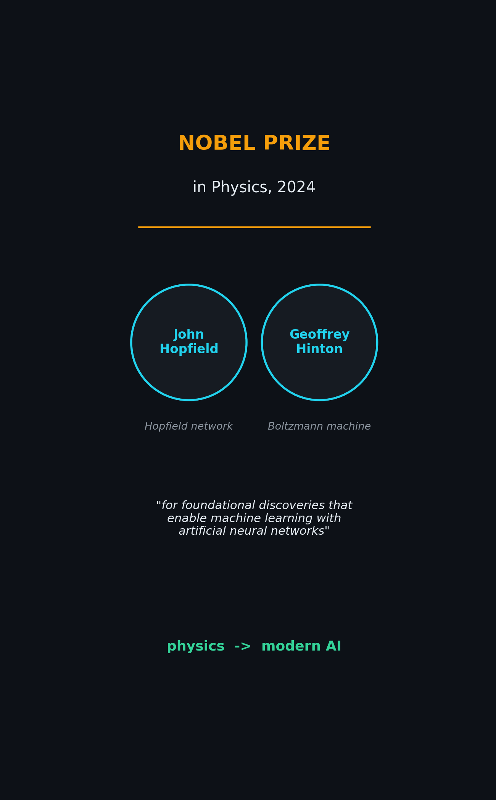
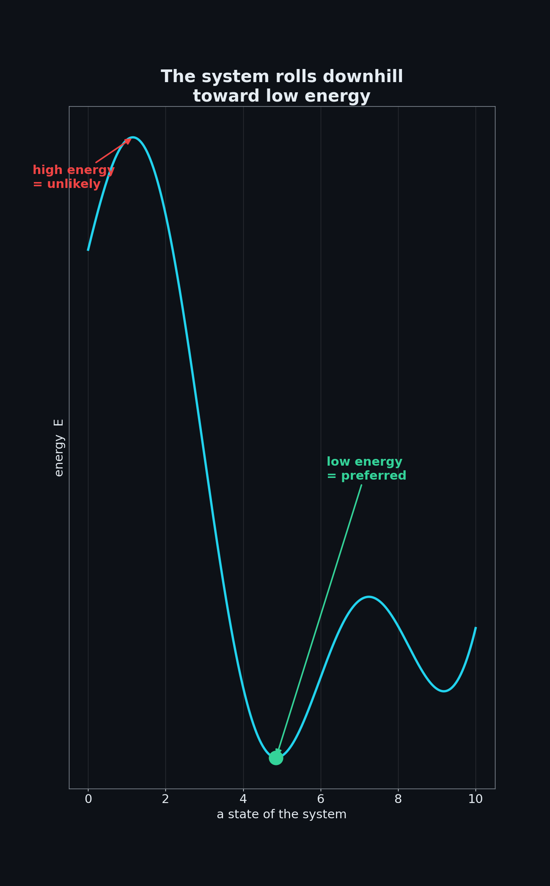
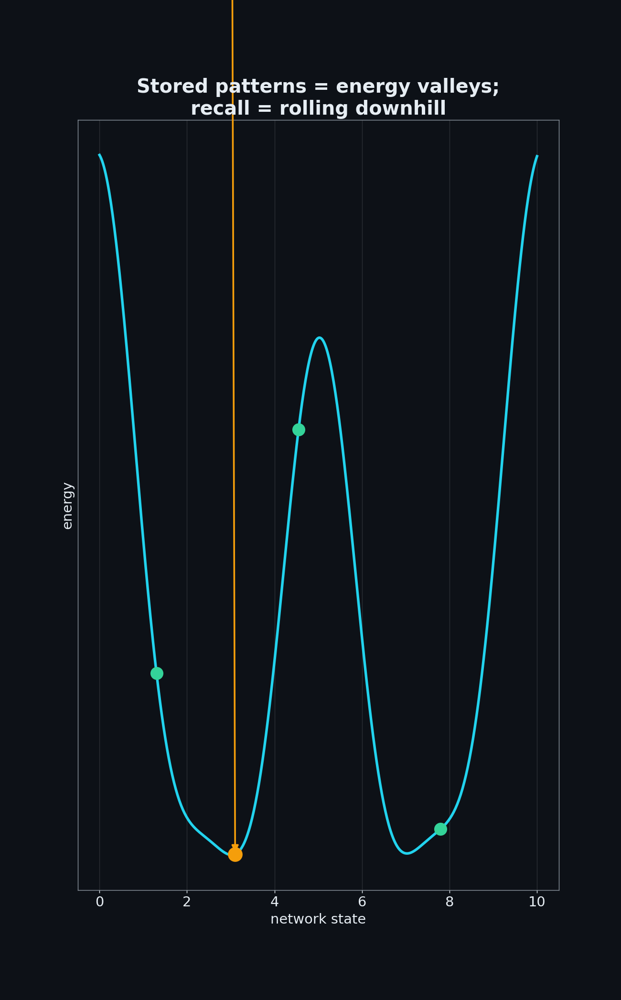
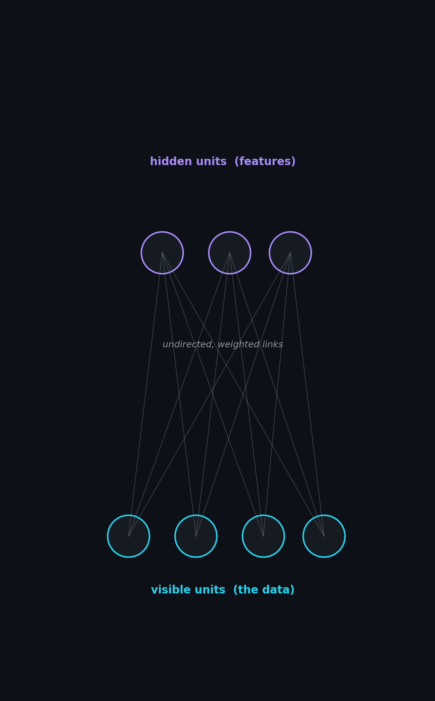
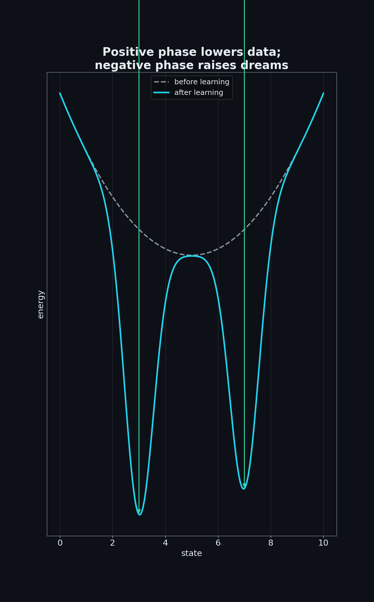
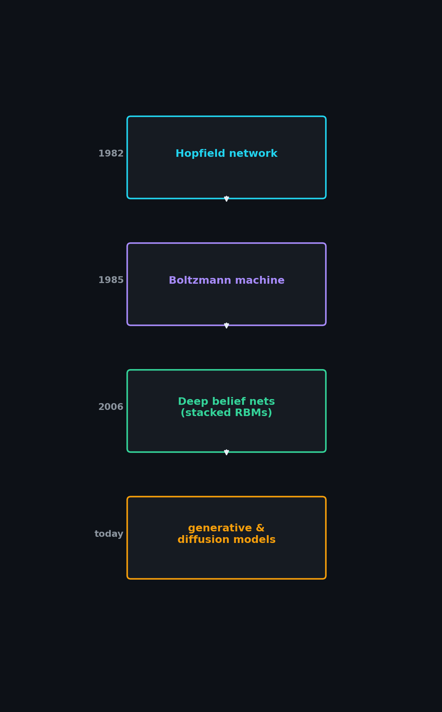

In 2024, the **Nobel Prize in Physics** went to **John Hopfield** and **Geoffrey Hinton** — *"for foundational discoveries and inventions that enable machine learning with artificial neural networks."* A physics prize, for AI? It turns out the two are deeply connected: the ideas that power modern neural networks came straight from the physics of **energy, heat, and how systems settle into their most stable states.**

At the heart of it all sits one beautiful concept — the **energy-based model**.

> 🎬 **Watch the 3-minute explainer (YouTube Short):**

  <iframe
    width="360" height="640"
    src="https://www.youtube.com/embed/456kN6RKNA8"
    title="Boltzmann Machines & Energy-Based Models"
    frameborder="0"
    allow="accelerometer; autoplay; clipboard-write; encrypted-media; gyroscope; picture-in-picture; web-share"
    allowfullscreen
    style="border-radius: 12px; max-width: 100%;"></iframe>

▶️ Direct link: [youtube.com/shorts/456kN6RKNA8](https://youtube.com/shorts/456kN6RKNA8)

---

## The Core Idea: An Energy Landscape

An energy-based model assigns every possible state of the system a single number — its **energy**. Picture a hilly landscape:

- The patterns we *want* (sensible, data-like states) sit **low in the valleys**.
- The states we *don't* want sit **high on the hills**.
- The system always wants to roll **downhill**, toward low energy.

Physics gives us the exact rule that links energy to probability — the famous **Boltzmann distribution**:

$$P(x) \propto e^{-E(x)/T}$$

The probability of a state falls off *exponentially* as its energy rises. **Low energy means high probability.** The temperature $T$ controls how much the system explores: hotter means more randomness.

---

## Hopfield Networks: Memory as Valleys

Hopfield's insight, in **1982**, was to use this landscape as a **memory**. He wired neurons together with *symmetric* connections ($w_{ij} = w_{ji}$) and defined an energy that the network always decreases as it updates.

The trick: shape the landscape so each **stored memory becomes its own valley.**

Show the network a noisy or partial pattern, and it simply rolls downhill into the nearest valley — **recovering the clean memory.** This is *associative memory*, built entirely out of energy.

---

## The Boltzmann Machine

Hinton and colleagues took the next step. A **Boltzmann machine** is a Hopfield-style network made **stochastic**: instead of strictly rolling downhill, each neuron turns on or off with a *probability* set by that same Boltzmann rule.

$$P(\text{neuron} = \text{ON}) = \sigma(\text{input}/T)$$

Two things make this powerful:

1. **Randomness lets it escape shallow traps** and genuinely *explore* the landscape, rather than getting stuck in the first valley it finds.
2. It adds **hidden units** — neurons representing features you never directly observe — so the network can capture deep, rich structure in the data instead of just memorizing patterns.

---

## Learning: Sculpting the Landscape

How does a Boltzmann machine learn? By **reshaping the energy landscape itself**, in two phases:

- **Positive phase** — show it real data and *lower* the energy around it, digging valleys where the data lives.
- **Negative phase** — let it "dream," generating its own samples, and *raise* their energy, flattening the valleys it invented.

Repeat, and the landscape gradually comes to **match the world.** The **Restricted Boltzmann Machine (RBM)** — with no connections *inside* a layer — made this training fast and practical (via *contrastive divergence*).

---

## Why It Mattered

This wasn't just elegant theory. In **2006**, stacking Restricted Boltzmann Machines let Hinton train **deep networks** for the first time — the spark that reignited deep learning after years in the cold.

And the energy-based view never went away. The idea of defining an **energy you minimize** still echoes through today's **diffusion models** and **score-based generative methods**. Physics gave AI a durable language for *probability* and *structure*.

---

## The Takeaway

The Boltzmann machine, in one breath:

- Define an **energy** over every possible state.
- **Prefer the low-energy ones** — those are the patterns you want.
- Add **randomness** so the network can explore.
- **Learning = reshaping the landscape** to match the data.

It's a Nobel-Prize-winning bridge between **physics** and **intelligence** — and a reminder that some of AI's deepest ideas were borrowed from the way the physical world settles into stable states.

---

*This post accompanies our short explainer video. We're brand new to YouTube — if you found this useful, please **[subscribe](https://youtube.com/shorts/456kN6RKNA8)** and like; it genuinely helps us keep making these. Thanks for reading!* 🙏
