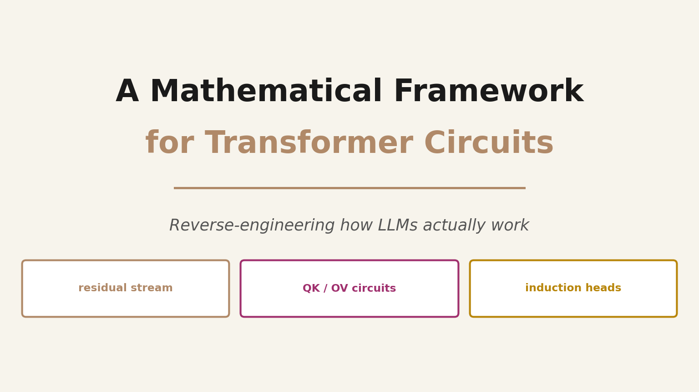
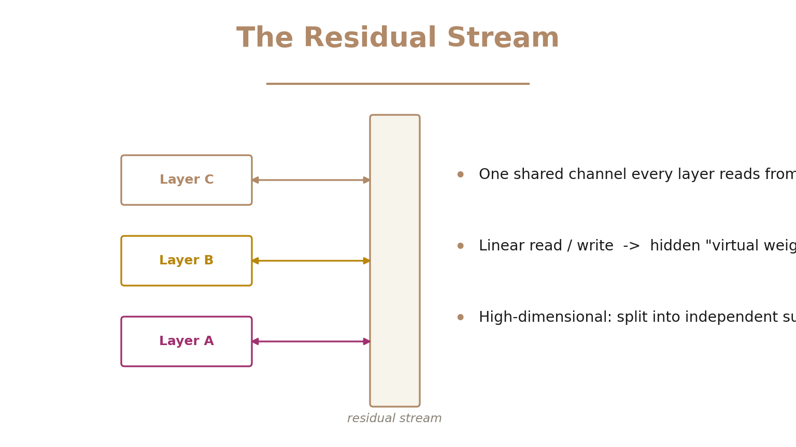
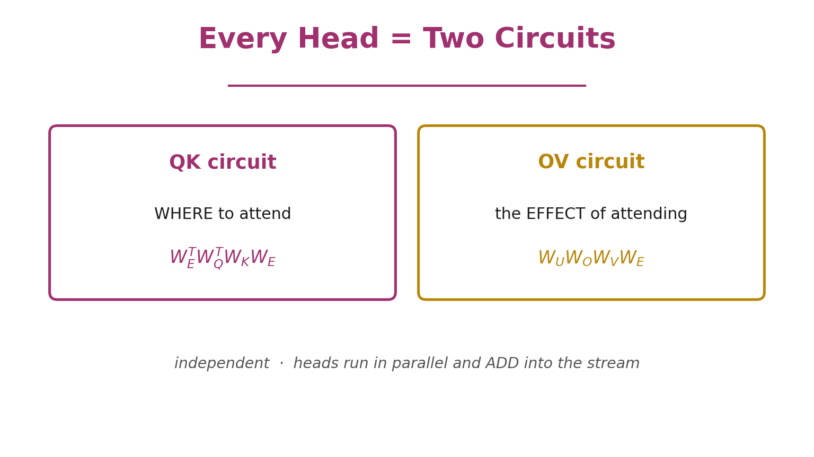
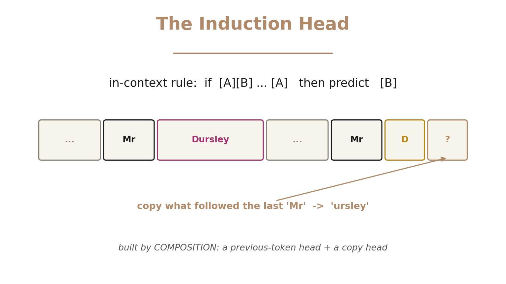

What if you could **reverse-engineer a transformer** the way you'd decompile a program — turning billions of weights back into human-readable algorithms?

That's exactly what Anthropic's 2021 paper *A Mathematical Framework for Transformer Circuits* set out to do, and it's the foundation almost all of modern **mechanistic interpretability** is built on. To make the math tractable, the authors studied a stripped-down model: **attention-only transformers** with zero, one, and two layers — no MLPs. Start simple, fully understand it, then add complexity.

> 🎬 **Watch the full ~11-minute explainer:**

  <iframe
    src="https://www.youtube.com/embed/bMa4k0CparA"
    title="A Mathematical Framework for Transformer Circuits"
    frameborder="0"
    allow="accelerometer; autoplay; clipboard-write; encrypted-media; gyroscope; picture-in-picture; web-share"
    allowfullscreen
    style="position: absolute; top: 0; left: 0; width: 100%; height: 100%; border-radius: 12px;"></iframe>

▶️ Direct link: [youtu.be/bMa4k0CparA](https://youtu.be/bMa4k0CparA)

> ⚡ **Short on time? Here's the 2-minute version** — *"What is a circuit in an LLM?"*

  <iframe
    width="315" height="560"
    src="https://www.youtube.com/embed/fA6oZw82hDM"
    title="What is a circuit in an LLM?"
    frameborder="0"
    allow="accelerometer; autoplay; clipboard-write; encrypted-media; gyroscope; picture-in-picture; web-share"
    allowfullscreen
    style="border-radius: 12px; max-width: 100%;"></iframe>

▶️ Short: [youtube.com/shorts/fA6oZw82hDM](https://www.youtube.com/shorts/fA6oZw82hDM)

---

## The Residual Stream Is a Highway

The central object in the whole framework is the **residual stream**. Don't think of layers as a pipeline that transforms data step by step. Instead, picture one shared **communication channel** running through the network.

Every attention head and layer **reads** from this stream with a linear projection, computes, then **writes** its result back by adding a linear projection in. Because every operation is linear, you can multiply the weights through the stream — and hidden connections appear, what the authors call **virtual weights**, directly linking any pair of layers. And because the stream is high-dimensional, it splits into independent **subspaces**: two layers only interact if one writes where the other reads.

---

## Every Attention Head Is Two Circuits

Here's the heart of the paper. An attention head looks like it has four weight matrices — query, key, value, output. But for understanding, they always group into just **two circuits**.

- The **QK circuit** decides *where* a head attends — which destination token reads from which source token:

$$\text{QK} = W_E^{T} \, W_Q^{T} \, W_K \, W_E$$

- The **OV circuit** decides the *effect* of attending — how the attended-to token changes the output:

$$\text{OV} = W_U \, W_O \, W_V \, W_E$$

There's a deep reason this grouping is natural: query and key only ever appear together as $W_Q^{T} W_K$, and output and value only as $W_O W_V$. The model never uses them apart. **Where to look, and what to do once you look there** — and you can analyze each circuit independently.

---

## One-Layer Models: Skip-Trigrams

Apply this to a one-layer attention-only transformer and, because everything is linear, the entire model collapses into one clean product: embed → move information via each head's attention pattern $A^h$ and OV circuit → unembed. Expanding it splits the model into a **direct path** (just bigram statistics) plus one clean, additive term per head.

So what do one-layer heads learn? **Skip-trigrams** — patterns of the form `A ... B → C`. A head sees `keep` earlier, the current token is `in`, so it predicts `mind`. These are genuine in-context copying rules recovered straight from the weights.

The framework even **predicts the model's bugs**: because QK and OV are separate, a head that learns `keep…in→mind` and `keep…at→bay` will also wrongly allow `keep…in→bay`. When your theory predicts the exact mistakes you then observe, you know you're reading the real mechanism.

> 💡 You can also detect **copying** behavior straight from the weights using **eigenvalues**: treat the OV circuit as a token-to-token map; a copying head maps tokens back to themselves, so its eigenvalues are positive.

> ⚡ **90-second version** — *"What is a skip-trigram?"*

  <iframe
    width="315" height="560"
    src="https://www.youtube.com/embed/LxmtD5Ibpew"
    title="What is a skip-trigram?"
    frameborder="0"
    allow="accelerometer; autoplay; clipboard-write; encrypted-media; gyroscope; picture-in-picture; web-share"
    allowfullscreen
    style="border-radius: 12px; max-width: 100%;"></iframe>

▶️ Short: [youtube.com/shorts/LxmtD5Ibpew](https://youtube.com/shorts/LxmtD5Ibpew)

---

## Two Layers: Composition & Induction Heads

Add a second layer and something new appears: **composition**. A head in the second layer can read what a head in the first layer wrote — through **Q-composition** (shaping queries), **K-composition** (shaping keys), or **V-composition** (shaping values). Two simple heads chain into an algorithm neither could do alone.

The most famous result is the **induction head**:

An induction head implements a powerful in-context rule: *if the pattern A B appeared earlier, and you now see A again, predict B.* It's a two-head circuit — a first-layer **previous-token head** tags each position with the token before it, and a second-layer head uses **K-composition** to find where the current token last appeared, then copies what came next. Having seen "Mr Dursley," when the model later hits "Mr D," it predicts "ursley." This is **in-context learning**, pinned down as a concrete mechanism.

> ⚡ **90-second version** — *"What is an induction head?"*

  <iframe
    width="315" height="560"
    src="https://www.youtube.com/embed/JSoHLBhCEnI"
    title="What is an induction head?"
    frameborder="0"
    allow="accelerometer; autoplay; clipboard-write; encrypted-media; gyroscope; picture-in-picture; web-share"
    allowfullscreen
    style="border-radius: 12px; max-width: 100%;"></iframe>

▶️ Short: [youtube.com/shorts/JSoHLBhCEnI](https://youtube.com/shorts/JSoHLBhCEnI)

---

## Path Expansion: Virtual Attention Heads

Multiply out a two-layer model and you get terms of increasing order: **order 0** is the direct path (bigrams), **order 1** is each individual head, and **order 2** gives **virtual attention heads** — pairs of real heads composed together. That order-2 term is exactly where induction heads live: small on average, but disproportionately important. Expanding the paths makes the whole computation legible.

---

## Why This Framework Matters

This paper gave us a **vocabulary for reading the inside of a transformer**:

- The **residual stream** as a shared channel.
- Every head as a **QK circuit** (where to attend) + an **OV circuit** (the effect).
- **Composition** and **virtual heads** that chain simple parts into real algorithms.
- **Induction heads** — the first concrete mechanism of in-context learning ever pinned down.

Attention-only models were just the starting point — MLPs and deeper networks bring real complications — but the concepts generalize, and almost every interpretability result since (monosemantic features, superposition, the discovery of induction heads driving in-context learning) builds directly on this language. It's the moment the black box started to become **readable**.

---

**Source:** Elhage, Nanda, Olsson, et al., *"A Mathematical Framework for Transformer Circuits,"* [Anthropic — Transformer Circuits](https://transformer-circuits.pub/2021/framework/index.html) (December 2021). The diagrams above are our own illustrations of the paper's ideas.

*If this helped the black box feel a little less black, please **[subscribe](https://youtu.be/bMa4k0CparA)** and like — we're just getting started. Thanks for reading!* 🙏
