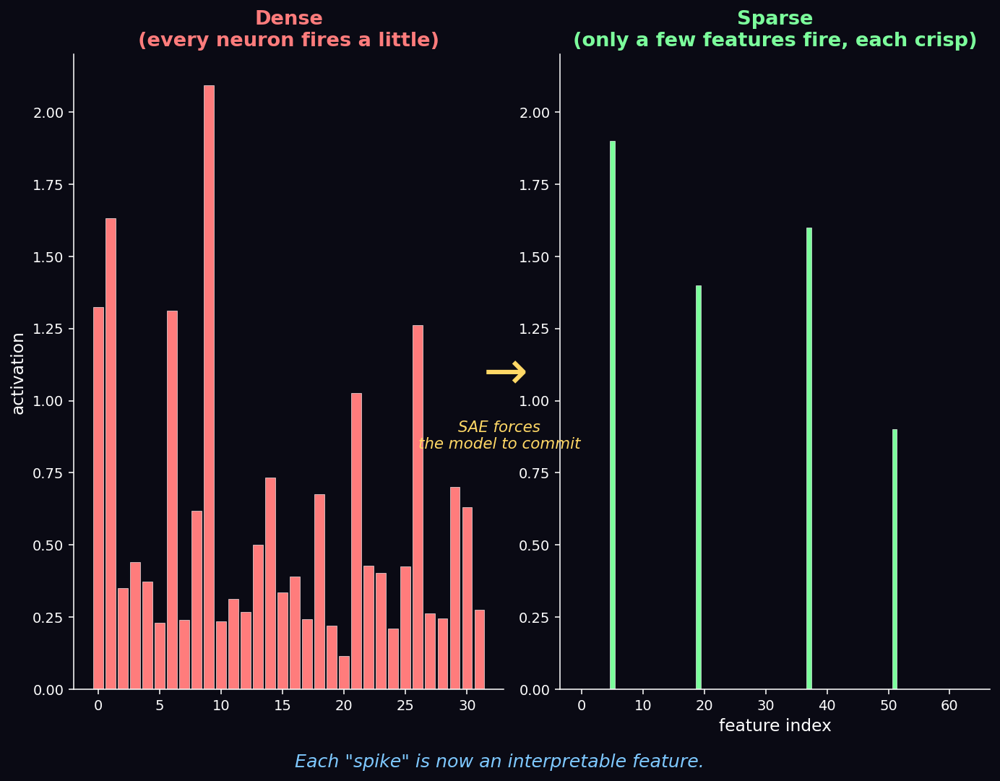
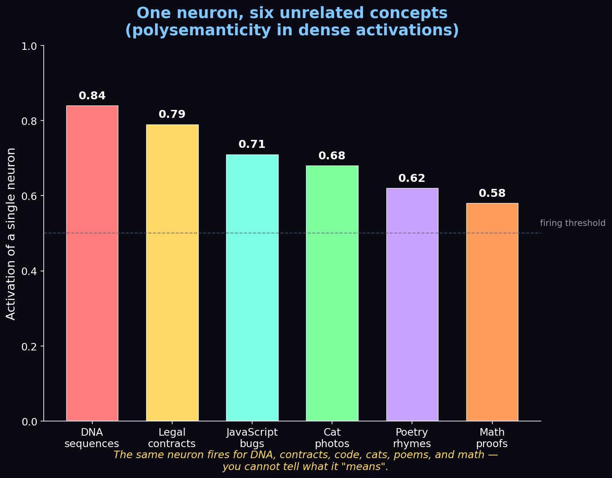
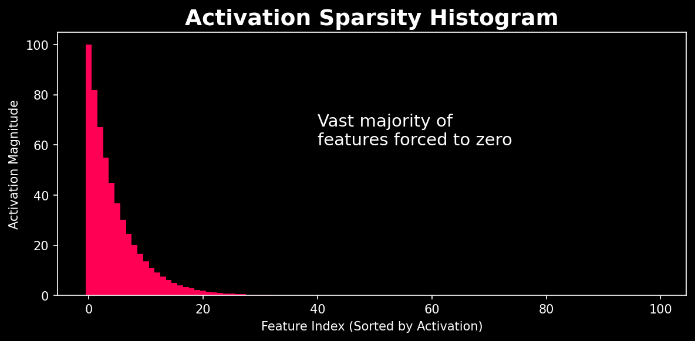
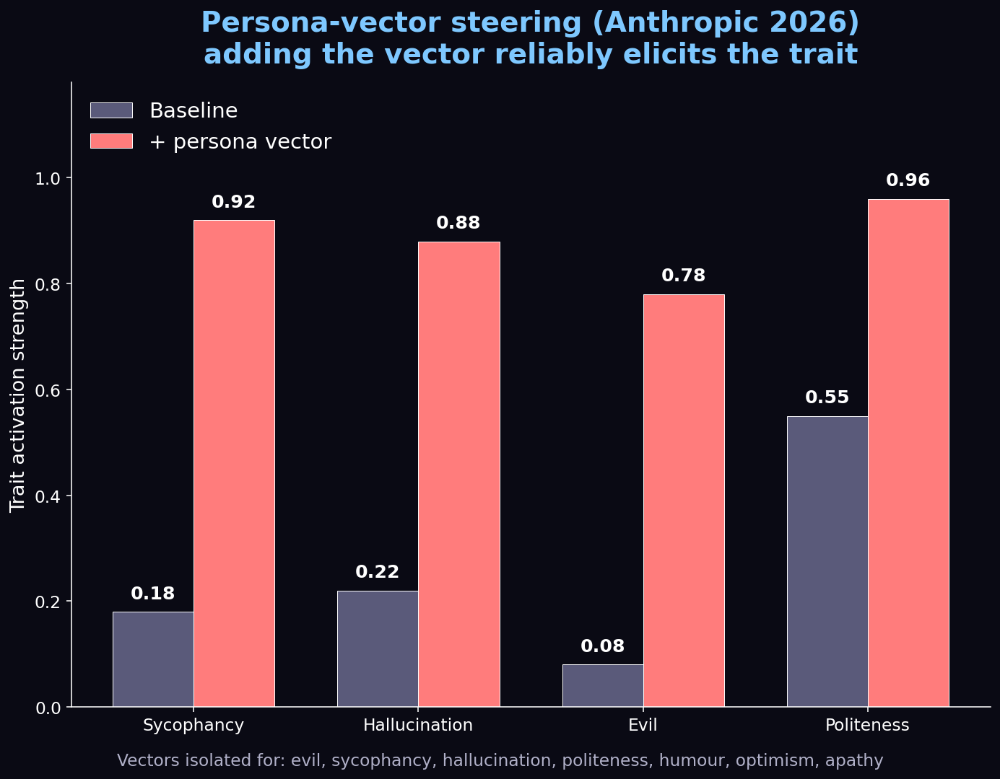
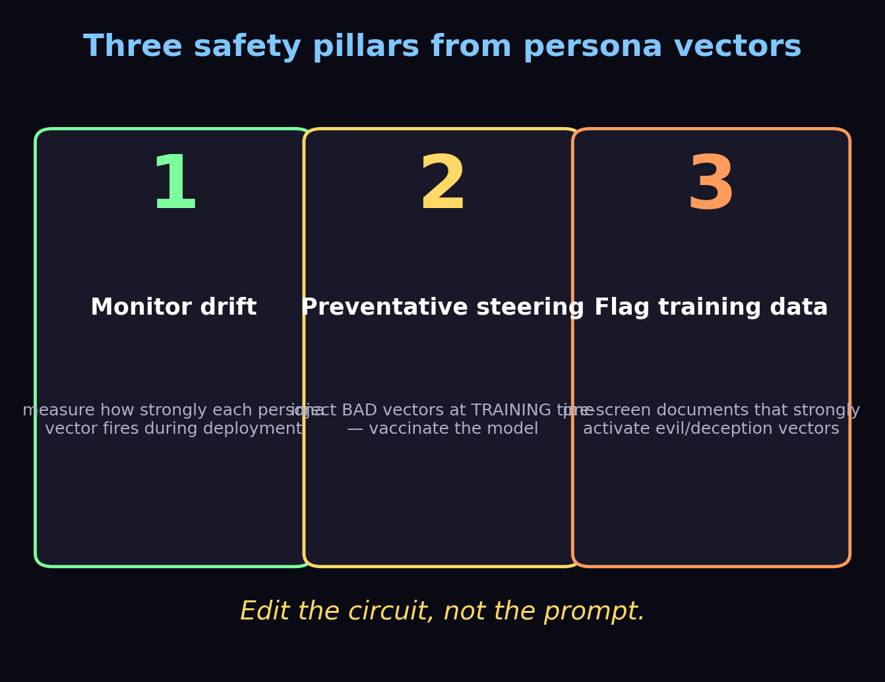

Imagine you're a physician a hundred years ago. You can observe a patient's symptoms, listen to their heartbeat, and make educated guesses about what's happening inside. Then someone hands you an **X-ray machine.** Suddenly you don't guess — you *see*.

That's exactly the leap **mechanistic interpretability** brings to AI. For years we judged language models purely by their outputs — the probability of the next word. Ask an AI a question and it might output *"Paris"* with 95% probability. But *why?* **Sparse Autoencoders (SAEs)** are giving us the X-ray to finally look inside.

> 🎬 **Watch the full 12-minute explainer:**

  <iframe
    src="https://www.youtube.com/embed/FygQSz5_fq8"
    title="Mechanistic Interpretability of Sparse Autoencoders"
    frameborder="0"
    allow="accelerometer; autoplay; clipboard-write; encrypted-media; gyroscope; picture-in-picture; web-share"
    allowfullscreen
    style="position: absolute; top: 0; left: 0; width: 100%; height: 100%; border-radius: 12px;"></iframe>

▶️ Direct link: [youtu.be/FygQSz5_fq8](https://youtu.be/FygQSz5_fq8)

---

## The Polysemanticity Problem

The biggest obstacle to reading a model's mind is a phenomenon called **polysemanticity**. In a standard neural network, a single neuron doesn't represent just one concept. Because space is limited, the model constantly compresses many ideas into the same neuron.

The *same* neuron might fire for DNA sequences, legal contracts, JavaScript bugs, cat photos, poetry, and math proofs. You simply cannot tell what it "means" — the signal is hopelessly tangled.

---

## The SAE Breakthrough

Enter the **Sparse Autoencoder**. Think of it as a high-resolution microscopic lens that deconstructs dense, messy neural activations.

The SAE acts as a strict **forcing function**: it takes the model's tangled, compressed thoughts and re-expresses them through a much *wider* but strictly *limited* set of active features. We call these **monosemantic** features — each represents one, and only one, distinct concept. By expanding the mathematical space and forcing most activations to zero, the SAE unpacks the compressed data into crystal-clear, non-overlapping signals (the bright spikes on the right of the cover image above).

### The Objective Function

How does it pull this off? With a beautifully simple objective that balances two terms:

$$\mathcal{L} = \underbrace{\lVert x - \hat{x} \rVert_2^2}_{\text{reconstruction}} \;+\; \lambda \underbrace{\lVert f \rVert_1}_{\text{sparsity}}$$

- The **reconstruction loss** ($L_2$ norm squared) ensures no meaning is lost — the features must rebuild the original activation $x$.
- The **sparsity penalty** ($L_1$ norm, weighted by $\lambda$) mathematically forces the autoencoder to use as *few* active features as possible.

This delicate balance — perfect reconstruction *plus* extreme sparsity — is what untangles the knot, isolating individual, human-understandable features from the noise.

---

## The Golden Gate Feature

A now-famous example: using an SAE on **Claude 3 Sonnet**, Anthropic's researchers discovered a highly specific monosemantic feature in the model's middle layers. What did it represent? **The Golden Gate Bridge.**

This single feature fired whenever the model encountered text, images, or even abstract references to the landmark — but *not* for other bridges, and *not* for other cities. It was the model's pure, isolated concept of the Golden Gate Bridge, pinned to a specific coordinate in its vast brain.

Individual concepts are just the nouns and verbs of thought. The real power comes from **circuitry** — watching features interact. The "sarcasm" feature might inhibit "politeness" while boosting "humor." By mapping these circuits, we watch artificial thought form in real time.

---

## Feature Steering: Writing to the Model's Mind

Once you can *read* the model's mind, the next step is *writing* to it. SAE features (and persona vectors more broadly) give a direct dial for any concept the model represents.

Compare this to **prompt engineering** — a blunt instrument where you type words and *hope*. Steering is **surgical**. You compute a target centroid $c_{\text{target}}$ and a refusal centroid $c_{\text{refusal}}$ in the residual stream; the steering vector is simply their difference, applied at a few layers at inference time.

The recent **SafeConstellations** result on LLaMA-3.1-8B makes it concrete:

- Over-refusal dropped from **46.7% → 8.9%** (an 81% reduction).
- MMLU utility stayed flat at **46.57**.
- Added latency: ~**0.2s** per response.
- **No retraining, no fine-tuning** — just a few activation-space vectors at the right layers.

---

## Safety: Three Pillars

The safety implications are staggering. Anthropic's persona-vector work showed three concrete applications:

1. **Monitor drift** — measure how strongly persona vectors fire during deployment to detect personality changes the moment they happen.
2. **Preventative steering** — inject *bad* vectors at **training** time to "vaccinate" the model against them.
3. **Flag training data** — pre-screen documents that strongly activate evil/deception vectors.

The motto: **edit the circuit, not the prompt.**

---

## From Stochastic Parrot to Auditable Intellect

For the longest time, critics dismissed LLMs as mere **"stochastic parrots"** — fancy autocorrect mimicking human text without real understanding. But the maps drawn by Sparse Autoencoders tell a wildly different story: a highly structured, deeply sophisticated representation of the world.

We're shifting from treating AI as a statistical parrot to an **auditable, transparent digital intellect** — and mathematically proving these networks build real internal models of reality. As we build ever larger systems, understanding the *why* behind the *what* is no longer academic curiosity. It's the final frontier of the AI revolution.

---

### ⏱️ Chapters

| Time | Section |
|------|---------|
| 0:00 | Cracking the Black Box |
| 0:54 | Probability vs Logic |
| 1:45 | Bridge to Knowing |
| 2:33 | The Polysemanticity Problem |
| 3:21 | The SAE Breakthrough |
| 4:08 | The Objective Function |
| 4:58 | Mapping the Blueprint |
| 5:44 | The Golden Gate Feature |
| 6:25 | Circuitry of a Thought |
| 7:09 | Feature Steering |
| 8:06 | Surgical Precision: SafeConstellations |
| 9:07 | Safety: Three Pillars |
| 10:01 | Granular Alignment |
| 10:45 | Auditable Intellect |
| 11:26 | The Final Frontier |

---

*Featured research: Anthropic's work on monosemantic features and persona vectors, and the SafeConstellations steering result on LLaMA-3.1-8B. Diagrams above are our own illustrations.*

*If you enjoyed this, we're brand new to YouTube — please **[subscribe](https://youtu.be/FygQSz5_fq8)** and like; it genuinely helps us keep making these. Thanks for reading!* 🙏
