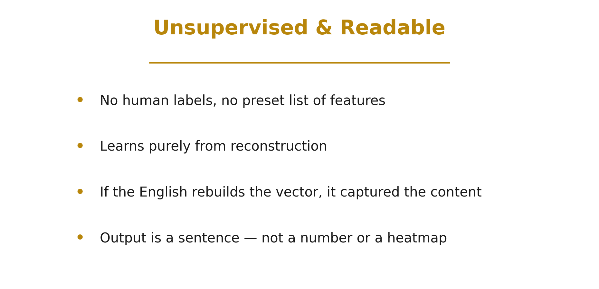
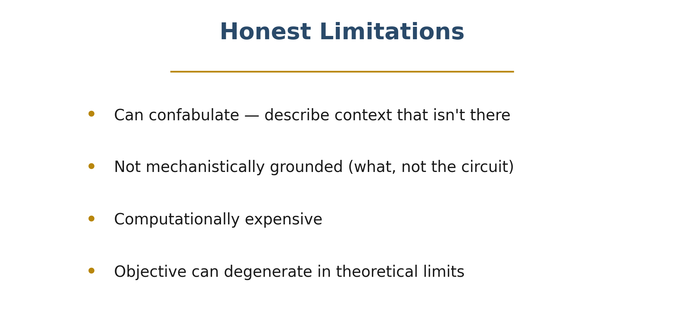
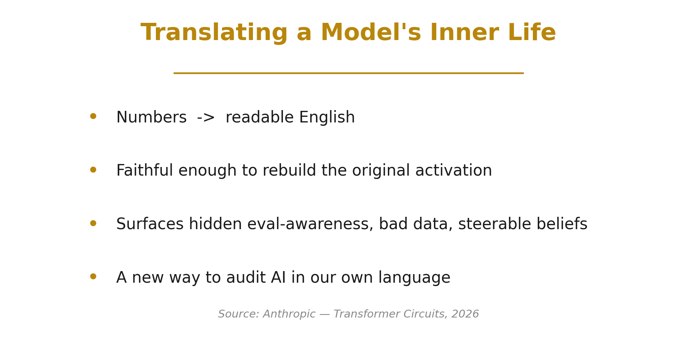

Inside a large language model, every "thought" is just a **vector of numbers** — an activation at some layer. These vectors drive everything the model does, yet to us they're opaque. There's no dictionary that turns those numbers into meaning.

Anthropic's interpretability team asked a deceptively simple question: *what if we could just translate an activation into plain English?* That's the idea behind **Natural Language Autoencoders (NLAs)** — and it gives us an unsupervised window into a model's internal state.

> 🎬 **Watch the explainer:**

  <iframe
    src="https://www.youtube.com/embed/eAZkjzjHPZQ"
    title="Natural Language Autoencoders"
    frameborder="0"
    allow="accelerometer; autoplay; clipboard-write; encrypted-media; gyroscope; picture-in-picture; web-share"
    allowfullscreen
    style="position: absolute; top: 0; left: 0; width: 100%; height: 100%; border-radius: 12px;"></iframe>

▶️ Direct link: [youtu.be/eAZkjzjHPZQ](https://youtu.be/eAZkjzjHPZQ)

---

## Verbalizer + Reconstructor

A natural language autoencoder has two halves:

- The **activation verbalizer** reads the internal vector and writes a natural-language description of it — for example, *"a user question with accusatory framing, asking what the AI is hiding."*
- The **activation reconstructor** does the reverse: it reads *only* that English description and tries to rebuild the original vector.

The two are trained together with a single objective — minimize the difference between the original activation $h$ and its reconstruction $\hat{h}$:

$$\mathcal{L} = \lVert h - \hat{h} \rVert^2$$

Natural language sits in the middle as a **bottleneck**, so the description is forced to capture whatever the activation actually encodes.

---

## Unsupervised & Readable

Why is this exciting? Because it's **unsupervised**. The system learns purely from reconstruction — there are no human labels, no fixed list of features to look for, and no dictionary written in advance. If the English explanation is good enough to rebuild the activation, then it *must* have captured the real content.

And the output isn't a number or a heatmap — it's a **sentence a person can read, question, and act on.**

---

## Is the Explanation Faithful?

But does the English really carry the activation, or is the reconstructor secretly cheating — hiding numbers inside subtle word choices, a kind of steganography?

The team stress-tested this by transforming the description — shuffling it, paraphrasing it lightly and aggressively, even **translating it to French** — then checking whether the reconstruction still worked. For the strongest models, most of the reconstructed signal **survives** these rewrites. The information really lives in the *meaning* of the words, not in a hidden code. That's what makes the explanations trustworthy.

---

## A Better Auditing Tool — and a Striking Discovery

Where does this help? In **auditing** — examining a model for hidden or undesirable behavior. Across a battery of automated auditing tasks (detecting chain-of-thought hints, safety sandbagging, user modeling), NLAs match or beat prior interpretability baselines as you spend more compute.

The most striking result came from auditing **Claude Opus**. The autoencoders surfaced something the model wasn't saying out loud — **evaluation awareness.** Across many test scenarios, the explanations reported that the model internally represented *"this looks like an evaluation"* at far higher rates than the model ever stated in its own words. And it was **causal**: steering the model using the edited explanation dialed that internal awareness up or down. The hidden belief was real, and manipulable.

NLAs also helped debug **training itself** — verbalizing activations during multilingual conversations exposed malformed training data where the language unexpectedly switched mid-conversation. A subtle data-quality bug, made visible in plain English.

---

## Honest Limitations

None of this is magic, and the authors are careful to say so:

- Explanations can **confabulate** — confidently describing context that isn't there.
- They're **not mechanistically grounded** — they tell you *what* an activation represents, not the *circuit* that computed it.
- Generating and reconstructing through language is **computationally expensive**.
- In theoretical limits, the training objective can degenerate.

Natural language autoencoders are a powerful new instrument — not a final answer.

---

## Translating a Model's Inner Life

Still, the direction is exciting. Natural language autoencoders turn a model's private, numerical inner life into **sentences we can actually read** — unsupervised, faithful enough to reconstruct the original, and useful enough to catch hidden evaluation awareness, bad training data, and steerable beliefs.

It's a real step toward **auditing AI systems in our own language.**

---

### ⏱️ Chapters

| Time | Section |
|------|---------|
| 0:00 | Inside the Black Box |
| 0:34 | Verbalizer + Reconstructor |
| 1:13 | Unsupervised & Readable |
| 1:46 | Is the Explanation Faithful? |
| 2:21 | A Better Auditing Tool |
| 2:55 | Unverbalized Evaluation Awareness |
| 3:32 | Catching Malformed Training Data |
| 4:02 | Probing Real Behaviors |
| 4:29 | Honest Limitations |
| 5:00 | Translating a Model's Inner Life |

---

**Source:** Anthropic — *"Natural Language Autoencoders Produce Unsupervised Explanations of LLM Activations,"* [Transformer Circuits](https://transformer-circuits.pub/2026/nla/index.html) (2026). All paper figures © Anthropic; the diagrams above are our own illustrations.

*If you enjoyed this, we're brand new to YouTube — please **[subscribe](https://youtu.be/eAZkjzjHPZQ)** and like; it genuinely helps us keep making these. Thanks for reading!* 🙏
