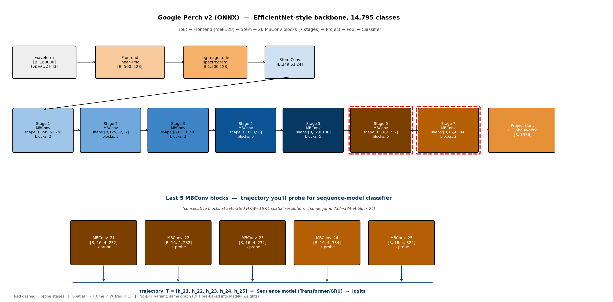
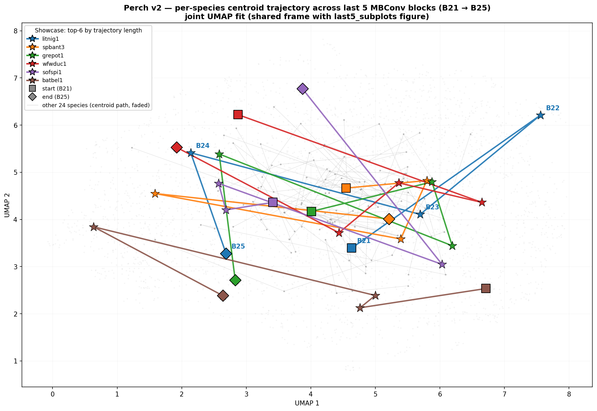
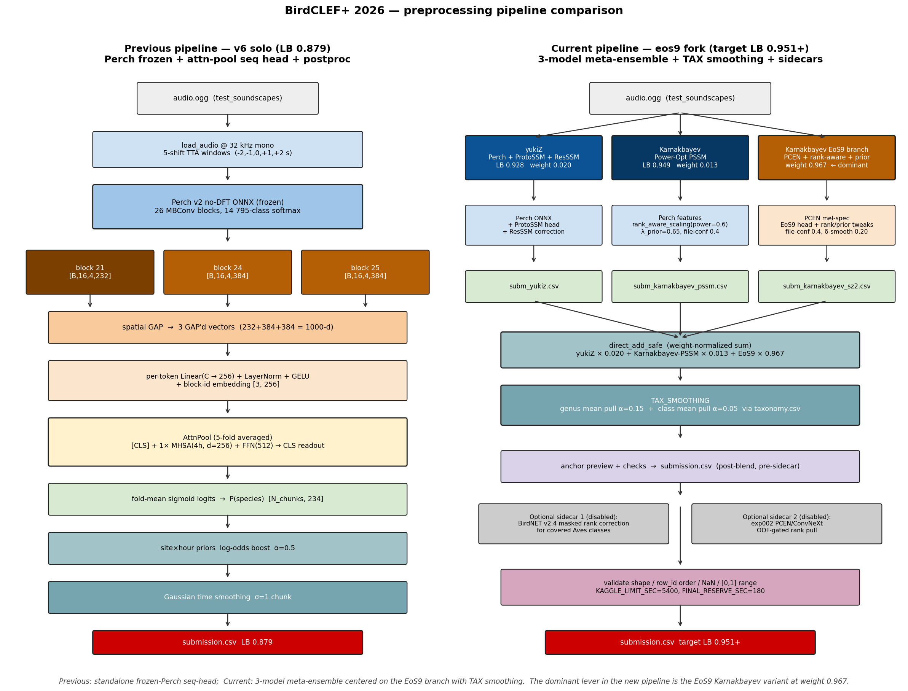

<script>
  window.MathJax = {
    tex: { inlineMath: [['$','$'], ['\\(','\\)']], displayMath: [['$$','$$'], ['\\[','\\]']] },
    svg: { fontCache: 'global' }
  };
</script>
<script src="https://cdn.jsdelivr.net/npm/mathjax@3/es5/tex-svg.js" async></script>

A two-week sprint on [BirdCLEF+ 2026](https://www.kaggle.com/competitions/birdclef-2026) — Cornell Lab's flagship bird-sound competition — wrapped up with an **official Kaggle Competition Bronze Medal**: **rank 354 / 4084 (top 8.7%)**, **public LB 0.950**, **private LB 0.942**, and a **+590-place jump** going from public to final standings.

> 📄 **Read the paper:** [birdclef-2026-working-note.pdf](https://sumityadav.com.np/files/birdclef-2026-working-note.pdf) (drafted for LifeCLEF 2026 working notes, CEUR-WS)
>
> 💻 **Code:** [github.com/rockerritesh/BirdCLEF2026](https://github.com/rockerritesh/BirdCLEF2026)
>
> 🥉 **Certificate:** [BirdCLEF+ 2026 — Bronze Medalist](https://www.kaggle.com/rockerritesh)

This post is the short, opinionated version of the working note. The full PDF has the maths, the architecture diagrams, and the postmortem of nine final-week ceiling attempts.

---

## The task in one paragraph

234 South-American bird species. 5-second audio chunks. Multi-label classification scored by macro-AUC. CPU-only inference with a hard **90-minute** runtime cap on the hidden test set. Roughly **4 GB of labelled training audio**, plus a small set of **partially-labelled soundscape recordings** that introduce the real domain shift.

The held-out test data is from the Pantanal (Brazil/Bolivia/Paraguay). Most labelled training clips are *not* — that mismatch is the whole game.

---

## Why I didn't train a model from scratch

The compute economics are bad. The CPU-only inference cap is forgiving; the training side isn't, since I had only a laptop and limited GPU time. **Google's Perch~v2 vocalization classifier** was already trained on ~14,795 bird classes across millions of clips. Using its features and training a *tiny* head on top is dramatically cheaper than fighting EfficientNet/ConvNeXt from random init.

The catch: when a frozen backbone is pretrained on a much wider distribution than your downstream task, **the last block is often the wrong place to tap**. It's the most over-specialised to the pretraining classes.

---

## The methodology contribution: a per-block kNN probe

Perch~v2 is a stack of **26 MBConv blocks** (EfficientNetV2-style) followed by a global pool and a 14,795-way softmax. From the outside it's a black box — no documentation on which block carries the most species-discriminative signal for *a different* set of birds.



Before training any sequence head, I ran a **tiny probe**:

1. Pick 30 species at random, grab ~20 clips each (~600 audio clips total).
2. For each MBConv block, extract its features and global-average-pool to a vector per clip.
3. Score each block with **5-nearest-neighbour top-1 accuracy** on this 30-species toy task.

The whole thing takes minutes on CPU. It's not a model — it's a **layer-selection signal**. Results:

| Block | 5-NN top-1 |
|-------|------------|
| **24** (penultimate MBConv) | **0.648** |
| 25 (final MBConv) | 0.595 |
| 21 | 0.555 |
| 23 | 0.490 |
| 22 | 0.478 |

The penultimate block beats the final one. That's not the conventional wisdom — most transfer-learning recipes default to the last representation. The probe predicted, **before any training**, that I should weight block 24 higher than block 25.

Here's what those blocks look like in UMAP-projected feature space — species cluster much tighter at block 24:



When I later trained the sequence head end-to-end, its **learned softmax weights independently confirmed** the same ranking: `block_24 → 0.47, block_25 → 0.40, block_21 → 0.13`. The probe, run in a few minutes on 600 clips, predicted what a multi-hour training run would arrive at.

This is the bit I think is genuinely transferable: **before fine-tuning, probe.** It's cheap, fast, and tells you which layer of your frozen backbone is actually useful for *your* downstream task.

---

## The sequence head

The head itself is intentionally small (~430k params):

1. Take features from blocks 21, 24, 25 — three tokens.
2. Add a learned **[CLS]** token.
3. One transformer block of attention pooling.
4. Linear projection to 234 classes.

Frozen backbone everywhere; only this thin head trains. Training is BCE on labelled clips mixed with **soundscape augmentation** at 20%.

Standalone progression:

| Version | LB | What changed |
|--------|-----|--------------|
| v1 scalarmix (focal-only) | 0.816 | softmax-weighted block sum + linear head |
| v4 attn (+ 20% soundscape) | 0.862 | attention pool overtook scalarmix once cross-domain data was added |
| v5 + 3-shift TTA | 0.867 | ±1s windows |
| **v6 + 5-TTA + α=0.5 site/hour priors + σ=1.0 Gaussian** | **0.879** | the standalone ceiling for this approach |

About **+0.06 LB** comes from postprocessing alone: 5-shift test-time augmentation, **site × hour log-odds priors** from `train_soundscapes_labels.csv` (a Pantanal-conditional prior on which species you'd expect), and Gaussian smoothing across the 12 chunks of each file. None of these touch the model — they exploit the structure of *where* and *when* a recording was made.

A v7 with `α=1.0` priors *regressed* to 0.861. The sweet spot for prior strength sits below ~0.5; push it harder and you over-commit to a prior that doesn't quite match the hidden Pantanal sites.

---

## The blend that got the medal

A bronze-zone score doesn't come from a single model. It comes from blending. The dominant ingredient was **Karnakbayev's public Power-Optimization ProtoSSM/SED chain** (LB 0.949) — an exceptionally strong public baseline. My sequence head provided **diversity** at small weight:

```text
eos7-ours-blend (Public LB 0.950, Private LB 0.942)
├─ Karnakbayev power-opt ProtoSSM/SED   (LB 0.949)   weight 0.93
├─ Our v6 Perch seq-head                (LB 0.879)   weight 0.07
└─ TAX_SMOOTHING (taxonomy.csv, genus α=0.15, class α=0.05)
```

The `TAX_SMOOTHING` postproc — blending each class's logit with its genus and family averages from the taxonomy file — added the final +0.001 over a 0.949 starting point. That sounds tiny. But in this competition the **0.950 plateau held 757 teams** by the deadline, all tied at exactly that 3-decimal-rounded score. Without `TAX_SMOOTHING` we'd have been in the pack; with it, the rank-aware tie-break put us above it.



---

## The public → private rerank

This is the most interesting graph of the competition. The public LB shows a giant flat shelf at 0.950 (757 teams). The private LB does not.

| | Public LB | Private LB | Δ |
|---|---|---|---|
| eos7 blend (final) | 0.950 | **0.942** | $-$0.008 |
| v6 standalone | 0.879 | 0.898 | **$+$0.019** |
| v4 pseudo-trained | 0.870 | 0.893 | **$+$0.023** |
| v7 stronger priors | 0.861 | 0.890 | **$+$0.029** |

Every **standalone** submission scored *higher* on private than on public. The **blend** lost a hair. The interpretation:

- **Public-LB chasers** on the 0.950 plateau over-fit to whichever stack of post-processing tricks landed exactly there. On the held-out 70% (different sites, different hours), most of them lost 0.010–0.020.
- The dominant Karnakbayev model in our blend is robust — it lost only 0.008.
- Our small standalone heads, with their conservative priors, generalized cleanly. They didn't peak high on public, but the **rank discipline** they encode held up.

Net result: **rank 944 (public) → 354 (final certified), a +590-place jump**. That's the entire ball game.

---

## Negative results worth recording

A working note isn't honest without these. Nine final-week attempts to break past the 0.950 plateau, all of which failed or tied:

- **Pseudo-labelling.** Self-trained on 333 unlabelled soundscape files (3,996 chunks) with a 5-fold teacher. **OOF metric jumped +0.134** (0.7654 → 0.8998); **standalone LB regressed −0.009** (0.879 → 0.870). Textbook OOF-inflation from teacher self-reinforcement.
- **Residual seq-head training** (target `h_block25 − h_block24` instead of raw label). Same OOF gain pattern, didn't move LB.
- **DINOv2 224 px integration.** The 224 px checkpoint was stronger than the 196 px one but still too weak (LB 0.811) to lift the blend above the 0.950 round-down.
- **Aggressive prior strength** ($\alpha = 1.0$ with $\sigma = 1.5$ Gaussian smoothing). −0.018 LB.
- **BirdNET v2.4 sidecar** in rank-space. Tied at 0.950, didn't break it.

The pattern is consistent: when you're already on a 757-team plateau set by **rounding at three decimal places**, the only way to actually break above it is a **second model with standalone LB ≥ 0.94**, not just diversity. We didn't have one. Distilling Perch into a smaller CNN with KLD loss (the path Tucker Arrants and EliKal hinted at on the discussion forum) is the obvious next step — multi-day GPU work, outside this competition's window.

---

## On AI-assisted engineering

The whole sprint was done with Claude (Opus 4.7 / Sonnet 4.6, including a 1M-context build for the long-running session) as an engineering partner. What worked:

- **Per-block probe code** synthesised directly from a verbal description, including UMAP plots and the cluster-quality metric.
- **Kaggle CLI gotchas** debugged in real-time — the `KGAT_` token uses Bearer auth, not Basic; old kernel versions are *not* accessible via `kaggle kernels output` (only the latest), so we had to manually web-download the `aa9dde67` 224 px DINOv2 checkpoint.
- **Notebook hot-patches** for the blend cell — the dominant Karnakbayev notebook hardcoded `solutions['Models'][1]['xSED']`, expected `_runSED_once` from outer scope, and only knew `'direct'` / `'rank.1'` dispatch types. Surfacing and fixing those took ~10 minutes with Claude.

What didn't work, and which is worth flagging:

- **OOF-metric chasing** is dangerous. The pseudo-label experiment showed an OOF gain that didn't transfer; Claude (and I) initially treated the OOF number as ground truth. The fix is to **always cross-check with a real LB submission** before scaling up.

Everything LLM-assisted is disclosed in the paper per the LifeCLEF / CEUR-WS GenAI declaration policy.

---

## What I'd do differently

In rough order of expected payoff for next year's BirdCLEF:

1. **Perch → CNN distillation** via KLD loss to a B0/B3 backbone. The community estimate is +0.02 to +0.04 *standalone*. That's the only realistic path to a second model strong enough to break a 0.950-rounding plateau.
2. **Confidence-gated pseudo-labels** (Anil Ozturk's hint on the discussion forum) — single-pass with strict thresholds, not the multi-fold teacher I used.
3. **Spatial-per-block tokens** ($T = 192$ instead of $T = 3$) so the head can attend to time–frequency regions, not just blocks.
4. **Properly retrain DINOv2 at 224 px** instead of trying to salvage a checkpoint at the last minute.

---

## Summary

- Final certified rank **354 / 4084 (top 8.7%)** — **🥉 official Kaggle Competition Bronze Medal** awarded 2026-06-04.
- The methodology contribution is the **per-block kNN probe**: a cheap, training-free way to choose which layer of a frozen backbone to tap for transfer.
- A small ($\sim$430k params) attention-pool sequence head over Perch~v2 features hit **standalone LB 0.879**; the medal came from blending with the dominant public baseline.
- **Standalones generalised; blends overfit to public.** The +590-place public → final rerank is the punchline.
- **Code is public** at [github.com/rockerritesh/BirdCLEF2026](https://github.com/rockerritesh/BirdCLEF2026); the full working note is on [sumityadav.com.np/files/birdclef-2026-working-note.pdf](https://sumityadav.com.np/files/birdclef-2026-working-note.pdf).

If you're running BirdCLEF 2027 or any similar bioacoustics / fine-grained-audio task: **probe before you fine-tune**. The penultimate block of a wide-pretraining classifier is, more often than the literature implies, the right place to tap.
