

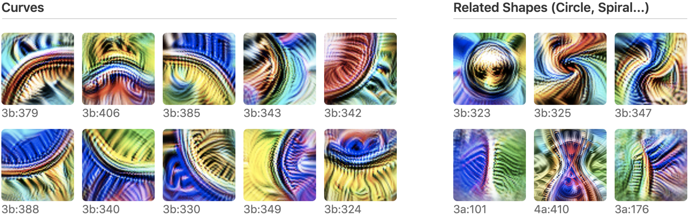

For most of deep learning's history we've treated neural networks as black boxes: we judge them by what they output, not by what they *do* inside. But what if you could put a network under a microscope and read it the way a biologist reads a cell — neuron by neuron, weight by weight?

That's the premise of the **circuits** program in interpretability, laid out in the classic Distill article *"Zoom In: An Introduction to Circuits."* This post (and the video below) walks through its core ideas: that networks are built from meaningful **features**, those features are wired into **circuits** that implement real algorithms, and the same structures recur across wildly different models.

> 🎬 **Watch the full 9-minute explainer:**

  <iframe
    src="https://www.youtube.com/embed/EjzaESBki5g"
    title="Zoom In: How to Read the Circuits Inside a Neural Network"
    frameborder="0"
    allow="accelerometer; autoplay; clipboard-write; encrypted-media; gyroscope; picture-in-picture; web-share"
    allowfullscreen
    style="position: absolute; top: 0; left: 0; width: 100%; height: 100%; border-radius: 12px;"></iframe>

▶️ Direct link: [youtu.be/EjzaESBki5g](https://youtu.be/EjzaESBki5g)

---

## The Microscope Moment

Biology had a turning point when better microscopes revealed that all living things are made of **cells**. Suddenly you could study life at the level of its building blocks. Interpretability is reaching for the same kind of leap — and the microscope is **feature visualization**: optimize an input image to maximally excite a single neuron, and you get a picture of what that neuron is "looking for."

Point that microscope at a vision model and something striking emerges: the neurons aren't random noise. Many of them correspond to clean, nameable, human-understandable concepts.

---

## Three Claims

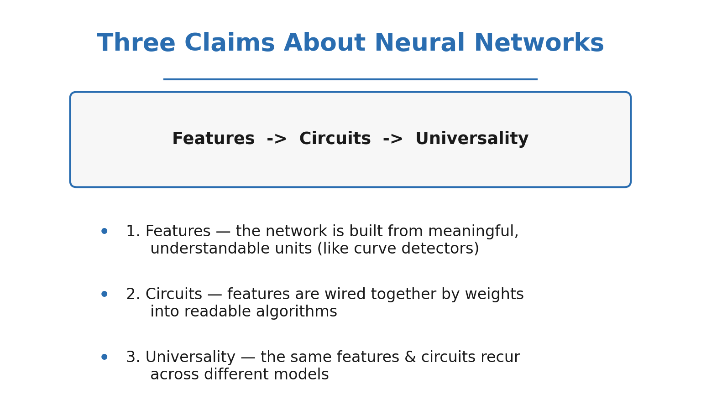

The circuits program rests on three falsifiable claims:

1. **Features** — networks are built from features, directions in activation space that correspond to understandable concepts.
2. **Circuits** — features are connected by weights, forming circuits that implement meaningful algorithms.
3. **Universality** — analogous features and circuits form across different models and tasks.

Let's take them one at a time.

---

## Claim One: Features

The cleanest example is the **curve detector**. Across a vision model you find a whole family of neurons, each firing for a curve at a particular orientation — and together they tile the full range of angles.

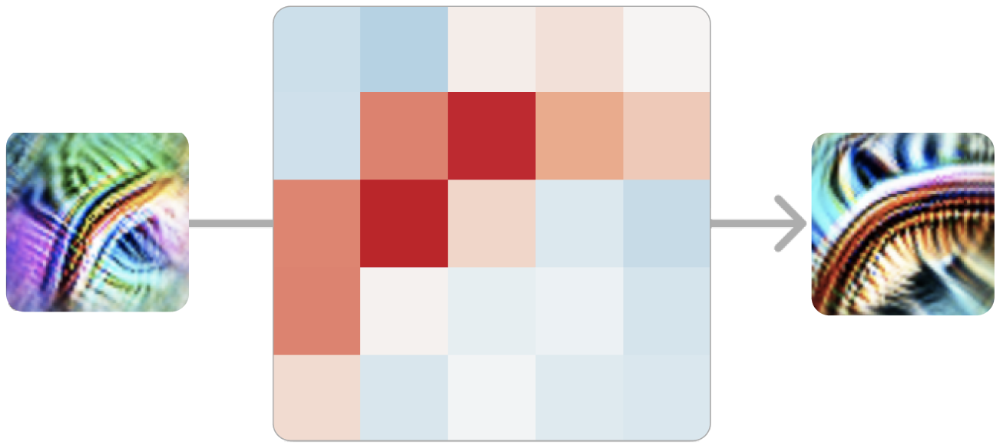

How do we know it's *really* a curve detector and not wishful thinking? The article assembles converging evidence: feature visualization, dataset examples, synthetic stimuli swept across angles, hand-written tuning curves, and — crucially — the **weights themselves**, which connect to earlier edge detectors in exactly the arrangement a curve detector would need.

### Equivariance

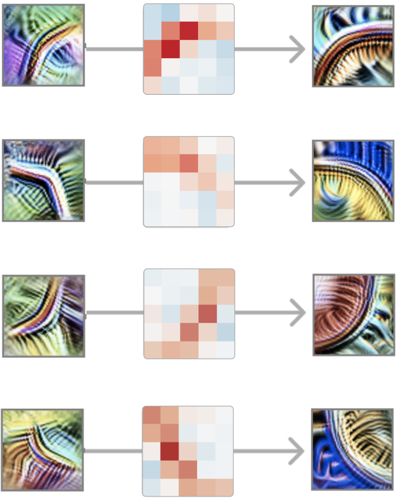

The curve detectors come as an **equivariant** set: rotate the input, and a *different* member of the family lights up. The network has effectively discovered rotation as a symmetry and built a detector for each slice of it — a recurring motif called equivariance.

### Another clear feature

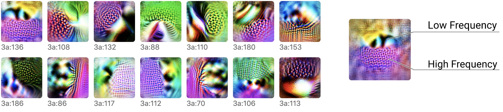

Curves aren't a one-off. **High-low frequency detectors** fire where a high-frequency texture meets a low-frequency one — a cue that's surprisingly useful for finding the boundary of an object against a blurry background.

---

## Claim Two: Circuits

A feature on its own is just a noun. The real payoff is watching features **wired together** to compute something.

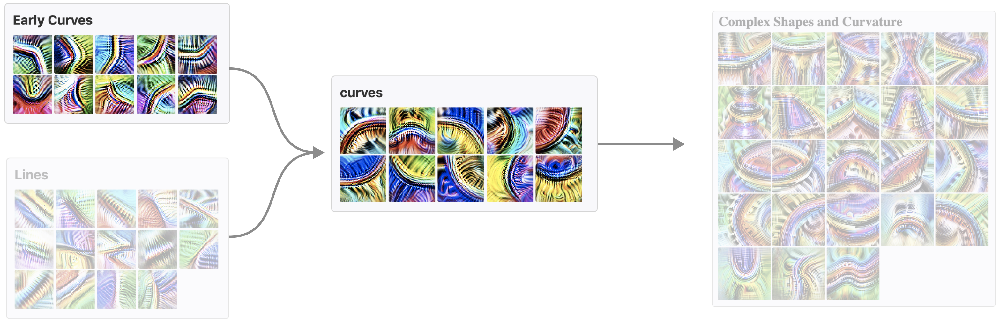

Because we can read the weights, we can read the algorithm. Take the **car detector**:

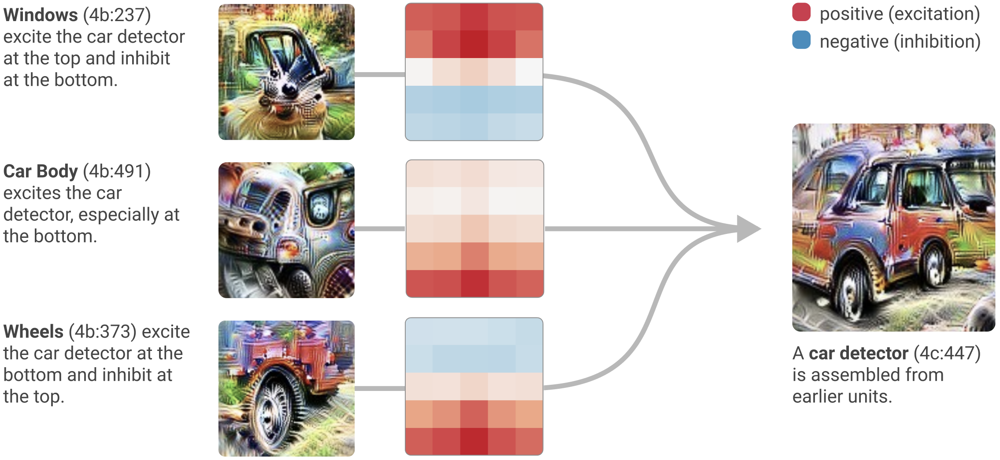

It draws on a window detector, a car-body detector, and a wheel detector — and the weights say *windows on top, body in the middle, wheels at the bottom.* The network learned the spatial layout of a car, written directly into its connections.

### Pose invariance as a logical OR

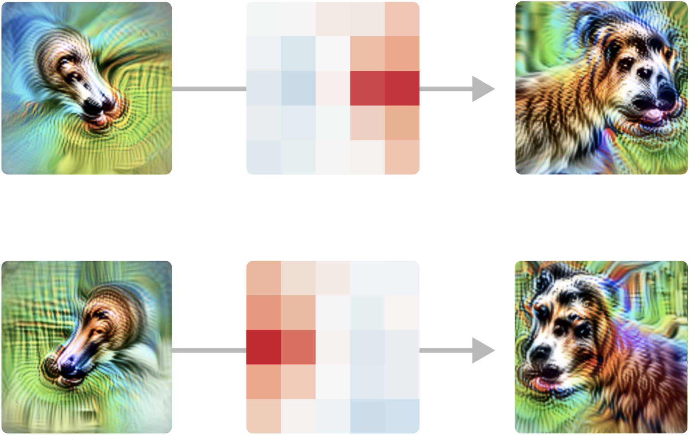

An even more elegant case: a neuron that detects a dog's head regardless of which way it's facing. Upstream are two features — a left-facing head detector and a right-facing one. The pose-invariant unit reads positively from **both**. In other words, the weights implement a literal **logical OR**: *left-facing OR right-facing → dog head.* And it holds up on real images, not just synthetic ones.

---

## Claim Three: Universality

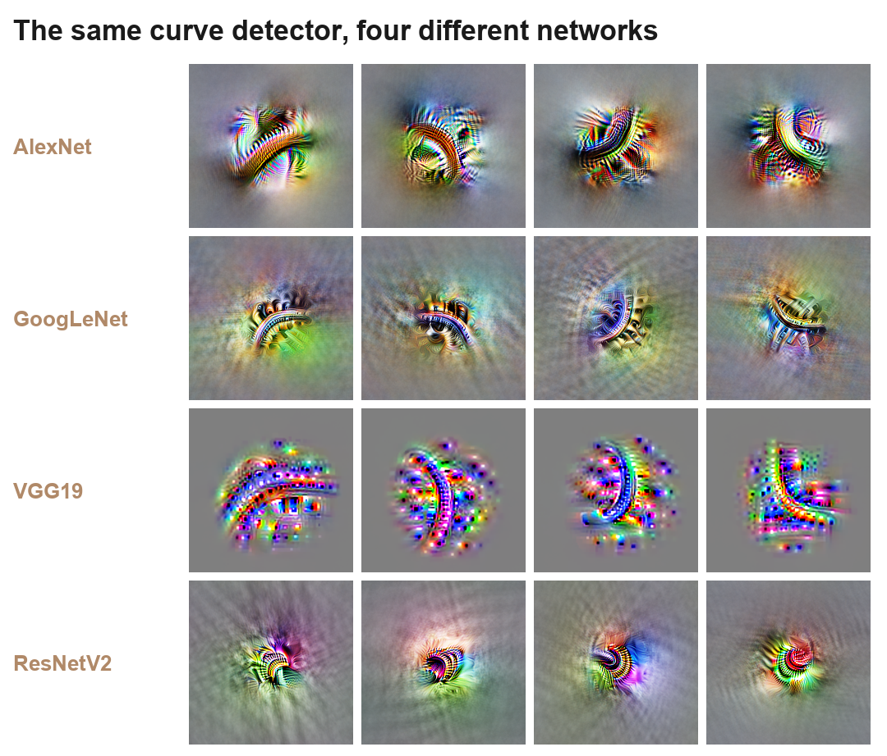

Here's the part that suggests we've found something real rather than an accident of one architecture. **Curve detectors show up again and again** — in AlexNet, InceptionV1/GoogLeNet, VGG, and ResNet, trained separately, on different architectures. The same feature keeps being rediscovered, hinting at universal building blocks of vision.

---

## The Honest Complication

It would be too tidy if every neuron were as clean as a curve detector. Many aren't.

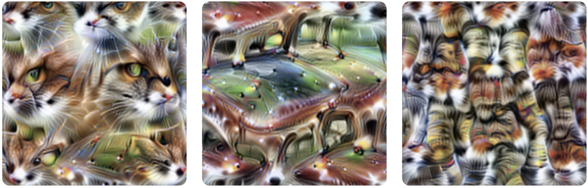

Some neurons are **polysemantic** — a single unit fires for several unrelated things (say, cat faces, fronts of cars, and cat legs). Why would a network do that?

> ⚡ **60-second version** — *"What is a polysemantic neuron?"*

  <iframe
    width="315" height="560"
    src="https://www.youtube.com/embed/MJlIOMGj3Ec"
    title="What is a polysemantic neuron?"
    frameborder="0"
    allow="accelerometer; autoplay; clipboard-write; encrypted-media; gyroscope; picture-in-picture; web-share"
    allowfullscreen
    style="border-radius: 12px; max-width: 100%;"></iframe>

▶️ Short: [youtube.com/shorts/MJlIOMGj3Ec](https://youtube.com/shorts/MJlIOMGj3Ec)

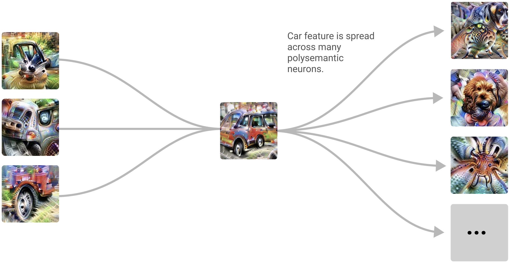

The leading hypothesis is **superposition**: there are far more useful features than neurons, so the network packs multiple features into shared directions, tolerating a little interference. Polysemanticity is the visible symptom of this packing — and one of the central obstacles to fully reverse-engineering a network.

> ⚡ **60-second version** — *"What is superposition?"*

  <iframe
    width="315" height="560"
    src="https://www.youtube.com/embed/jht5lLU9CRk"
    title="What is superposition?"
    frameborder="0"
    allow="accelerometer; autoplay; clipboard-write; encrypted-media; gyroscope; picture-in-picture; web-share"
    allowfullscreen
    style="border-radius: 12px; max-width: 100%;"></iframe>

▶️ Short: [youtube.com/shorts/jht5lLU9CRk](https://youtube.com/shorts/jht5lLU9CRk)

---

## Interpretability as a Natural Science

The methodological stance of the article is as important as any single result: treat interpretability like a **natural science**. Observe carefully, build up a catalogue of features and circuits, form hypotheses, and test them against the weights and activations — observation first, grand theories later.

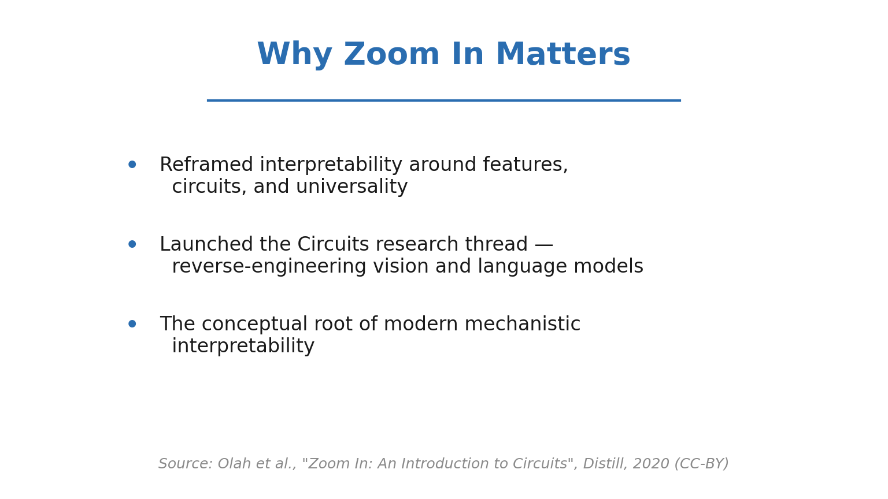

## Why Zoom In Matters

If features, circuits, and universality hold up, then neural networks aren't inscrutable after all — they're intricate objects we can study, name, and eventually understand. That's not just intellectually satisfying; it's the foundation for **AI safety**, where understanding *why* a model does something matters as much as *what* it does.

---

### ⏱️ Chapters

| Time | Section |
|------|---------|
| 0:00 | The Microscope Moment |
| 0:34 | The Microscope: Feature Visualization |
| 1:11 | Three Claims |
| 1:56 | Claim One: Features |
| 2:33 | How We Know It's a Curve Detector |
| 3:06 | Curves at Every Angle (Equivariance) |
| 3:37 | Another Clear Feature: High-Low Frequency |
| 4:05 | Claim Two: Circuits |
| 4:52 | Reading a Circuit: The Car Detector |
| 5:22 | A Circuit for Pose Invariance |
| 5:44 | Implementing OR in Weights |
| 6:09 | And It Holds Up on Real Images |
| 6:33 | Claim Three: Universality |
| 7:13 | The Complication: Polysemantic Neurons |
| 7:37 | Superposition |
| 8:04 | Interpretability as a Natural Science |
| 8:33 | Why Zoom In Matters |

---

**Source:** Chris Olah, Nick Cammarata, Ludwig Schubert, Gabriel Goh, Michael Petrov & Shan Carter, *"Zoom In: An Introduction to Circuits,"* [Distill (2020)](https://distill.pub/2020/circuits/zoom-in/). Published open-access under **CC-BY 4.0**; all figures above are from the article and © the authors, used with attribution.

*We're brand new to YouTube — if this helped, please **[subscribe](https://youtu.be/EjzaESBki5g)** and like; it genuinely keeps these explainers coming. Thanks for reading!* 🙏
