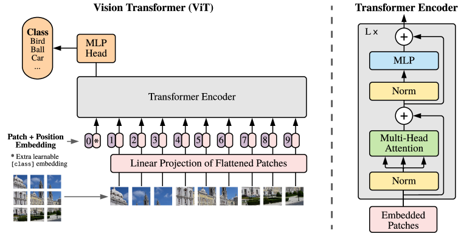
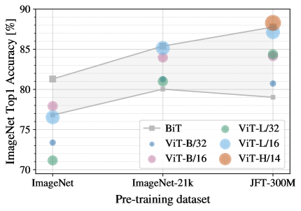
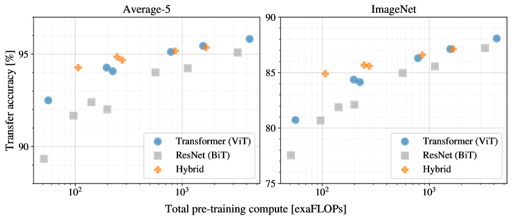
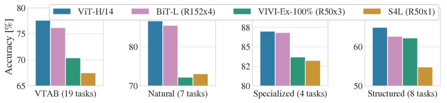
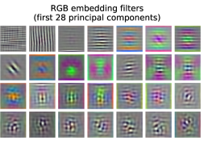
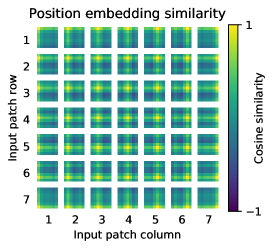
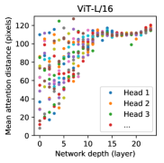
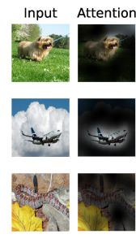

By 2020, the Transformer had conquered natural language processing. But computer vision was still ruled by **convolutional neural networks (CNNs)**, which had dominated for nearly a decade. Then a team at Google Brain asked a wonderfully simple, almost reckless question:

*What if we stop treating an image as a grid of pixels, and instead treat it as a sequence of words — and feed it to a standard Transformer? No convolutions at all.*

The paper is **"An Image is Worth 16x16 Words"** (Dosovitskiy et al., ICLR 2021), and the model it introduced is the **Vision Transformer (ViT)**.

> 🎬 **Watch the full 8-minute explainer:**

  <iframe
    src="https://www.youtube.com/embed/UwxeaIX0rZ4"
    title="An Image Is Worth 16x16 Words: How Vision Transformers Work"
    frameborder="0"
    allow="accelerometer; autoplay; clipboard-write; encrypted-media; gyroscope; picture-in-picture; web-share"
    allowfullscreen
    style="position: absolute; top: 0; left: 0; width: 100%; height: 100%; border-radius: 12px;"></iframe>

▶️ Direct link: [youtu.be/UwxeaIX0rZ4](https://youtu.be/UwxeaIX0rZ4)

> ⚡ **Short on time? Here's the ~2-minute version** — *"Vision Transformers, explained fast."*

  <iframe
    width="315" height="560"
    src="https://www.youtube.com/embed/Whe0zU4WlFk"
    title="Vision Transformers explained"
    frameborder="0"
    allow="accelerometer; autoplay; clipboard-write; encrypted-media; gyroscope; picture-in-picture; web-share"
    allowfullscreen
    style="border-radius: 12px; max-width: 100%;"></iframe>

▶️ Short: [youtube.com/shorts/Whe0zU4WlFk](https://youtube.com/shorts/Whe0zU4WlFk)

---

## Two Worlds of Deep Learning

To see why this is bold, picture two separate worlds. In **language**, the Transformer reigns: pure attention, very few assumptions baked in, and it scales beautifully — pour in more data and compute and it just keeps getting better. In **vision**, convolutional networks reign, carrying strong hand-designed assumptions about how images work.

These worlds had grown up apart. ViT's wager is that the clean, scalable language recipe could be applied — almost unchanged — directly to pixels.

---

## Step 1: Turn Patches Into Tokens

The whole trick is a translation step that lets an image pretend to be a sentence.

Take a typical $224 \times 224$ image and cut it into a grid of fixed **$16 \times 16$ patches**. That gives $14 \times 14 = 196$ patches. Flatten each one — $16 \times 16$ pixels across 3 color channels is just a list of $16 \cdot 16 \cdot 3 = 768$ numbers — and pass it through a single linear layer. Each patch becomes one neat **token vector**.

An image is now, quite literally, a sentence of 196 tokens.

---

## Step 2: Position Embeddings + a [class] Token

There's a subtlety: self-attention is **order-blind**. Shuffle the tokens and it can't tell — which is a disaster for image patches, where *where* a patch sits clearly matters.

So we add a learned **position embedding** to every patch (a little vector that says "where I came from"). Then we borrow one more trick from language models: prepend a single extra learnable **`[class]` token**. After the network runs, that token's final state serves as the summary of the whole image, and it's what we classify.

---

## Step 3: Just a Transformer

Now the easy part — because there's almost nothing left to invent. The sequence of patch tokens, plus positions and the `[class]` token, is fed into a **completely standard Transformer encoder**, the same design used for text. Inside, multi-head self-attention lets every patch directly look at every other patch, anywhere in the image, from the very first layer.

Notice what's *missing*: no convolutions, no pooling. Almost nothing about images is hard-coded. The model has to learn how vision works from scratch.

---

## The Catch: It's Data-Hungry

This is the paper's most important result. Trained only on **ImageNet** (a medium dataset), ViT actually *loses* to the convolutional baseline (the gray line). Pre-train on the larger **ImageNet-21k** and it catches up. Pre-train on **JFT-300M** (300 million images) and the Transformers (the colored dots) pull clearly ahead.

The lesson: this model is hungry. Give it enough data, and it overtakes the networks that ruled vision for years.

### Why so hungry?

It comes down to **inductive bias** — the assumptions baked into a model before it sees any data. A CNN has two powerful ones built in:

- **Locality** — nearby pixels belong together.
- **Translation equivariance** — an object is the same wherever it appears.

ViT is handed almost none of this. It must *learn* those facts about images itself, and learning them from scratch simply takes far more examples.

---

## But Efficient With Compute

Here's the flip side that got people excited. Plot performance against **pre-training compute**, and the Vision Transformers (blue dots) sit above the ResNets (gray squares) almost everywhere. For a fixed compute budget, ViT tends to reach higher accuracy. Scalable *and* efficient — exactly the combination that made the language Transformer so dominant.

---

## State of the Art

The payoff was real. The largest model, **ViT-H/14**, pre-trained on JFT and transferred, matched or beat the best convolutional systems of the day across a wide sweep of benchmarks — the 19-task VTAB suite, natural images, specialized (medical/satellite) imagery, and structured tasks — while taking substantially *less* compute to pre-train than the top CNN competitor.

---

## What Did It Learn Inside?

It works — but does it learn anything sensible, or just memorize? The authors looked, and the answer is reassuring.

**Filters.** Visualizing the very first linear patch-embedding layer reveals filters that look like edge detectors, color blobs, and textures — strikingly similar to the first layer of a CNN. Given freedom and data, ViT rediscovered the same basic visual building blocks by itself.

**2D layout.** Those position embeddings started as random vectors with no notion of geometry. This grid shows how similar each patch's learned position vector is to every other. The bright row/column structure means patches in the same row or column ended up with similar embeddings — the model figured out the **two-dimensional layout** of the image, purely from data.

**Global attention from the start.** A convolution sees only a tiny local window early on; its view widens slowly with depth. This plot measures how far each attention head looks on average. Even in the *first* layers, some heads already reach right across the whole image, while others stay local. ViT can be global from layer one — and learns to use both near and far information at once.

**Looking at the right things.** Trace what the model attends to, from its output back to the input pixels, and it consistently focuses on what matters: the dog (not the grass), the airplane (not the sky), the snake (not the leaves). With no built-in notion of objects, ViT learns to attend to semantically meaningful regions.

---

## Why It Mattered

The significance is hard to overstate. This paper showed that **convolutions — long thought essential to vision — are not actually required.** With enough scale, a plain Transformer and raw attention can match or beat them. It meant a *single architecture* could span both language and vision, a major step toward unified models. And it opened the floodgates: the Vision Transformer became a foundation for much of modern computer vision that followed.

Sometimes the boldest idea is to take what already works — and simply refuse to complicate it.

---

### ⏱️ Chapters

| Time | Section |
|------|---------|
| 0:00 | An Image Is Worth 16x16 Words |
| 0:36 | Two Worlds: CNNs vs Transformers |
| 1:09 | The Vision Transformer Architecture |
| 1:39 | Step 1: Patches Become Tokens |
| 2:11 | Step 2: Position + [class] Token |
| 2:44 | Step 3: Just a Transformer Encoder |
| 3:17 | The Catch: It's Data-Hungry |
| 3:51 | Why So Hungry? (Inductive Bias) |
| 4:26 | Efficient With Compute |
| 4:58 | State of the Art (VTAB) |
| 5:30 | What It Learns: Filters |
| 6:00 | It Learns the 2D Layout |
| 6:28 | Global Attention From the Start |
| 6:57 | Looking at the Right Things |
| 7:24 | Why It Mattered |

---

**Source:** Alexey Dosovitskiy, Lucas Beyer, Alexander Kolesnikov, Dirk Weissenborn, Xiaohua Zhai, Thomas Unterthiner, Mostafa Dehghani, Matthias Minderer, Georg Heigold, Sylvain Gelly, Jakob Uszkoreit & Neil Houlsby, *"An Image is Worth 16x16 Words: Transformers for Image Recognition at Scale,"* [ICLR 2021 (arXiv:2010.11929)](https://arxiv.org/abs/2010.11929). All figures are from the paper and © the authors, shown here for educational explanation.

*We're brand new to YouTube — if this helped, please **[subscribe](https://youtu.be/UwxeaIX0rZ4)** and like; it genuinely keeps these explainers coming. Thanks for reading!* 🙏
