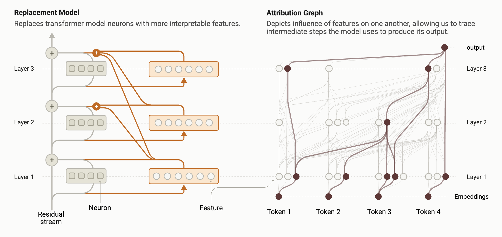

In a companion post we toured *the biology of a language model* — watching Claude plan rhymes, chain facts, and even scheme. But every one of those discoveries rests on a single technique. The goal sounds impossible: take a network of **billions of inscrutable weights** and turn the computation behind one specific answer into a readable diagram. The method that pulls this off is **circuit tracing**, and its output is an **attribution graph**.

## Why you can't just read neurons

The obvious move would be to inspect the neurons. The trouble is that a single neuron fires for many unrelated things at once — faces, code, punctuation — all tangled together. That's **polysemanticity**, a consequence of *superposition* (the network packing more concepts than it has neurons). So the network's natural units are essentially unreadable. Before we can draw a circuit, we need cleaner parts.

## Step 1 — swap neurons for features

Using **dictionary learning**, the model's activity is re-described with a large set of **features**, each tuned to a single, nameable concept. Where a neuron is a blur of meanings, a feature is one clean meaning. These are the interpretable building blocks.

## Step 2 — a transparent replacement model

The key device is a **cross-layer transcoder (CLT)**: a special dictionary that reads the model's residual stream and reproduces what its feed-forward layers would have computed — but expressed in those clean features, and features that can reach *across* layers. Swap it in for the original components and you get a **replacement model**: a stand-in that behaves almost like the real network but is built from interpretable pieces.

## Step 3 — make it faithful for one prompt

A stand-in is only useful if it truly matches the original. So for each specific prompt, they build a **local replacement model**: freeze the attention patterns, and add correction terms so the stand-in reproduces the real model's activations *exactly*, on that prompt. This matters — it means the graph describes the **actual computation** the real model performed, not a loosely similar one.

## Error nodes: honesty built in

Those correction terms have a name — **error nodes** — and they're the most honest touch in the method. Whatever the clean features genuinely *cannot* account for is dumped into an explicit error node, right there in the graph. So the diagram never pretends to understand more than it does. A big error node tells you that part of the computation is still outside our explanation. The unknown is **labeled, not hidden**.

## Reading — and testing — the graph

The nodes are the active features (plus the input tokens, the output, and error nodes); the edges measure how strongly each feature directly pushes on the others. Raw, that graph has thousands of connections, so related features are grouped into **supernodes** and the graph is pruned down to what carries the computation. What's left reads almost like a sentence: *this concept drove that one, which produced the answer.*

But a beautiful diagram can still be wrong, so the method insists on **validation**. An attribution graph makes a prediction — turn off a feature it blames, and the output should change in a specific way. They perturb those features and check the real model responds as predicted. Only then does the graph become **evidence**, not just illustration.

## How much does it explain?

Honestly: partially. The clean features capture a real, substantial fraction of the computation, and everything else is openly accounted for by error nodes. So you get a *quantifiable* claim of understanding — here's how much we can explain, and precisely how much we can't. The main limitation is that attention patterns are frozen, so this explains *what* information moves, but not *why* a head attends where it does (the subject of follow-up work).

That's circuit tracing: clean features → a transparent stand-in → a per-prompt graph → proof by perturbation. It's the quiet engine behind every striking result in the biology of large language models.

---

**Source:** Ameisen, Lindsey et al., *"Circuit Tracing: Revealing Computational Graphs in Language Models,"* Anthropic — [Transformer Circuits Thread](https://transformer-circuits.pub/2025/attribution-graphs/methods.html) (2025). All figures © the authors, shown here for educational explanation.
