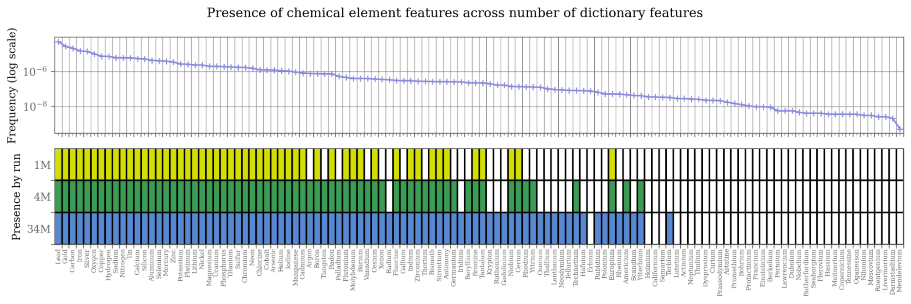
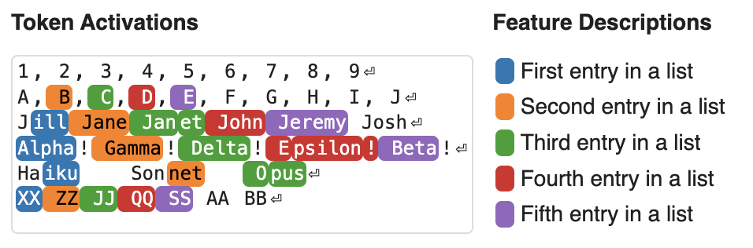

In 2023, Anthropic learned to pull clean, single-meaning **features** out of a tiny one-layer model. The obvious question was whether the trick scales. In *"Scaling Monosemanticity,"* they answered it on **Claude 3 Sonnet** — a real production model — extracting **millions** of interpretable features with a sparse autoencoder. It's the moment interpretability grew up.

## Features that scale — and that are abstract

Training a much larger sparse autoencoder on Claude's activations yields features that stay clean and human-understandable at scale. And they're not just surface word-detectors — many are **abstract**, **multilingual**, and **multimodal**: the same feature fires for a concept in English, in other languages, and even in images of it.

Better still, you can lay the whole feature space out as a **map**, where related features sit near each other — a genuine atlas of the concepts a model has learned (top).

## The Golden Gate feature

The famous example: a single feature for the **Golden Gate Bridge**. It fires for the bridge in English, in other languages, even in pictures — one clean concept, isolated inside the model. And it's **causal**: clamp that one feature high and the whole model becomes obsessed, steering any conversation back to the bridge. (Anthropic briefly shipped this as "Golden Gate Claude.") A feature is a **lever**, not just a label.

## The real prize: safety-relevant features

Far more important than one bridge: they found features for the things safety actually cares about — **deception**, **bias**, **dangerous code**, **sycophancy**, secrecy, and power-seeking. Each such feature is **dual-use** by design:

- a **detector** — letting us *see* when these concepts activate inside the model, and
- a **dial** — letting us turn that behavior down.

That's a concrete handle for monitoring and steering a deployed model, grounded in its internal representations rather than its outputs.

## Why it mattered

The point was never one bridge — it's that **interpretability scaled all the way up** to a frontier model, producing millions of human-understandable concepts that are both readable and causally controllable. The honest caveats remain: a sparse autoencoder captures only part of what the model represents, and finding a feature for a concept doesn't mean you've found *every* place that concept lives. But this is the work that turned "monosemantic features" from a toy-model curiosity into a practical tool for understanding the models we actually deploy.

---

**Source:** Templeton, Conerly et al., *"Scaling Monosemanticity: Extracting Interpretable Features from Claude 3 Sonnet,"* Anthropic — [Transformer Circuits Thread](https://transformer-circuits.pub/2024/scaling-monosemanticity/index.html) (2024). All figures © the authors, shown here for educational explanation.
