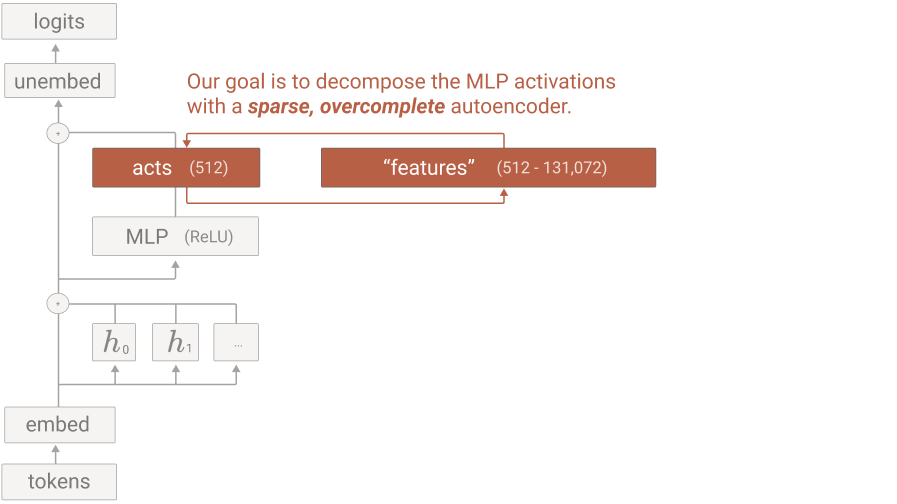
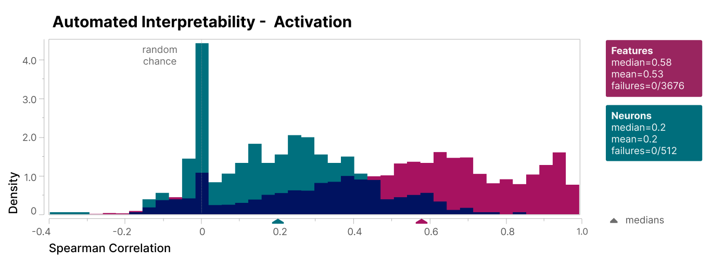

Inside a neural network, a single neuron fires for many unrelated things at once — it's **polysemantic**, which makes it almost impossible to read. So how do you pull out clean, single-meaning concepts? The 2023 paper *"Towards Monosemanticity"* showed the way, and it launched the whole feature-extraction program that later scaled to frontier models.

## The method: dictionary learning

The trick is a **sparse autoencoder (SAE)**. Take the model's tangled activations and re-express them in a much *wider* space where only a few units fire at once. By expanding the dimensionality and forcing sparsity, those units become clean, single-meaning **features** — the network's concepts, untangled from the neurons that superimpose them.

Formally, the SAE balances two terms — faithful reconstruction plus sparsity:

$$\mathcal{L} = \underbrace{\lVert x - \hat{x}\rVert_2^2}_{\text{reconstruction}} \;+\; \lambda\underbrace{\lVert f \rVert_1}_{\text{sparsity}}$$

Perfect reconstruction *plus* extreme sparsity is what isolates individual, human-readable features from the noise.

## What a feature looks like

A good feature does two things: it fires **consistently** on one concept across many contexts (say, Arabic script, or DNA sequences), and when you turn it on, it **steers** the model's output toward that concept. Consistent *and* causal — far cleaner than any single neuron.

And this isn't hand-waving: scored for interpretability, the SAE features beat the raw neurons by a clear margin.

## Feature splitting

A beautiful discovery: make the dictionary **bigger** and a single feature **splits** into many. One broad "bird" feature becomes features for specific birds; a generic concept resolves into finer ones. You can effectively *zoom in* on a concept at whatever resolution you choose — a hint that the model's concept space is richly hierarchical.

## Why start so small — and why it mattered

The experiment ran on a deliberately tiny one-layer model, precisely so the result would be unambiguous. The same features even reappear across different models trained separately — strong evidence they're **real structure in the data**, not accidents of one network. That combination — clean, causal, measurable, and universal — is what made this the foundation for everything that followed, including extracting millions of features from a production-scale Claude.

The honest limits: an SAE is an approximation that captures only part of what a model represents, and choosing the dictionary size and sparsity is a real tuning problem. But this little experiment proved the core claim — that monosemantic features can be *found* — and turned reading a model's mind from a dream into a method.

---

**Source:** Bricken, Templeton et al., *"Towards Monosemanticity: Decomposing Language Models With Dictionary Learning,"* Anthropic — [Transformer Circuits Thread](https://transformer-circuits.pub/2023/monosemantic-features/index.html) (2023). All figures © the authors, shown here for educational explanation.
