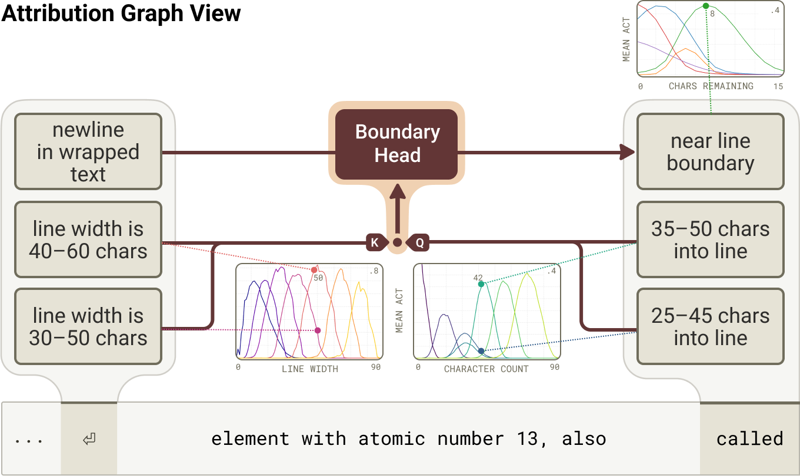

Here's a deceptively simple puzzle. When a language model wraps text to a fixed width, it has to know how many characters still fit on the current line. But it has no eyes and no ruler — only a stream of tokens. So how does it *count*? Anthropic's interpretability team pulled this thread, and what they found is one of the most elegant little mechanisms in any model.

## The task

The model is generating inside a fixed line width and, at each step, must decide whether the next word fits or whether to insert a line break. To do that, it must track a running character count and compare it against the limit — pure arithmetic, with no obvious place to store a number.

## Counting on a helix

The surprise is *where* the count lives. It isn't a plain scalar tucked in a neuron. The running character count is represented on a **helix** — a curved spiral in activation space — where position along the curve encodes how far across the line the model is (the cover figure). Counts that are close numerically sit close on the curve.

You can read the whole mechanism as a circuit: features that detect the current count feed a comparison that triggers the line break. And because the representation is a smooth manifold rather than discrete slots, it has a tell-tale signature.

## Doing math by rotating geometry

To check whether the next word fits, attention heads effectively **rotate one count-manifold onto another** — comparing characters-used against the width that remains. The model performs arithmetic not with logic gates but by *moving geometry*: a rotation in a curved space implements a comparison.

This has a striking consequence. Because the count lives on a curve, you can **fool** it — carefully crafted text throws off the model's sense of position, a kind of *optical illusion for a language model*, predicted directly from the geometry. The whole thing also rhymes with neuroscience: it looks a lot like the **place cells and grid cells** the brain uses to track position in space.

## Why a boring habit hides real structure

Line-wrapping is about the least glamorous thing a model does — and yet under the hood it's a genuine counting machine built from spirals and rotations, discovered by reading both the **features** and the **geometry** together. It's a clean reminder that even the model's most mundane behaviors are implemented by structured, legible mechanisms, if you look closely enough.

---

**Source:** Anthropic, *"Line Breaking"* / the geometry of counting in language models — [Transformer Circuits Thread](https://transformer-circuits.pub/2025/linebreaks/index.html) (2025). All figures © the authors, shown here for educational explanation.
