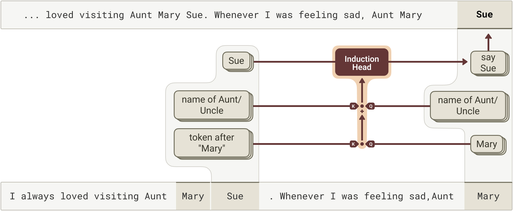
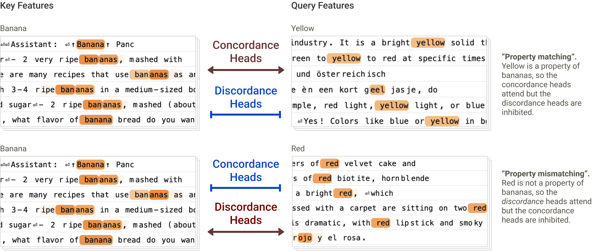

Attribution graphs gave us a way to see *what* information a model moves between tokens. But they froze one crucial thing: the **attention pattern** itself. They could tell you a head copied information from an earlier token — but not *why* it attended to **that** token. This work cracks open the other half of the circuit: the **query** and the **key**.

## The idea: QK attributions

Every attention head decides *where* to look using a **query** (from the current token) and a **key** (from each earlier token); attention flows where their dot product is high. QK attributions trace that decision back to the **features** that built the query and the key — so we can finally explain why a head attends where it does.

The intuition is clean: think of the **query as a question** the current token asks ("what am I looking for?") and the **key as an advertisement** each earlier token posts ("here's what I offer"). Attention goes where question meets matching ad.

## Confirmed: induction heads

Run it on **induction heads** — the circuit that continues a repeated pattern (`[A][B]…[A] → [B]`) — and the attribution confirms the textbook story precisely: the query looks for *what came after the current token last time*. The mechanism interpretability folklore long described is now verified from the weights (cover figure).

## A surprise: many mechanisms at once

The big surprise: a single attention head often runs **several matching mechanisms in parallel**, not one clean rule. What looks like a single behavior is frequently a blend of heuristics layered together — a reminder that real circuits are messier than the tidy stories we tell about them.

## A new discovery: concordance heads

The method didn't just confirm known heads — it **revealed new ones**, like **concordance heads** that attend based on grammatical agreement (matching number, gender, or case). Finding new, nameable head types straight from QK attributions is the clearest sign the technique is doing real work.

## Why it matters

Attribution graphs showed *what* a model computes; QK attributions now show *why it looks where it looks*. For auditing model behavior — especially in long-horizon or safety-critical settings — being able to explain attention, not just trace it, closes a real gap. There are open questions (it's still per-prompt, and attention is only one part of the story), but the other half of the circuit is finally open.

---

**Source:** Anthropic, *"Attention QK"* — tracing query–key attributions in attention heads — [Transformer Circuits Thread](https://transformer-circuits.pub/2025/attention-qk/index.html) (2025). All figures © the authors, shown here for educational explanation.
