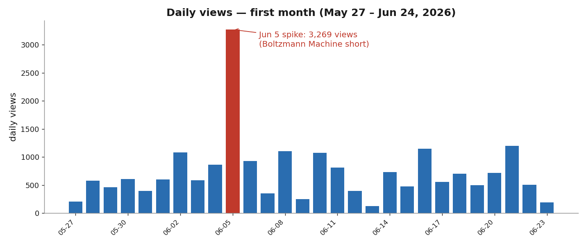
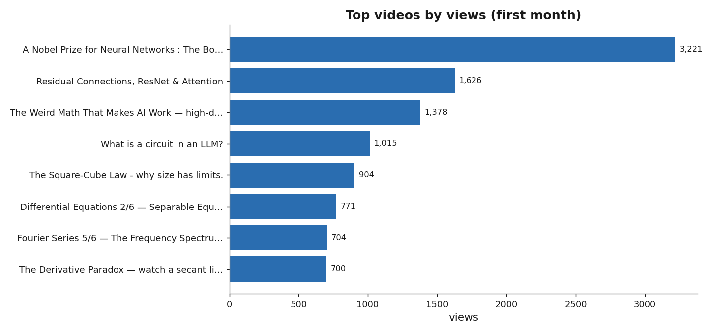
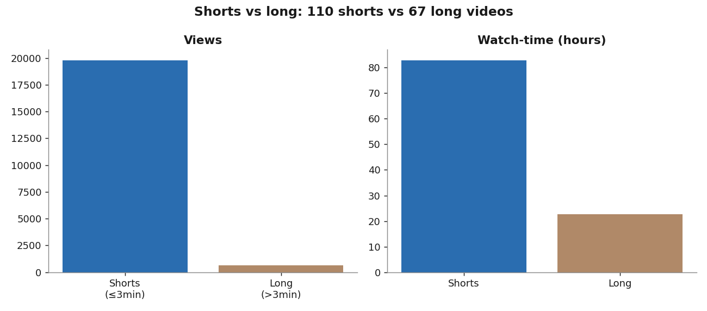
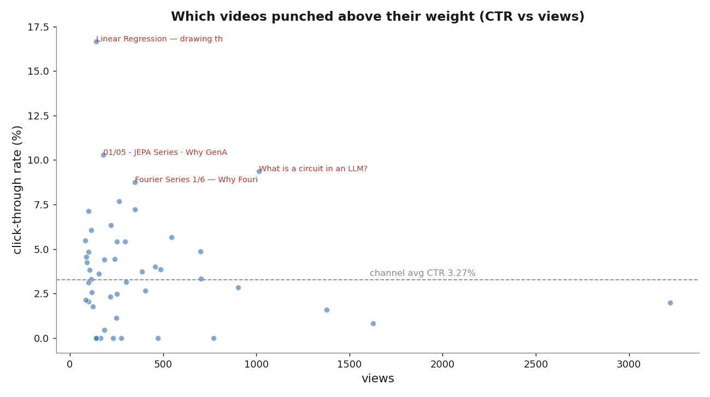

A month ago I started uploading short, dense explainers on AI, machine learning, and the math underneath them. No audience, no plan beyond "explain one idea clearly per video." Here's an honest, data-driven look at the first month — **May 27 to June 24, 2026** — straight from the YouTube analytics, the good and the humbling.

## The headline numbers

| Metric | First month |
|---|---|
| **Views** | **20,442** |
| **Watch time** | **105.9 hours** |
| **Subscribers gained** | **55** |
| **Impressions** | **24,033** |
| **Click-through rate** | **3.27%** |
| **Videos published** | **177** |

Twenty thousand views in a month from a standing start feels surreal. But the averages hide everything interesting — so let's break it down.

## A few videos carry the whole channel

The view distribution is brutally top-heavy. A handful of videos did most of the work, and a long tail did almost nothing.

The breakout was the **Boltzmann Machine** short — *"A Nobel Prize for Neural Networks"* — at **3,221 views**, the single bar that defines the whole month. You can see it as the red spike on June 5 above: **3,269 views in one day**, more than triple any other day. One video genuinely changed the trajectory.

Right behind it: **Residual Connections / ResNet & Attention** (1,626), **The Weird Math That Makes AI Work** (1,378), and **What is a circuit in an LLM?** (1,015).

## Shorts bring the crowd; long videos bring the depth

I made two very different kinds of video, and the data splits cleanly along that line.

- **Shorts (≤3 min):** ~110 videos, **~19,800 views** — virtually all the reach.
- **Long videos (>3 min):** ~67 videos, only ~650 views — but they pull their weight in **watch-time depth**.

The single biggest watch-time contributors tell the story: the Boltzmann short (6.8 hours), but also the long *Mathematical Framework for Transformer Circuits* (5.8 hours from just 302 views), *The Derivative Paradox* (5.3 h), and *Why 1.58-bit LLMs?* (5.2 h). **Shorts win discovery; long videos win attention.** Both matter.

## Click-through rate: the title-and-thumbnail game

Views depend on how many people *click* after seeing the thumbnail. The channel average is **3.27%**, but a few videos massively over-performed.

The CTR champions:

- **Linear Regression — drawing the best line through data** — **16.7%**
- **JEPA Series 01/05 — Why GenAI Has a Fundamental Problem** — **10.3%**
- **What is a circuit in an LLM?** — **9.4%** *(and 1,015 views — the rare video that's both clickable AND widely seen)*
- **Fourier Series 1/6 — Why Fourier?** — **8.8%**

The pattern is clear: **concrete, curiosity-gap titles win** ("Why GenAI Has a Fundamental Problem", "drawing the best line through data") over abstract ones. The single best outcome is the top-right of that chart — high views *and* high CTR — and *"What is a circuit in an LLM?"* was the closest thing to that sweet spot.

## What the data taught me

1. **One hit reshapes everything.** The Boltzmann short alone was ~16% of the month's views. You can't predict the hit, so the only move is to keep shipping.
2. **Shorts for reach, longs for trust.** Shorts found the audience; the long explainers are where the few who arrive actually *stay* and subscribe.
3. **Titles are half the battle.** A 16.7% CTR vs a sub-1% CTR on similar topics is almost entirely framing.
4. **Subscribers are slow and earned.** 55 subs from 20k views (~0.27%) — people watch one idea and move on. Converting viewers to subscribers is the real next chapter.

## Onward

55 subscribers isn't a milestone anyone brags about — but a month ago it was zero, and 20,000 people watched something I made to understand an idea a little better. The plan for month two is unchanged: **one clear idea per video, shipped relentlessly**, with sharper titles and a few more long-form deep dives for the people who want to go deeper.

If any of this sounds like your kind of thing — AI, ML, and the math behind it, explained simply — I'd love for you to [come along](https://www.youtube.com/@dotehacker). Thanks for reading. 🙏

*All figures from YouTube Studio analytics, May 27 – June 24, 2026. Charts generated from the raw export.*
