A world model has three pieces: an **encoder**, a **state-space model**, and a **decoder**. This post builds two of them from scratch — one for CartPole, one for a little visual "counting + mass" world — and at the end you can **drive the trained model yourself, in your browser**.

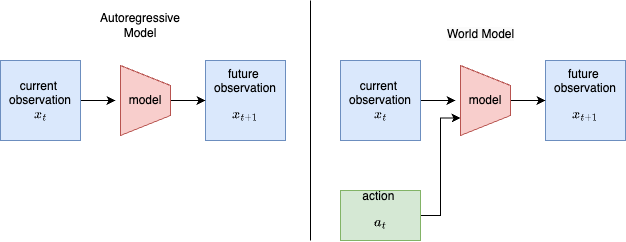

## 1. World models: the idea (and the math)

An **autoregressive (AR) model** predicts the next observation from the past:
$$ x_{t+1} \sim p_\theta(x_{t+1} \mid x_{\le t}). $$
A **world model (WM)** also conditions on the *action* the agent takes, so it can answer "what happens **if I do** $a_t$?":
$$ x_{t+1} \sim p_\theta(x_{t+1} \mid x_{\le t},\, a_t). $$
That extra $a_t$ is the whole difference (figure above): it turns a passive predictor into something an agent can *plan and act* inside. We use the **Dreamer** recipe: learn a compact latent world model from data, then train a controller purely on trajectories *imagined* by that model.

## 2. The model (RSSM)

State is split into a **deterministic** path $h_t$ (a GRU memory) and a **stochastic** latent $z_t$:
$$
\begin{aligned}
h_t &= f_{\text{GRU}}\big(h_{t-1},\,[\,z_{t-1},\,a_{t-1}\,]\big) &&\text{(recurrence)}\\
\text{prior:}\quad & p_\theta(z_t \mid h_t) = \mathcal N\!\big(\mu_\theta(h_t),\,\sigma_\theta(h_t)\big)\\
\text{posterior:}\quad & q_\phi(z_t \mid h_t, x_t) = \mathcal N\!\big(\mu_\phi(h_t,e_t),\,\sigma_\phi(h_t,e_t)\big),\ \ e_t=\text{enc}(x_t)\\
s_t &= [\,h_t,\,z_t\,] &&\text{(model state / ``feature'')}
\end{aligned}
$$
From the state $s_t$, three heads predict the observation, the reward, and the "keep going" probability:
$$
\hat x_t = g_\theta(s_t),\qquad \hat r_t = r_\theta(s_t),\qquad \hat c_t = \sigma\big(c_\theta(s_t)\big)\approx \Pr(\text{not terminal}).
$$
The **prior** dreams the next latent *without* looking at the world; the **posterior** corrects it *using* the real observation $x_t$. This split is exactly the open-loop vs closed-loop behaviour we study in the results.

## 3. Training the world model

Fit everything by minimising reconstruction + reward + continue + a KL term:
$$
\mathcal L_{\text{WM}}=\mathbb E_{q_\phi}\Big[\underbrace{\lVert x_t-\hat x_t\rVert^2}_{\text{reconstruction}} + \underbrace{(r_t-\hat r_t)^2}_{\text{reward}} + \underbrace{\text{BCE}(c_t,\hat c_t)}_{\text{continue}} + \beta\,\mathrm{KL}_t\Big].
$$
The KL keeps the dream (prior) close to the observation-grounded posterior, with **KL balancing** and free nats $\kappa$:
$$
\mathrm{KL}_t = \alpha\,\max\!\big(\kappa,\ \mathrm{KL}[\,\text{sg}(q_\phi)\,\|\,p_\theta\,]\big) + (1-\alpha)\,\max\!\big(\kappa,\ \mathrm{KL}[\,q_\phi\,\|\,\text{sg}(p_\theta)\,]\big),
$$
where $\text{sg}[\cdot]$ is stop-gradient ($\alpha=0.8,\ \kappa=1$).

## 4. Learning to act — inside imagination

Starting from real model states, we **roll the prior forward** $H$ steps using the actor $\pi_\psi(a\mid s)$, never touching the environment. On this imagined trajectory we use a **$\lambda$-return**:
$$
V^\lambda_t = \hat r_t + \gamma\,\hat c_t\Big[(1-\lambda)\,v_\xi(s_{t+1}) + \lambda\,V^\lambda_{t+1}\Big],\qquad V^\lambda_H=v_\xi(s_H).
$$
The **critic** regresses to it and the **actor** maximises it (discrete actions use straight-through gradients, so the signal flows back through the dynamics), plus an entropy bonus $\eta$:
$$
\mathcal L_v=\mathbb E\Big[\sum_t\big(v_\xi(s_t)-\text{sg}(V^\lambda_t)\big)^2\Big],\qquad
\mathcal L_\pi=-\mathbb E\Big[\sum_t V^\lambda_t\Big]-\eta\,\mathbb E[\,\mathcal H(\pi_\psi)\,].
$$
A slow **target critic** stabilises the bootstrap: $\bar\xi \leftarrow (1-\tau)\,\bar\xi + \tau\,\xi$.

## 5. Acting: open loop vs closed loop

When the trained agent plays, it can update its latent two ways each step:
$$
\text{open-loop (dream):}\ \ z_t\sim p_\theta(z_t\mid h_t),\qquad
\text{closed-loop (peek):}\ \ z_t\sim q_\phi(z_t\mid h_t,x_t).
$$
Open-loop needs no observations but lets small errors compound; closed-loop re-grounds on the real $x_t$ every step. We measure exactly this trade-off below.

---

## Exp 0: CartPole world model (the baseline)

A good first experiment before moving to images: it exercises every core world-model idea with minimal complexity.

**Objective.** Train a world model that learns CartPole's dynamics from interaction data, then use it to imagine futures and train a controller *inside the model's dreams*.

**Why CartPole first?** It's fully observable and low-dimensional (4-D state), fast to debug, and a classic control task — so it's easy to verify whether the model learned accurate physics. It builds intuition for dynamics, imagination, and model-based control before pixels enter the picture.

**Setup.**

- **Environment:** `CartPole-v1` (Gymnasium). State $x\in\mathbb R^4$ = (cart position, cart velocity, pole angle, pole angular velocity); two discrete actions (push left / right); reward $=+1$ each step until the pole falls or 500 steps elapse.
- **A key modelling choice.** The 500-step cap is a *time limit* (truncation), **not** a failure. We set the continue target $c_t=1$ for truncation and $c_t=0$ only for a real fall — otherwise the model learns "the world always ends at 500" and gives up.

**World-model components.**

- **Encoder** — a small MLP (the state is already low-dimensional) → latent.
- **Dynamics (core)** — a GRU taking (latent + action) → next latent, reward, and done probability.
- **Decoder + reward/continue heads** — small heads on the model state.

| Component | Choice | | Component | Choice |
|---|---|---|---|---|
| Deterministic state $h$ | 128 | | Discount $\gamma$ / $\lambda$ | 0.99 / 0.95 |
| Stochastic latent $z$ | 32 (Gaussian) | | Imagination horizon $H$ | 15 |
| Hidden units | 128 (ELU MLPs) | | KL balance $\alpha$ / free nats $\kappa$ | 0.8 / 1.0 |
| World-model LR | $6\times10^{-4}$ | | Target-critic rate $\tau$ | 0.02 |
| Actor / critic LR | $8\times10^{-5}$ | | Batch / sequence length | 32 / 20 |
| Entropy bonus $\eta$ | $3\times10^{-3}$ | | Updates | 3000 (~4 min, CPU) |

**Training loop.** Seed the replay buffer with random episodes, then repeat: sample sequences → update the world model ($\mathcal L_{\text{WM}}$) → imagine and update actor + critic ($\mathcal L_\pi,\ \mathcal L_v$) → collect a fresh episode with the current policy ($\varepsilon$-greedy) → evaluate.

**Code map.** RSSM + heads → `world_model.py`; actor / critic / imagination → `dreamer.py`; replay buffer → `buffer.py`; training loop → `train.py`; metrics + plots → `evaluate.py`.

### Exp 0 — results (what actually happened)

**Short version: it worked.** We trained a world model on CartPole, then trained the player *only inside the model's imagination* — and when we dropped that player into the real game, it balanced the pole perfectly.

Think of the world model as three small parts:

- **Eyes (encoder):** look at the game numbers (cart position, speed, pole angle, pole speed) and turn them into a small "idea".
- **Imagination (the core):** given the current idea + your action, guess the *next* idea — plus the reward and whether the pole just fell.
- **Translator (decoder):** turn an "idea" back into real game numbers, so we can check and draw it.

Then a small **player (actor)** and a **judge (critic)** learn to play — but they practice **only in dreams**. The model imagines short futures, the player improves inside them, and it never touches the real game while learning.

**The score.**

- Real game: **500 / 500, every single time** (100 games in a row). 500 is the maximum — the pole never fell.
- That beats the "solved" target of 475.
- The model can **see ~10+ steps into the future accurately** — its pole-angle guess is off by only ~0.03 rad even 11 steps ahead.

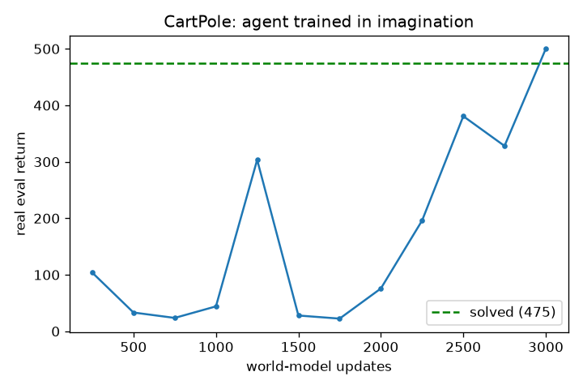

**The most interesting part: dreaming alone vs dreaming with a peek.**

- **Open-loop (dream alone):** after the first frame the model imagines everything itself. Tiny mistakes pile up, and after ~80 steps the dreamed pole drifts away and tips over.
- **Closed-loop (peek every step):** the model glances at the real game each step and corrects itself — staying glued to reality, about **11× less drift** (0.03 vs 0.33).

This is *why* the player keeps its eyes open while actually playing, and only trusts short dreams while practicing.

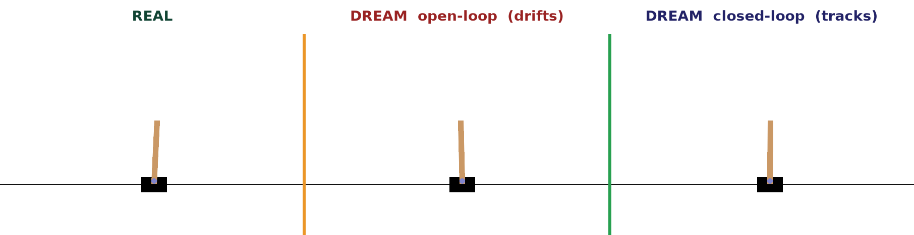

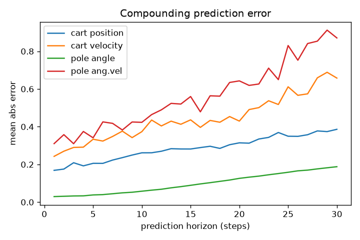

**How often does the dream need to peek? (10 vs 20 vs 40).** Peeking every step keeps the dream perfect — but that's a lot of peeking. So we let the dream run on its own and gave it one real peek every 10, 20, or 40 steps.

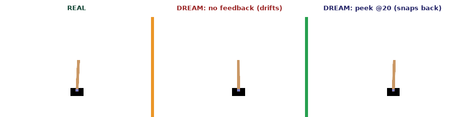

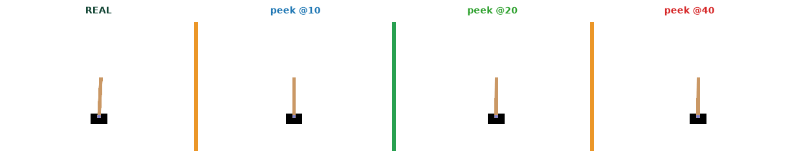

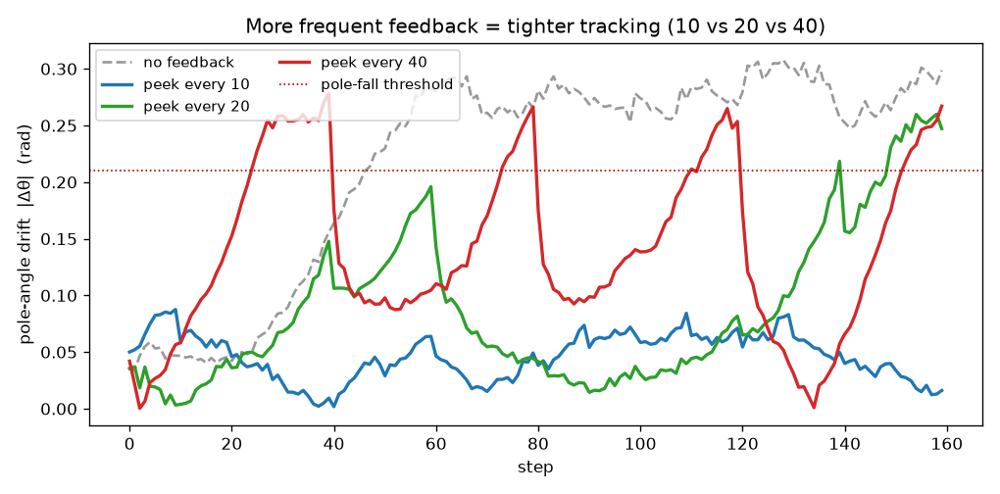

What we found (drift = how far the dreamed pole angle is from the real one):

- **Every 10 steps:** stays tight — barely drifts (max ~0.09).
- **Every 20 steps:** drifts up to ~0.26 between peeks — getting risky.
- **Every 40 steps:** drifts almost as much as never peeking.

Simple takeaway: **a little feedback goes a long way.** Even peeking 1 step in 10 keeps the dream ~5× closer to reality than dreaming blind.

**Honest notes (what was tricky).** The model's *predictions* were always good; the hard part was the *player's* training being wobbly — it would hit a perfect 500, then bounce around. Adding a **target critic** (a slow, steady copy of the judge) made it stable. Forcing extra attention on "the pole fell" moments backfired (the model became scared the pole always falls), so we kept that gentle. And the time-limit-vs-failure distinction at 500 steps mattered — get it wrong and the model gives up.

### Conclusion (Exp 0)

- A controller trained **entirely inside a learned world model's imagination** solved CartPole: **500 / 500 over 100 real episodes**, clearing the "solved" bar (475).
- Predictions were accurate (pole angle off by ~0.03 rad even 11 steps ahead). The only hard part was controller stability — fixed with a slow target critic.
- **Open-loop dreams drift** (~0.33 rad over 500 steps); **closed-loop tracking stays glued to reality** (~0.03 rad, ~11× lower).
- **Takeaway:** the world model is a good *short-horizon* simulator. Trust it for short imagined rollouts and control, but re-ground it on real observations frequently.

---

## Experiment 1: counting + mass (now with pixels)

**Goal.** Build a minimal *visual* world model that tracks and predicts object **count** and **total mass** over time from image sequences. It introduces pixel input while keeping the state low-dimensional and interpretable, and success is easy to measure (accuracy of predicted count/mass).

**Task setup.** Synthetic 64×64 image sequences of random colored shapes (circles / squares) that appear, disappear, or stay. Each object has a mass from its size (small = 1, medium = 2, large = 5). Three actions: *add a random object*, *remove one*, *no-op*.

**Architecture.** A **CNN encoder** → feature vector with an auxiliary count/mass head; a **GRU dynamics core** maintaining the believed (count, total-mass); and **prediction heads** for next count, next mass, and an optional reconstruction. Same encoder → latent-dynamics → heads → imagination recipe as CartPole — just with a CNN for eyes.

### Exp 1 — results (what actually happened)

**Short version: the visual world model works — and we built an agent that plans inside it.** Four steps: make the data, prove the model can *see*, teach it the *dynamics*, then train an agent to *reach goals*.

**Step 1 — the data (a little shapes world).** No dataset to download, so we built a tiny simulator: a 64×64 image with colored shapes, each with a size → mass. Each step an action changes the scene; we record image, action, count, and total mass per frame.

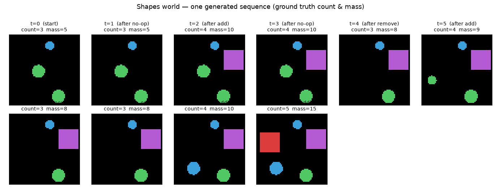

**Step 2 — can it even *see*? (perception check).** Before any world model, the most basic test: can a CNN read **count** and **mass** from a *single* image? First try: only **67%** — it miscounted when shapes overlapped (two on top of each other look like one). After making the world well-posed (no overlap) and treating count as a 7-way choice: **98% count accuracy.** Lesson: *a world model is only as good as its eyes — fix perception first.*

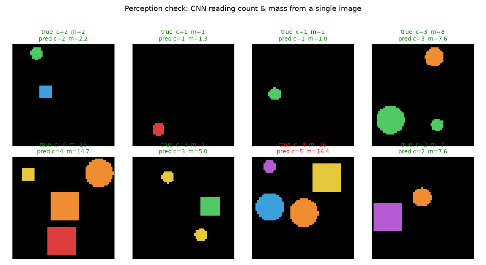

**Step 3 — learning the dynamics.** Now the real thing: from the current image **+ your action**, predict the **future** count & mass.

- **Closed-loop (peek every frame):** near-perfect — count **98–100%** even 12 steps ahead.
- **Open-loop (dream, no peeking):** count drifts from **93% → 67%** over 12 steps; mass drifts more. The same compounding-error story as CartPole.

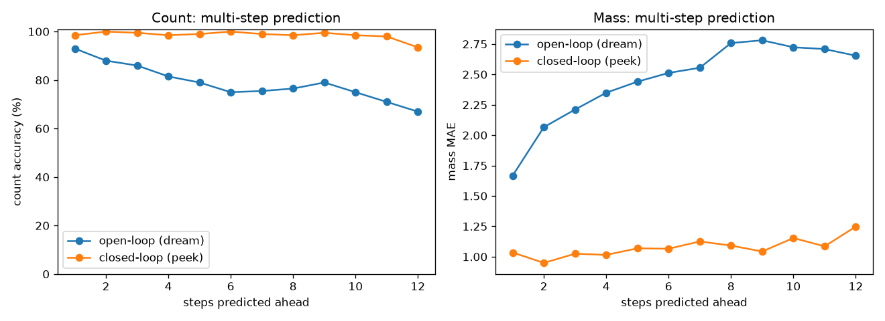

A subtlety: pressing **add** spawns a shape of **random size**, so the action alone can't say whether mass goes +1, +2, or +5. The model is honest about it — it predicts **count exactly** (always +1) but only the **average** mass change (~2.7). That's *why* mass drifts and count doesn't, and why peeking is the only way to know the true mass.

**Step 4 — planning inside the dream (the controller).** We added a goal: **reach a target object count.** An actor learned — *purely inside the model's imagination* — to pick add/remove/no-op to hit and hold any target. The first attempt stalled at **66%**: probing its decision table showed it had learned the *direction* (add when below, remove when above) but **never learned to stop (no-op)**, so it overshot and oscillated. A tiny "cost for moving" fixed it — **99% success** across all targets.

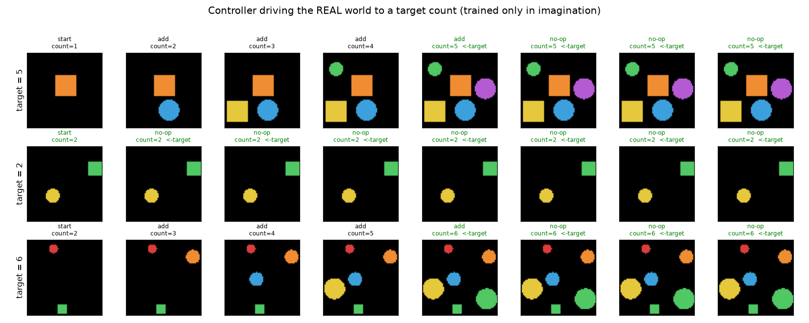

**A second controller — for total mass.** A separate controller targets a **mass** total. This is fundamentally harder: you can't choose the size of an added shape (random 1/2/5), so mass is only **partially controllable**. It gets *close* — within ~1–2 for moderate targets — but can't hit large targets exactly (reaches 15 when asked for 18). The clean contrast: **count is exactly controllable; mass only approximately.**

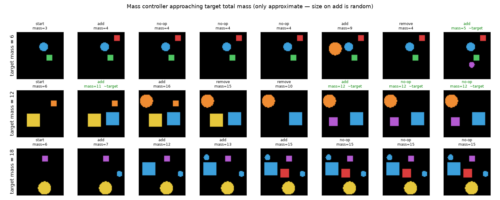

### What this experiment showed

- A world model works on **pixels**, not just numbers.
- The **same recipe scales**: encoder (now a CNN) → latent dynamics → prediction heads → imagination.
- You can **plan** inside it: an agent trained only in dreams achieves real goals (99%).
- Two honest lessons: **fix perception first**, and **debug by looking** — we found the missing-no-op bug by *probing* the policy, not guessing hyperparameters.

---

## Try it yourself — interactive demo

The **real trained model runs right here in your browser** — the RSSM dynamics, the count/mass heads, and the controller actor, ported to JavaScript and verified to match PyTorch. Three tabs: (1) act and watch the model's belief *drift* open-loop, then **Peek** to snap it back; (2) set a target **count** and let the controller drive the world to it; (3) set a target **mass** (only approximately controllable). *Scope: up to 4 objects. The widget loads a ~7.8 MB model, so give it a moment.*

<iframe src="wm-toy-app.html" title="Interactive world-model demo" loading="lazy" style="width:100%;height:780px;border:1px solid var(--rule);border-radius:10px;background:#fff"></iframe>

[Open the demo in a new tab →](wm-toy-app.html) &nbsp;·&nbsp; [Code on GitHub](https://github.com/rockerritesh/W-M-toy)

---

## Conclusion

Two full world models — one for continuous control (CartPole), one for visual prediction + planning (counting/mass) — both follow the same **encoder → latent dynamics → imagination** pattern, and both show the same lesson: a world model is a great **short-horizon simulator**. Trust it for short dreams (training, planning), and re-ground it on real observations to stay accurate. That open-loop-drift / closed-loop-stability trade-off is the heart of it — and now you can feel it yourself in the demo above.
