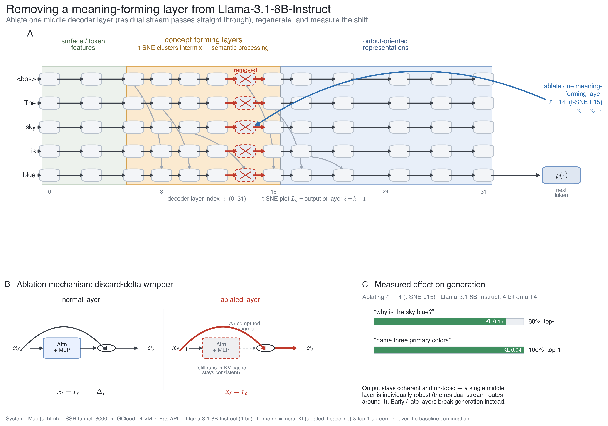
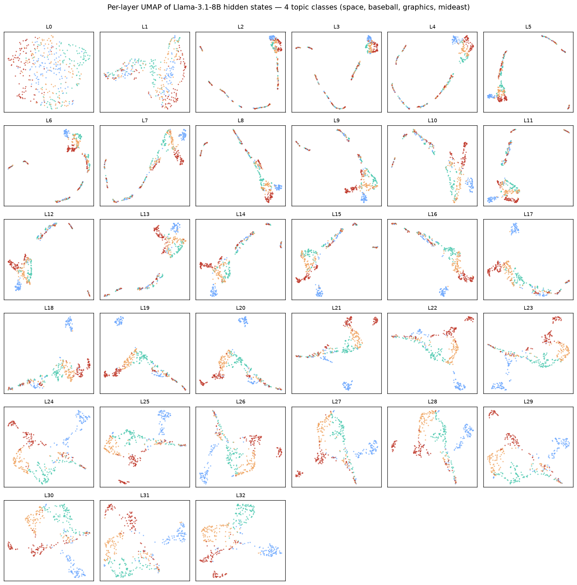
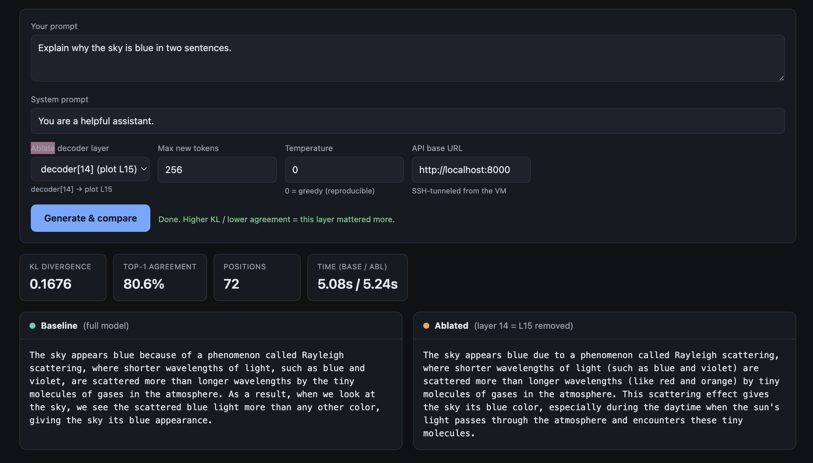
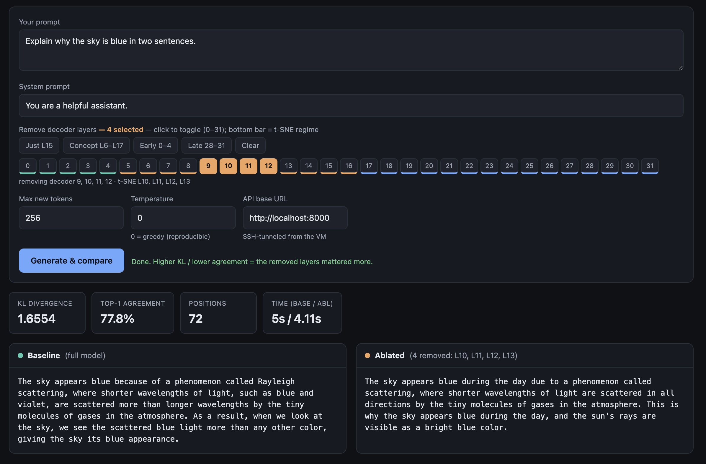
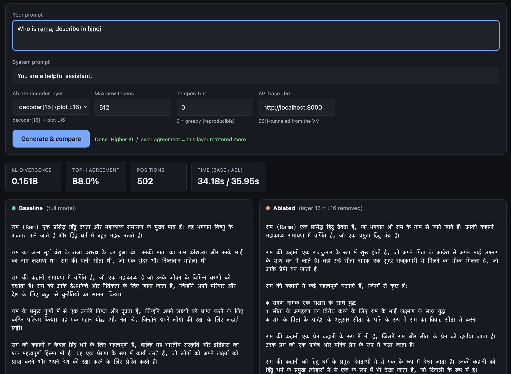

*A hands-on interpretability walkthrough. We watch concepts form layer-by-layer inside
Llama-3.1-8B-Instruct, measure precisely which layers carry meaning, then **delete
layers** — one at a time and in whole bands — and quantify exactly how generation
degrades. Every chart below is interactive and driven by the real run data;
everything ran on a single 16 GB T4 GPU. We close by connecting the result to
Anthropic's 2026 "global workspace" finding.*



> **TL;DR.** Topic information becomes **decodable within the first few layers and
> stays decodable everywhere** (kNN ≈ 0.9 from layer 2 on). Yet through the first
> half of the network the classes are **visually entangled** — they collapse onto
> overlapping manifolds (silhouette ≈ 0) — and only **re-separate into clean
> clusters in the second half**. That *entangled-but-decodable* middle is where
> meaning is **worked on**. Deleting **one** middle layer barely dents generation;
> deleting the **whole band** collapses reasoning while leaving shallow recall
> intact — the same asymmetry Anthropic report when they suppress the
> **J-space / global workspace** [10]. Across **100 queries**, removing the band
> breaks **creative / abstract generation first and single-step recall last**.

---

## 0. Setup

- **Model.** `meta-llama/Llama-3.1-8B-Instruct` — 32 residual decoder layers,
  hidden width 4096, so `output_hidden_states=True` yields **33** residual-stream
  tensors (`L0` = embeddings; **`Lk` = the output of decoder block `k−1`** — mind
  this off-by-one throughout).
- **Compute.** One NVIDIA T4 (16 GB), model quantised to 4-bit (nf4).
- **Data.** 400 texts, 4 balanced topic classes from 20-Newsgroups
  (*space, baseball, graphics, mideast*), mean-pooled per layer.
- **Two instruments.** (1) a per-layer **probe** of the hidden states, and (2) a
  reversible **layer-ablation wrapper** that turns any decoder block into an
  identity so the residual stream skips it (§3).

The full code, weights recipe, and the interactive tool are in the repo:
[`rockerritesh/nlp-remove-jspace-layer`](https://github.com/rockerritesh/nlp-remove-jspace-layer).

---

## 1. First, a clarification: KL divergence is **not** entropy

This question started the whole project, and it is worth getting straight because
every ablation number below is a KL. Three related-but-distinct quantities:

| Quantity | Formula | Measures | # dists |
|---|---|---|---|
| **Entropy** $H(p)$ | $-\sum_i p_i \log p_i$ | uncertainty of *one* distribution | 1 |
| **Cross-entropy** $H(p,q)$ | $-\sum_i p_i \log q_i$ | coding $p$ using $q$ | 2 |
| **KL divergence** $D_{\mathrm{KL}}(p\,\|\,q)$ | $\sum_i p_i \log \tfrac{p_i}{q_i}$ | how far $p$ is from reference $q$ | 2 |

They are tied together by one identity:

$$
D_{\mathrm{KL}}(p\,\|\,q) \;=\; H(p,q) - H(p),
\qquad D_{\mathrm{KL}} \ge 0,
\qquad D_{\mathrm{KL}}(p\,\|\,q)=0 \iff p=q .
$$

- **Entropy** is about *one* distribution — how spread out / uncertain it is.
- **KL divergence** ("relative entropy") is about *two* — how far the ablated
  model's next-token distribution $p_{\text{abl}}$ has moved from the intact
  reference $p_{\text{base}}$. It is asymmetric.

So "measure the KL of removing a layer" means computing
$D_{\mathrm{KL}}(p_{\text{abl}}\,\|\,p_{\text{base}})$ at each position — *how much
did deleting this layer change the predictions?* We also report **entropy**
$H(p_{\text{abl}})$ separately, because a broken model can fail two ways: become
**uncertain** (entropy ↑, the distribution flattens) or get **stuck** (entropy ↓,
it repeats). KL catches both; entropy tells you *which*.

---

## 2. The two probes: decodable vs. visually separated

For every layer we take two measurements on the *same* mean-pooled hidden states:

**(a) Class decodability** — can a classifier still read the topic off the full
4096-d state? We use a 5-fold cross-validated $k$-NN ($k=15$) on standardized
features:

$$
\text{acc}(\ell) \;=\; \tfrac{1}{5}\sum_{f=1}^{5}
\operatorname{Acc}\!\big(\text{kNN}_{15};\, H^{(\ell)}_{\text{test}(f)}\big),
\qquad H^{(\ell)}\in\mathbb{R}^{400\times 4096}.
$$

**(b) Visual separation** — how cleanly do the classes separate in the 2-D UMAP
projection? We use the mean silhouette coefficient, where for point $i$ with
in-class mean distance $a_i$ and nearest-other-class mean distance $b_i$,

$$
s_i \;=\; \frac{b_i - a_i}{\max(a_i,\,b_i)} \;\in[-1,1],
\qquad \text{silhouette}(\ell) \;=\; \tfrac{1}{N}\sum_i s_i .
$$

Decodability asks *is the information present?* Silhouette asks *is it laid out in
big, separated directions?* The **gap between them is the whole story**, and it is
the first interactive figure below. But first — what does the raw geometry look
like?

---

## 3. Experiment 1 — watch the representation reorganise, layer by layer

Push the 4-class set through the model, mean-pool the hidden state at each layer,
project each layer to 2-D with UMAP [8], colour by class:



- **Embeddings / early (≈ L0–L5).** `L0` is a diffuse cloud; by `L2–L6` the points
  collapse onto thin, folded **1-D manifolds** with the four topics *interleaved*
  along the curve.
- **Middle (≈ L6–L16).** Still entangled — clusters overlap heavily; one class
  (graphics) begins to peel off around `L11–L14`.
- **Late (≈ L18–L32).** Clean **4-way separation** emerges and sharpens all the way
  to the final layer.

The representation goes **entangle → re-specialise**, echoing the logit lens [1],
the tuned lens [2], and Tenney et al.'s "BERT rediscovers the classical NLP
pipeline" [4].

> **Careful.** UMAP / t-SNE are *nonlinear 2-D projections* [8]. "Looks entangled"
> is a statement about the projection, not about whether the class is *present*.
> The next figure checks exactly that — and the answer flips the naive reading.

### 3b. The workspace signature (decodable ≫ visually separated)

Here is the crux. Decodability (how well a classifier reads the class off the full
state) against visual separation (silhouette on the projection), per layer:

<iframe class="jspace-fig" src="jspace-fig-separability.html" title="Decodability vs. visual separation across layers" loading="lazy" scrolling="no" style="width:100%;height:530px;border:1px solid var(--rule);border-radius:10px;background:var(--bg)"></iframe>

- **Decodability (blue) is high everywhere:** `0.68` at the embeddings, `~0.90` by
  layer 5, and it stays `0.86–0.93` for the *entire rest of the network*. The class
  is always readable from layer 2 on.
- **Visual separation (green) tells the opposite story early:** silhouette hovers
  near **0 (even negative)** through roughly `L1–L15`, then climbs steeply to
  **`0.49`** at the final layer.

The **gap** — high decodability, near-zero visual separation — is the signature of
a **distributed, entangled** code: the information did not leave, it went into
overlapping directions (**superposition** [5]). This is precisely the regime
Anthropic's workspace lives in: their J-space carries the concepts the model
reasons over while occupying only **~6–10 % of activation variance** [10]. High
information, low variance — a workspace, not a bottleneck.

---

## 4. Experiment 2 — turning a layer off

Every decoder block is residual:

$$
x_{\ell} \;=\; x_{\ell-1} \;+\; \operatorname{Attn}_\ell(x_{\ell-1}) \;+\;
\operatorname{MLP}_\ell(x_{\ell-1}) \;=\; x_{\ell-1} + \Delta_\ell(x_{\ell-1}).
$$

To **remove** layer $\ell$ we wrap it so it still runs — keeping the KV-cache
consistent for the layers above — but **discards its update** $\Delta_\ell$ and
returns its input unchanged:

$$
\tilde x_{\ell} \;=\; x_{\ell-1}
\qquad(\text{i.e. } \Delta_\ell \mapsto 0).
$$

Reversible, no retraining — the layer-level analogue of activation patching /
causal tracing [3]. In code it is a ten-line module:

```python
class AblatedDecoderLayer(nn.Module):
    """Runs the layer (keeps the KV cache consistent) but returns the *input*
    hidden states, so the residual stream skips this layer."""
    def __init__(self, orig): super().__init__(); self.orig = orig
    def forward(self, hidden_states, *args, **kwargs):
        out = self.orig(hidden_states, *args, **kwargs)   # still populates KV cache
        if isinstance(out, tuple):
            return (hidden_states,) + tuple(out[1:])       # discard the new hidden state
        return hidden_states
```

Diagrammatically:

```mermaid
flowchart LR
    subgraph normal["Normal layer ℓ"]
        A1["x&#8203;in"] --> B1["attn + mlp"] --> C1["x&#8203;in + Δ"]
        A1 -. residual .-> C1
    end
    subgraph ablated["Ablated layer ℓ"]
        A2["x&#8203;in"] --> B2["attn + mlp<br/>(runs, keeps KV cache)"]
        B2 -. Δ discarded .-> X(("·"))
        A2 ==>|returned unchanged| C2["x&#8203;out = x&#8203;in"]
    end
```



**The metric.** For each prompt we take the intact model's greedy continuation,
then re-run the model **teacher-forced on that same continuation** with layer(s)
ablated, and compare the two next-token distributions at every position:

$$
\overline{D_{\mathrm{KL}}} \;=\; \frac{1}{T}\sum_{t=1}^{T}
D_{\mathrm{KL}}\!\big(p^{(t)}_{\text{abl}} \,\big\|\, p^{(t)}_{\text{base}}\big),
\qquad
\text{top-1} \;=\; \frac{1}{T}\sum_{t=1}^{T}
\mathbf{1}\!\left[\arg\max p^{(t)}_{\text{abl}} = \arg\max p^{(t)}_{\text{base}}\right].
$$

Teacher-forcing on the *same* tokens is what makes the comparison fair: both models
see identical context, so any divergence is the ablation's doing, not drift.

---

## 5. Experiment 3 — remove each layer, one at a time

Now ablate every single decoder layer in turn and measure the effect. Toggle the
metric (top-1 agreement, KL, entropy, perplexity) and switch between the 8-prompt
sweep and the 100-query sweep with ±1σ bands:

<iframe class="jspace-fig" src="jspace-fig-single-ablation.html" title="Single-layer ablation sweep" loading="lazy" scrolling="no" style="width:100%;height:560px;border:1px solid var(--rule);border-radius:10px;background:var(--bg)"></iframe>

It is **not** a symmetric U — it is an **early cliff**:

- **Layers 0–1 are load-bearing.** Remove `L0` → KL ≈ 17–18, top-1 **6–7 %**,
  perplexity in the *thousands*. Remove `L1` → KL ≈ 13–14, top-1 **23–24 %**. The
  model is destroyed.
- **Every other single layer is remarkably survivable.** Across `L2–L29` the top-1
  agreement sits at **89–96 %** with KL ≈ `0.05–0.22` and perplexity barely above
  the `1.10` baseline. Middle layers are individually the *most redundant* — which
  is exactly why depth-pruning methods delete them [6, 7].
- **The final layer matters a bit more:** `L31` → KL ≈ 0.98–1.18, top-1 ≈ 81–88 %.

Across 100 queries the picture is rock-solid: **exactly two layers** (L0, L1) are
individually catastrophic; everything else routes around a single missing block.
Here is the intact model vs. removing just the middle `L15` on "explain why the sky
is blue" — the outputs are near-identical (KL 0.17, top-1 81 %):



One missing middle block? The residual stream just re-routes around it.

---

## 6. Experiment 4 — remove the **whole band** → the workspace collapses

Individually redundant ≠ collectively expendable. Delete a **growing contiguous
window** of middle layers (centred ~`L11`) and watch the model fall over. Toggle
metric and sample size:

<iframe class="jspace-fig" src="jspace-fig-cumulative.html" title="Cumulative middle-band ablation" loading="lazy" scrolling="no" style="width:100%;height:560px;border:1px solid var(--rule);border-radius:10px;background:var(--bg)"></iframe>

A graceful-then-catastrophic collapse — the numbers (100-query means):

| layers removed | 1 | 2 | 4 | 6 | 8 | 10 | 12 | 14 |
|---|---|---|---|---|---|---|---|---|
| KL | 0.18 | 0.39 | 1.5 | 3.9 | 5.6 | 9.9 | 13.9 | 16.9 |
| top-1 | 91 % | 86 % | 79 % | 67 % | 54 % | 40 % | 22 % | 12 % |

The interactive tool makes the failure mode visible. Removing four middle layers
(L10–L13) still gives a coherent — if shallower — answer:



…but push to the whole 12-layer concept band and the output degenerates into
*"…the sky is a beautiful blue and the sky is a beautiful blue. It's a blue collar,
a blue collar…"* — the **word** "blue" survives, the **explanation** does not
(KL ≈ 15.6, top-1 ≈ 20 %). Individually the layers are spare tyres; together they
are the engine.

---

## 7. Which capability breaks first? (and a language-adherence surprise)

Splitting the band-removal effect by query type — 20 prompts each of **recall,
math, reasoning, translation, creative** — asks the question the workspace account
really cares about: *when you remove the band, does abstraction break before recall?*

<iframe class="jspace-fig" src="jspace-fig-by-category.html" title="Which capability breaks first, by query type" loading="lazy" scrolling="no" style="width:100%;height:560px;border:1px solid var(--rule);border-radius:10px;background:var(--bg)"></iframe>

Through the informative mid-range (4–10 layers removed) the ordering is consistent:
**single-step recall is the most robust; open-ended / creative generation collapses
first**, with reasoning and translation in between. That is the direction
Anthropic's workspace result predicts — abstract, generative capability leans
hardest on the middle band; shallow recall leans on it least. Two honest caveats:
the separation is **graded, not on/off**, and beyond ~12 layers removed *everything*
converges toward collapse (the ordering gets noisy once the model is already broken).

### A language-adherence surprise

A striking qualitative case, straight from the interactive tool. Ask Llama to
answer **in Hindi** and remove a single middle layer — the Devanagari answer is
preserved essentially intact (KL 0.15, top-1 88 %):



But remove the **middle band** on the same Hindi prompt and the model **switches
back to English and starts repeating** — the *content* limps on, but the
*instruction to stay in the target language* is gone:


That is a small, vivid instance of a general point: **instruction- and
language-adherence live in the same mid-network band as abstract reasoning**, and
they are among the first things to go. It also connects to a companion line of work
on inference-time *representation steering* for Devanagari sister-languages —
where the Hindi→target transfer direction lives in exactly this re-divergence-onset
region of the network.

### Try it yourself

The interactive UI (`ui.html`) drives the 8B model on a GPU box through an SSH
tunnel: type any prompt, toggle any subset of the 0–31 decoder layers (with
regime-coloured presets — *Concept L6–L17*, *Early*, *Late*), and get
baseline-vs-ablated generations side by side with live KL and top-1. Because it
needs the model weights on a GPU it can't run inline here, but the whole thing —
`server.py`, `ui.html`, `client.py`, and the experiment scripts — is in the
[repo](https://github.com/rockerritesh/nlp-remove-jspace-layer).

---

## 8. The connection: a blunt version of the "global workspace"

Anthropic's **"Verbalizable Representations Form a Global Workspace in Language
Models"** (Gurnee, Sofroniew, … Lindsey; July 2026) [10] introduces the **Jacobian
lens (J-lens)**, which surfaces a small set of token-aligned directions in the
intermediate layers — the **J-space** — that behaves like a cognitive-science
*global workspace* [9]: a shared "blackboard" the model reads concepts from and
reasons over, occupying only ~6–10 % of activation variance. When they **suppress
the top J-space directions**:

| Impaired | Preserved |
|---|---|
| multi-hop **reasoning** (→ ~0 %) | text parsing, grammatical **fluency** |
| **creative / abstract** generation | shallow classification, fact extraction |
| experiential self-report | **single-step factual recall** |

Our coarse experiment — deleting whole *layers* rather than surgical *directions* —
reproduces the **same asymmetry**: kill the middle band and reasoning / abstraction
dies while shallow recall survives (§7). And §3b shows *why* that band is special:
it is where the topic is maximally **entangled yet fully decodable** — an
information-rich, low-variance workspace. The layers where the classes *stop looking
separated* are exactly the layers you *cannot* remove as a group without losing the
ability to reason. That is where the workspace lives.

---

## 9. Related work

**Depth redundancy & layer pruning.** That a *single* middle layer is nearly free
to drop is the empirical backbone of the depth-pruning literature. Gromov et al.,
*The Unreasonable Ineffectiveness of the Deeper Layers* [6], and Men et al.,
*ShortGPT* [7], both show you can delete a large contiguous block of upper-middle
layers with little loss (after light healing). Our single-layer sweep (§5)
independently reproduces their premise on Llama-3.1-8B; our band-removal collapse
(§6) marks where "little loss" ends.

**Which layers do what.** A 2025 line of work makes the capability split precise.
*Demystifying the Roles of LLM Layers in Retrieval, Knowledge, and Reasoning*
(arXiv:2510.02091) [11] shows shallow layers dominate retrieval while **middle and
deep layers are where reasoning (e.g. GSM8K) is sensitive** — the direct,
correctness-graded version of our §7. *On the Limits of Layer Pruning for
Generative Reasoning in LLMs* (arXiv:2602.01997) [12] studies exactly when pruning
breaks generative reasoning, matching our graceful-then-catastrophic band curve.

**Scalpel, not sledgehammer.** Where we ablate whole layers, others ablate
directions or neurons. *The Achilles' Heel of LLMs* (arXiv:2510.10238) [13] shows a
*handful* of neurons can cripple core language ability, and *Sparse Neuron Ablation
Triggers Catastrophic Collapse of the Language Core* (arXiv:2512.00918) [14] finds a
small "language core" whose ablation collapses fluency — the fine-grained analogue
of our band collapse, and closer in spirit to the J-space's low-rank subspace [10].

**Reading the residual stream.** The probing view builds on the logit lens [1] and
tuned lens [2], on Tenney et al.'s layer-wise "NLP pipeline" [4], on
superposition [5] as the reason a code can be decodable yet entangled, and on
activation patching / causal tracing [3] as the intervention template that
layer ablation coarsens.

---

## 10. Honest caveats

- **Layer ≠ subspace.** We remove *entire layers* (sledgehammer); the J-space is a
  *low-rank subspace within* layers (scalpel). Layer ablation is a coarse,
  correlational proxy for workspace ablation — a directional replication, not a
  reproduction.
- **The metric is a proxy.** Top-1 agreement measures *"output preserved vs. the
  intact model's own greedy continuation,"* not correctness. A confident wrong
  answer and a confident right answer both score high.
- **Regime boundaries are eyeballed.** The three-band story is a reading of the
  UMAP grid; §3b's decodability-vs-silhouette gap is the load-bearing evidence, and
  mean-pooling + UMAP shape the *early*-layer picture in particular.
- **Scope.** One model, 4-bit, 20-Newsgroups (400 texts) + 8/100 prompts, short
  greedy continuations. Directional, not a benchmark.

Still — a satisfying result on a single T4: **the layers where classes stop looking
separated are precisely the layers you can't remove as a group without losing the
ability to reason.**

---

## 11. Reproduce

```bash
# On the GPU box (VM):
python server.py --load-4bit                  # FastAPI on :8000 (4-bit for a T4)
python experiments/run_experiments.py         # UMAP grid, separability, ablation (8-prompt)
python experiments/run_queries100.py          # 100-query sweep + per-category + CSV/JSON

# From a laptop: tunnel + open ui.html, ablate any subset of layers interactively
gcloud compute ssh <vm> -- -N -L 8000:localhost:8000
```

Code, data, and figures: [`rockerritesh/nlp-remove-jspace-layer`](https://github.com/rockerritesh/nlp-remove-jspace-layer).

---

## References

1. nostalgebraist (2020). *Interpreting GPT: the Logit Lens.* LessWrong.
2. Belrose et al. (2023). *Eliciting Latent Predictions from Transformers with the Tuned Lens.* arXiv:2303.08112.
3. Meng, Bau, Andonian, Belinkov (2022). *Locating and Editing Factual Associations in GPT* (ROME / causal tracing). NeurIPS. arXiv:2202.05262.
4. Tenney, Das, Pavlick (2019). *BERT Rediscovers the Classical NLP Pipeline.* ACL. arXiv:1905.05950.
5. Elhage et al. (2022). *Toy Models of Superposition.* Anthropic / Transformer Circuits.
6. Gromov, Tirumala, Shapourian, Glorioso, Roberts (2024). *The Unreasonable Ineffectiveness of the Deeper Layers.* arXiv:2403.17887.
7. Men et al. (2024). *ShortGPT: Layers in Large Language Models are More Redundant Than You Expect.* arXiv:2403.03853.
8. McInnes, Healy, Melville (2018). *UMAP.* arXiv:1802.03426. · van der Maaten & Hinton (2008). *t-SNE.* JMLR.
9. Baars (1988); Dehaene et al. — *Global Workspace Theory* of consciousness (the analogy).
10. Gurnee, Sofroniew, Pearce, … Lindsey (2026). *Verbalizable Representations Form a Global Workspace in Language Models.* Anthropic. <https://transformer-circuits.pub/2026/workspace/>
11. *Demystifying the Roles of LLM Layers in Retrieval, Knowledge, and Reasoning* (2025). arXiv:2510.02091.
12. *On the Limits of Layer Pruning for Generative Reasoning in Large Language Models* (2026). arXiv:2602.01997.
13. *The Achilles' Heel of LLMs: How Altering a Handful of Neurons Can Cripple Language Abilities* (2025). arXiv:2510.10238.
14. *Sparse Neuron Ablation Triggers Catastrophic Collapse of the Language Core in Large Vision-Language Models* (2025). arXiv:2512.00918.

---

*Built on a GCloud T4 VM · Llama-3.1-8B-Instruct (4-bit) · interactive charts driven
by `metrics.json` / `metrics_100.json` from the run · figures from
`experiments/run_experiments.py`.*

<script>
(function(){
  function theme(){var c=document.documentElement.classList;return (c.contains('dark-theme')||c.contains('rain-theme'))?'dark':'light';}
  function sync(){document.querySelectorAll('iframe.jspace-fig').forEach(function(f){try{f.contentWindow.postMessage({type:'theme',theme:theme()},'*');}catch(e){}});}
  document.querySelectorAll('iframe.jspace-fig').forEach(function(f){f.addEventListener('load',sync);});
  try{new MutationObserver(sync).observe(document.documentElement,{attributes:true,attributeFilter:['class']});}catch(e){}
  setTimeout(sync,400);setTimeout(sync,1400);
})();
</script>
