

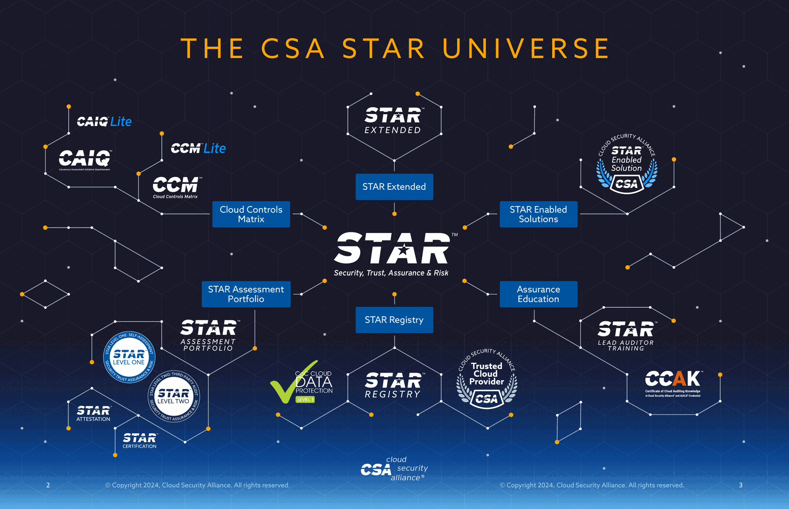

*The CSA STAR universe, as CSA draws it. © Cloud Security Alliance, from the STAR Program Knowledge Guide — reproduced here for educational explanation. Every other figure in this post is my own.*

Someone on your board has asked what the security program is doing about AI. Meanwhile the business has already shipped Copilot to every employee, signed an enterprise LLM contract, and approved three agent pilots — two of which security learned about from the invoice. You go looking for a framework, and the Cloud Security Alliance hands you five of them: **CCM**, **CAIQ**, **STAR**, **AICM**, and **AISMM**.

They sound interchangeable. They are not. Each one answers a genuinely different question, and the reason there are five is that "is this thing secure?" decomposes into five different questions that need five different kinds of artifact to answer.

This post is the map I wish I'd had. By the end you should be able to look at any of the five and say, in one sentence, what it's for and who it's for.

## The one-sentence version

Here's the whole family, compressed:

> A **control** is a promise about how a system is built. A **questionnaire** is how you make someone state that promise on the record. A **registry** is where the promise becomes public and checkable. A **maturity model** is the order in which you should build the capability to make those promises truthfully.

CCM and AICM are the controls. CAIQ and AI-CAIQ are the questionnaires. STAR is the registry and the assurance program around it. AISMM is the maturity model. Cloud came first; AI is the second branch grown from the same trunk.

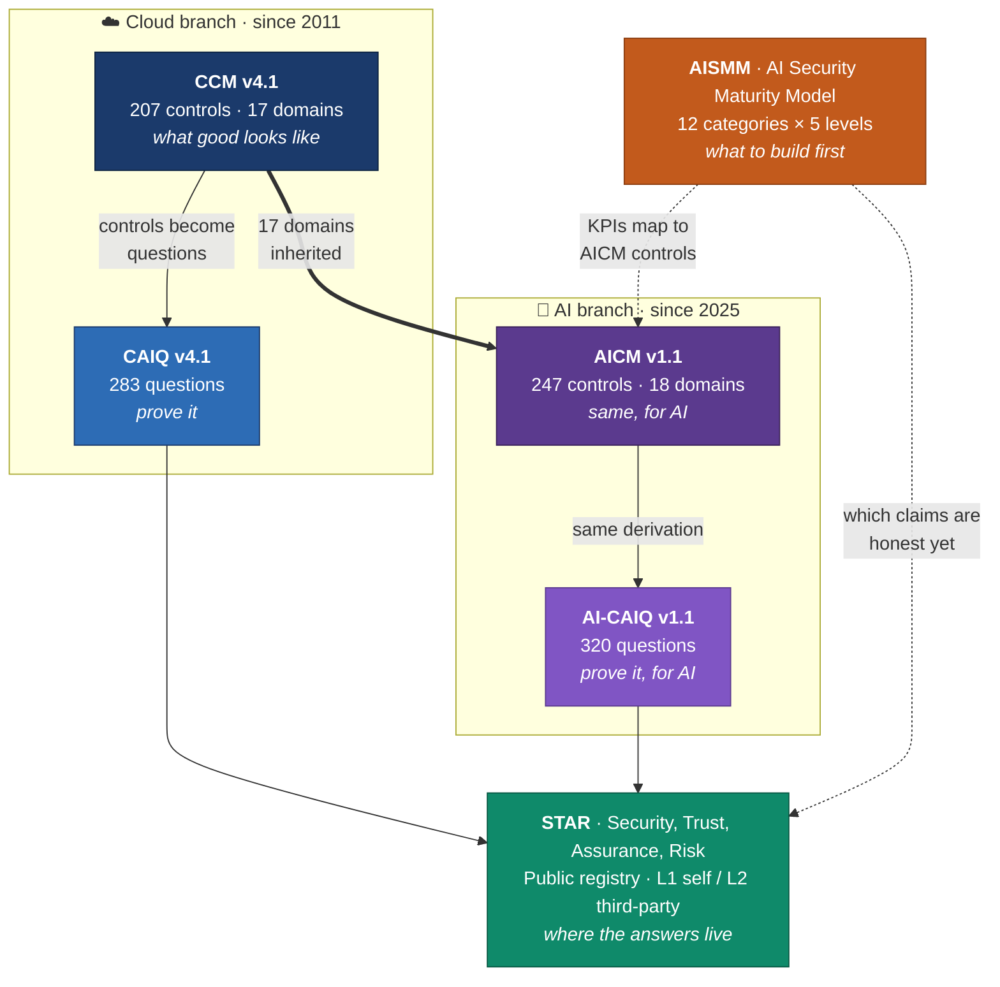

*Figure 1 — The five artifacts and how they feed each other. Solid arrows are derivation; dotted arrows are cross-reference.*

Everything below is an expansion of that diagram.

---

## Part 1 — CCM: the control catalog

The **Cloud Controls Matrix** is the trunk of the tree. It is a catalog of **207 control objectives across 17 domains**, and it has been the de-facto vocabulary for cloud security assurance since long before anyone was worried about prompt injection.

A "control objective" here is a short, testable statement of a desired property. Not "use AES-256" — that's an implementation. Something closer to *"cryptographic keys are managed through a defined lifecycle with documented ownership."* Deliberately technology-agnostic, so it survives the next five years of tooling churn.

The thing people miss about CCM is that the spreadsheet of 207 controls is only one of about six components in the download. The rest is what makes it usable:

| Component | What it gives you |
|---|---|
| **CCM Controls** | The 207 control objectives across 17 domains |
| **Implementation Guidelines** | Per-control: *how* to actually achieve it, written by practitioners |
| **Auditing Guidelines** | Per-control: what an auditor should look at and ask |
| **Mappings** | Equivalences to ISO 27001/27002/27017/27018, AICPA TSC, CIS Controls, NIST CSF, NIST 800-53, PCI DSS, and more |
| **CCM Metrics** | The Continuous Audit Metrics Catalog — turning controls into measurable, potentially real-time signals |
| **Machine-readable forms** | JSON / YAML / OSCAL, for automating all of the above |

Two of those deserve emphasis.

**The mappings are the real product.** A control framework's value is roughly proportional to how much duplicate work it eliminates. If you can demonstrate a CCM control and mechanically show that it satisfies the corresponding ISO 27001 and NIST 800-53 requirements, you have collapsed three audits into one evidence-gathering exercise. This is the entire economic argument for adopting CCM rather than inventing your own control set, and it's why the mappings get as much working-group attention as the controls.

**The metrics are where this is heading.** The Continuous Audit Metrics Catalog exists because point-in-time audits are a poor fit for systems that redeploy hourly. A metric, in the ISO/IEC 19086-1 sense, defines both a measurement rule and how to interpret the result. Get enough of those wired into telemetry and "compliance" stops being an annual event and becomes a dashboard. CSA has been explicit that these metrics may fold into STAR later as a foundation for *continuous* certification. Worth watching.

### The Shared Security Responsibility Model

One idea from CCM carries all the way through to the AI frameworks, so it's worth pinning down now: the **Shared Security Responsibility Model (SSRM)**.

In cloud, nobody implements a control alone. The provider secures the hypervisor; you configure the security groups. A control framework that doesn't say *who* is responsible produces an argument at every audit. So CCM annotates controls with ownership, and CAIQ asks providers to declare it.

Hold onto this. When we get to AI, the SSRM is the single biggest structural change — because the AI supply chain has five actors instead of two.

---

## Part 2 — CAIQ: turning controls into questions

The **Consensus Assessment Initiative Questionnaire** is CCM rotated ninety degrees. Same content, different grammar.

CCM says: *this property should hold.* CAIQ asks: *does it hold in your environment — yes or no?*

CAIQ v4.1 contains **283 questions** derived from the 207 controls. More questions than controls, because some controls have several independently-verifiable parts. Each question is answerable Yes/No, with room to explain and — critically — to declare SSRM ownership.

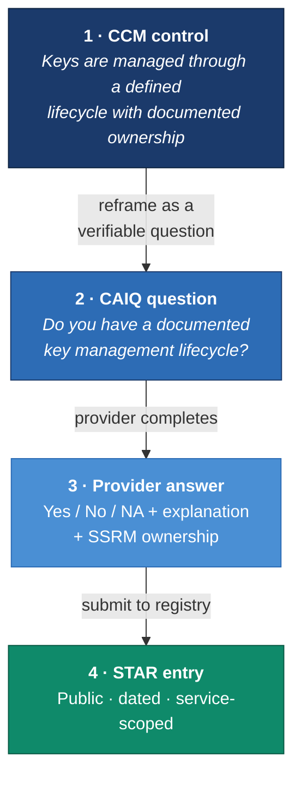

*Figure 2 — One control's journey from abstract objective to public claim. This pipeline is identical on the AI side; only the inputs change.*

Why does this rotation matter so much? Because it solves a coordination problem that was eating the industry alive.

Before CAIQ, every enterprise sent every vendor its own bespoke security questionnaire. A mid-sized SaaS company might answer four hundred of them a year, each asking the same forty things in different words. CAIQ replaced *n × m* bespoke interrogations with one standard artifact that a provider fills out once and publishes.

That is a genuinely large efficiency win, and it explains a quirk that confuses newcomers: **the CAIQ in the CCM bundle is not the one you submit.** The bundle's copy is a reference/working version. The submittable artifact is the separately-packaged *STAR Level 1: Security Questionnaire*, which is format-locked so the registry can parse it. Same questions, different packaging, and mixing them up is the most common reason a submission bounces.

---

## Part 3 — STAR: where claims become public

**STAR** — Security, Trust, Assurance and Risk — launched in 2011 and is the part of this family that isn't a document. It's a program: a public registry, two assurance levels, a network of authorized assessors, and the governance around all of it.

The problem STAR solves is the mirror image of CAIQ's. CAIQ gives providers one artifact to fill in. STAR gives them **one place to put it** so a thousand customers can read it without a thousand emails.

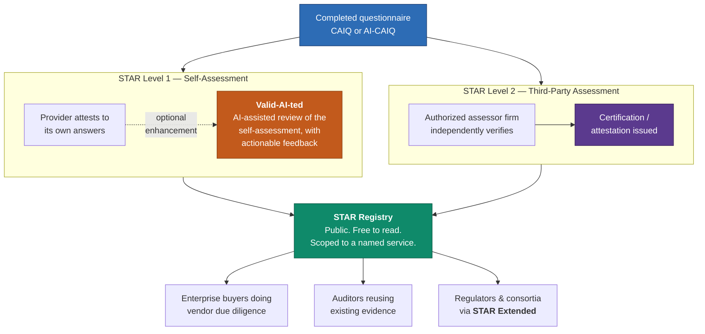

*Figure 3 — The two assurance levels and who consumes the output.*

The two levels are a deliberate cost/credibility trade:

- **Level 1** is self-assessment. Cheap, fast, and exactly as trustworthy as the organization publishing it. Its value isn't that it's independently verified — it's that the claims are **specific, dated, and public**, which makes them falsifiable and reputationally costly to fake. **Valid-AI-ted** sits here as an AI-powered reviewer that catches internal contradictions and thin answers before a human ever reads them, which is a rather nice bit of recursion: AI reviewing your AI-governance homework.
- **Level 2** is third-party assessment by an authorized firm. Expensive, slow, and carries real weight. This is what enterprise procurement asks for when the deal is large enough.

Around these sit the other pillars: the **STAR Assessment Portfolio** (the expanding menu of security and privacy assessments), **STAR Enabled Solutions** (the assessor firms, Trusted Cloud Consultants, and technology licensees of the CCM and STAR API), and **STAR Extended**, which lets a government or industry consortium run the STAR machinery against its own tailored requirements while keeping control of what providers must comply with.

And then — the reason we're here — **STAR for AI**.

---

## Part 4 — AICM: the same idea, pointed at AI

The **AI Controls Matrix** is the AI-branch counterpart to CCM. Published in July 2025 as v1.0 with 243 controls, updated to **v1.1 with 247 controls across 18 domains** in mid-2026, this time under consolidated governance: CSA merged the CCM and AI Controls Framework working groups into a **Security Controls Catalog** under the **Compliance Automation Revolution (CAR)** working group. That reorganization is a signal worth reading — controls, mappings, and machine-readable formats are being maintained as one canonical catalog rather than parallel silos, which is what has to happen if the mappings are going to stay honest.

Here's the structural fact that makes AICM easy to reason about:

> **AICM's 18 domains are CCM's 17 domains, plus one new AI-specific domain: Model Development Security (MDS).**

That is a much more conservative design than it might have been, and it's the right call. Securing an AI system is mostly *securing a system*: identity, logging, encryption, change control, supply chain, incident response. Those don't need reinventing for AI; they need re-interpreting. So AICM keeps the CCM domain structure — which means your existing control program, audit evidence, and mappings mostly carry over — and adds a domain for the genuinely new thing: the model itself.

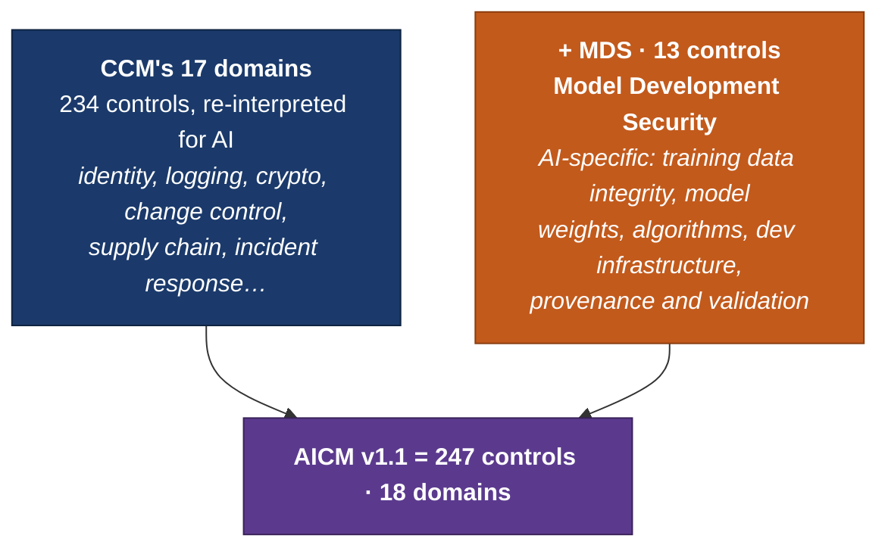

*Figure 4 — AICM v1.1's composition. The seventeen inherited domains carry 234 controls; MDS adds 13, giving 247.*

The full domain breakdown, which is worth having in one place:

| ID | Domain | Controls | Type |
|---|---|---:|---|
| A&A | Audit & Assurance | 6 | Cloud & AI |
| AIS | Application & Interface Security | 15 | Cloud & AI |
| BCR | Business Continuity & Operational Resilience | 11 | Cloud & AI |
| CCC | Change Control & Configuration Management | 9 | Cloud & AI |
| CEK | Cryptography, Encryption & Key Management | 21 | Cloud & AI |
| DCS | Datacenter Security | 18 | Cloud-specific |
| DSP | Data Security & Privacy Lifecycle Management | 24 | Cloud & AI |
| GRC | Governance, Risk Management & Compliance | 15 | Cloud & AI |
| HRS | Human Resources | 15 | Cloud & AI |
| IAM | Identity & Access Management | 18 | Cloud & AI |
| IPY | Interoperability & Portability | 4 | Cloud & AI |
| I&S | Infrastructure Security | 9 | Cloud & AI |
| LOG | Logging & Monitoring | 16 | Cloud & AI |
| **MDS** | **Model Development Security** | **13** | **AI-specific** |
| SEF | Security Incident Management, E-Discovery & Forensics | 10 | Cloud & AI |
| STA | Supply Chain Management, Transparency & Accountability | 16 | Cloud & AI |
| TVM | Threat & Vulnerability Management | 13 | Cloud & AI |
| UEM | Universal Endpoint Management | 14 | Cloud & AI |
| | **Total** | **247** | **18 domains** |

The distribution tells you where the drafters thought the risk concentrates: **DSP at 24** and **CEK at 21** are the two heaviest domains, which is a reasonable statement about what actually goes wrong.

**MDS** is the interesting one. Thirteen controls covering what has no cloud analogue: the confidentiality, integrity and availability of *training data, model weights, algorithms, and development infrastructure*, plus provenance and validation. Note who owns these: if you fine-tune, you share MDS responsibility. If you only consume an API, you mostly don't — you inherit whatever your upstream provider did, which is precisely why you'd want to read their STAR for AI entry.

AICM also ships the same supporting cast as CCM — Implementation Guidelines, Auditing Guidelines, and **framework mappings to ISO/IEC 42001, NIST AI RMF, the EU AI Act, BSI AIC4, and AIUC-1**. That mapping set is the reason a compliance team can treat AICM as a hub: implement once, report into several regimes. With the EU AI Act's obligations landing on real products, "which of my controls satisfies which article?" stopped being academic.

---

## Part 5 — Five actors: the SSRM gets complicated

Remember the Shared Security Responsibility Model? In cloud it was essentially a two-party split. In AI it is a **five-actor supply chain**, and this is the single most useful concept in AICM.

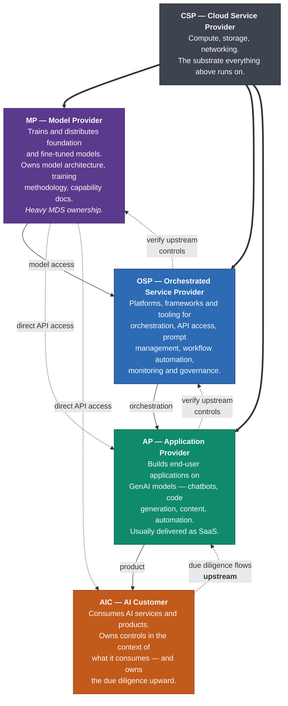

*Figure 5 — The AI supply chain in AICM's SSRM. Value flows down; accountability flows up.*

Every AICM control is annotated with which of these five owns it. The ownership vocabulary is precise: **CSP-Owned**, **MP-Owned**, and so on for a control that sits entirely with one actor, plus shared expressions where responsibility genuinely splits.

Two observations from staring at this diagram:

**First, most organizations are more than one actor.** If you fine-tune an open-weights model, wrap it in your own orchestration, and sell the result as SaaS, you are simultaneously MP, OSP and AP — and an AIC of whoever hosts you. The framework doesn't assign you a single identity; it asks you to work out your role *per control*. That's more work up front and much more accurate.

**Second, notice the dotted arrows going up.** Each actor is responsible not only for its own controls but for *conducting due diligence on its upstream providers* to verify that theirs are implemented. This is the mechanism by which assurance is supposed to become transitive — and it only functions if upstream providers publish something checkable. Which is what STAR for AI is for. The design is circular by intent: the registry exists so the due-diligence obligation is satisfiable without an NDA and a six-week questionnaire cycle.

### AI-CAIQ and STAR for AI

The rest of the AI branch is a faithful copy of the cloud pattern, which is exactly what you want — no new process to learn.

**AI-CAIQ** is the questionnaire derived from AICM: **320 questions** in v1.1. **STAR for AI** is the assurance program, and submitting a Level 1 self-assessment is the same six-step flow as classic STAR: create an account on the STAR platform, fill in the AI-CAIQ **in the original CSA format**, submit via the STAR submission form selecting *Self-assessment* and *AI-CAIQ*, confirm by email, pick your organization and service, and wait — typically one business day, up to five if it needs manual review. **Valid-AI-ted** is available here too, at no extra cost to CSA members.

The format-strictness bears repeating because it's where submissions die: **no columns, rows or sheets added or removed**, every field in the *Service Provider AI-CAIQ Answer* and *SSRM Control Ownership* columns populated. If a control isn't marked NA, ownership is usually **ND** (Not Determined). Boring, mechanical, and the single most common cause of a rejected submission.

---

## Part 6 — AISMM: the model that tells you what to do first

Everything so far answers a question about a *thing*: is this service secure, is this model's training data controlled, does this provider manage keys properly. The **AI Security Maturity Model** answers a different question entirely, and getting this distinction right is the key to the whole family:

> **AICM asks: is this AI project secure?**
> **AISMM asks: is our security *program* capable of securing AI at all?**

AISMM is explicitly *not* a checklist of AI controls, *not* an assessment of any single project, and — a scope boundary the authors are emphatic about — *not* a measure of how well the security team uses AI internally. It is a structural map of the capabilities an enterprise security program needs, and what each looks like at five levels of maturity.

Its lineage is the **Cloud Security Maturity Model (CSMM)**, which has been in use for years across hundreds of organizations. AISMM keeps what worked — twelve categories in three domains, five CMM-aligned levels, control objectives as KPIs — and adds what AI specifically needs.

### Twelve categories, three domains

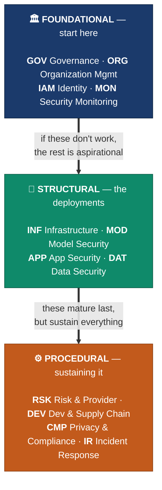

*Figure 6 — AISMM's twelve categories grouped into three domains. The vertical ordering is a genuine dependency claim, not presentation.*

What each category actually covers:

| Domain | Category | Scope |
|---|---|---|
| **Foundational** | **GOV** Governance | Policies, decision rights, the AI Council or equivalent, authoritative registries of approved use cases and deployments, acceptable use, role-based training, ethics review for high-risk cases |
| | **ORG** Organization Management | Technical *enforcement* of governance decisions — cloud org policies restricting AI services, AI-SPM and AI-BOM discovery, blast-radius isolation, shared security services |
| | **IAM** Identity & Access | Human identity into AI services, non-human identity for agents and MCP tools, authorization scopes, delegation chains, credential lifecycle |
| | **MON** Security Monitoring | Prompt and response capture, guardrail-violation logging, agent action logs, model behaviour monitoring, and the SOC workflows that consume them |
| **Structural** | **INF** Infrastructure & Resilience | Training clusters, inference servers, network isolation, host vulnerability management, AI-specific resilience patterns |
| | **MOD** Model Security | Selection, approval, version pinning, integrity, provenance, parameter bounds, and the approved-model registry downstream categories anchor to |
| | **APP** Application Security | System prompt hardening, guardrails, input/output validation, tool and MCP restrictions, runtime I/O monitoring, human-in-the-loop enforcement |
| | **DAT** Data Security | Training data governance, RAG and vector store access control, permission-aware retrieval, output sanitization, poisoning detection |
| **Procedural** | **RSK** Risk & Provider Assessment | Provider, model and project risk assessment; reassessment cadence; the approved-provider registry |
| | **DEV** Dev & Supply Chain | Coding assistants, AI-BOM, library scanning, CI/CD integration, AI-specific supply-chain concerns |
| | **CMP** Privacy, Compliance & Audit | Audit evidence collection, AI-CAIQ completion, privacy impact assessments, IP and licensing tracking |
| | **IR** Incident Response | Playbooks for prompt injection, agent compromise, model abuse, exfiltration via AI flows, plus threat-intel integration |

The domain split encodes an opinion I find persuasive. **Foundational** categories — governance, org management, IAM, monitoring — span everything else, and the model is blunt that *if governance and identity aren't working, the rest of the model is mostly aspirational.* **Structural** categories are per-deployment security of infrastructure, models, applications and data; familiar territory for anyone with an AppSec background, except the underlying technology misbehaves in ways existing playbooks don't cover. **Procedural** categories sustain the program over time and, realistically, mature last.

Note **MOD (Model Security)** has no CSMM counterpart — it exists because AI needed it, mirroring how MDS appeared in AICM. And the model's own assessment of where organizations are weakest is worth quoting: on data security, *"the data side of AI is where most organizations are weakest."* Matches everything I've seen.

### Five levels, and the honesty of skipping Level 1

The levels are standard CMM: **L1 Initial · L2 Repeatable · L3 Defined · L4 Capable · L5 Efficient**. There are deliberately **no Level 1 control objectives** — L1 is the state where no AI-specific capability exists, so there's nothing to measure. That's an unusually candid design decision for a maturity model.

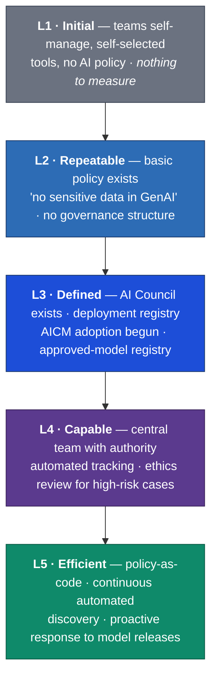

*Figure 7 — The maturity ladder, illustrated with the Governance category's trajectory.*

The control objectives are **KPIs, not exhaustive controls**. This is the load-bearing idea, and it's cleverer than it first appears. The claim is not "meeting this KPI makes you Level 3." It's: *an organization that could not plausibly meet this KPI without having the broader capability of Level 3, therefore probably has Level 3 maturity.* The KPI is an indicator chosen because it **discriminates between levels** — a cheap probe for an expensive-to-measure property.

Every objective carries a **Key Indicator Rationale**: one sentence explaining why the inference holds. That field is what makes the model auditable rather than arbitrary — if you want to substitute your own KPI, you can check whether it supports the same inference.

A concrete example, paraphrased from the Governance category's first Level 2 objective (GOV-02.1). The KPI: a version-controlled AI acceptable-use policy exists, and **at least 90% of employees and contractors have signed an attestation** within the trailing twelve months. The rationale is sharp:

> The signal is not that a policy exists in a document library — it is that every employee has seen it, attested to it, and therefore has no deniability about the ground rules.

And the threshold does real work: an organization whose policy 60% of staff have signed is, in practice, still at Level 1. Contractors count, because contractors are a common shadow-AI vector.

That's the texture throughout — thresholds chosen to be *falsifiable on an assessor visit*, with reasoning attached.

### Three deployment types

The one genuinely new field versus CSMM. AI deployments cluster into three patterns that differ enough to matter:

| Type | What it means | Who owns the model |
|---|---|---|
| **Self-hosted** | Running the model on your own infrastructure | You. Full MDS/MOD weight lands on you. |
| **PaaS** | Model APIs via a cloud-managed service — Bedrock, Azure OpenAI | Shared. You configure; the platform operates. |
| **API/SaaS** | Model APIs direct from a provider, or an embedded AI feature in a SaaS product | Them. You own consumption controls and due diligence. |

Every AISMM objective is tagged with the types it applies to, so an organization that only consumes API/SaaS AI can filter the model down to what's actually relevant instead of pretending to care about training-cluster isolation. Small feature; large practical difference.

Each objective also carries a **Manual / Automated / Either** flag for its realistic assessment mode, and an **AICM Mapping** — which is the seam where the two frameworks join.

---

## Part 7 — How they interlock

Here's the mental model I've settled on. The family varies along two independent axes, and each artifact occupies a distinct cell.

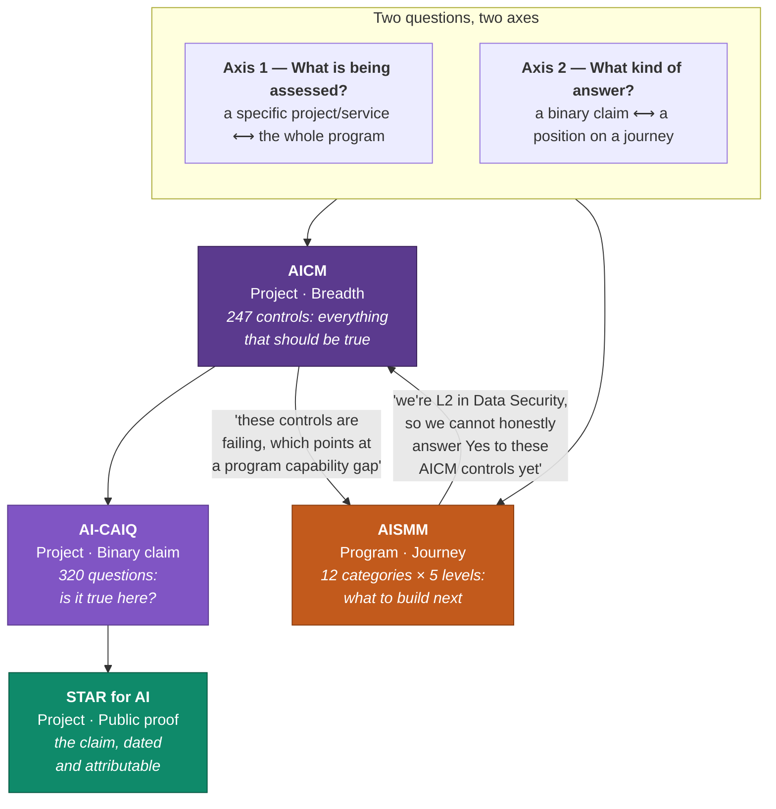

*Figure 8 — The two frameworks are complementary diagnostics that feed each other.*

The feedback loop in the middle of that diagram is the point, and it runs both directions:

- **AISMM → AICM.** Your maturity level tells you which control claims you can make *honestly*. A program at L2 in Data Security filling in AI-CAIQ answers about permission-aware RAG retrieval is writing fiction. AISMM tells you that before an assessor does.
- **AICM → AISMM.** A cluster of failing controls in one domain is rarely a collection of independent bugs. It's usually one missing program capability expressing itself repeatedly. AISMM is where you look up which one.

Zoom out and the layering is clean:

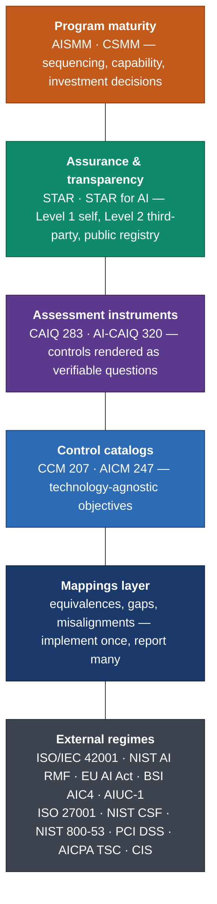

*Figure 9 — The full stack. Each layer consumes the one below and serves the one above.*

---

## Part 8 — Which one do you actually need?

Reasonable question, given that reading all five cover to cover is a week of your life.

| If your goal is… | Start with | Then |
|---|---|---|
| **Prove our AI service is secure** to buyers | **AICM** — implement the controls that apply to your actor role | **AI-CAIQ** to answer them → **STAR for AI Level 1** to publish. Run **Valid-AI-ted** before submitting. |
| **Evaluate someone else's** AI service | Their **STAR** entry, if it exists | Missing? Send them the **AI-CAIQ**. Use the **SSRM** to work out which actor owns the controls you actually care about. |
| **Know where our security program stands** | **AISMM** — score all twelve categories | Find your real floor, sequence investment. Foundational domain first. |
| **Satisfy EU AI Act / ISO 42001 / NIST AI RMF** | **AICM mappings** | Implement AICM controls once, report through the mapping into each regime. |

Whichever row you start on, the last step is the same:

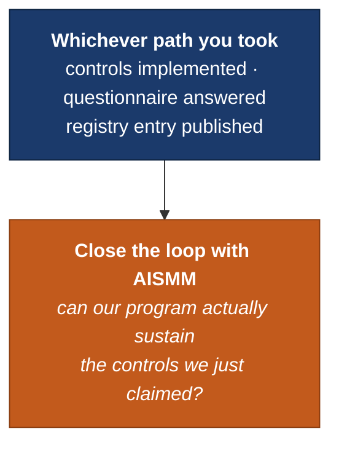

*Figure 10 — Every path ends in the same sanity check.*

A practical note on sequencing: score yourself on AISMM *before* you start filling in AI-CAIQ. It takes an afternoon, and it will tell you which of the 320 answers you're about to write are aspirational. Finding that out yourself is much cheaper than having an assessor find it.

---

## Part 9 — Where this meets AI safety, and where it doesn't

I want to be straight about the limits, because "AI safety" gets used for two quite different things and this family only covers one of them.

**What these frameworks genuinely do well.** They convert vague anxiety into enumerated, ownable, auditable obligations. That is not a small thing. Most real-world AI harm to date has come from mundane failures — an agent with over-broad credentials, a RAG index that ignored source permissions, a coding assistant trained on the wrong repository, a vector store on default access controls, an incident with no playbook and no telemetry to reconstruct it. Every one of those has a control. AICM's data-security and model-development domains, AISMM's blunt observation that data security is where organizations are weakest, the SSRM's insistence that someone specifically owns each control — this is exactly the machinery that prevents boring, expensive, entirely foreseeable failures. The unglamorous 90%.

**What they don't touch.** None of this addresses whether a model's objectives are aligned with its operator's intent, whether interpretability tools can detect deceptive behaviour, whether scaling introduces qualitatively new failure modes, or whether a capable system in an agentic loop pursues something nobody specified. Those are research problems. A control framework can require that you monitor model behaviour and log agent actions; it cannot tell you what to look for in the logs, because nobody fully knows yet.

The honest framing is that these are **complementary layers, not substitutes**. Compliance handles the failures we can already enumerate. Safety research works on the ones we can't. A mature program needs both, and confusing them in either direction is a mistake — a fully STAR-for-AI-certified deployment of a misaligned model is still a misaligned model, and a beautifully interpretable model with no access controls will still leak your customer data.

Two more caveats worth stating plainly:

**Self-assessment is self-assessment.** STAR Level 1 is an organization grading its own work. Its value is specificity and public commitment, not verification. Valid-AI-ted helps with internal consistency; it does not make L1 into L2. Read L1 entries as *what the vendor is willing to claim in public* — genuinely useful, and not the same as evidence.

**Point-in-time artifacts age badly against systems that change weekly.** A questionnaire answered in March describes March. When your provider ships a new model version in April, half your assumptions may have moved. AISMM's higher levels acknowledge this directly — L5 Governance is *"monitored via automated tooling"*, L5 Risk includes *"rapid frontier-release assessment"* — and CSA's continuous-audit metrics work is aimed squarely at the same gap. But the tooling to make compliance continuous is, for most organizations, still ahead of them.

---

## The summary table

| Framework | Question it answers | Unit | Scope | Output |
|---|---|---|---|---|
| **CCM** v4.1 | What should be true of a secure cloud service? | 207 controls, 17 domains | Cloud service | Control objectives + guidelines + mappings |
| **CAIQ** v4.1 | Is it true in your cloud environment? | 283 questions | Cloud service | Yes/No + SSRM ownership |
| **STAR** | Where can I read your answers? | 2 assurance levels | Named service | Public registry entry |
| **AICM** v1.1 | What should be true of a secure AI system? | 247 controls, 18 domains | AI system | Control objectives, 5-actor SSRM, 5 regime mappings |
| **AI-CAIQ** v1.1 | Is it true in your AI system? | 320 questions | AI service | Yes/No + SSRM ownership |
| **STAR for AI** | Where can I read your AI answers? | L1 self / L2 third-party | Named AI service | Public registry entry |
| **AISMM** | Can our program secure AI at all? | 12 categories × 5 levels | The security program | Maturity scores + investment sequence |

---

## Closing

The thing that finally made this family click for me was realizing the five artifacts aren't five attempts at the same job. They're one pipeline, split at the points where the *audience* changes.

An engineer needs a control. An auditor needs a question. A customer needs a registry. A CISO needs a maturity model and a budget argument. Same underlying reality, four incompatible formats — and the mappings are what keep them from drifting into four different truths.

The AI branch's most encouraging property is how *unoriginal* it is. Seventeen of eighteen domains inherited. Same questionnaire grammar. Same submission flow. One genuinely new domain for the genuinely new thing. That's a framework designed by people who understood that most of securing AI is securing software, and that the fastest way to get organizations to do the new work is to not make them relearn the old.

Whether the compliance layer can keep pace with a technology that ships a new frontier model every few months is the open question. The direction of travel — machine-readable controls, continuous metrics, policy-as-code at L5, AI-assisted assessment review — suggests the people building these frameworks know it too.

---

## Sources

All five frameworks are published by the **Cloud Security Alliance** and available from [cloudsecurityalliance.org](https://cloudsecurityalliance.org). This post is my own synthesis and explanation; the frameworks, their structure, and all quoted phrases are CSA's work, cited here for educational commentary. The opening "STAR Universe" image is CSA's, from the STAR Program Knowledge Guide; Figures 1–10 are my own diagrams, drawn to illustrate the relationships described.

- **CCM & CAIQ v4.1** — *Guide to the CCM and CAIQ*; *Introductory Guidance to CCM*; *CCM v4.1 Implementation Guidelines v2.1*; *The Continuous Audit Metrics Catalog v1.1*; *Code of Practice for Implementing and Maintaining Key Metrics*. → [CCM](https://cloudsecurityalliance.org/research/cloud-controls-matrix)
- **STAR** — *STAR Program Overview*; *STAR Registry FAQ*; *STAR Assessment Portfolio FAQ*; *STAR Enabled Solutions FAQ*; *STAR Extended FAQ*; *STAR Program Knowledge Guide*. → [STAR](https://cloudsecurityalliance.org/star)
- **AICM v1.1** — *Introductory Guidance to AICM v1.1*, Marina Bregkou et al., Compliance Automation Revolution Working Group / Security Controls Catalog. → [AICM v1.1](https://cloudsecurityalliance.org/artifacts/ai-controls-matrix-v1-1)
- **AI-CAIQ & STAR for AI** — *STAR for AI Level 1 Submission Guide*; *Filling in the AI CAIQ: Instructions and Recommendations*. → [STAR for AI](https://cloudsecurityalliance.org/star/ai/)
- **AISMM** — *AI Security Maturity Model: Introduction*; *AISMM Control Objectives Details*; AISMM poster and main grid.
