# The Redundancy Trap

*I deleted the two attention heads with the largest positive direct effects in GPT-2 small. The model got **better**. Then I found the same failure across seven models — and in my own code.*

<div style="font-family:ui-monospace,SFMono-Regular,Menlo,monospace;font-size:.82rem;opacity:.65;margin:.2rem 0 1.1rem">Sumit Yadav · August 2026 · GPT-2 small/medium/large/XL · Pythia-410m/1.4b · Llama-3.2-1B · one T4</div>

There is a move that appears in almost every mechanistic interpretability result. You have a hypothesis that head $h$ does job $J$. You ablate $h$, the behaviour degrades, and you conclude that $h$ implements $J$. It is the workhorse of the field, it is what makes a claim causal rather than correlational, and it is the right instinct.

This post is about the three separate ways it went wrong for me, all of them variations on one theme: **a network that repairs itself cannot be interrogated one component at a time.**

I set out to reproduce the canonical results on GPT-2 small — induction heads, K-composition, the indirect-object-identification circuit — to a standard where every claim came with the intervention that would have falsified it. That part worked. The interesting part is what happened when I went back and tried to break my own tests.

> **The one-line claim.** Redundancy is not a caveat you note at the end. It determines which measurements mean anything. A circuit that repairs itself will report *no effect* from removing a component it genuinely depends on, *no importance* for a head that carries a third of the mechanism, and *absence* where there is only distribution — and each of those errors looks exactly like a clean negative result.

---

## 01 · The model, and the metric

Everything below is GPT-2 small unless stated: 12 layers, 12 heads per layer, 144 attention heads, $d_{\text{model}} = 768$, learned absolute positional embeddings. Milestone 5 adds GPT-2 medium/large/XL (24/36/48 layers), Pythia-410m and 1.4b (parallel attention+MLP, rotary embeddings), and Llama-3.2-1B (grouped-query attention, RMSNorm, SwiGLU). Everything runs in fp32 on a single T4.

GPT-2 small is small enough that exhaustive things are affordable — a $2^9$ coalition lattice, 28,512 path patches, greedy elimination over all 144 heads — and that turns out to matter more than scale, because the exhaustive versions are where the single-component story breaks.

Two tasks:

**Induction.** Feed `[BOS] + random(50) + the same random(50)`. Random tokens cannot be predicted from world knowledge or n-gram statistics, so getting the second copy right requires copying from the first. Per-position loss collapses **13.298 → 0.485** at the repeat boundary.

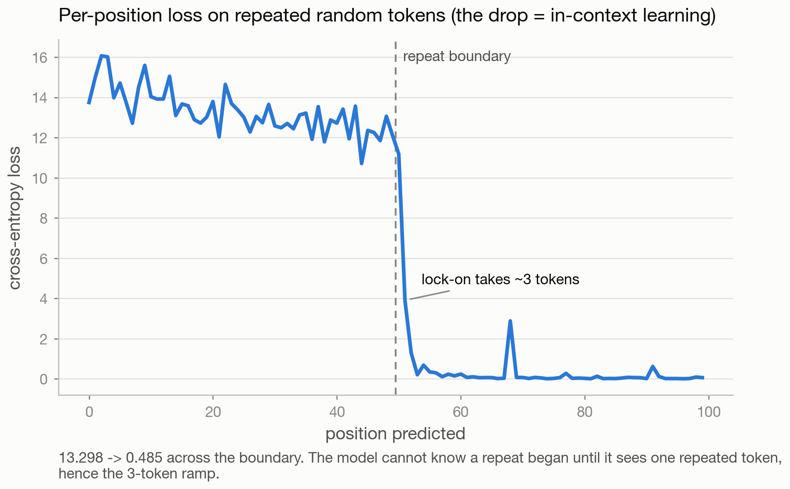

**IOI.** *"When Mary and John went to the store, John gave a drink to →  Mary."* The metric throughout is the **logit difference** between the correct name and the distractor: clean +2.626, corrupted (roles swapped) −2.826. Every "fraction of the gap" below is measured against those two ends.

---

## 02 · The first crack: a 33.7% effect

Milestone 2 was textbook. The strongest previous-token head is L4H11 (score 0.992, next best 0.547); the strongest induction head is L5H5 (0.906). K-composition says the induction head reads the previous-token head's output as a *key* — remove the writer and the reader's attention pattern should collapse.

Mean-ablate L4H11 and L5H5's induction score drops **0.9059 → 0.6009**, a 33.7% fall. Ablate a control head in the same layer and it drops 0.1%. The treatment is **426× the control**, which is what licenses a claim about a specific circuit rather than about generic damage.

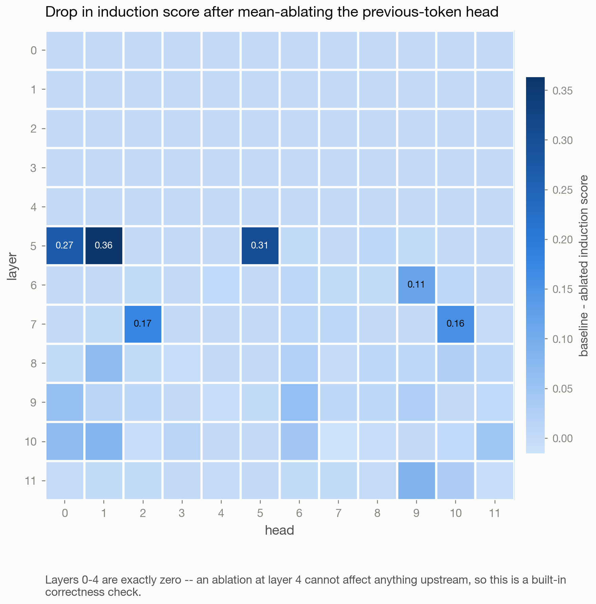

But look at that number again. **33.7%, not 100%.** Two thirds of the induction behaviour survived losing the head that supposedly feeds it. I wrote at the time that the circuit was probably distributed across several previous-token heads, and moved on.

That was a hypothesis presented as an explanation. Holding onto it properly would have saved me a lot later.

---

## 03 · A circuit, and the wrong reason it was wrong

Milestone 3 localised the IOI circuit by three criteria I chose:

- **name movers** — direct effect on the logit difference, computed analytically by projecting each head's write onto $W_U[:,\text{IO}] - W_U[:,\text{S}]$
- **duplicate-token heads** — attention from the subject's second occurrence back to its first
- **S-inhibition heads** — the shift in the top name mover's attention when a sender is patched into its *query* only

Each with a cutoff at some fraction of the measured maximum. Nine heads came out.

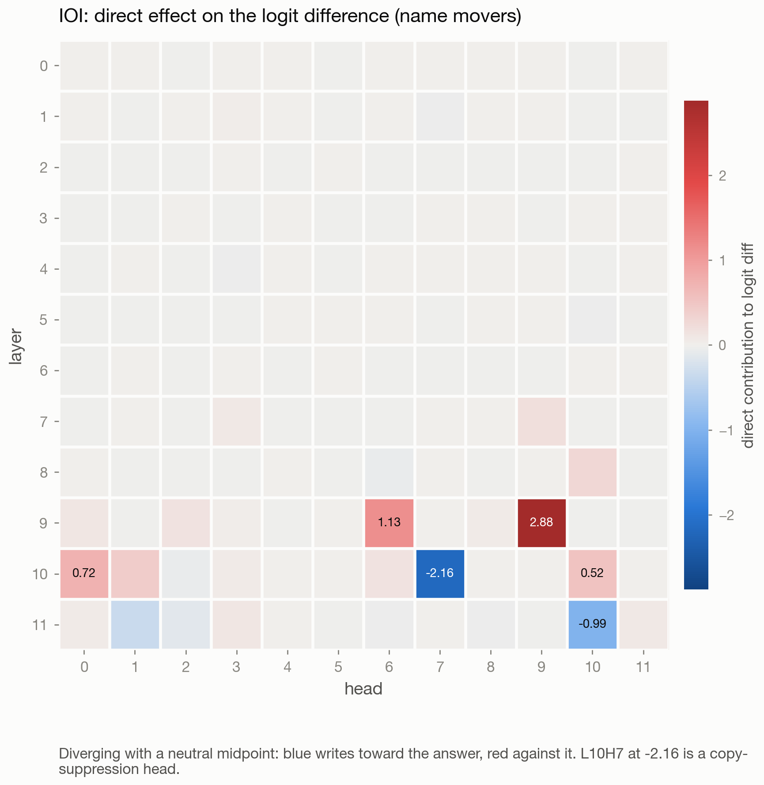

Three hand-picked thresholds is the softest joint in any circuit result, so I replaced them with something threshold-free: **greedy backward elimination** over all 144 heads. Repeatedly ablate whichever remaining head costs least, and record the order. That gives a complete ranking by causal expendability and a circuit at *any* performance level, with no cutoff to choose. 10,440 forward passes.

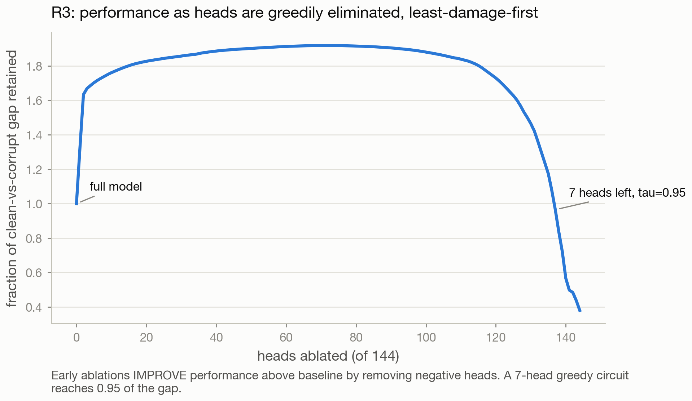

The two circuits agree on **6 of 9**.

The obvious diagnosis is that my thresholds were badly set. It is worth checking, because the remedies are completely different: a bad threshold is fixed by sweeping it and nothing else needs to change.

So for each head the hand-picked selection missed, I took its best score under *any criterion the old code could represent* and compared it to that criterion's cutoff:

| Added head | Measured role | Best score under an old-schema criterion | Cause |
|:---|:---|---:|:---|
| L4H11 | previous-token | **2%** of the nearest cutoff | schema |
| L5H5 | induction | **1%** | schema |
| L10H0 | backup name mover | 83% (0.250 against 0.30) | threshold |

**Two of the three were unreachable by any threshold at all.**

The circuit was stored in a dataclass with exactly three fields — `name_movers`, `s_inhibition`, `duplicate_token` — and milestone 3 measured exactly three matching quantities. L4H11 is a previous-token head. L5H5 is an induction head. Both had been measured back in milestone 2. Both are in the top four most causally load-bearing heads in the entire model. Neither could be recorded, because there was no field to put it in and no criterion that could have selected it.

That is a different kind of error from a mis-set number, and worse in a specific way: **it is silent.** A threshold that is too high leaves a head just below the line, where a sweep finds it. A missing category leaves no trace. The circuit looked complete, every role was populated, and nothing failed.

Toggle the second view below to see it directly — grey out the columns that did not exist, and watch two rows lose every ringed cell they had.

<iframe src="rt-roles.html" title="Role criteria grid" loading="lazy" scrolling="no" style="width:100%;height:660px;border:0;background:transparent"></iframe>

### The fix has to be structural

Adding an `induction` field would have fixed this instance and left the class of bug intact. So the taxonomy became data — one `Criterion` object per role, recording its metric, threshold, sign, source experiment, and the task its metric is defined on — with the part that actually matters being a test:

```python
def test_every_role_has_a_criterion_and_every_criterion_has_a_role():
    criteria_roles = {c.role for c in CRITERIA}
    declared = set(ROLES) - {"unclassified"}
    assert criteria_roles == declared
```

A role with no way to be measured, or a measurement with nowhere to record its answer, is now a failing test rather than a hole in a result. That test would have caught the original defect the day it was introduced.

`unclassified` is a real role for the same reason. A head that the causal ranking proves is load-bearing but that no criterion describes is a *finding*; dropping it for want of a label repeats the original mistake one level up. L10H0 held that label for a while — and it turned into the most interesting experiment in the project.

One thing fell out of the grid that no earlier experiment could have shown: **L9H6 and L9H9 pass the induction criterion too** (0.55 of L5H5's maximum), not just the name-mover one. That is not an artifact to be tuned away. A name mover on IOI copies a name from an earlier occurrence, which is precisely what the induction metric measures on repeated random tokens. The milestone-2 and milestone-3 mechanisms are measurably not disjoint — visible only because a head was finally scored under a criterion belonging to a different milestone.

---

## 04 · Play with the lattice

With nine heads, there are $2^9 = 512$ ways to choose which stay intact. That is 512 forward passes — seconds on a T4. So rather than measuring the two points everyone reports (ablate the circuit; ablate everything else), I measured the whole surface.

Every number in the figure below is one of those measurements. Click heads off and on.

<iframe src="rt-lattice.html" title="The IOI ablation lattice" loading="lazy" scrolling="no" style="width:100%;height:620px;border:0;background:transparent"></iframe>

A few things worth trying:

- **All nine intact** gives sufficiency **1.1741** — *above* the clean baseline. Ablating everything outside the circuit also removes the copy-suppression heads, so the model does slightly better than untouched.
- **The 7-head circuit** gives **0.9651**. That number is a coalition of this lattice, and it independently reproduces the threshold-free greedy answer at $\tau = 0.95$ by a completely different method. Two roads, same place.
- **L9H9 alone** — the head with by far the largest direct effect — recovers 36% of the gap.

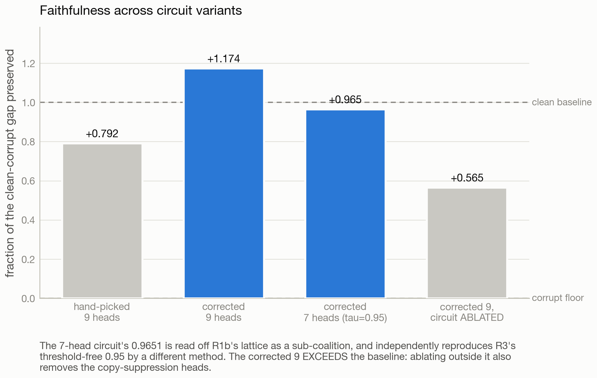

### Shapley, because single ablation is the wrong estimator

The whole lattice lets you compute **exact Shapley values**: each head's average marginal contribution over every coalition it could join. This is the correct attribution when components substitute for one another, and the reason it matters is stark — for two perfectly redundant heads, single-head ablation reports *zero for both*.

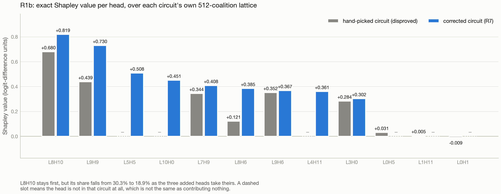

**L8H10 is the most important head in the IOI circuit** — 18.9% of the total — despite a direct effect roughly six times smaller than L9H9's. What a head *writes* is not what it is *worth*.

The pairwise interactions say something too. Inside the circuit the structure is **synergy**, not redundancy: 8 synergistic pairs against 4 redundant. Redundancy lives outside the circuit, among the heads that step in when members are removed. And one specific redundant pair — L9H6 × L10H0 at −0.0796 — is the coalition lattice independently discovering a relationship I only measured causally two experiments later.

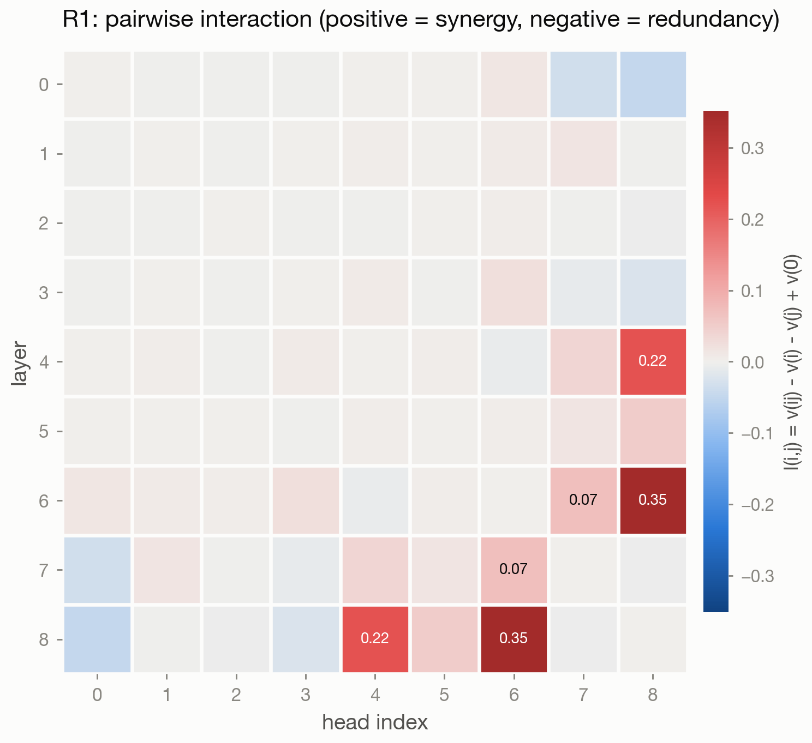

---

## 05 · Deleting the two best heads makes it better

Milestone 4 had a pre-registered prediction I got wrong, and it was worth more than the ones I got right. L9H9's direct effect is **+2.8782**, so I predicted ablating it would cost about −2.30. It costs **−0.585**.

The false assumption was that direct effect predicts ablation damage. It does not. I wrote "other name movers compensate" and left it there — which is a story, not a measurement, and it left 2.293 of logit difference unaccounted for in the middle of the headline result.

So: ablate **both** primary name movers, L9H6 and L9H9, combined direct effect **+4.0064**.

The logit difference goes **up** by 0.1488.

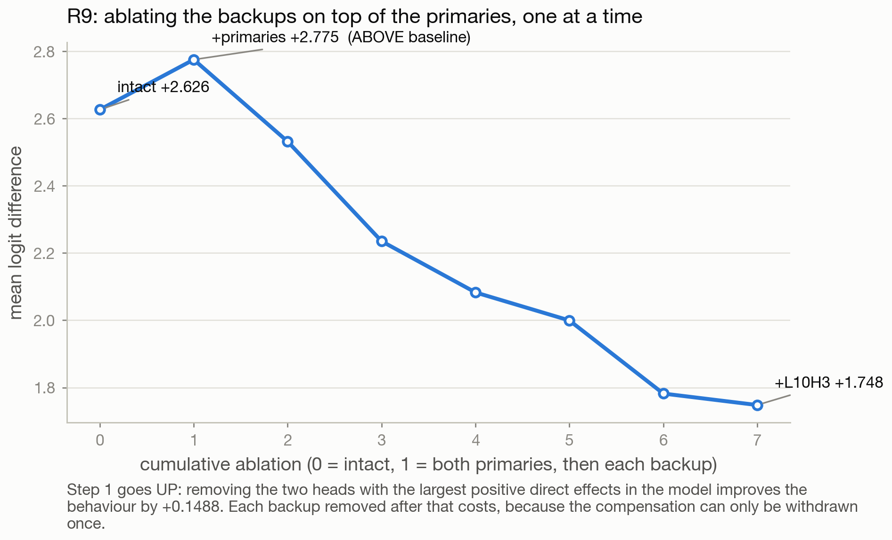

### Two mechanisms, not one

The way to find what absorbed it: recompute every head's direct effect with the primaries ablated, and subtract. One extra cached forward pass gives you all 144.

My first version ranked heads by that rise, and its top result was **L10H7**, going from −2.1602 to −0.0200. But that head is not writing the answer more — it has *stopped writing against it*. Both are compensation, both show up as a positive rise, and calling a copy-suppression head the model's leading backup name mover would have been plainly wrong.

The rise decomposes exactly, with no sign threshold to pick:

$$\text{withdrawal} = \min(a,0) - \min(b,0), \qquad \text{promotion} = \max(a,0) - \max(b,0)$$

where $b$ and $a$ are the head's direct effect before and after. The two sum to the rise identically. A head at −2.16 → −0.02 is pure withdrawal; +0.72 → +1.38 is pure promotion; −0.06 → +0.30 splits between them rather than being forced to one side by which side of zero it happened to start on.

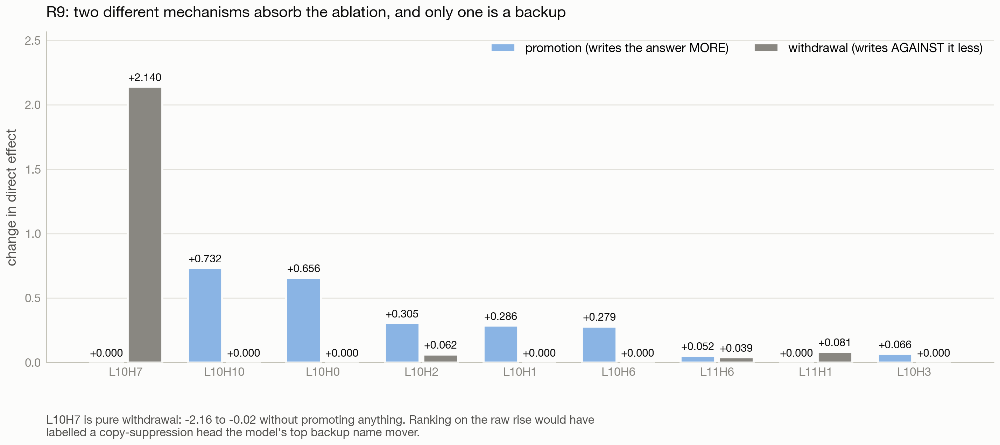

| Where the +4.0064 goes | |
|:---|---:|
| Actual cost of removing both | **−0.1488** |
| Absorbed | +4.1552 |
| — backup name movers promoting more | +2.5790 |
| — copy-suppression heads opposing less | +2.3920 |

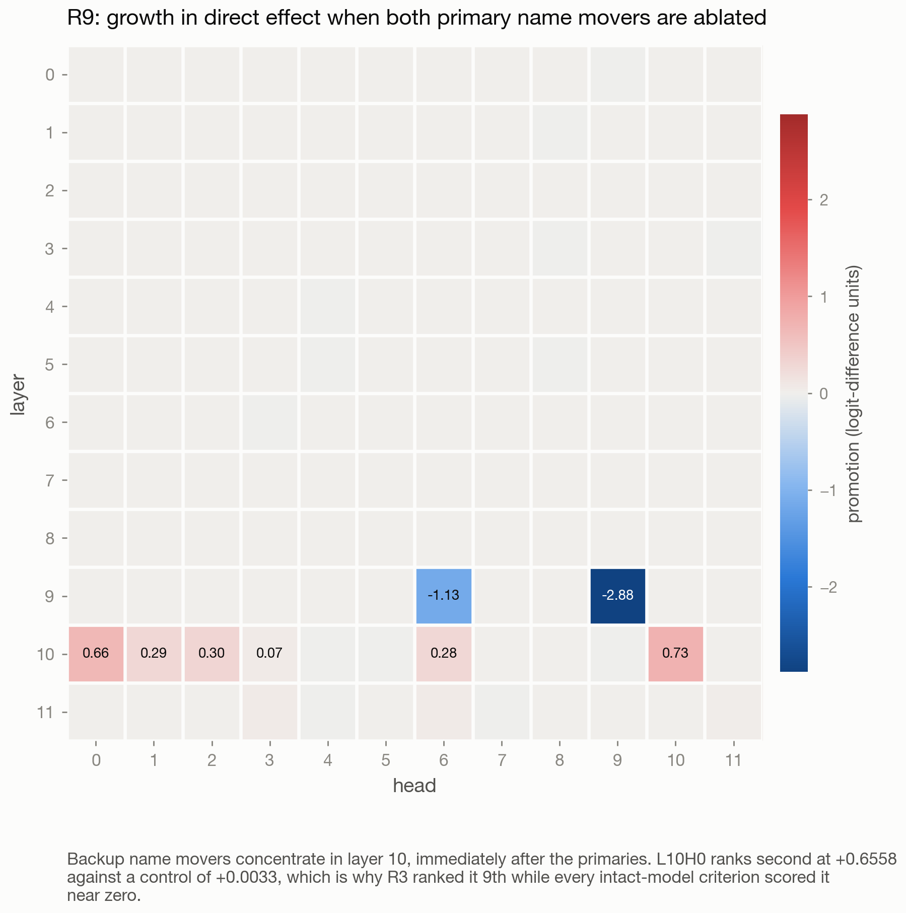

And L10H0 — the head no criterion could describe — is confirmed: promotion **+0.6558** against a same-layer control's +0.0033, a ratio of **198×**, rank 2 of 144.

Its small direct effect in the intact model is not weak evidence. It is the signature. **A head that only acts once the primaries are gone cannot be found by any criterion measured on the intact model.** The causal ranking put it 9th; every score in milestone 3 put it nowhere. That is the whole shape of the problem in one head.

---

## 06 · A loop, tested instead of asserted

Milestone 3 measured three hand-picked edges and documented the gap honestly. The exhaustive version is 3 inputs × 144 receivers × 66 senders = **28,512 path patches**, which is minutes on a T4 — so the scope bound was an effort choice dressed as a resource constraint.

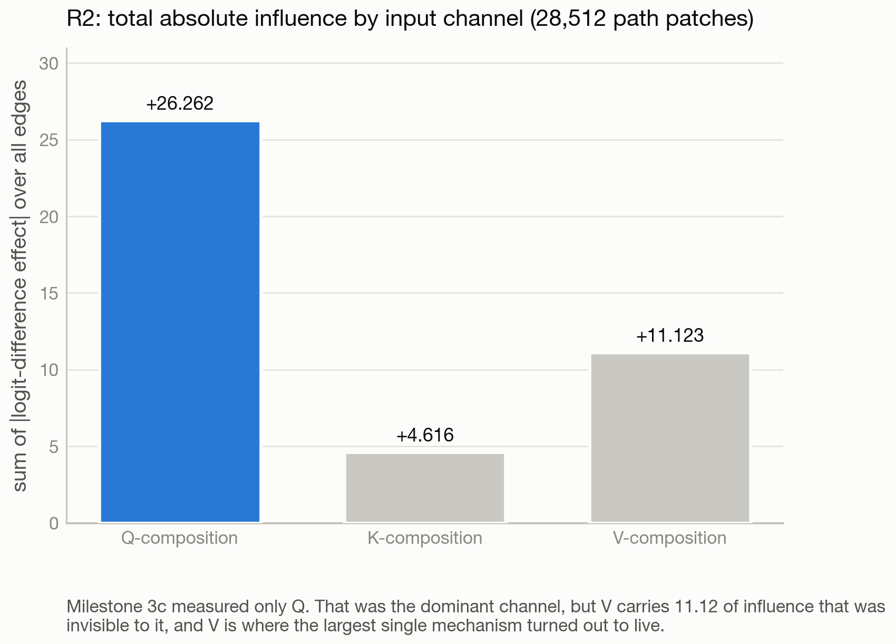

The exhaustive sweep found that the two largest edges in the entire model both run from the top name mover into a **copy-suppression head's query**: L9H9 → L10H7.q at +2.2856, L9H9 → L11H10.q at +1.8881.

I described that as a negative feedback loop. But that is an interpretation of a magnitude — the same magnitude is equally consistent with L9H9's output being a large vector that perturbs whatever it is added to. So I wrote the predictions down first, committed them to git before the experiment ran, and tested it.

**The decisive test is open loop versus closed loop.** If the loop is real, part of what protects L9H9 from its own removal is the suppression it stops provoking. So ablate it again with the loop already cut:

$$\text{gain} = \underbrace{\big[\text{LD}(\text{ablate }h + \text{supp}) - \text{LD}(\text{ablate supp})\big]}_{\text{open}} - \underbrace{\big[\text{LD}(\text{ablate }h) - \text{LD}(\text{base})\big]}_{\text{closed}}$$

Whatever the backup heads contribute appears in *both* terms and cancels, which is what makes the difference a clean estimator of the loop rather than a mixture of the two mechanisms.

| Arm | Logit difference | Δ |
|:---|---:|---:|
| baseline | +2.6263 | — |
| ablate L9H9, loop intact | +2.0388 | **−0.5875** |
| suppressors ablated | +6.0836 | — |
| ablate L9H9, loop cut first | +4.3669 | **−1.7168** |

**Loop gain −1.1293**, against a control head's +0.0029 — **394×**. Removing the name mover costs nearly three times as much once the suppression it provoked can no longer be withdrawn along with it.

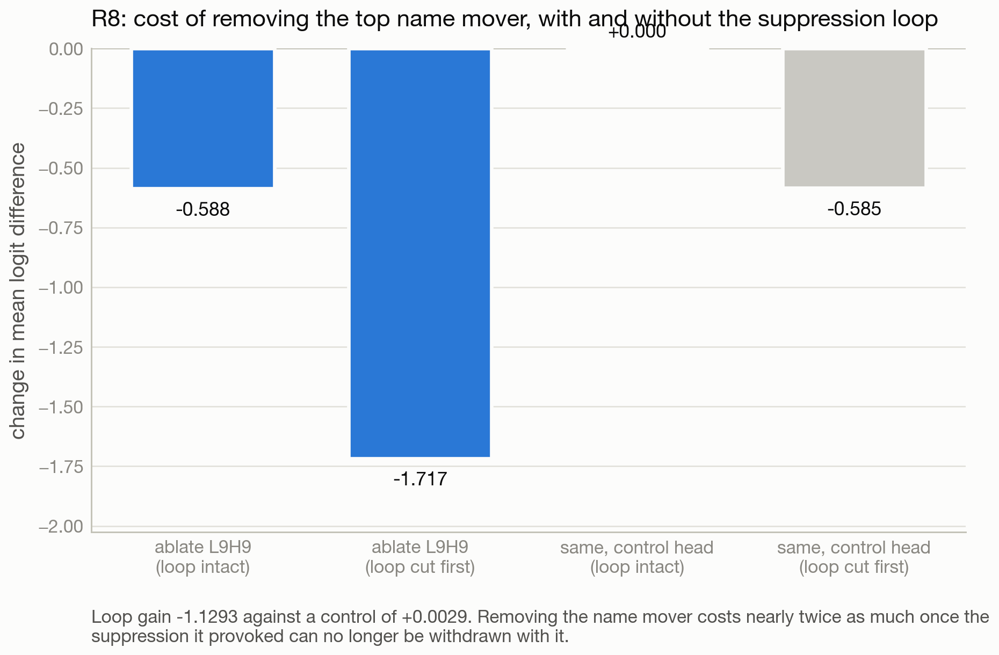

Cutting the single edge in isolation — adding L9H9's ablation delta to L10H7's *query input only*, leaving keys and values untouched, so L9H9 still writes its +2.8782 into the residual stream and the suppressor simply cannot see it — **raises** the logit difference by **+0.9199**, at **2562×** its control. One wire is worth about a third of the entire clean–corrupt gap.

All five pre-registered predictions hit. Which is a *weaker* signal than milestone 4's three-from-four, not a stronger one: the miss there taught more than any hit here.

### The disagreement I kept

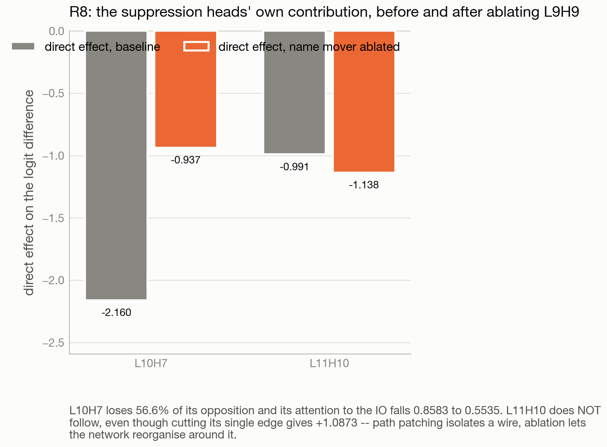

| Head | Baseline | With L9H9 ablated | Attention to IO |
|:---|---:|---:|:---|
| L10H7 | −2.1602 | −0.9369 (**56.6% gone**) | 0.8583 → 0.5535 |
| L11H10 | −0.9913 | −1.1375 (14.8% *deeper*) | 0.6261 → 0.6597 |

L11H10 does not follow. Its suppression slightly *deepens* under full ablation, even though cutting its single edge gives the **larger** isolated effect of +1.0873.

The two facts are not in conflict once you separate the interventions. A path patch cuts one wire and holds everything else fixed. An ablation removes the head entirely and lets the network reorganise — with L9H9 gone, L10H7's suppression withdraws and six backup heads fire, so what reaches L11H10 at layer 11 is a *different residual stream*, and it may well be reading the backups instead.

**Path patching measures an edge. Ablation measures a world without the node.** Reporting only the head that agreed would have made the loop look cleaner than it is.

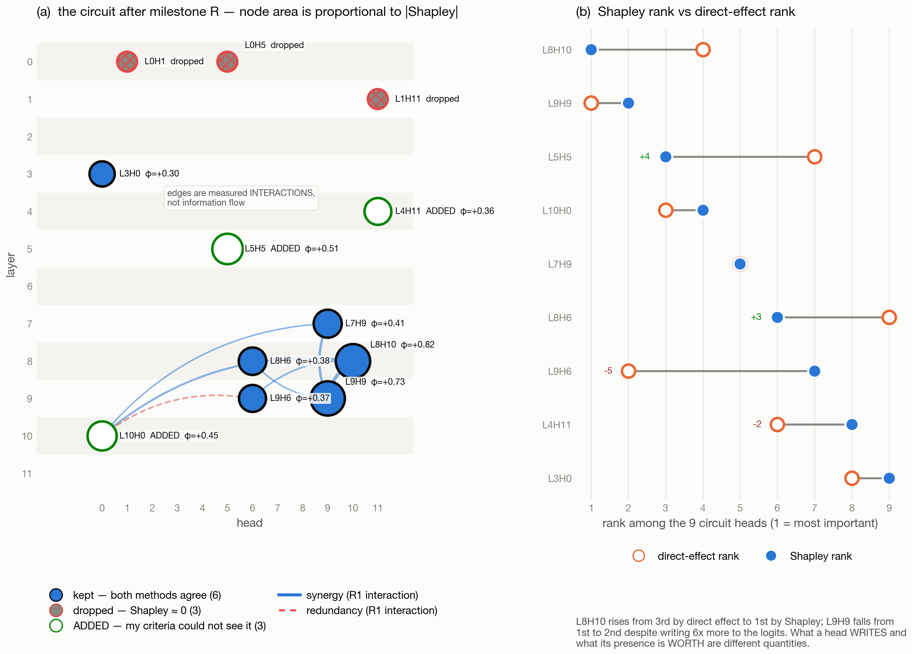

Laid out over token position and depth, with every edge carrying its measured path-patching magnitude:

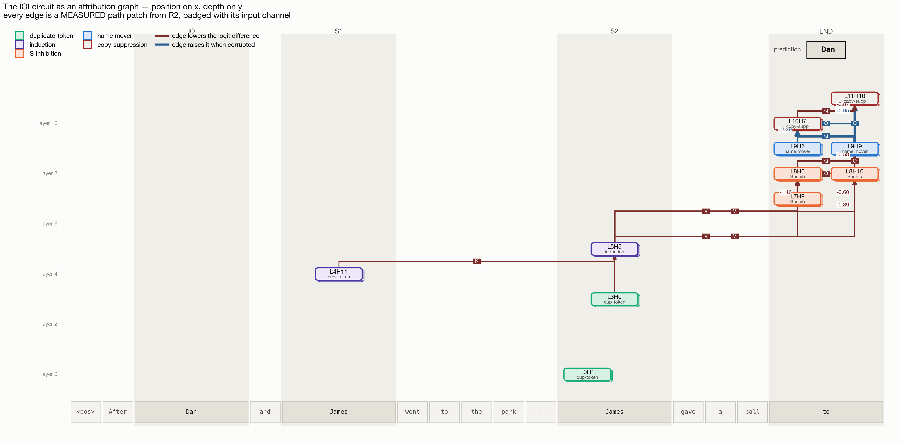

---

## 07 · Seven models, and the test that fails at scale

Everything so far concerns one 124M-parameter network. Nothing measured could distinguish a fact about transformers from a fact about GPT-2 small.

So: seven models on two axes. GPT-2 small → medium → large → XL holds the architecture fixed while depth goes 12 → 48. Pythia-410m and 1.4b run attention and MLP **in parallel** from the same residual input, with rotary embeddings. Llama-3.2-1B uses **grouped-query attention**, RMSNorm and SwiGLU — the sharpest test, because several query heads share one key/value head, so "ablate the previous-token head" is not even the same intervention.

Identical method for every model, every head index derived from that model's own measurements. The generalisation question is whether the *answer* transfers, so the *method* must not vary.

<iframe src="rt-universality.html" title="Universality across scale and architecture" loading="lazy" scrolling="no" style="width:100%;height:620px;border:0;background:transparent"></iframe>

- **In-context copying: 7/7.** Every model collapses per-position loss at the repeat boundary.
- **K-composition by the single-head test: 3/7.**
- **K-composition by the joint test: 7/7.**

Where the two disagree, the disagreement is in the **test**. On gpt2-medium, ablating L5H11 — previous-token score 0.992, the strongest in that model — moves the top induction head from 0.9377 to **0.9400**. Nothing at all. But gpt2-medium has six heads clearing the criterion and three above 0.95, so removing one writer is absorbed by the others.

This is section 02's 33.7% again, at a larger scale and with the answer this time.

**GPT-2 small is the case where the single-head test works at all**, because it has one writer at 0.992 and the next at 0.547. That is the test I used for my own causal K-composition claim. Reporting only that number across these seven models would have concluded that the induction circuit does not generalise — recording redundancy as absence.

### What actually scales

| | correlation with depth |
|:---|---:|
| previous-token writers | **r = +0.77** |
| induction heads within 50% of the top | **r = +0.95** |

The reading side is almost perfectly linear in depth: 9 induction heads at 12 layers, 32 at 48. The mechanism does not change; it is implemented by progressively more components.

Llama-3.2-1B is the informative outlier. At 16 layers it has 7 writers, far more than GPT-2 small's 2, and its top previous-token score is only **0.603** against 0.99+ everywhere else. Under GQA the previous-token function is spread thin across query heads sharing key/value projections, so no single head looks like a canonical previous-token head. The single-head test fails there for a *different reason* than it fails on gpt2-xl — same verdict, different cause.

### The stronger claim

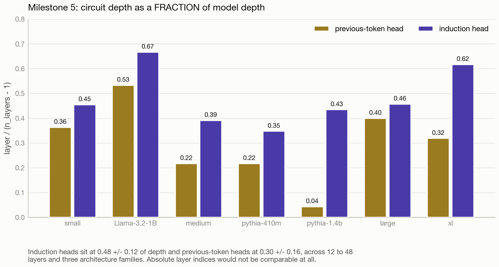

Induction heads sit at **0.48 ± 0.12** of depth and previous-token heads at **0.30 ± 0.16**, across three architecture families. The circuit occupies a consistent *relative* position regardless of how deep the model is.

Absolute layer indices would not be comparable at all — L5H5 in a 12-layer model and L5H11 in a 24-layer one are not the same place — and reporting them as though they were is an easy way to manufacture or destroy an apparent universality result.

---

## 08 · Two numbers that stayed uncomfortable

Not everything got better when I looked harder.

**Sufficiency depends on what you ablate toward, and correcting the circuit made it worse.** Mean-ablation replaces an activation with "what this component typically does", and the answer depends entirely on what distribution "typically" is over. I used means over the corrupted batch — a choice made quietly and never tested.

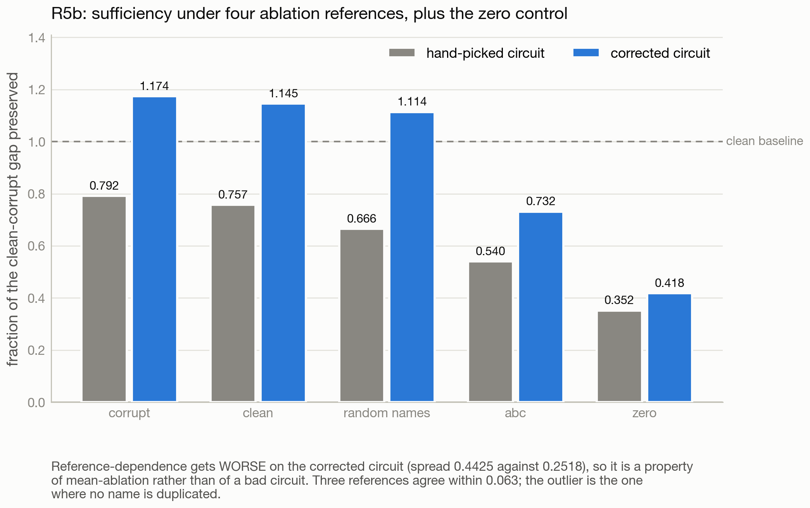

The spread across four on-distribution references went from 0.2518 on the wrong circuit to **0.4425** on the corrected one. So reference-dependence is a property of **mean-ablation itself**, not of a bad circuit, and any single sufficiency figure quoted without its reference is underdetermined — including in the work I was reproducing.

The corrected circuit does sharpen the picture. Three of the four references now agree within **0.063**, and the entire spread is carried by one outlier: the reference in which *no name is duplicated*. That is not noise — it is the one reference that destroys the duplicate-token cue the circuit runs on, so ablating toward it genuinely removes more. A mechanistically interpretable spread is a more useful statement than either "0.792" or "0.54 to 0.79".

**A stability test that measured the wrong thing.** I checked whether each circuit head stays in the top-9 *by direct effect* across 15 template × seed conditions, and flagged three heads as unstable. But only name movers were ever selected by direct effect. Asking whether a duplicate-token head has a large direct effect is asking whether it does a job nobody claimed it did — a low score is the expected answer, not instability.

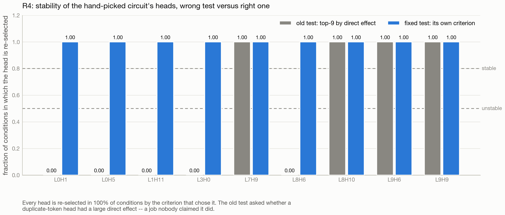

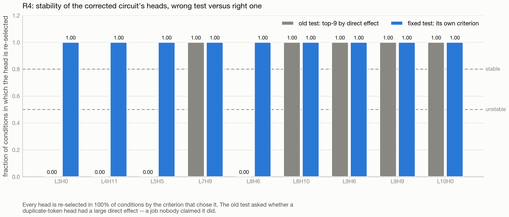

Re-run so that each head faces **its own** selection rule, on the task that rule is defined on: every head of both circuits is re-selected in **100%** of conditions, and **5 of 9 verdicts change**. The instability flags are withdrawn. That those three heads contribute approximately nothing remains true — it is the Shapley result, established by a different measurement that never depended on this one.

That distinction matters more than the correction. Two claims had been sitting on top of each other; one was right, one was wrong, and only pulling them apart showed which.

---

## 09 · What I would tell myself at the start

**Redundancy is not a caveat. It is a property that determines which measurements mean anything.** Three of the corrections here — the 33.7%, the −0.585, the 3/7 — are the same fact appearing at three scales. Every single-component ablation in a self-repairing network is a lower bound of unknown tightness.

**Structural choices are the ones that hide.** Every correction that came from a *parameter* was found by sweeping it. The three costliest errors were encoded in structure — three fields in a dataclass, one criterion per role, one head per ablation — and structure does not look like a decision when you read the code back. A rigour pass built entirely around varying parameters missed all three.

**An instrumentation bug that doubles a number is worse than one that garbles it.** My model-cache eviction reported gpt2-medium at 3.05 GB against its 1.52 GB checkpoint — exactly twice, every time. I read that as the hub downloading two weight formats and wrote an optimisation to avoid it. The doubling was my own size walk counting each file once as a blob and again as a symlink. The constraint did not exist; the optimisation then broke three models. A garbled number gets investigated. A plausible wrong one gets built on.

**Report the measurement that disagreed.** L11H10 does not follow the loop story. The `abc` reference is an outlier. Ablating both name movers *improves* the model. Each was tempting to average away, and each turned out to be the most informative thing in its section.

**Pre-registration earns its keep on the miss.** Milestone 4 scored 3 hits and 1 miss; the miss — that direct effect does not predict ablation damage — set up two later experiments and explained a number I would otherwise have narrated past. The 5/5 that followed taught me less.

---

## Numbers, in one place

| | |
|:---|---:|
| Residual identity max error, all 12 layers | 0.000e+00 |
| Per-position loss, first → second copy | 13.298 → 0.485 |
| K-composition, treatment / control | 426× |
| IOI clean / corrupt logit difference | +2.626 / −2.826 |
| Circuit agreement, hand-picked vs threshold-free | 6 of 9 |
| Additions unreachable by *any* threshold | **2 of 3** |
| Sufficiency, 7-head circuit at $\tau = 0.95$ | **0.9651** |
| Top Shapley value | L8H10, 18.9% |
| Cost of ablating both primary name movers | **−0.1488** (improves) |
| — absorbed by backup promotion / withdrawn suppression | +2.579 / +2.392 |
| Feedback loop gain / control | **−1.1293** / +0.0029 |
| Single-edge cut, L9H9 → L10H7.q | +0.9199 (2562× control) |
| Path patches measured | 28,512 |
| Coalitions measured | 512 |
| In-context copying | 7 / 7 models |
| K-composition, single-head / joint | **3 / 7** and **7 / 7** |
| Redundancy vs depth, writers / induction heads | r = +0.77 / **+0.95** |
| Relative depth, induction / previous-token | 0.48 ± 0.12 / 0.30 ± 0.16 |
| Pre-registered predictions | 3/4, then 5/5 |
| Harness defects found by running rather than reasoning | 12 |

---

*Twelve harness defects turned up along the way; three produced confidently wrong output before being caught. The most instructive: one where the code was correct, the run was clean, and the result came back empty because the **question** was mis-posed; and one where a mean-ablation used its own target as the reference — making the intervention a perfect no-op — and the experiment reported a confident refutation anyway.*
