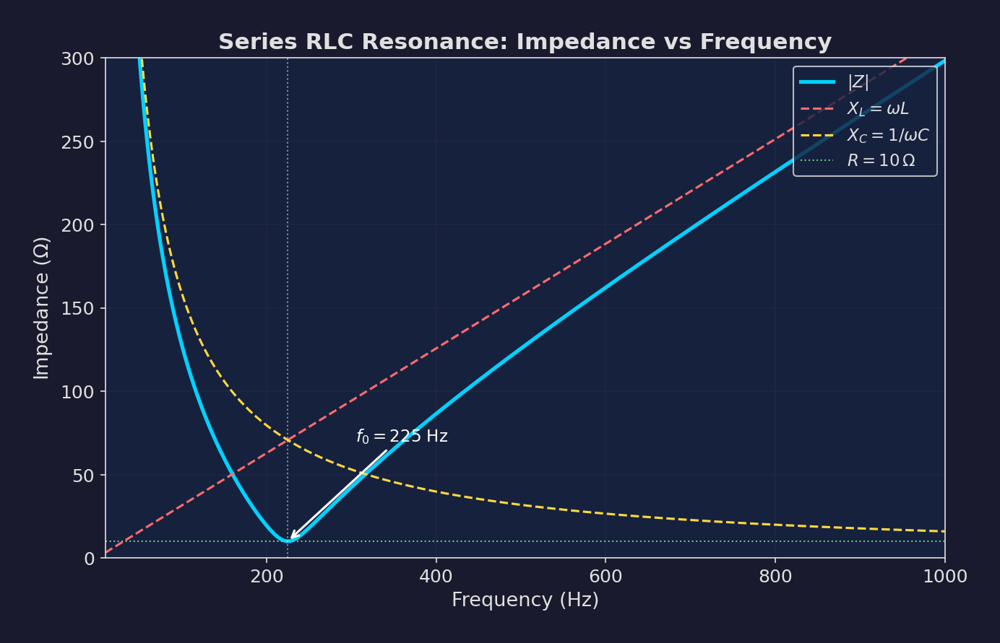
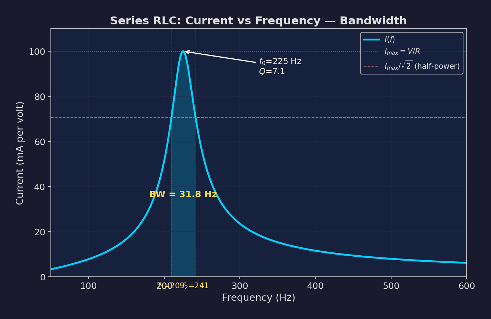
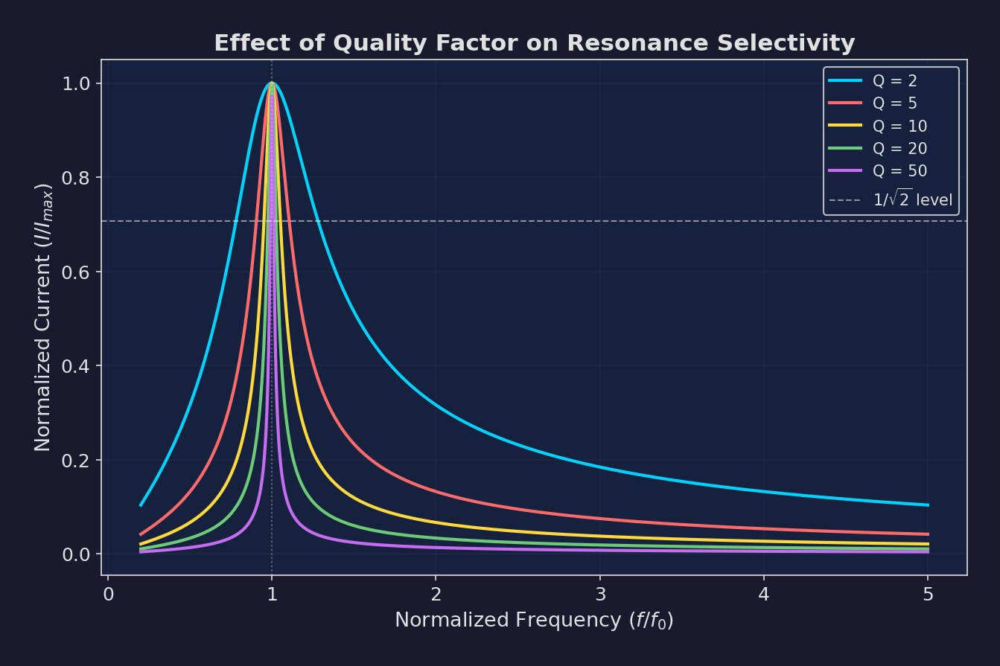
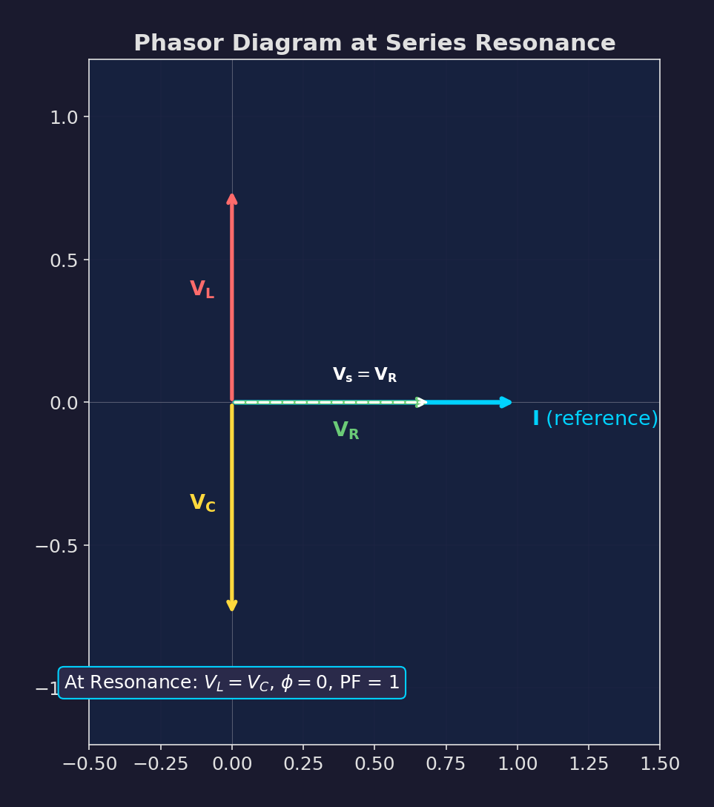
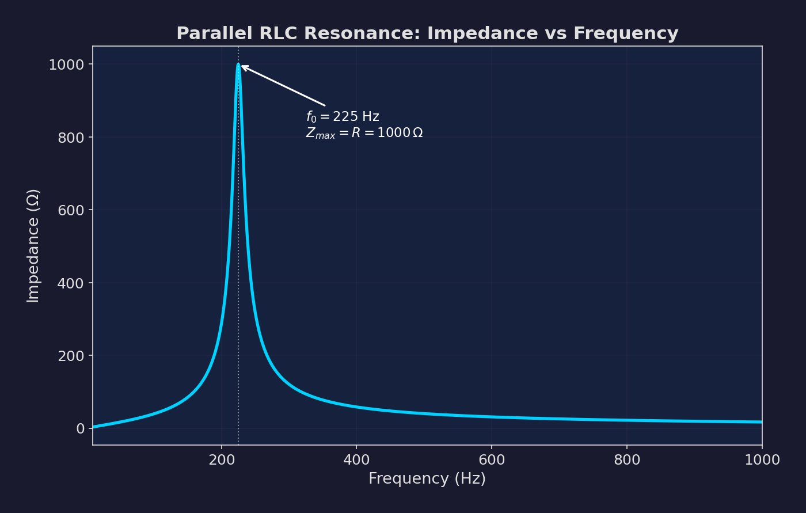

# Chapter 1: Network Analysis of AC Circuits & Resonance

**Electric Circuit Theory (EE 501) -- Tribhuvan University, IOE**
**Lecture Hours: 8 | Weightage: ~15-18 marks**

---

## Table of Contents

1. [Mesh Analysis of AC Circuits](#1-mesh-analysis-of-ac-circuits)
2. [Nodal Analysis of AC Circuits](#2-nodal-analysis-of-ac-circuits)
3. [Dependent Sources in Network Analysis](#3-dependent-sources-in-network-analysis)
4. [Series RLC Resonance](#4-series-rlc-resonance)
5. [Parallel RLC Resonance](#5-parallel-rlc-resonance)
6. [Worked Solutions](#6-worked-solutions)
7. [Quick Reference Formula Box](#7-quick-reference-formula-box)
8. [Exam Question Frequency Table](#8-exam-question-frequency-table)

---

## 1. Mesh Analysis of AC Circuits

### 1.1 Overview

Mesh analysis (also called loop analysis) applies Kirchhoff's Voltage Law (KVL) around each independent loop (mesh) of a planar circuit. In AC circuits, all quantities are expressed as phasors and impedances rather than DC resistances and voltages.

**Key Idea:** For each mesh, the sum of voltage drops (impedance times mesh current) around the loop equals the sum of voltage sources in that loop.

### 1.2 Steps for Mesh Analysis

1. **Identify meshes**: A mesh is a loop that contains no other loop within it. For a circuit with $b$ branches and $n$ nodes, the number of independent meshes is $m = b - n + 1$.

2. **Assign mesh currents**: Assign a clockwise (or counterclockwise -- be consistent) phasor current $\mathbf{I}_1, \mathbf{I}_2, \ldots, \mathbf{I}_m$ to each mesh.

3. **Write KVL for each mesh**: For mesh $k$:

$$\sum_{j=1}^{m} \mathbf{Z}_{kj} \mathbf{I}_j = \mathbf{V}_k$$

where:
- $\mathbf{Z}_{kk}$ = self-impedance of mesh $k$ (sum of all impedances in mesh $k$)
- $\mathbf{Z}_{kj}$ = mutual impedance between mesh $k$ and mesh $j$ (negative if currents flow in opposite directions through the shared element)
- $\mathbf{V}_k$ = algebraic sum of voltage sources in mesh $k$

4. **Solve the system**: Use matrix methods (Cramer's rule, matrix inversion, or Gaussian elimination).

### 1.3 Matrix Form: $[\mathbf{Z}][\mathbf{I}] = [\mathbf{V}]$

For a circuit with $m$ meshes, the impedance matrix equation is:

$$\begin{bmatrix} \mathbf{Z}_{11} & \mathbf{Z}_{12} & \cdots & \mathbf{Z}_{1m} \\ \mathbf{Z}_{21} & \mathbf{Z}_{22} & \cdots & \mathbf{Z}_{2m} \\ \vdots & \vdots & \ddots & \vdots \\ \mathbf{Z}_{m1} & \mathbf{Z}_{m2} & \cdots & \mathbf{Z}_{mm} \end{bmatrix} \begin{bmatrix} \mathbf{I}_1 \\ \mathbf{I}_2 \\ \vdots \\ \mathbf{I}_m \end{bmatrix} = \begin{bmatrix} \mathbf{V}_1 \\ \mathbf{V}_2 \\ \vdots \\ \mathbf{V}_m \end{bmatrix}$$

**Properties of the impedance matrix $[\mathbf{Z}]$:**

- **Diagonal elements** $\mathbf{Z}_{kk}$: Sum of all impedances in mesh $k$. Always positive.
- **Off-diagonal elements** $\mathbf{Z}_{kj}$: Impedance common to meshes $k$ and $j$. Negative if mesh currents flow in opposite directions through the shared element (the typical case when all mesh currents are assigned in the same rotational sense).
- **Symmetry**: For circuits with only independent sources and passive elements, $\mathbf{Z}_{kj} = \mathbf{Z}_{jk}$ (the matrix is symmetric). This symmetry breaks when dependent sources are present.

> **Exam Tip:** In the IOE exam, if the problem says "use mesh analysis," write the impedance matrix directly by inspection for faster solution. Always double-check the sign of off-diagonal terms.

### 1.4 Example: Two-Mesh AC Circuit

Consider two meshes sharing an impedance $\mathbf{Z}_3$:
- Mesh 1 contains $\mathbf{V}_1$, $\mathbf{Z}_1$, $\mathbf{Z}_3$
- Mesh 2 contains $\mathbf{V}_2$, $\mathbf{Z}_2$, $\mathbf{Z}_3$

With both mesh currents clockwise:

$$\begin{bmatrix} \mathbf{Z}_1 + \mathbf{Z}_3 & -\mathbf{Z}_3 \\ -\mathbf{Z}_3 & \mathbf{Z}_2 + \mathbf{Z}_3 \end{bmatrix} \begin{bmatrix} \mathbf{I}_1 \\ \mathbf{I}_2 \end{bmatrix} = \begin{bmatrix} \mathbf{V}_1 \\ -\mathbf{V}_2 \end{bmatrix}$$

Using Cramer's rule:

$$\mathbf{I}_1 = \frac{\begin{vmatrix} \mathbf{V}_1 & -\mathbf{Z}_3 \\ -\mathbf{V}_2 & \mathbf{Z}_2 + \mathbf{Z}_3 \end{vmatrix}}{\begin{vmatrix} \mathbf{Z}_1 + \mathbf{Z}_3 & -\mathbf{Z}_3 \\ -\mathbf{Z}_3 & \mathbf{Z}_2 + \mathbf{Z}_3 \end{vmatrix}}$$

### 1.5 Supermesh

A **supermesh** is formed when a current source (independent or dependent) exists in a branch shared by two meshes.

**Procedure:**
1. A current source shared between meshes $k$ and $j$ provides the constraint: $\mathbf{I}_j - \mathbf{I}_k = \mathbf{I}_s$ (or $\mathbf{I}_k - \mathbf{I}_j = \mathbf{I}_s$ depending on direction).
2. Remove the current source branch and write KVL around the combined outer path of both meshes (the supermesh).
3. Use the constraint equation as the additional equation needed.

**Example Supermesh Setup:**

If a current source $\mathbf{I}_s$ is between mesh 1 and mesh 2 (current flowing from mesh 1 to mesh 2):
- Constraint: $\mathbf{I}_2 - \mathbf{I}_1 = \mathbf{I}_s$
- Supermesh KVL: Write KVL around the outer boundary of meshes 1 and 2, excluding the current source branch.

> **Common Mistake:** Students often forget to write the constraint equation for the current source. Remember: supermesh gives you one KVL equation but you lose one mesh equation, so the constraint fills the gap.

---

## 2. Nodal Analysis of AC Circuits

### 2.1 Overview

Nodal analysis applies Kirchhoff's Current Law (KCL) at each node. In AC circuits, we work with admittances $\mathbf{Y} = 1/\mathbf{Z}$ and phasor node voltages.

**Key Idea:** At each non-reference node, the sum of currents leaving the node (admittance times node voltage difference) equals the sum of source currents entering the node.

### 2.2 Steps for Nodal Analysis

1. **Select a reference node** (usually the node with the most connections).
2. **Assign node voltages** $\mathbf{V}_1, \mathbf{V}_2, \ldots, \mathbf{V}_n$ to each non-reference node (where $n$ = number of non-reference nodes).
3. **Write KCL at each node**: For node $k$:

$$\sum_{j=1}^{n} \mathbf{Y}_{kj} \mathbf{V}_j = \mathbf{I}_k$$

where:
- $\mathbf{Y}_{kk}$ = self-admittance at node $k$ (sum of all admittances connected to node $k$)
- $\mathbf{Y}_{kj}$ = mutual admittance between nodes $k$ and $j$ (negative of the sum of admittances directly connecting nodes $k$ and $j$)
- $\mathbf{I}_k$ = net source current entering node $k$

4. **Solve the system**.

### 2.3 Matrix Form: $[\mathbf{Y}][\mathbf{V}] = [\mathbf{I}]$

$$\begin{bmatrix} \mathbf{Y}_{11} & \mathbf{Y}_{12} & \cdots & \mathbf{Y}_{1n} \\ \mathbf{Y}_{21} & \mathbf{Y}_{22} & \cdots & \mathbf{Y}_{2n} \\ \vdots & \vdots & \ddots & \vdots \\ \mathbf{Y}_{n1} & \mathbf{Y}_{n2} & \cdots & \mathbf{Y}_{nn} \end{bmatrix} \begin{bmatrix} \mathbf{V}_1 \\ \mathbf{V}_2 \\ \vdots \\ \mathbf{V}_n \end{bmatrix} = \begin{bmatrix} \mathbf{I}_1 \\ \mathbf{I}_2 \\ \vdots \\ \mathbf{I}_n \end{bmatrix}$$

**Properties of the admittance matrix $[\mathbf{Y}]$:**

- **Diagonal elements** $\mathbf{Y}_{kk}$: Sum of all admittances connected to node $k$. Always positive.
- **Off-diagonal elements** $\mathbf{Y}_{kj}$: Negative of the admittance connecting nodes $k$ and $j$.
- **Symmetry**: $\mathbf{Y}_{kj} = \mathbf{Y}_{jk}$ for circuits with only passive elements and independent sources.

### 2.4 Admittances of Basic Elements

| Element | Impedance $\mathbf{Z}$ | Admittance $\mathbf{Y}$ |
|---------|----------------------|------------------------|
| Resistor | $R$ | $G = 1/R$ |
| Inductor | $j\omega L$ | $\frac{1}{j\omega L} = -\frac{j}{\omega L}$ |
| Capacitor | $\frac{1}{j\omega C}$ | $j\omega C$ |

### 2.5 Supernode

A **supernode** is formed when a voltage source (independent or dependent) is connected between two non-reference nodes.

**Procedure:**
1. The voltage source between nodes $k$ and $j$ gives the constraint: $\mathbf{V}_k - \mathbf{V}_j = \mathbf{V}_s$.
2. Combine nodes $k$ and $j$ into a supernode and write a single KCL equation for the combined region.
3. Use the constraint equation as the additional equation.

> **When to use Mesh vs. Nodal:**
> - **Mesh analysis** is better when the circuit has fewer meshes than nodes, or when the circuit has mostly voltage sources.
> - **Nodal analysis** is better when the circuit has fewer nodes than meshes, or when the circuit has mostly current sources.
> - Mesh analysis only works for **planar** circuits. Nodal analysis works for both planar and non-planar circuits.

---

## 3. Dependent Sources in Network Analysis

### 3.1 Types of Dependent (Controlled) Sources

| Type | Symbol | Relationship | Controlling Variable | Controlled Variable |
|------|--------|-------------|---------------------|-------------------|
| VCVS | Voltage-Controlled Voltage Source | $\mathbf{V}_x = \mu \mathbf{V}_c$ | Voltage | Voltage |
| VCCS | Voltage-Controlled Current Source | $\mathbf{I}_x = g_m \mathbf{V}_c$ | Voltage | Current |
| CCVS | Current-Controlled Voltage Source | $\mathbf{V}_x = r_m \mathbf{I}_c$ | Current | Voltage |
| CCCS | Current-Controlled Current Source | $\mathbf{I}_x = \beta \mathbf{I}_c$ | Current | Current |

Where:
- $\mu$ = voltage gain (dimensionless)
- $g_m$ = transconductance (siemens)
- $r_m$ = transresistance (ohms)
- $\beta$ = current gain (dimensionless)

### 3.2 Handling Dependent Sources in Mesh Analysis

1. **Treat the dependent source like an independent source** initially when writing KVL.
2. **Express the controlling variable** in terms of mesh currents.
3. **Substitute** the expression into the mesh equations.
4. **Rearrange** all terms to one side. The resulting impedance matrix will NOT be symmetric.

**Example:** If a VCVS $\mathbf{V}_x = \mu \mathbf{V}_{ab}$ appears in mesh 2, and $\mathbf{V}_{ab} = \mathbf{Z}_1(\mathbf{I}_1 - \mathbf{I}_2)$:
- Write KVL for mesh 2 including $\mu \mathbf{Z}_1(\mathbf{I}_1 - \mathbf{I}_2)$
- Move terms involving mesh currents to the left side
- The resulting matrix will have modified coefficients and will be asymmetric

### 3.3 Handling Dependent Sources in Nodal Analysis

1. **Treat the dependent source like an independent source** initially when writing KCL.
2. **Express the controlling variable** in terms of node voltages.
3. **Substitute** and rearrange.

**Example:** If a CCCS $\mathbf{I}_x = \beta \mathbf{I}_c$ where $\mathbf{I}_c = (\mathbf{V}_1 - \mathbf{V}_2)\mathbf{Y}_1$:
- Express $\mathbf{I}_x = \beta \mathbf{Y}_1 (\mathbf{V}_1 - \mathbf{V}_2)$
- Include this in the KCL equations
- The resulting admittance matrix will be asymmetric

> **Exam Tip:** When a dependent source is present, you CANNOT write the $[\mathbf{Z}]$ or $[\mathbf{Y}]$ matrix by inspection. You must write the equations systematically and then form the matrix. The loss of symmetry is a signature of dependent sources.

---

## 4. Series RLC Resonance

### 4.1 The Series RLC Circuit

Consider a series circuit with resistance $R$, inductance $L$, and capacitance $C$ driven by an AC source $\mathbf{V} = V_m \angle 0^\circ$ at angular frequency $\omega$.

The total impedance is:

$$\mathbf{Z} = R + j\omega L + \frac{1}{j\omega C} = R + j\left(\omega L - \frac{1}{\omega C}\right)$$

The magnitude is:

$$|\mathbf{Z}| = \sqrt{R^2 + \left(\omega L - \frac{1}{\omega C}\right)^2}$$

The phase angle is:

$$\phi = \tan^{-1}\left(\frac{\omega L - 1/(\omega C)}{R}\right)$$

### 4.2 Resonant Frequency

**Resonance** occurs when the imaginary part of the impedance is zero:

$$\omega L - \frac{1}{\omega C} = 0$$

Solving:

$$\omega_0 = \frac{1}{\sqrt{LC}}$$

$$\boxed{f_0 = \frac{1}{2\pi\sqrt{LC}}}$$

### 4.3 Conditions at Series Resonance

At resonance ($\omega = \omega_0$):

| Property | Value at Resonance |
|----------|-------------------|
| Impedance | $\mathbf{Z} = R$ (purely resistive, minimum) |
| Current | $I_0 = V/R$ (maximum) |
| Phase angle | $\phi = 0$ (voltage and current in phase) |
| Power factor | $\cos\phi = 1$ (unity) |
| Inductive reactance | $X_L = \omega_0 L$ |
| Capacitive reactance | $X_C = 1/(\omega_0 C) = \omega_0 L = X_L$ |
| Voltage across $L$ | $V_L = I_0 \cdot \omega_0 L = QV$ |
| Voltage across $C$ | $V_C = I_0 / (\omega_0 C) = QV$ |
| $V_L$ and $V_C$ | Equal in magnitude, opposite in phase (cancel) |

*Figure 1.1: Impedance magnitude vs. frequency for a series RLC circuit. At resonance, $|\mathbf{Z}|$ reaches its minimum value $R$.*

### 4.4 Quality Factor (Q-Factor)

The quality factor measures the "sharpness" of the resonance peak and the voltage magnification at resonance.

$$\boxed{Q = \frac{\omega_0 L}{R} = \frac{1}{\omega_0 CR} = \frac{1}{R}\sqrt{\frac{L}{C}}}$$

**Physical interpretations:**
- $Q$ = ratio of reactive power to average power at resonance
- $Q$ = voltage magnification factor: $V_L = V_C = Q \cdot V$ at resonance
- $Q$ = $2\pi \times$ (maximum energy stored) / (energy dissipated per cycle)

> **Warning:** At resonance, $V_L$ and $V_C$ can each be much larger than the source voltage $V$ if $Q > 1$. For $Q = 50$, a 10V source produces 500V across the inductor and 500V across the capacitor!

### 4.5 Bandwidth and Half-Power Frequencies

The **bandwidth** (BW) is the range of frequencies over which the current is at least $I_0/\sqrt{2}$ (i.e., power is at least half the maximum).

$$\boxed{BW = f_2 - f_1 = \frac{f_0}{Q} = \frac{R}{2\pi L}}$$

where $f_1$ and $f_2$ are the **half-power frequencies** (or -3dB frequencies).

The half-power frequencies satisfy $|\mathbf{Z}| = R\sqrt{2}$, which means:

$$\omega L - \frac{1}{\omega C} = \pm R$$

Solving the quadratic:

$$\omega_1 = -\frac{R}{2L} + \sqrt{\left(\frac{R}{2L}\right)^2 + \frac{1}{LC}}$$

$$\omega_2 = +\frac{R}{2L} + \sqrt{\left(\frac{R}{2L}\right)^2 + \frac{1}{LC}}$$

**Important relationships:**

$$\omega_0 = \sqrt{\omega_1 \omega_2} \quad \text{(geometric mean)}$$

$$\omega_2 - \omega_1 = \frac{R}{L} = \frac{\omega_0}{Q}$$

$$f_0 = \sqrt{f_1 f_2}$$

*Figure 1.2: Current magnitude vs. frequency for series RLC circuit. The bandwidth is measured between the half-power points where $I = I_0/\sqrt{2}$.*

### 4.6 High-Q vs Low-Q Circuits

| Property | High Q ($Q > 10$) | Low Q ($Q < 10$) |
|----------|-------------------|-------------------|
| Resonance curve | Sharp, narrow peak | Broad, flat peak |
| Bandwidth | Narrow ($BW \ll f_0$) | Wide ($BW$ comparable to $f_0$) |
| Selectivity | High (good for filters) | Low |
| $V_L, V_C$ at resonance | Much greater than $V$ | Close to $V$ |
| Approximation | $f_1 \approx f_0 - BW/2$, $f_2 \approx f_0 + BW/2$ | Must use exact formulas |
| Damping | Lightly damped | Heavily damped |

*Figure 1.3: Resonance curves for different Q values. Higher Q gives sharper, taller peaks with narrower bandwidth.*

> **Exam Tip:** For high-Q circuits ($Q > 10$), the resonance curve is approximately symmetric about $f_0$ on a linear frequency scale. The half-power frequencies are approximately $f_1 \approx f_0 - BW/2$ and $f_2 \approx f_0 + BW/2$. This approximation simplifies calculations considerably.

### 4.7 Phasor Diagram at Resonance

At resonance:
- The current $\mathbf{I}$ is in phase with the source voltage $\mathbf{V}$.
- $\mathbf{V}_R = R\mathbf{I}$ is in phase with $\mathbf{I}$ and equals $\mathbf{V}$.
- $\mathbf{V}_L = j\omega_0 L \cdot \mathbf{I}$ leads $\mathbf{I}$ by 90 degrees.
- $\mathbf{V}_C = \mathbf{I}/(j\omega_0 C)$ lags $\mathbf{I}$ by 90 degrees.
- $\mathbf{V}_L + \mathbf{V}_C = 0$ (they cancel).

Below resonance ($\omega < \omega_0$): Circuit is capacitive ($X_C > X_L$), current leads voltage.
Above resonance ($\omega > \omega_0$): Circuit is inductive ($X_L > X_C$), current lags voltage.

*Figure 1.4: Phasor diagram of a series RLC circuit at resonance. $\mathbf{V}_L$ and $\mathbf{V}_C$ are equal and opposite, leaving $\mathbf{V} = \mathbf{V}_R$.*

### 4.8 Power at Resonance

At resonance, the average power is maximum:

$$P_{\max} = \frac{V^2}{R} = I_0^2 R$$

At the half-power frequencies:

$$P_{1/2} = \frac{P_{\max}}{2} = \frac{V^2}{2R}$$

---

## 5. Parallel RLC Resonance

### 5.1 The Ideal Parallel RLC Circuit

Consider $R$, $L$, and $C$ all in parallel, driven by a current source $\mathbf{I}_s$.

The total admittance is:

$$\mathbf{Y} = \frac{1}{R} + \frac{1}{j\omega L} + j\omega C = \frac{1}{R} + j\left(\omega C - \frac{1}{\omega L}\right)$$

The total impedance is:

$$\mathbf{Z} = \frac{1}{\mathbf{Y}}$$

### 5.2 Resonant Frequency

Resonance occurs when the imaginary part of $\mathbf{Y}$ is zero:

$$\omega C - \frac{1}{\omega L} = 0$$

$$\boxed{\omega_0 = \frac{1}{\sqrt{LC}}, \quad f_0 = \frac{1}{2\pi\sqrt{LC}}}$$

Note: The resonant frequency formula is identical to the series case for the ideal parallel RLC circuit.

### 5.3 Conditions at Parallel Resonance

At resonance ($\omega = \omega_0$):

| Property | Value at Resonance |
|----------|-------------------|
| Admittance | $\mathbf{Y} = 1/R$ (purely conductive, minimum) |
| Impedance | $\mathbf{Z} = R$ (purely resistive, **maximum**) |
| Voltage | $V_0 = I_s R$ (maximum) |
| Phase angle | $\phi = 0$ (voltage and current in phase) |
| Power factor | $\cos\phi = 1$ (unity) |
| Current through $L$ | $I_L = V_0/(\omega_0 L) = Q I_s$ |
| Current through $C$ | $I_C = V_0 \omega_0 C = Q I_s$ |
| $I_L$ and $I_C$ | Equal in magnitude, opposite in phase (cancel) |

**Key Difference from Series Resonance:** In series resonance, impedance is minimum and current is maximum. In parallel resonance, impedance is maximum and current drawn from the source is minimum.

*Figure 1.5: Impedance magnitude vs. frequency for parallel RLC circuit. At resonance, $|\mathbf{Z}|$ reaches its maximum value $R$.*

### 5.4 Quality Factor for Parallel RLC

For the ideal parallel RLC circuit:

$$\boxed{Q = \frac{R}{\omega_0 L} = \omega_0 CR = R\sqrt{\frac{C}{L}}}$$

> **Critical Note:** The Q-factor formula for parallel RLC is the **reciprocal** of the series formula! In series: $Q = \omega_0 L / R$. In parallel: $Q = R / (\omega_0 L)$. This is because a large $R$ in series means more loss (lower Q), while a large $R$ in parallel means less loss (higher Q).

### 5.5 Bandwidth

$$\boxed{BW = \frac{f_0}{Q} = \frac{1}{2\pi RC}}$$

The half-power frequencies have the same general relationship:

$$\omega_0 = \sqrt{\omega_1 \omega_2}$$

$$\omega_2 - \omega_1 = \frac{1}{RC} = \frac{\omega_0}{Q}$$

### 5.6 Practical Parallel Resonance (Coil with Resistance)

In practice, inductors always have some resistance. Consider a coil (modeled as $R_L$ in series with $L$) in parallel with $C$.

The impedance of the parallel combination is:

$$\mathbf{Z} = \frac{(R_L + j\omega L) \cdot \frac{1}{j\omega C}}{R_L + j\omega L + \frac{1}{j\omega C}}$$

The resonant frequency (where the imaginary part of $\mathbf{Z}$ is zero, or equivalently where the imaginary part of $\mathbf{Y}$ is zero) is:

$$\omega_0 = \frac{1}{\sqrt{LC}}\sqrt{1 - \frac{R_L^2 C}{L}}$$

$$\boxed{f_0 = \frac{1}{2\pi\sqrt{LC}}\sqrt{1 - \frac{R_L^2 C}{L}} = \frac{1}{2\pi\sqrt{LC}}\sqrt{1 - \frac{1}{Q_{\text{coil}}^2}}}$$

where $Q_{\text{coil}} = \omega_0 L / R_L$.

**If $Q_{\text{coil}} > 10$:** The correction factor is negligible and $f_0 \approx \frac{1}{2\pi\sqrt{LC}}$.

The impedance at resonance for the practical parallel circuit is:

$$Z_0 = \frac{L}{R_L C}$$

This is called the **dynamic resistance** of the parallel circuit.

### 5.7 Duality Between Series and Parallel Resonance

| Series RLC | Parallel RLC |
|-----------|-------------|
| $\mathbf{Z}$ is minimum at resonance | $\mathbf{Z}$ is maximum at resonance |
| Current is maximum | Voltage is maximum |
| $Q = \omega_0 L / R$ | $Q = R / (\omega_0 L)$ |
| $BW = R / (2\pi L)$ | $BW = 1/(2\pi RC)$ |
| Voltage magnification | Current magnification |
| Series $R$ causes loss | Parallel $R$ limits loss |
| Used for bandpass (current) | Used for bandstop (current) |

---

## 6. Worked Solutions

### Worked Solution Q1: Series Resonance Parameter Determination

**Problem:** A $50\,\Omega$ resistor is connected in series with a coil of resistance $R$ and inductance $L$, and a variable capacitor $C$. The circuit is supplied by a $100\,\text{V}$ (rms) variable frequency source. When the frequency is adjusted to $200\,\text{Hz}$, the current is maximum at $0.7\,\text{A}$ and the voltage across the capacitor is $200\,\text{V}$. Find $R$, $L$, and $C$.

**Solution:**

**Step 1: Identify resonance condition.**

The current is maximum at $200\,\text{Hz}$, which means the circuit is at resonance.

$$f_0 = 200\,\text{Hz}, \quad \omega_0 = 2\pi f_0 = 2\pi \times 200 = 400\pi\,\text{rad/s}$$

**Step 2: Find total resistance.**

At resonance, $Z = R_{\text{total}}$ (impedance is purely resistive), so:

$$R_{\text{total}} = \frac{V}{I_0} = \frac{100}{0.7} = 142.86\,\Omega$$

Since $R_{\text{total}} = 50 + R$ (external resistor plus coil resistance):

$$\boxed{R = 142.86 - 50 = 92.86\,\Omega \approx 92.86\,\Omega}$$

**Step 3: Find capacitance $C$ from $V_C$.**

At resonance, the voltage across the capacitor is:

$$V_C = I_0 \times X_C = I_0 \times \frac{1}{\omega_0 C}$$

$$200 = 0.7 \times \frac{1}{400\pi \times C}$$

$$C = \frac{0.7}{400\pi \times 200} = \frac{0.7}{80000\pi}$$

$$\boxed{C = \frac{0.7}{251327.4} = 2.785 \times 10^{-6}\,\text{F} \approx 2.79\,\mu\text{F}}$$

**Step 4: Find inductance $L$.**

At resonance, $X_L = X_C$:

$$\omega_0 L = \frac{1}{\omega_0 C}$$

$$L = \frac{1}{\omega_0^2 C} = \frac{1}{(400\pi)^2 \times 2.785 \times 10^{-6}}$$

$$L = \frac{1}{1.5791 \times 10^{6} \times 2.785 \times 10^{-6}} = \frac{1}{4.398}$$

$$\boxed{L = 0.2274\,\text{H} \approx 0.227\,\text{H}}$$

**Step 5: Verify using Q-factor.**

$$Q = \frac{\omega_0 L}{R_{\text{total}}} = \frac{400\pi \times 0.2274}{142.86} = \frac{285.7}{142.86} = 2.0$$

Voltage magnification check: $V_C = Q \times V = 2.0 \times 100 = 200\,\text{V}$ ✓

**Final Answers:**
- $R = 92.86\,\Omega$
- $L = 0.227\,\text{H}$
- $C = 2.79\,\mu\text{F}$
- $Q = 2.0$

---

### Worked Solution Q2: Series Circuit with Coil and Capacitor

**Problem:** A series circuit consists of a coil with inductance $L = 0.11\,\text{H}$ and resistance $R = 8\,\Omega$, connected in series with a capacitor $C = 120\,\mu\text{F}$. The supply is $240\,\text{V}$, $50\,\text{Hz}$.

(a) Find the active and reactive components of the current.
(b) Find the value of capacitance required for unity power factor.

**Solution:**

**Part (a): Active and Reactive Current Components**

**Step 1: Calculate reactances at $50\,\text{Hz}$.**

$$\omega = 2\pi f = 2\pi \times 50 = 100\pi = 314.16\,\text{rad/s}$$

Inductive reactance:

$$X_L = \omega L = 314.16 \times 0.11 = 34.56\,\Omega$$

Capacitive reactance:

$$X_C = \frac{1}{\omega C} = \frac{1}{314.16 \times 120 \times 10^{-6}} = \frac{1}{0.03770} = 26.53\,\Omega$$

**Step 2: Calculate total impedance.**

$$\mathbf{Z} = R + j(X_L - X_C) = 8 + j(34.56 - 26.53) = 8 + j8.03\,\Omega$$

Magnitude:

$$|Z| = \sqrt{8^2 + 8.03^2} = \sqrt{64 + 64.48} = \sqrt{128.48} = 11.34\,\Omega$$

Phase angle:

$$\phi = \tan^{-1}\left(\frac{8.03}{8}\right) = \tan^{-1}(1.004) = 45.11^\circ$$

**Step 3: Calculate current.**

$$I = \frac{V}{|Z|} = \frac{240}{11.34} = 21.16\,\text{A}$$

**Step 4: Active and reactive components.**

Active (in-phase) component of current:

$$\boxed{I_{\text{active}} = I\cos\phi = 21.16 \times \cos(45.11^\circ) = 21.16 \times 0.7054 = 14.93\,\text{A}}$$

Reactive (quadrature) component of current:

$$\boxed{I_{\text{reactive}} = I\sin\phi = 21.16 \times \sin(45.11^\circ) = 21.16 \times 0.7088 = 14.99\,\text{A}}$$

Since $X_L > X_C$, the circuit is inductive and the current lags the voltage. The reactive component is **lagging**.

**Part (b): Capacitance for Unity Power Factor**

For unity power factor, the net reactance must be zero: $X_L = X_C$.

$$X_L = X_C$$

$$\omega L = \frac{1}{\omega C_{\text{new}}}$$

$$C_{\text{new}} = \frac{1}{\omega^2 L} = \frac{1}{(314.16)^2 \times 0.11} = \frac{1}{98696 \times 0.11} = \frac{1}{10856.6}$$

$$\boxed{C_{\text{new}} = 92.11 \times 10^{-6}\,\text{F} = 92.11\,\mu\text{F}}$$

**Verification at unity power factor:**

$$X_C = \frac{1}{314.16 \times 92.11 \times 10^{-6}} = \frac{1}{0.02894} = 34.56\,\Omega = X_L \quad \checkmark$$

Current at unity PF: $I = V/R = 240/8 = 30\,\text{A}$ (maximum possible current for this circuit).

> **Exam Tip:** Unity power factor in a series RLC circuit means the circuit is at resonance at the given frequency. The required capacitance can be found directly from $C = 1/(\omega^2 L)$.

---

### Worked Solution Q3: Bandwidth Importance & Parallel Resonance

**Problem:**
(a) Discuss the importance of bandwidth in resonant circuits.
(b) For a parallel RLC circuit with $R = 10\,\text{k}\Omega$, $L = 100\,\text{mH}$, $C = 10\,\text{pF}$, find the resonance frequency, Q-factor, and bandwidth.

**Solution:**

**Part (a): Importance of Bandwidth**

Bandwidth is a critical parameter in resonant circuits for the following reasons:

1. **Selectivity in Communication Systems:** In radio receivers and transmitters, the resonant circuit must select a desired signal at frequency $f_0$ while rejecting adjacent signals. A narrow bandwidth (high Q) means better selectivity -- the circuit responds strongly only to frequencies very close to $f_0$.

2. **Signal Fidelity vs. Noise Rejection Trade-off:** A bandwidth that is too narrow may distort the desired signal (since real signals occupy a range of frequencies), while a bandwidth that is too wide admits excessive noise and interference. The bandwidth must be matched to the signal bandwidth.

3. **Filter Design:** Bandwidth directly determines the passband of bandpass and bandstop filters. The -3dB bandwidth defines the useful frequency range of the filter.

4. **Power Transfer:** At the half-power frequencies, the power delivered to the load drops to 50% of maximum. The bandwidth specifies the frequency range over which at least half the maximum power is delivered.

5. **Transient Response:** Bandwidth is inversely related to the settling time of the circuit's transient response. A narrow bandwidth (high Q) means the circuit rings for longer after a disturbance. Specifically, the number of cycles to decay is approximately $Q/\pi$.

6. **Tuning Sensitivity:** High-Q (narrow bandwidth) circuits require more precise tuning but provide better frequency discrimination. Low-Q circuits are easier to tune but less selective.

**Part (b): Parallel RLC Circuit Parameters**

Given: $R = 10\,\text{k}\Omega = 10^4\,\Omega$, $L = 100\,\text{mH} = 0.1\,\text{H}$, $C = 10\,\text{pF} = 10 \times 10^{-12}\,\text{F}$

**Step 1: Resonant frequency.**

$$f_0 = \frac{1}{2\pi\sqrt{LC}} = \frac{1}{2\pi\sqrt{0.1 \times 10 \times 10^{-12}}}$$

$$f_0 = \frac{1}{2\pi\sqrt{10^{-12}}} = \frac{1}{2\pi \times 10^{-6}} = \frac{10^6}{2\pi}$$

$$\boxed{f_0 = 159.15\,\text{kHz}}$$

$$\omega_0 = 2\pi f_0 = 10^6\,\text{rad/s}$$

**Step 2: Quality factor.**

For parallel RLC:

$$Q = \frac{R}{\omega_0 L} = \frac{10^4}{10^6 \times 0.1} = \frac{10^4}{10^5} = 0.1$$

Alternatively:

$$Q = \omega_0 CR = 10^6 \times 10 \times 10^{-12} \times 10^4 = 10^6 \times 10^{-7} = 0.1$$

$$\boxed{Q = 0.1}$$

**Step 3: Bandwidth.**

$$BW = \frac{f_0}{Q} = \frac{159.15\,\text{kHz}}{0.1} = 1591.5\,\text{kHz}$$

$$\boxed{BW = 1591.5\,\text{kHz} \approx 1.59\,\text{MHz}}$$

**Observation:** This is a very low-Q circuit ($Q = 0.1 < 1$). The bandwidth is much larger than the resonant frequency, which means the resonance peak is extremely broad. This circuit would be poor as a frequency-selective filter. To increase Q (and sharpen selectivity), one could increase $R$, decrease $L$, or increase $C$.

> **Note:** If the problem had different component values giving $Q \gg 1$, the circuit would exhibit a sharp resonance peak suitable for filtering applications.

---

## 7. Quick Reference Formula Box

### Series RLC Resonance

| Formula | Expression |
|---------|-----------|
| Resonant frequency | $f_0 = \dfrac{1}{2\pi\sqrt{LC}}$ |
| Impedance at resonance | $Z_0 = R$ (minimum) |
| Current at resonance | $I_0 = V/R$ (maximum) |
| Quality factor | $Q = \dfrac{\omega_0 L}{R} = \dfrac{1}{\omega_0 CR} = \dfrac{1}{R}\sqrt{\dfrac{L}{C}}$ |
| Bandwidth | $BW = \dfrac{f_0}{Q} = \dfrac{R}{2\pi L}$ |
| Half-power frequencies | $\omega_{1,2} = \mp\dfrac{R}{2L} + \sqrt{\left(\dfrac{R}{2L}\right)^2 + \dfrac{1}{LC}}$ |
| Geometric mean | $f_0 = \sqrt{f_1 f_2}$ |
| Voltage magnification | $V_L = V_C = QV$ |

### Parallel RLC Resonance

| Formula | Expression |
|---------|-----------|
| Resonant frequency | $f_0 = \dfrac{1}{2\pi\sqrt{LC}}$ |
| Impedance at resonance | $Z_0 = R$ (maximum) |
| Voltage at resonance | $V_0 = I_s R$ (maximum) |
| Quality factor | $Q = \dfrac{R}{\omega_0 L} = \omega_0 CR = R\sqrt{\dfrac{C}{L}}$ |
| Bandwidth | $BW = \dfrac{f_0}{Q} = \dfrac{1}{2\pi RC}$ |
| Current magnification | $I_L = I_C = Q I_s$ |
| Dynamic resistance (practical) | $Z_0 = \dfrac{L}{R_L C}$ |

### Practical Parallel Resonance

$$f_0 = \frac{1}{2\pi\sqrt{LC}}\sqrt{1 - \frac{R_L^2 C}{L}}$$

### Mesh/Nodal Quick Rules

| Mesh Analysis | Nodal Analysis |
|--------------|----------------|
| Apply KVL | Apply KCL |
| Use impedances $\mathbf{Z}$ | Use admittances $\mathbf{Y}$ |
| $[\mathbf{Z}][\mathbf{I}] = [\mathbf{V}]$ | $[\mathbf{Y}][\mathbf{V}] = [\mathbf{I}]$ |
| $\mathbf{Z}_{kk}$ = sum of $Z$ in mesh $k$ | $\mathbf{Y}_{kk}$ = sum of $Y$ at node $k$ |
| $\mathbf{Z}_{kj}$ = $-$(shared $Z$) | $\mathbf{Y}_{kj}$ = $-$(connecting $Y$) |
| Supermesh for shared current source | Supernode for connecting voltage source |
| Symmetric if no dependent sources | Symmetric if no dependent sources |

---

## 8. Exam Question Frequency Table

Based on analysis of past IOE exams (2065-2080 BS):

| Topic | Frequency | Typical Marks | Difficulty |
|-------|-----------|--------------|------------|
| Series RLC resonance (find R, L, C, Q, BW) | Very High (appears almost every year) | 10-12 | Medium |
| Mesh analysis of AC circuits | High | 8-10 | Medium-High |
| Nodal analysis of AC circuits | High | 8-10 | Medium-High |
| Parallel resonance (ideal and practical) | High | 8-10 | Medium |
| Q-factor and bandwidth derivation/calculation | High | 5-8 | Medium |
| Half-power frequency derivation | Medium | 5-6 | Medium |
| Dependent sources in mesh/nodal analysis | Medium | 8-10 | High |
| Supermesh/Supernode problems | Medium | 8-10 | Medium-High |
| Comparison of series and parallel resonance | Medium | 5 | Easy |
| Phasor diagrams at/near resonance | Low-Medium | 3-5 | Easy-Medium |
| Unity power factor problems | Medium | 5-8 | Medium |
| Importance/applications of resonance | Low | 3-5 | Easy |

> **Exam Strategy:**
> - Master series RLC resonance completely -- it appears in nearly every exam.
> - Practice at least 3-4 mesh/nodal analysis problems with complex impedances.
> - Know the parallel resonance formulas and how they differ from series.
> - Always verify your answer using Q-factor relationships.
> - Draw phasor diagrams whenever asked -- they carry easy marks.

---

## Common Mistakes to Avoid

1. **Sign errors in mesh analysis:** Off-diagonal elements are NEGATIVE when mesh currents are in the same direction (both CW or both CCW). Double-check signs.

2. **Confusing series and parallel Q formulas:** $Q_{\text{series}} = \omega_0 L/R$ vs. $Q_{\text{parallel}} = R/(\omega_0 L)$. Remember: large $R$ hurts series Q but helps parallel Q.

3. **Forgetting coil resistance:** Real inductors have resistance. The voltage across a coil is $V_{\text{coil}} = I\sqrt{R_L^2 + X_L^2}$, not just $IX_L$.

4. **Using arithmetic mean instead of geometric mean:** $f_0 = \sqrt{f_1 f_2}$ (geometric), NOT $(f_1 + f_2)/2$ (arithmetic). They are approximately equal only for high Q.

5. **Neglecting units:** Always convert $\mu\text{F}$, $\text{mH}$, $\text{k}\Omega$, etc. to base SI units before calculation.

6. **Power factor at resonance:** At resonance, $\cos\phi = 1$ (unity). This is true for BOTH series and parallel resonance.

7. **Current source in mesh analysis:** You cannot write KVL through a current source (it has no defined voltage). Use a supermesh or assign a voltage variable.

8. **Voltage source in nodal analysis:** You cannot write KCL through a voltage source (it forces a voltage). Use a supernode.

---

## 9. Additional Worked Examples (Short-Answer Type)

### Example 1: Writing Impedance Matrix by Inspection

**Problem:** A three-mesh AC circuit has the following configuration:
- Mesh 1: $\mathbf{Z}_1 = 10\,\Omega$, $\mathbf{Z}_3 = j5\,\Omega$ (shared with mesh 2), source $\mathbf{V}_1 = 50\angle 0°\,\text{V}$
- Mesh 2: $\mathbf{Z}_2 = -j8\,\Omega$, $\mathbf{Z}_3 = j5\,\Omega$ (shared with mesh 1), $\mathbf{Z}_4 = 6\,\Omega$ (shared with mesh 3)
- Mesh 3: $\mathbf{Z}_5 = 4 + j3\,\Omega$, $\mathbf{Z}_4 = 6\,\Omega$ (shared with mesh 2), source $\mathbf{V}_2 = 30\angle 90°\,\text{V}$

Write the impedance matrix by inspection.

**Solution:**

$$[\mathbf{Z}] = \begin{bmatrix} 10 + j5 & -j5 & 0 \\ -j5 & -j8 + j5 + 6 & -6 \\ 0 & -6 & 4 + j3 + 6 \end{bmatrix}$$

$$= \begin{bmatrix} 10 + j5 & -j5 & 0 \\ -j5 & 6 - j3 & -6 \\ 0 & -6 & 10 + j3 \end{bmatrix}$$

$$[\mathbf{V}] = \begin{bmatrix} 50\angle 0° \\ 0 \\ -30\angle 90° \end{bmatrix} = \begin{bmatrix} 50 \\ 0 \\ -j30 \end{bmatrix}$$

Note: The matrix is symmetric since there are no dependent sources. The $(1,3)$ and $(3,1)$ elements are zero because meshes 1 and 3 do not share any element.

### Example 2: Quick Resonance Calculation

**Problem:** A series RLC circuit has $R = 10\,\Omega$, $L = 50\,\text{mH}$, $C = 200\,\mu\text{F}$. Find $f_0$, $Q$, $BW$, $f_1$, and $f_2$.

**Solution:**

$$f_0 = \frac{1}{2\pi\sqrt{LC}} = \frac{1}{2\pi\sqrt{0.05 \times 200 \times 10^{-6}}} = \frac{1}{2\pi\sqrt{10^{-5}}} = \frac{1}{2\pi \times 3.162 \times 10^{-3}}$$

$$f_0 = \frac{1}{0.01987} = 50.33\,\text{Hz}$$

$$\omega_0 = 2\pi f_0 = 316.2\,\text{rad/s}$$

$$Q = \frac{\omega_0 L}{R} = \frac{316.2 \times 0.05}{10} = \frac{15.81}{10} = 1.581$$

$$BW = \frac{f_0}{Q} = \frac{50.33}{1.581} = 31.84\,\text{Hz}$$

Since $Q$ is not very high, we use the exact formulas for half-power frequencies:

$$\omega_1 = -\frac{R}{2L} + \sqrt{\left(\frac{R}{2L}\right)^2 + \omega_0^2} = -100 + \sqrt{10000 + 100000} = -100 + 331.66 = 231.66\,\text{rad/s}$$

$$f_1 = \frac{231.66}{2\pi} = 36.87\,\text{Hz}$$

$$\omega_2 = +\frac{R}{2L} + \sqrt{\left(\frac{R}{2L}\right)^2 + \omega_0^2} = 100 + 331.66 = 431.66\,\text{rad/s}$$

$$f_2 = \frac{431.66}{2\pi} = 68.70\,\text{Hz}$$

**Check:** $BW = f_2 - f_1 = 68.70 - 36.87 = 31.83\,\text{Hz}$ $\checkmark$

**Check:** $f_0 = \sqrt{f_1 \times f_2} = \sqrt{36.87 \times 68.70} = \sqrt{2532.97} = 50.33\,\text{Hz}$ $\checkmark$

### Example 3: Admittance Matrix for Nodal Analysis

**Problem:** A circuit has 3 non-reference nodes. Node 1 is connected to the reference through $Y_1 = 0.1\,\text{S}$ and to node 2 through $Y_3 = j0.2\,\text{S}$. Node 2 is connected to the reference through $Y_2 = -j0.05\,\text{S}$ and to node 3 through $Y_4 = 0.04\,\text{S}$. Node 3 is connected to the reference through $Y_5 = j0.1\,\text{S}$. A current source $\mathbf{I}_s = 2\angle 0°\,\text{A}$ enters node 1.

Write the admittance matrix.

**Solution:**

$$\mathbf{Y}_{11} = Y_1 + Y_3 = 0.1 + j0.2$$

$$\mathbf{Y}_{22} = Y_2 + Y_3 + Y_4 = -j0.05 + j0.2 + 0.04 = 0.04 + j0.15$$

$$\mathbf{Y}_{33} = Y_4 + Y_5 = 0.04 + j0.1$$

$$\mathbf{Y}_{12} = \mathbf{Y}_{21} = -Y_3 = -j0.2$$

$$\mathbf{Y}_{23} = \mathbf{Y}_{32} = -Y_4 = -0.04$$

$$\mathbf{Y}_{13} = \mathbf{Y}_{31} = 0 \quad \text{(no direct connection)}$$

$$[\mathbf{Y}][\mathbf{V}] = [\mathbf{I}]:$$

$$\begin{bmatrix} 0.1 + j0.2 & -j0.2 & 0 \\ -j0.2 & 0.04 + j0.15 & -0.04 \\ 0 & -0.04 & 0.04 + j0.1 \end{bmatrix} \begin{bmatrix} \mathbf{V}_1 \\ \mathbf{V}_2 \\ \mathbf{V}_3 \end{bmatrix} = \begin{bmatrix} 2 \\ 0 \\ 0 \end{bmatrix}$$

---

## 10. Applications of Resonance

### 10.1 Tuning Circuits

The most important application of resonance is in **radio tuning circuits**. A series or parallel RLC circuit is used to select a desired radio station frequency. By varying the capacitance (variable capacitor), the resonant frequency is tuned to match the broadcast frequency. The Q-factor determines how well adjacent stations are rejected.

### 10.2 Impedance Matching

At resonance, the impedance of a series RLC circuit is purely resistive ($Z = R$). This property is used for impedance matching in power systems and communication circuits, ensuring maximum power transfer.

### 10.3 Power Factor Correction

In industrial power systems, inductive loads (motors, transformers) cause a lagging power factor. Capacitors are added in parallel to create a condition close to resonance, bringing the power factor closer to unity and reducing reactive power demand.

### 10.4 Filters

- **Series RLC as bandpass filter:** At resonance, current is maximum. The circuit passes signals near $f_0$ and rejects others.
- **Parallel RLC as bandstop (notch) filter:** At resonance, impedance is maximum. The circuit blocks signals near $f_0$.
- The bandwidth determines the width of the pass/stop band.

### 10.5 Oscillators

LC resonance is the basis of oscillator circuits (Colpitts, Hartley, crystal oscillators). The resonant frequency determines the oscillation frequency. High Q ensures stable, low-noise oscillation.

---

## Video Reference

For animated visualization of series resonance concepts, see:

[Series Resonance Animation](../videos/media/videos/ect_animations/480p15/SeriesResonance.mp4)

---

*End of Chapter 1 -- Network Analysis of AC Circuits & Resonance*
