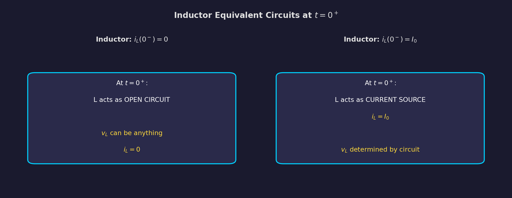
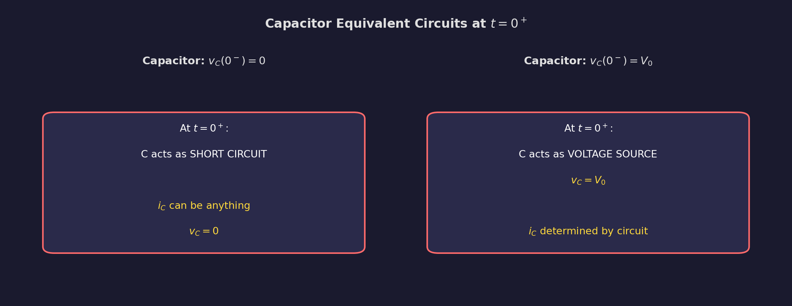
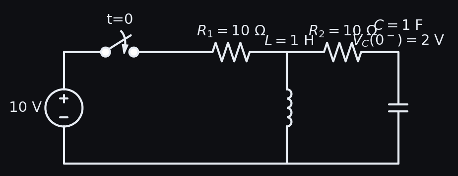
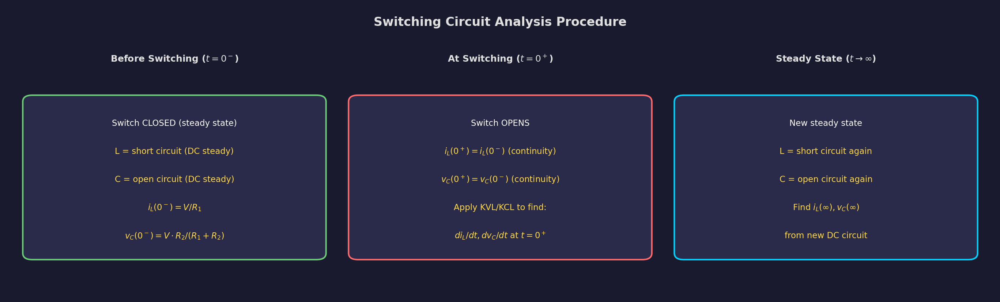

# Chapter 2: Initial Conditions in Network Elements

**Electric Circuit Theory (EE 501) -- Tribhuvan University, IOE**
**Lecture Hours: 4 | Weightage: ~10-12 marks**

---

## Table of Contents

1. [Why Initial Conditions Matter](#1-why-initial-conditions-matter)
2. [Element Characteristics and Memory](#2-element-characteristics-and-memory)
3. [Continuity Conditions](#3-continuity-conditions)
4. [Equivalent Circuits at t = 0+](#4-equivalent-circuits-at-t--0)
5. [Systematic Procedure for Finding Initial Conditions](#5-systematic-procedure-for-finding-initial-conditions)
6. [Finding Derivatives at t = 0+](#6-finding-derivatives-at-t--0)
7. [Higher Order Derivatives](#7-higher-order-derivatives)
8. [RLC Networks: Multiple Energy Storage Elements](#8-rlc-networks-multiple-energy-storage-elements)
9. [Worked Solutions](#9-worked-solutions)
10. [Quick Reference Formula Box](#10-quick-reference-formula-box)
11. [Common Mistakes and Exam Tips](#11-common-mistakes-and-exam-tips)

---

## 1. Why Initial Conditions Matter

When a switch operates in a circuit (opens or closes), the circuit topology changes instantaneously. The behavior of the circuit immediately after the switching event depends on the **energy stored** in inductors and capacitors before the switch operated.

Initial conditions are essential for:
- Solving differential equations that describe circuit transients (Chapter 3)
- Determining the complete response of a circuit
- Evaluating constants of integration in the general solution

**Time Reference:**
- $t = 0^-$ : The instant just before the switch operates
- $t = 0$ : The instant the switch operates
- $t = 0^+$ : The instant just after the switch operates

The transition from $t = 0^-$ to $t = 0^+$ is **instantaneous** -- no time elapses. Yet, some circuit quantities may change abruptly while others must remain continuous.

---

## 2. Element Characteristics and Memory

### 2.1 Resistor (No Memory)

The voltage-current relationship for a resistor is:

$$v_R(t) = R \cdot i_R(t)$$

This is a **purely algebraic** (memoryless) relationship. The resistor has **no energy storage** and therefore no memory. The voltage and current through a resistor can change instantaneously without any constraint.

- $v_R(0^+)$ need NOT equal $v_R(0^-)$
- $i_R(0^+)$ need NOT equal $i_R(0^-)$

### 2.2 Inductor (Current Memory)

The voltage-current relationship for an inductor is:

$$v_L(t) = L \frac{di_L}{dt}$$

$$i_L(t) = \frac{1}{L}\int_{-\infty}^{t} v_L(\tau)\,d\tau$$

The inductor stores energy in its magnetic field:

$$W_L = \frac{1}{2}L\,i_L^2$$

**Key Property:** The current through an inductor cannot change instantaneously because that would require infinite voltage ($v_L = L \cdot di_L/dt \to \infty$) and infinite energy transfer.

$$\boxed{i_L(0^+) = i_L(0^-)}$$

This is the **current continuity condition** for an inductor.

> **Physical Reasoning:** The energy stored in an inductor is $\frac{1}{2}Li^2$. An instantaneous change in current would require an instantaneous change in energy, which would require infinite power. Since infinite power is physically impossible, the current must be continuous.

However, **the voltage across an inductor CAN change instantaneously**. There is no energy argument that prevents $v_L$ from jumping.

### 2.3 Capacitor (Voltage Memory)

The voltage-current relationship for a capacitor is:

$$i_C(t) = C \frac{dv_C}{dt}$$

$$v_C(t) = \frac{1}{C}\int_{-\infty}^{t} i_C(\tau)\,d\tau$$

The capacitor stores energy in its electric field:

$$W_C = \frac{1}{2}C\,v_C^2$$

**Key Property:** The voltage across a capacitor cannot change instantaneously because that would require infinite current ($i_C = C \cdot dv_C/dt \to \infty$) and infinite energy transfer.

$$\boxed{v_C(0^+) = v_C(0^-)}$$

This is the **voltage continuity condition** for a capacitor.

However, **the current through a capacitor CAN change instantaneously**.

### 2.4 Summary Table

| Element | Stored Energy | Continuous Quantity | Can Jump |
|---------|--------------|--------------------|--------------------|
| Resistor $R$ | None | Nothing | Both $v_R$ and $i_R$ |
| Inductor $L$ | $\frac{1}{2}Li_L^2$ | $i_L(0^+) = i_L(0^-)$ | $v_L$ can jump |
| Capacitor $C$ | $\frac{1}{2}Cv_C^2$ | $v_C(0^+) = v_C(0^-)$ | $i_C$ can jump |

> **Exam Tip:** The fundamental principle is simple -- **energy cannot change instantaneously**. Since $W_L \propto i_L^2$ and $W_C \propto v_C^2$, inductor current and capacitor voltage must be continuous. Everything else follows from this.

---

## 3. Continuity Conditions

### 3.1 Formal Statement

For any circuit undergoing a switching event at $t = 0$:

1. **Inductor current continuity:**

$$i_L(0^+) = i_L(0^-)$$

2. **Capacitor voltage continuity:**

$$v_C(0^+) = v_C(0^-)$$

These two conditions are the **only** constraints that bridge the pre-switching and post-switching circuits.

### 3.2 What About Inductor Voltage and Capacitor Current?

The voltage across an inductor and the current through a capacitor are determined by the circuit topology **at $t = 0^+$** (the post-switching circuit). They are NOT constrained by their pre-switching values.

$$v_L(0^+) \neq v_L(0^-) \quad \text{(in general)}$$

$$i_C(0^+) \neq i_C(0^-) \quad \text{(in general)}$$

### 3.3 Special Case: Inductor with Zero Initial Current

If $i_L(0^-) = 0$, then $i_L(0^+) = 0$. At $t = 0^+$, the inductor behaves like an **open circuit** (zero current flows through it).

### 3.4 Special Case: Capacitor with Zero Initial Voltage

If $v_C(0^-) = 0$, then $v_C(0^+) = 0$. At $t = 0^+$, the capacitor behaves like a **short circuit** (zero voltage across it).

---

## 4. Equivalent Circuits at $t = 0^+$

To analyze the circuit at $t = 0^+$, we replace each energy storage element with an appropriate equivalent.

### 4.1 Inductor at $t = 0^+$

*Figure 2.1: Inductor equivalent circuits at $t = 0^+$.*

**Case 1: $i_L(0^-) = I_0 \neq 0$ (Non-zero initial current)**

The inductor is replaced by a **current source** of value $I_0$ in the direction of the initial current.

$$i_L(0^+) = I_0$$

This current source forces the current $I_0$ to flow through the inductor branch, regardless of the voltage across it. Once you determine $v_L(0^+)$ from the circuit, you can find:

$$\frac{di_L}{dt}\bigg|_{t=0^+} = \frac{v_L(0^+)}{L}$$

**Case 2: $i_L(0^-) = 0$ (Zero initial current)**

The inductor is replaced by an **open circuit**.

$$i_L(0^+) = 0$$

### 4.2 Capacitor at $t = 0^+$

*Figure 2.2: Capacitor equivalent circuits at $t = 0^+$.*

**Case 1: $v_C(0^-) = V_0 \neq 0$ (Non-zero initial voltage)**

The capacitor is replaced by a **voltage source** of value $V_0$ with the same polarity as the initial voltage.

$$v_C(0^+) = V_0$$

This voltage source forces the voltage $V_0$ across the capacitor terminals, regardless of the current through it. Once you determine $i_C(0^+)$ from the circuit, you can find:

$$\frac{dv_C}{dt}\bigg|_{t=0^+} = \frac{i_C(0^+)}{C}$$

**Case 2: $v_C(0^-) = 0$ (Zero initial voltage)**

The capacitor is replaced by a **short circuit**.

$$v_C(0^+) = 0$$

### 4.3 Summary of Equivalent Circuits

| Element | Initial Condition | Equivalent at $t = 0^+$ |
|---------|------------------|------------------------|
| Inductor $L$ | $i_L(0^-) = I_0 \neq 0$ | Current source $I_0$ |
| Inductor $L$ | $i_L(0^-) = 0$ | Open circuit |
| Capacitor $C$ | $v_C(0^-) = V_0 \neq 0$ | Voltage source $V_0$ |
| Capacitor $C$ | $v_C(0^-) = 0$ | Short circuit |

> **Memory Aid:**
> - **Inductor** remembers its **current** $\Rightarrow$ modeled as a **current** source
> - **Capacitor** remembers its **voltage** $\Rightarrow$ modeled as a **voltage** source
> - Zero memory $\Rightarrow$ blocks the relevant quantity (open for zero current, short for zero voltage)

---

## 5. Systematic Procedure for Finding Initial Conditions

### Step-by-Step Procedure

**Step 1: Analyze the circuit at $t = 0^-$ (before switching).**

- Assume the circuit has been in this state for a long time (steady state).
- For DC circuits at steady state:
  - Inductor $\to$ short circuit (zero voltage across it, since $v_L = L \cdot di/dt = 0$ in steady state)
  - Capacitor $\to$ open circuit (zero current through it, since $i_C = C \cdot dv/dt = 0$ in steady state)
- Solve this simplified circuit to find $i_L(0^-)$ and $v_C(0^-)$.

**Step 2: Apply continuity conditions.**

$$i_L(0^+) = i_L(0^-)$$
$$v_C(0^+) = v_C(0^-)$$

**Step 3: Draw the circuit at $t = 0^+$ (after switching).**

- Apply the new circuit topology (switch opened or closed).
- Replace inductors and capacitors with their $t = 0^+$ equivalents:
  - Inductor with $i_L(0^+) = I_0 \to$ current source $I_0$
  - Inductor with $i_L(0^+) = 0 \to$ open circuit
  - Capacitor with $v_C(0^+) = V_0 \to$ voltage source $V_0$
  - Capacitor with $v_C(0^+) = 0 \to$ short circuit

**Step 4: Solve the $t = 0^+$ circuit.**

- Use standard circuit analysis (KVL, KCL, mesh, nodal) to find all desired voltages and currents at $t = 0^+$.
- Particularly find $v_L(0^+)$ and $i_C(0^+)$ since these are needed for derivatives.

**Step 5: Find first derivatives (if required).**

$$\frac{di_L}{dt}\bigg|_{0^+} = \frac{v_L(0^+)}{L}$$

$$\frac{dv_C}{dt}\bigg|_{0^+} = \frac{i_C(0^+)}{C}$$

**Step 6: Find higher-order derivatives (if required).**

See Section 7.

---

## 6. Finding Derivatives at $t = 0^+$

### 6.1 First Derivatives

The first derivatives of inductor current and capacitor voltage are obtained directly from the element equations:

$$\boxed{\frac{di_L}{dt}\bigg|_{0^+} = \frac{v_L(0^+)}{L}}$$

$$\boxed{\frac{dv_C}{dt}\bigg|_{0^+} = \frac{i_C(0^+)}{C}}$$

For resistors, the derivative of voltage and current are related by:

$$\frac{dv_R}{dt}\bigg|_{0^+} = R \cdot \frac{di_R}{dt}\bigg|_{0^+}$$

### 6.2 Finding $v_L(0^+)$ and $i_C(0^+)$

To find the voltage across the inductor at $t = 0^+$:
1. Draw the $t = 0^+$ equivalent circuit.
2. The inductor is a current source $I_0$. Apply KVL around the loop containing the inductor, or use nodal analysis, to find $v_L(0^+)$.

To find the current through the capacitor at $t = 0^+$:
1. Draw the $t = 0^+$ equivalent circuit.
2. The capacitor is a voltage source $V_0$. Apply KCL at the node where the capacitor connects, or use mesh analysis, to find $i_C(0^+)$.

### 6.3 Derivatives of Other Circuit Quantities

For any other voltage or current in the circuit, use the circuit relationships. For example, if $v_R = R \cdot i_R$ and $i_R$ flows through an inductor:

$$\frac{dv_R}{dt}\bigg|_{0^+} = R \cdot \frac{di_L}{dt}\bigg|_{0^+} = R \cdot \frac{v_L(0^+)}{L}$$

If a current is the sum of two branch currents, $i = i_1 + i_2$:

$$\frac{di}{dt}\bigg|_{0^+} = \frac{di_1}{dt}\bigg|_{0^+} + \frac{di_2}{dt}\bigg|_{0^+}$$

---

## 7. Higher Order Derivatives

### 7.1 Second Derivatives

To find second derivatives like $\frac{d^2 i_L}{dt^2}\bigg|_{0^+}$, we need $\frac{dv_L}{dt}\bigg|_{0^+}$:

$$\frac{d^2 i_L}{dt^2}\bigg|_{0^+} = \frac{1}{L}\frac{dv_L}{dt}\bigg|_{0^+}$$

Similarly:

$$\frac{d^2 v_C}{dt^2}\bigg|_{0^+} = \frac{1}{C}\frac{di_C}{dt}\bigg|_{0^+}$$

### 7.2 Procedure for Second Derivatives

The challenge is finding $\frac{dv_L}{dt}\bigg|_{0^+}$ or $\frac{di_C}{dt}\bigg|_{0^+}$. This requires:

1. Write an expression for $v_L(t)$ or $i_C(t)$ in terms of other circuit variables using KVL/KCL.
2. Differentiate this expression with respect to time.
3. Evaluate at $t = 0^+$ using the first derivatives already computed.

**Example:** If by KVL: $v_L = V_s - Ri_L - v_C$, then:

$$\frac{dv_L}{dt} = \frac{dV_s}{dt} - R\frac{di_L}{dt} - \frac{dv_C}{dt}$$

Evaluate at $t = 0^+$:

$$\frac{dv_L}{dt}\bigg|_{0^+} = \frac{dV_s}{dt}\bigg|_{0^+} - R \cdot \frac{v_L(0^+)}{L} - \frac{i_C(0^+)}{C}$$

Then:

$$\frac{d^2 i_L}{dt^2}\bigg|_{0^+} = \frac{1}{L}\frac{dv_L}{dt}\bigg|_{0^+}$$

### 7.3 General Pattern for $n$-th Order Derivatives

For the $n$-th derivative of inductor current:

$$\frac{d^n i_L}{dt^n}\bigg|_{0^+} = \frac{1}{L}\frac{d^{n-1} v_L}{dt^{n-1}}\bigg|_{0^+}$$

For the $n$-th derivative of capacitor voltage:

$$\frac{d^n v_C}{dt^n}\bigg|_{0^+} = \frac{1}{C}\frac{d^{n-1} i_C}{dt^{n-1}}\bigg|_{0^+}$$

Each successive derivative requires knowledge of the previous one. The process is systematic but increasingly tedious.

> **Exam Tip:** IOE exams typically ask for derivatives up to second order. Rarely do they go beyond that. The key is to methodically write KVL/KCL equations, differentiate, and substitute known values.

---

## 8. RLC Networks: Multiple Energy Storage Elements

### 8.1 Circuits with Both L and C

When a circuit contains both inductors and capacitors, both continuity conditions apply simultaneously:

$$i_L(0^+) = i_L(0^-) \quad \text{AND} \quad v_C(0^+) = v_C(0^-)$$

At $t = 0^+$, both the inductor (current source) and capacitor (voltage source) must be included in the equivalent circuit.

### 8.2 Multiple Inductors and/or Capacitors

For circuits with multiple energy storage elements:
- Each inductor provides a current continuity condition
- Each capacitor provides a voltage continuity condition
- All conditions are applied simultaneously
- The $t = 0^+$ circuit has multiple sources (current sources for inductors, voltage sources for capacitors)

### 8.3 Coupled Circuits

If there are $n$ inductors and $m$ capacitors, you need:
- $n$ initial current values: $i_{L_1}(0^-), i_{L_2}(0^-), \ldots, i_{L_n}(0^-)$
- $m$ initial voltage values: $v_{C_1}(0^-), v_{C_2}(0^-), \ldots, v_{C_m}(0^-)$

These provide $n + m$ constraints that completely determine the initial state.

### 8.4 Inductor and Capacitor in Series

When $L$ and $C$ are in series, the same current flows through both. The initial conditions are:
- $i_L(0^+) = i_L(0^-)$ determines the initial current in the series branch
- $v_C(0^+) = v_C(0^-)$ determines the initial voltage across the capacitor
- These two independently constrain the series combination

### 8.5 Inductor and Capacitor in Parallel

When $L$ and $C$ are in parallel, the same voltage appears across both. The initial conditions are:
- $v_C(0^+) = v_C(0^-)$ determines the voltage across the parallel combination
- $i_L(0^+) = i_L(0^-)$ determines the current through the inductor branch
- The current through the capacitor is then determined by KCL

---

## 9. Worked Solutions

### Worked Solution Q1: RLC Circuit with Switch Closing

**Problem:** In the circuit shown, the switch closes at $t = 0$. The DC source is $V_s = 10\,\text{V}$, the inductor is $L = 1\,\text{H}$, the capacitor is $C = 1\,\text{F}$ with initial voltage $v_C(0^-) = 2\,\text{V}$, and there are two $10\,\Omega$ resistors $R_1$ and $R_2$.

Circuit description: $V_s = 10\,\text{V}$ in series with $R_1 = 10\,\Omega$ and the switch. After the switch, the circuit splits into two branches in parallel: Branch 1 has $L = 1\,\text{H}$ carrying current $i_1$, and Branch 2 has $R_2 = 10\,\Omega$ in series with $C = 1\,\text{F}$ carrying current $i_2$. The total current from the source is $i = i_1 + i_2$.

Find at $t = 0^+$:
(a) $i_1(0^+)$ and $i_2(0^+)$
(b) $\frac{di_1}{dt}\bigg|_{0^+}$ and $\frac{di_2}{dt}\bigg|_{0^+}$
(c) $\frac{d^2 i_2}{dt^2}\bigg|_{0^+}$

**Solution:**

**Step 1: Analyze at $t = 0^-$ (before switch closes).**

Before the switch closes, no current flows (the circuit is open):

$$i_1(0^-) = 0, \quad i_2(0^-) = 0, \quad i(0^-) = 0$$

$$i_L(0^-) = i_1(0^-) = 0$$

$$v_C(0^-) = 2\,\text{V} \quad \text{(given)}$$

**Step 2: Apply continuity conditions.**

$$i_L(0^+) = i_L(0^-) = 0 \quad \Rightarrow \quad \boxed{i_1(0^+) = 0}$$

$$v_C(0^+) = v_C(0^-) = 2\,\text{V}$$

**Step 3: Draw $t = 0^+$ equivalent circuit.**

- Inductor ($i_L = 0$): Replace with **open circuit**
- Capacitor ($v_C = 2\,\text{V}$): Replace with **voltage source of 2V**

The $t = 0^+$ circuit: $V_s = 10\,\text{V}$ in series with $R_1 = 10\,\Omega$. Since the inductor branch is open, all current flows through the $R_2$-$C$ branch.

*Figure 2.3: Circuit at $t = 0^+$ with inductor replaced by open circuit and capacitor replaced by 2V source.*

**Step 4: Solve $t = 0^+$ circuit.**

Since $i_1(0^+) = 0$ (inductor is open), all current goes through the $R_2$-$C$ branch:

By KVL around the outer loop:

$$V_s - R_1 \cdot i_2(0^+) - R_2 \cdot i_2(0^+) - v_C(0^+) = 0$$

$$10 - 10 \cdot i_2 - 10 \cdot i_2 - 2 = 0$$

$$8 = 20 \cdot i_2$$

$$\boxed{i_2(0^+) = 0.4\,\text{A}}$$

Total current: $i(0^+) = i_1(0^+) + i_2(0^+) = 0 + 0.4 = 0.4\,\text{A}$

**Step 5: Find voltage across inductor at $t = 0^+$.**

The voltage across the inductor equals the voltage across the $R_2$-$C$ series combination (since they are in parallel):

$$v_L(0^+) = R_2 \cdot i_2(0^+) + v_C(0^+) = 10 \times 0.4 + 2 = 6\,\text{V}$$

**Step 6: Find first derivatives.**

$$\boxed{\frac{di_1}{dt}\bigg|_{0^+} = \frac{v_L(0^+)}{L} = \frac{6}{1} = 6\,\text{A/s}}$$

For $i_2$, we need $\frac{di_2}{dt}\bigg|_{0^+}$. Using the current through the capacitor:

$$i_C(0^+) = i_2(0^+) = 0.4\,\text{A}$$

$$\frac{dv_C}{dt}\bigg|_{0^+} = \frac{i_C(0^+)}{C} = \frac{0.4}{1} = 0.4\,\text{V/s}$$

Now write KVL for the loop containing $V_s$, $R_1$, $R_2$, and $C$:

$$V_s = R_1(i_1 + i_2) + R_2 \cdot i_2 + v_C$$

Differentiate with respect to $t$:

$$0 = R_1\left(\frac{di_1}{dt} + \frac{di_2}{dt}\right) + R_2 \frac{di_2}{dt} + \frac{dv_C}{dt}$$

At $t = 0^+$:

$$0 = 10(6 + \frac{di_2}{dt}\bigg|_{0^+}) + 10 \cdot \frac{di_2}{dt}\bigg|_{0^+} + 0.4$$

$$0 = 60 + 10\frac{di_2}{dt}\bigg|_{0^+} + 10\frac{di_2}{dt}\bigg|_{0^+} + 0.4$$

$$0 = 60.4 + 20\frac{di_2}{dt}\bigg|_{0^+}$$

$$\boxed{\frac{di_2}{dt}\bigg|_{0^+} = -\frac{60.4}{20} = -3.02\,\text{A/s}}$$

The negative sign indicates $i_2$ is initially decreasing (the capacitor is charging, building up voltage that opposes current flow).

**Step 7: Find second derivative $\frac{d^2 i_2}{dt^2}\bigg|_{0^+}$.**

Differentiate the KVL equation again:

$$0 = R_1\left(\frac{d^2 i_1}{dt^2} + \frac{d^2 i_2}{dt^2}\right) + R_2 \frac{d^2 i_2}{dt^2} + \frac{d^2 v_C}{dt^2}$$

We need:

$\frac{d^2 i_1}{dt^2}\bigg|_{0^+}$: From the inductor, $\frac{di_1}{dt} = v_L / L$. So:

$$\frac{d^2 i_1}{dt^2} = \frac{1}{L}\frac{dv_L}{dt}$$

Since $v_L = R_2 i_2 + v_C$ (the voltage across the parallel branch):

$$\frac{dv_L}{dt} = R_2 \frac{di_2}{dt} + \frac{dv_C}{dt}$$

At $t = 0^+$:

$$\frac{dv_L}{dt}\bigg|_{0^+} = 10 \times (-3.02) + 0.4 = -30.2 + 0.4 = -29.8\,\text{V/s}$$

$$\frac{d^2 i_1}{dt^2}\bigg|_{0^+} = \frac{-29.8}{1} = -29.8\,\text{A/s}^2$$

$\frac{d^2 v_C}{dt^2}\bigg|_{0^+}$: Since $\frac{dv_C}{dt} = i_2/C$:

$$\frac{d^2 v_C}{dt^2} = \frac{1}{C}\frac{di_2}{dt}$$

At $t = 0^+$:

$$\frac{d^2 v_C}{dt^2}\bigg|_{0^+} = \frac{-3.02}{1} = -3.02\,\text{V/s}^2$$

Substituting into the second derivative of KVL:

$$0 = 10(-29.8 + \frac{d^2 i_2}{dt^2}\bigg|_{0^+}) + 10 \cdot \frac{d^2 i_2}{dt^2}\bigg|_{0^+} + (-3.02)$$

$$0 = -298 + 10\frac{d^2 i_2}{dt^2}\bigg|_{0^+} + 10\frac{d^2 i_2}{dt^2}\bigg|_{0^+} - 3.02$$

$$0 = -301.02 + 20\frac{d^2 i_2}{dt^2}\bigg|_{0^+}$$

$$\boxed{\frac{d^2 i_2}{dt^2}\bigg|_{0^+} = \frac{301.02}{20} = 15.05\,\text{A/s}^2}$$

**Summary of Results:**

| Quantity | Value at $t = 0^+$ |
|----------|-------------------|
| $i_1(0^+)$ | $0\,\text{A}$ |
| $i_2(0^+)$ | $0.4\,\text{A}$ |
| $di_1/dt$ | $6\,\text{A/s}$ |
| $di_2/dt$ | $-3.02\,\text{A/s}$ |
| $d^2 i_2/dt^2$ | $15.05\,\text{A/s}^2$ |

---

### Worked Solution Q2: Circuit with Two Inductors and a Capacitor

**Problem:** In the circuit below, the switch closes at $t = 0$. Given: $V_s = 100\,\text{V}$, $R_1 = R_2 = 10\,\Omega$, $L_1 = L_2 = 2\,\text{H}$, $C = 2\,\text{F}$. Before the switch closes, no energy is stored in any element.

Circuit: $V_s$ in series with the switch and $R_1$. After $R_1$, the circuit splits: Branch 1 has $L_1$ with current $i_1$. Branch 2 has $R_2$, $L_2$, and $C$ all in series with current $i_2$.

Find at $t = 0^+$: $i_1$, $i_2$, $i_1'$, $i_2'$, and $i_1''$.

**Solution:**

**Step 1: Initial conditions at $t = 0^-$.**

No energy stored, so:

$$i_{L_1}(0^-) = 0, \quad i_{L_2}(0^-) = 0, \quad v_C(0^-) = 0$$

**Step 2: Continuity conditions.**

$$i_{L_1}(0^+) = i_{L_1}(0^-) = 0 \quad \Rightarrow \quad \boxed{i_1(0^+) = 0}$$

$$i_{L_2}(0^+) = i_{L_2}(0^-) = 0 \quad \Rightarrow \quad \boxed{i_2(0^+) = 0}$$

$$v_C(0^+) = v_C(0^-) = 0$$

**Step 3: Equivalent circuit at $t = 0^+$.**

- $L_1$ ($i = 0$): Open circuit
- $L_2$ ($i = 0$): Open circuit
- $C$ ($v = 0$): Short circuit

Since both inductor branches are open circuits, **no current flows** at $t = 0^+$:

$$i(0^+) = i_1(0^+) + i_2(0^+) = 0 + 0 = 0$$

**Step 4: Find voltages across inductors at $t = 0^+$.**

Since $i_1(0^+) = i_2(0^+) = 0$:

Voltage drop across $R_1$: $v_{R_1}(0^+) = R_1 \times i(0^+) = 10 \times 0 = 0$

Voltage across the parallel combination: $v_{ab}(0^+) = V_s - v_{R_1}(0^+) = 100 - 0 = 100\,\text{V}$

For Branch 1 (just $L_1$):

$$v_{L_1}(0^+) = v_{ab}(0^+) = 100\,\text{V}$$

For Branch 2 ($R_2 + L_2 + C$ in series, with $C$ as short circuit):

$$v_{ab}(0^+) = R_2 \cdot i_2(0^+) + v_{L_2}(0^+) + v_C(0^+)$$

$$100 = 10 \times 0 + v_{L_2}(0^+) + 0$$

$$v_{L_2}(0^+) = 100\,\text{V}$$

**Step 5: Find first derivatives.**

$$\boxed{i_1'(0^+) = \frac{di_1}{dt}\bigg|_{0^+} = \frac{v_{L_1}(0^+)}{L_1} = \frac{100}{2} = 50\,\text{A/s}}$$

$$\boxed{i_2'(0^+) = \frac{di_2}{dt}\bigg|_{0^+} = \frac{v_{L_2}(0^+)}{L_2} = \frac{100}{2} = 50\,\text{A/s}}$$

**Step 6: Find second derivative $i_1''(0^+)$.**

We need $\frac{dv_{L_1}}{dt}\bigg|_{0^+}$.

By KVL, $v_{L_1} = V_s - R_1(i_1 + i_2)$, so:

$$\frac{dv_{L_1}}{dt} = -R_1\left(\frac{di_1}{dt} + \frac{di_2}{dt}\right)$$

At $t = 0^+$:

$$\frac{dv_{L_1}}{dt}\bigg|_{0^+} = -10(50 + 50) = -1000\,\text{V/s}$$

But wait -- we also need to check that $v_{L_1} = v_{ab}$ and $v_{ab}$ depends on branch 2 as well. Let us be more careful.

Since branches 1 and 2 are in parallel: $v_{L_1} = v_{ab}$.

For the outer loop: $V_s = R_1 \cdot i + v_{ab}$ where $i = i_1 + i_2$.

$$v_{ab} = V_s - R_1(i_1 + i_2)$$

$$\frac{dv_{ab}}{dt} = -R_1\left(\frac{di_1}{dt} + \frac{di_2}{dt}\right)$$

$$\frac{dv_{ab}}{dt}\bigg|_{0^+} = -10(50 + 50) = -1000\,\text{V/s}$$

Since $v_{L_1} = v_{ab}$:

$$\frac{dv_{L_1}}{dt}\bigg|_{0^+} = -1000\,\text{V/s}$$

Therefore:

$$\boxed{i_1''(0^+) = \frac{d^2 i_1}{dt^2}\bigg|_{0^+} = \frac{1}{L_1}\frac{dv_{L_1}}{dt}\bigg|_{0^+} = \frac{-1000}{2} = -500\,\text{A/s}^2}$$

**Summary of Results:**

| Quantity | Value at $t = 0^+$ |
|----------|-------------------|
| $i_1(0^+)$ | $0\,\text{A}$ |
| $i_2(0^+)$ | $0\,\text{A}$ |
| $i_1'(0^+)$ | $50\,\text{A/s}$ |
| $i_2'(0^+)$ | $50\,\text{A/s}$ |
| $i_1''(0^+)$ | $-500\,\text{A/s}^2$ |

---

### Worked Solution Q3: Two Inductors with Different Initial Currents

**Problem:** In a circuit, two inductors $L_1 = 2\,\text{mH}$ and $L_2 = 6\,\text{mH}$ are connected in series with resistors $R_1 = 10\,\text{k}\Omega$ and $R_2 = 5\,\text{k}\Omega$ respectively. The initial current through $L_1$ is $i_{L_1}(0) = 2\,\text{A}$. A switch opens at $t = 0$. Find all initial values and derivatives.

**Solution Approach:**

**Step 1: Identify what is known at $t = 0^-$.**

Given: $i_{L_1}(0^-) = 2\,\text{A}$.

If $L_1$ and $L_2$ are in series, the same current flows through both:

$$i_{L_2}(0^-) = i_{L_1}(0^-) = 2\,\text{A}$$

**Step 2: Apply continuity.**

$$i_{L_1}(0^+) = i_{L_1}(0^-) = 2\,\text{A}$$

$$i_{L_2}(0^+) = i_{L_2}(0^-) = 2\,\text{A}$$

**Step 3: Draw $t = 0^+$ circuit.**

After the switch opens, the circuit topology changes. Both inductors are modeled as $2\,\text{A}$ current sources. Since they are in series, the current through the series path remains $2\,\text{A}$.

The exact voltage across each element depends on the specific circuit topology after switching. Assuming the switch creates a new path (e.g., the inductors now discharge through their respective resistors):

**Step 4: Find voltages at $t = 0^+$.**

If $L_1$ discharges through $R_1$:

$$v_{L_1}(0^+) = -i_{L_1}(0^+) \times R_1 = -2 \times 10000 = -20\,\text{kV}$$

(Negative sign indicates the inductor voltage opposes the decaying current.)

If $L_2$ discharges through $R_2$:

$$v_{L_2}(0^+) = -i_{L_2}(0^+) \times R_2 = -2 \times 5000 = -10\,\text{kV}$$

> **Note:** These large voltages are physically realistic and demonstrate why opening an inductive circuit is dangerous. The inductor tries to maintain current by producing a very large voltage -- this is the principle behind ignition coils and arc generation in switches.

**Step 5: First derivatives.**

$$\frac{di_{L_1}}{dt}\bigg|_{0^+} = \frac{v_{L_1}(0^+)}{L_1} = \frac{-20000}{0.002} = -10 \times 10^6\,\text{A/s} = -10\,\text{MA/s}$$

$$\frac{di_{L_2}}{dt}\bigg|_{0^+} = \frac{v_{L_2}(0^+)}{L_2} = \frac{-10000}{0.006} = -1.667 \times 10^6\,\text{A/s} \approx -1.67\,\text{MA/s}$$

**Step 6: Higher derivatives follow the same pattern.**

Use KVL to express $v_L$ in terms of circuit variables, differentiate, and evaluate.

**Key Observations:**

- The large values of $dv/dt$ and $di/dt$ at $t = 0^+$ are characteristic of circuits with small $L$ and large $R$.
- The time constants are very small: $\tau_1 = L_1/R_1 = 0.002/10000 = 0.2\,\mu\text{s}$, $\tau_2 = L_2/R_2 = 0.006/5000 = 1.2\,\mu\text{s}$.
- The circuit response decays very rapidly.

---

## 10. Quick Reference Formula Box

### Continuity Conditions

$$\boxed{i_L(0^+) = i_L(0^-)} \qquad \boxed{v_C(0^+) = v_C(0^-)}$$

### Equivalent Circuits at $t = 0^+$

| Condition | Element | Equivalent |
|-----------|---------|-----------|
| $i_L(0^-) = I_0 \neq 0$ | Inductor | Current source $I_0$ |
| $i_L(0^-) = 0$ | Inductor | Open circuit |
| $v_C(0^-) = V_0 \neq 0$ | Capacitor | Voltage source $V_0$ |
| $v_C(0^-) = 0$ | Capacitor | Short circuit |

### Steady State (DC, $t \to \infty$)

| Element | DC Steady State |
|---------|----------------|
| Inductor | Short circuit ($v_L = 0$) |
| Capacitor | Open circuit ($i_C = 0$) |

### Derivative Formulas

$$\frac{di_L}{dt}\bigg|_{0^+} = \frac{v_L(0^+)}{L} \qquad \frac{dv_C}{dt}\bigg|_{0^+} = \frac{i_C(0^+)}{C}$$

$$\frac{d^2 i_L}{dt^2}\bigg|_{0^+} = \frac{1}{L}\frac{dv_L}{dt}\bigg|_{0^+} \qquad \frac{d^2 v_C}{dt^2}\bigg|_{0^+} = \frac{1}{C}\frac{di_C}{dt}\bigg|_{0^+}$$

### Resistor Relationship (Always Valid)

$$v_R(t) = R \cdot i_R(t) \qquad \frac{dv_R}{dt} = R \cdot \frac{di_R}{dt}$$

### Procedure Checklist

1. Find $i_L(0^-)$ and $v_C(0^-)$ from the DC steady-state circuit (L = short, C = open)
2. Apply: $i_L(0^+) = i_L(0^-)$, $v_C(0^+) = v_C(0^-)$
3. Draw $t = 0^+$ circuit with equivalent sources
4. Solve for all $t = 0^+$ values (especially $v_L(0^+)$ and $i_C(0^+)$)
5. Compute first derivatives: $di_L/dt = v_L/L$, $dv_C/dt = i_C/C$
6. For second derivatives: differentiate KVL/KCL, substitute first derivatives

---

## 11. Common Mistakes and Exam Tips

### Common Mistakes

1. **Confusing inductor and capacitor rules:** Students sometimes write $v_L(0^+) = v_L(0^-)$ (wrong!) or $i_C(0^+) = i_C(0^-)$ (wrong!). Remember: **inductors preserve current**, **capacitors preserve voltage**. Nothing else is guaranteed to be continuous.

2. **Forgetting to change circuit topology:** The circuit at $t = 0^+$ has a different topology than at $t = 0^-$ because the switch has operated. Always redraw the circuit.

3. **Wrong steady-state model:** At $t = 0^-$ (DC steady state), inductor = short circuit and capacitor = open circuit. At $t = 0^+$, inductor = current source or open, and capacitor = voltage source or short. Do not confuse these two different models.

4. **Sign errors in derivatives:** Be careful with the sign convention. If KVL gives $v_L = V_s - Ri$, then $di_L/dt = (V_s - Ri)/L$, not $Ri/L$.

5. **Not converting units:** Always convert mH to H, $\mu$F to F, k$\Omega$ to $\Omega$ before calculating derivatives.

6. **Assuming all initial conditions are zero:** Read the problem carefully. If a capacitor has a pre-charged voltage or an inductor carries an initial current, use those values. Do not default to zero.

7. **Ignoring the pre-switching circuit:** Some problems have switches that have been closed for a long time before opening at $t = 0$. You must analyze the pre-switching circuit to find $i_L(0^-)$ and $v_C(0^-)$.

### Exam Tips

1. **Draw three circuits:** (a) at $t = 0^-$ with steady-state models, (b) at $t = 0^+$ with equivalent sources, (c) at $t = \infty$ with steady-state models for the new topology. This helps organize your work.

2. **Tabulate your results:** Create a table with columns for each variable and rows for $t = 0^-$, $t = 0^+$, first derivative, and second derivative. This prevents losing track.

3. **Check your answers:** At $t = 0^+$, verify KVL and KCL are satisfied. The voltages around any loop should sum to zero, and currents at any node should sum to zero.

4. **Time management:** Initial conditions problems typically carry 10-12 marks and take 15-20 minutes. Do not spend excessive time on second derivatives if you are running short.

5. **The derivative chain:** To find $d^n i_L/dt^n$, you need $d^{n-1} v_L/dt^{n-1}$. To find $d^{n-1} v_L/dt^{n-1}$, express $v_L$ via KVL and differentiate $n-1$ times. Each level requires all lower-order derivatives to be known.

6. **Typical question patterns in IOE exams:**
   - Switch closes at $t = 0$ in a DC circuit with R, L, C: Find initial values and first/second derivatives.
   - Two-loop circuit with one inductor and one capacitor: Find all initial conditions.
   - Circuit with pre-charged capacitor: Find currents and their derivatives.

---

## Additional Practice Hints

### Quick Check: Does the Answer Make Physical Sense?

- **Inductor current at $t = 0^+$** should equal its value at $t = 0^-$. If you get a different value, you made an error.
- **Capacitor voltage at $t = 0^+$** should equal its value at $t = 0^-$. Same check.
- **All other quantities** are allowed to jump. Large jumps are physically possible and common.
- **The derivative $di_L/dt$** should be finite (since $v_L$ is finite). If you get infinity, something is wrong.
- **The derivative $dv_C/dt$** should be finite (since $i_C$ is finite). Same check.
- **Power dissipated** at $t = 0^+$ should be non-negative ($P = I^2R \geq 0$ for each resistor).

### Relationship to Chapter 3 (Transients)

The initial conditions found in this chapter serve as the starting point for the transient solutions in Chapter 3:

- For a first-order circuit (one L or one C): You need $i_L(0^+)$ or $v_C(0^+)$ plus the final steady-state value.
- For a second-order circuit (L and C): You need $i_L(0^+)$, $v_C(0^+)$, and their first derivatives $di_L/dt|_{0^+}$, $dv_C/dt|_{0^+}$ to determine the two constants of integration.
- For higher-order circuits: Each order requires one more initial condition (higher derivative).

The accuracy of your transient solution depends entirely on getting the initial conditions right. This is why this chapter is the essential foundation for Chapter 3.

---

## 12. Additional Worked Examples (Short-Answer Type)

### Example A: Charged Capacitor Discharging Through RL

**Problem:** A capacitor $C = 0.5\,\text{F}$ is charged to $v_C(0^-) = 20\,\text{V}$. At $t = 0$, a switch connects it in series with $R = 4\,\Omega$ and $L = 2\,\text{H}$ (initially unenergized). Find all initial conditions.

**Solution:**

At $t = 0^-$: $v_C = 20\,\text{V}$, $i_L = 0$.

Apply continuity:
- $v_C(0^+) = 20\,\text{V}$ (capacitor as 20V voltage source)
- $i_L(0^+) = 0$ (inductor as open circuit)

At $t = 0^+$ equivalent circuit: 20V source in series with $R = 4\,\Omega$ and open circuit (inductor).

Since the inductor is open, $i(0^+) = 0$.

But wait -- the current through the series circuit is the same current through L, C, and R. Since $i_L(0^+) = 0$, no current flows, so:

$$i(0^+) = 0, \quad v_R(0^+) = R \cdot i(0^+) = 0$$

By KVL: $v_C(0^+) = v_R(0^+) + v_L(0^+)$

$$20 = 0 + v_L(0^+) \quad \Rightarrow \quad v_L(0^+) = 20\,\text{V}$$

First derivatives:

$$\frac{di_L}{dt}\bigg|_{0^+} = \frac{v_L(0^+)}{L} = \frac{20}{2} = 10\,\text{A/s}$$

$$\frac{dv_C}{dt}\bigg|_{0^+} = \frac{i_C(0^+)}{C} = \frac{0}{0.5} = 0\,\text{V/s}$$

(Note: $i_C = -i_L$ in this circuit since the capacitor is discharging, so $i_C(0^+) = 0$ as well.)

**Summary:**

| Quantity | Value |
|----------|-------|
| $v_C(0^+)$ | $20\,\text{V}$ |
| $i_L(0^+)$ | $0\,\text{A}$ |
| $i(0^+)$ | $0\,\text{A}$ |
| $v_L(0^+)$ | $20\,\text{V}$ |
| $v_R(0^+)$ | $0\,\text{V}$ |
| $di_L/dt\|_{0^+}$ | $10\,\text{A/s}$ |
| $dv_C/dt\|_{0^+}$ | $0\,\text{V/s}$ |

### Example B: DC Steady State Before Switching

**Problem:** In a circuit with $V_s = 50\,\text{V}$, $R_1 = 10\,\Omega$, $R_2 = 40\,\Omega$, $L = 5\,\text{H}$, $C = 0.1\,\text{F}$: $R_1$ is in series with the source; $R_2$, $L$, and $C$ are all in parallel with each other, connected after $R_1$. The switch has been closed for a very long time. Find the energy stored in each element.

**Solution:**

At DC steady state: $L$ = short circuit, $C$ = open circuit.

Since $L$ is a short circuit, it short-circuits both $R_2$ and $C$ (all three are in parallel). The parallel combination has zero impedance.

The entire source voltage drops across $R_1$: $i = V_s / R_1 = 50/10 = 5\,\text{A}$

All current flows through the inductor (short circuit path): $i_L = 5\,\text{A}$

Voltage across parallel combination: $v_{ab} = 0\,\text{V}$ (short circuit)

Current through $R_2$: $i_{R_2} = v_{ab}/R_2 = 0/40 = 0\,\text{A}$

Voltage across $C$: $v_C = v_{ab} = 0\,\text{V}$

Energy stored:

$$W_L = \frac{1}{2}Li_L^2 = \frac{1}{2}(5)(5)^2 = 62.5\,\text{J}$$

$$W_C = \frac{1}{2}Cv_C^2 = \frac{1}{2}(0.1)(0)^2 = 0\,\text{J}$$

If the switch now opens at $t = 0$:
- $i_L(0^+) = 5\,\text{A}$ (inductor preserves current)
- $v_C(0^+) = 0\,\text{V}$ (capacitor preserves voltage)

These become the initial conditions for the transient analysis of the new circuit.

### Example C: Capacitor Voltage Continuity -- A Subtle Case

**Problem:** Two capacitors $C_1 = 1\,\text{F}$ (charged to $10\,\text{V}$) and $C_2 = 1\,\text{F}$ (uncharged) are connected in parallel by closing a switch at $t = 0$ through a small resistance $R$.

Find $v_{C_1}(0^+)$ and $v_{C_2}(0^+)$.

**Solution:**

This is a frequently misunderstood problem.

At $t = 0^-$: $v_{C_1} = 10\,\text{V}$, $v_{C_2} = 0\,\text{V}$.

Continuity requires: $v_{C_1}(0^+) = v_{C_1}(0^-) = 10\,\text{V}$ and $v_{C_2}(0^+) = v_{C_2}(0^-) = 0\,\text{V}$.

But once connected in parallel, both capacitors must have the same voltage. This apparent contradiction is resolved by noting that charge redistribution happens very quickly (on a timescale proportional to $R \times C_{\text{eq}}$), not instantaneously.

At $t = 0^+$ (the true mathematical instant after switch closure with $R > 0$):
- $v_{C_1}(0^+) = 10\,\text{V}$
- $v_{C_2}(0^+) = 0\,\text{V}$
- The voltage difference drives a large current through $R$: $i(0^+) = (10 - 0)/R = 10/R$

The voltages equalize over time, eventually reaching $v = Q_{\text{total}}/(C_1 + C_2) = (10 \times 1)/(1 + 1) = 5\,\text{V}$.

> **Lesson:** Continuity conditions apply at $t = 0^+$ even if the resulting situation seems physically unusual. The circuit then evolves from those initial conditions according to the differential equations.

---

## 13. Exam Question Frequency Table

| Topic | Frequency | Typical Marks | Difficulty |
|-------|-----------|--------------|------------|
| Finding $i_L(0^+)$ and $v_C(0^+)$ from DC steady state | Very High | 4-6 | Easy |
| Drawing $t = 0^+$ equivalent circuit | Very High | 3-4 | Easy-Medium |
| First derivatives $di_L/dt$, $dv_C/dt$ at $t = 0^+$ | Very High | 4-6 | Medium |
| Second derivatives at $t = 0^+$ | High | 4-6 | Medium-High |
| Complete initial condition problem (all parts) | Very High | 10-12 | Medium |
| Circuits with pre-charged capacitors | High | 10-12 | Medium |
| Circuits with two inductors or two capacitors | Medium | 10-12 | Medium-High |
| Theoretical questions (continuity conditions, why?) | Medium | 3-5 | Easy |
| Equivalent circuit explanation | Medium | 3-5 | Easy |

---

*End of Chapter 2 -- Initial Conditions in Network Elements*
