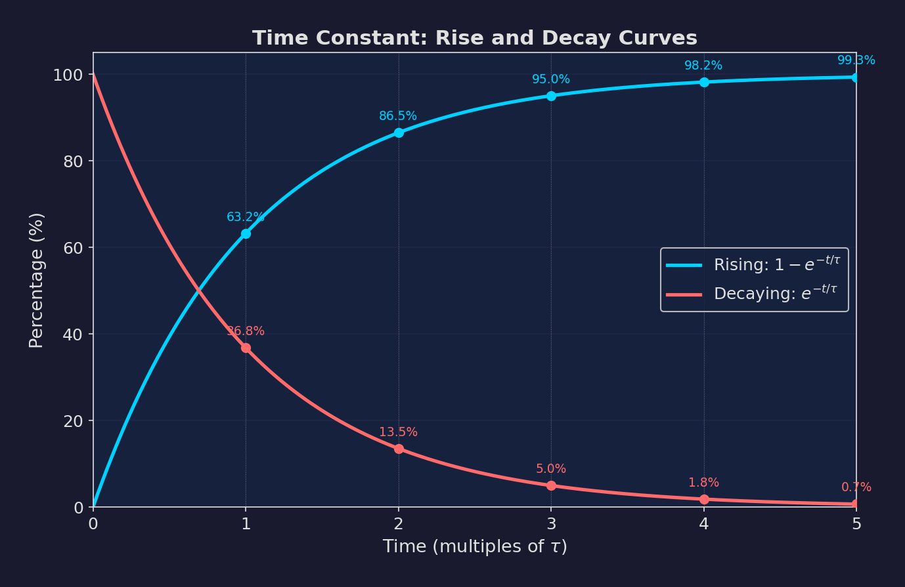
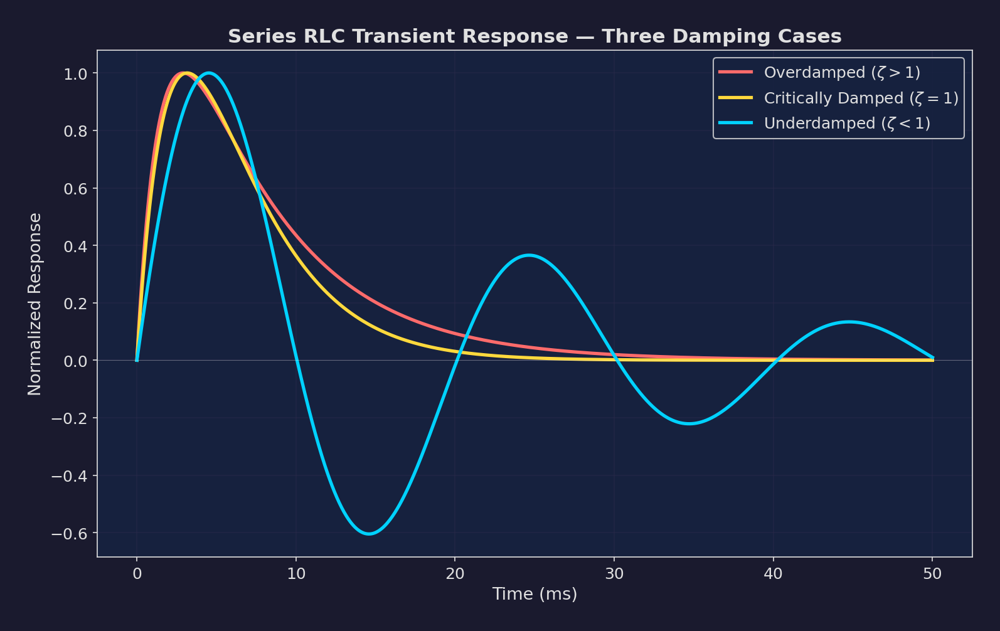
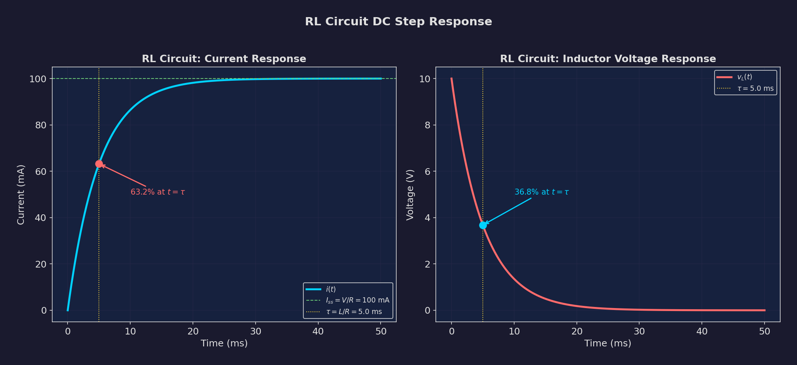
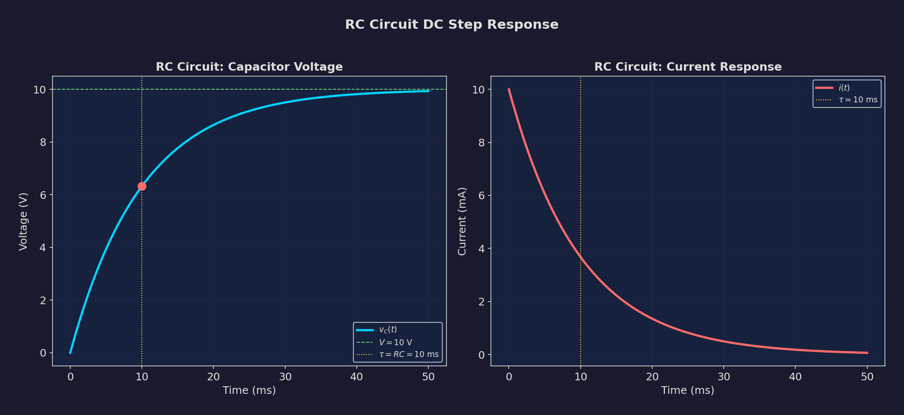
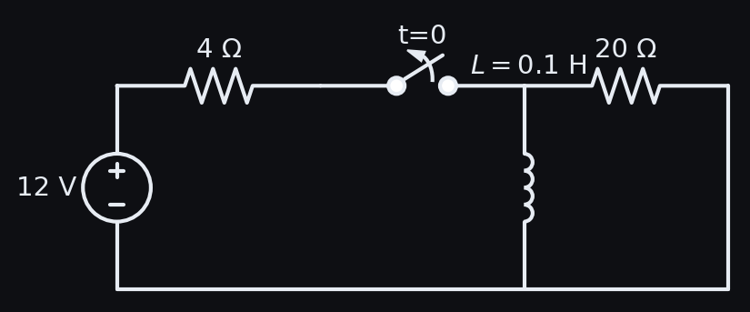

# Chapter 3: Transient Analysis by Direct (Classical) Method

**Electric Circuit Theory (EE 501) -- Tribhuvan University, IOE**
**Lecture Hours: 10 | Weightage: ~18-22 marks**

---

## Table of Contents

1. [Introduction to Transient Analysis](#1-introduction-to-transient-analysis)
2. [First-Order Differential Equations](#2-first-order-differential-equations)
3. [Second-Order Differential Equations](#3-second-order-differential-equations)
4. [Damping Parameters and Classification](#4-damping-parameters-and-classification)
5. [Particular Integrals by Undetermined Coefficients](#5-particular-integrals-by-undetermined-coefficients)
6. [RL Circuit Transient Responses](#6-rl-circuit-transient-responses)
7. [RC Circuit Transient Responses](#7-rc-circuit-transient-responses)
8. [Series RLC Circuit Transient Responses](#8-series-rlc-circuit-transient-responses)
9. [Parallel RLC Circuit Transients](#9-parallel-rlc-circuit-transients)
10. [Worked Solutions](#10-worked-solutions)
11. [Quick Reference Formula Box](#11-quick-reference-formula-box)
12. [Common Mistakes and Exam Tips](#12-common-mistakes-and-exam-tips)

---

## 1. Introduction to Transient Analysis

### 1.1 What is a Transient?

A **transient** is the temporary, time-varying response of a circuit that occurs when the circuit transitions from one steady state to another. Transients are caused by sudden changes such as:

- Closing or opening a switch
- Sudden application or removal of a source
- Abrupt change in source value

The transient eventually dies out (in stable circuits), and the circuit settles into a new steady state.

### 1.2 Complete Response

The complete response of any circuit variable (voltage or current) consists of two parts:

$$\boxed{x(t) = x_h(t) + x_p(t) = x_{\text{transient}}(t) + x_{\text{steady-state}}(t)}$$

where:
- $x_h(t)$ = **homogeneous solution** (complementary function, natural response, transient part): This is the solution to the homogeneous differential equation (source set to zero). It contains the arbitrary constants determined by initial conditions.
- $x_p(t)$ = **particular integral** (forced response, steady-state part): This is any particular solution to the complete differential equation. It has the same form as the forcing function.

The **classical (direct) method** solves the differential equation by:
1. Finding the complementary function $x_h(t)$
2. Finding the particular integral $x_p(t)$
3. Forming the complete solution $x(t) = x_h(t) + x_p(t)$
4. Applying initial conditions to evaluate arbitrary constants

### 1.3 Order of the Differential Equation

The **order** of the governing differential equation equals the number of independent energy storage elements in the circuit:

| Energy Storage Elements | DE Order | Example |
|------------------------|----------|---------|
| 1 inductor OR 1 capacitor | First order | RL, RC circuits |
| 1 inductor AND 1 capacitor | Second order | RLC circuits |
| $n$ independent elements | $n$-th order | Complex networks |

---

## 2. First-Order Differential Equations

### 2.1 General Form

All first-order circuits (RL or RC) reduce to a differential equation of the form:

$$\boxed{\frac{dy}{dt} + Py = Q(t)}$$

where $y$ is the unknown (current or voltage), $P$ is a constant (related to the time constant), and $Q(t)$ is the forcing function.

### 2.2 Homogeneous Solution

Setting $Q(t) = 0$:

$$\frac{dy_h}{dt} + Py_h = 0$$

$$y_h = Ae^{-Pt}$$

where $A$ is an arbitrary constant. The characteristic equation is $s + P = 0$, giving the root $s = -P$.

### 2.3 Time Constant

The **time constant** $\tau$ is defined as:

$$\tau = \frac{1}{P}$$

The homogeneous solution can be written as:

$$y_h = Ae^{-t/\tau}$$

**Physical meaning:** $\tau$ is the time it takes for the transient to decay to $e^{-1} \approx 36.8\%$ of its initial value. After $5\tau$, the transient has decayed to $e^{-5} \approx 0.67\%$ -- practically zero.

| Time | $e^{-t/\tau}$ | Percent Remaining |
|------|-------------|-------------------|
| $0$ | $1.000$ | $100\%$ |
| $\tau$ | $0.368$ | $36.8\%$ |
| $2\tau$ | $0.135$ | $13.5\%$ |
| $3\tau$ | $0.050$ | $5.0\%$ |
| $4\tau$ | $0.018$ | $1.8\%$ |
| $5\tau$ | $0.007$ | $0.7\%$ |

*Figure 3.1: Exponential decay showing the significance of the time constant. After $5\tau$, the transient is essentially zero.*

### 2.4 Time Constants for RL and RC Circuits

**RL Circuit:**

$$\boxed{\tau_{RL} = \frac{L}{R}}$$

where $R$ is the Thevenin resistance seen by the inductor.

**RC Circuit:**

$$\boxed{\tau_{RC} = RC}$$

where $R$ is the Thevenin resistance seen by the capacitor.

> **Memory Aid:** The time constant always involves $L$ or $C$ and the resistance. For RL: $L/R$ (inductance divided by resistance). For RC: $RC$ (resistance times capacitance). Both have units of seconds.

### 2.5 Complete Solution for First-Order Circuits

The complete solution is:

$$y(t) = y_h(t) + y_p(t) = Ae^{-t/\tau} + y_p(t)$$

Apply the initial condition $y(0^+)$ to find $A$:

$$y(0^+) = A + y_p(0)$$

$$A = y(0^+) - y_p(0)$$

Therefore:

$$\boxed{y(t) = [y(0^+) - y_p(0)]e^{-t/\tau} + y_p(t)}$$

For DC excitation where $y_p = y(\infty)$ (the final steady-state value):

$$\boxed{y(t) = y(\infty) + [y(0^+) - y(\infty)]e^{-t/\tau}}$$

This is the **universal first-order formula** -- valid for any first-order circuit with DC excitation.

---

## 3. Second-Order Differential Equations

### 3.1 General Form

All second-order circuits (series or parallel RLC) reduce to:

$$\boxed{\frac{d^2 y}{dt^2} + 2\alpha \frac{dy}{dt} + \omega_0^2 y = f(t)}$$

where:
- $\alpha$ = damping coefficient (neper frequency), units: Np/s
- $\omega_0$ = undamped natural frequency, units: rad/s
- $f(t)$ = forcing function (related to the source)

### 3.2 Characteristic Equation

Setting $f(t) = 0$ and assuming $y_h = Ae^{st}$:

$$s^2 + 2\alpha s + \omega_0^2 = 0$$

The roots are:

$$\boxed{s_{1,2} = -\alpha \pm \sqrt{\alpha^2 - \omega_0^2}}$$

The nature of the roots depends on the **discriminant** $\Delta = \alpha^2 - \omega_0^2$.

### 3.3 Three Cases of Damping

#### Case 1: Overdamped ($\alpha > \omega_0$, i.e., $\alpha^2 > \omega_0^2$)

The discriminant is positive. Both roots are real, negative, and distinct:

$$s_1 = -\alpha + \sqrt{\alpha^2 - \omega_0^2}, \quad s_2 = -\alpha - \sqrt{\alpha^2 - \omega_0^2}$$

Both $s_1 < 0$ and $s_2 < 0$ (with $|s_2| > |s_1|$).

The homogeneous solution is:

$$\boxed{y_h(t) = A_1 e^{s_1 t} + A_2 e^{s_2 t}}$$

**Behavior:** The response is the sum of two decaying exponentials. No oscillation. The response slowly approaches the steady state. This is sluggish behavior.

#### Case 2: Critically Damped ($\alpha = \omega_0$, i.e., $\alpha^2 = \omega_0^2$)

The discriminant is zero. Both roots are real, negative, and equal:

$$s_1 = s_2 = -\alpha$$

The homogeneous solution is (note the $t$ multiplier on the second term -- needed because of the repeated root):

$$\boxed{y_h(t) = (A_1 + A_2 t)e^{-\alpha t}}$$

**Behavior:** The response approaches steady state as fast as possible without oscillating. This is the boundary between overdamped and underdamped.

#### Case 3: Underdamped ($\alpha < \omega_0$, i.e., $\alpha^2 < \omega_0^2$)

The discriminant is negative. The roots are complex conjugates:

$$s_{1,2} = -\alpha \pm j\omega_d$$

where $\omega_d = \sqrt{\omega_0^2 - \alpha^2}$ is the **damped natural frequency**.

The homogeneous solution is:

$$\boxed{y_h(t) = e^{-\alpha t}(A_1 \cos\omega_d t + A_2 \sin\omega_d t)}$$

Or equivalently in amplitude-phase form:

$$y_h(t) = Ae^{-\alpha t}\cos(\omega_d t + \phi)$$

where $A = \sqrt{A_1^2 + A_2^2}$ and $\phi = -\tan^{-1}(A_2/A_1)$.

**Behavior:** The response oscillates at frequency $\omega_d$ while the amplitude decays exponentially with decay rate $\alpha$. The oscillations are enclosed within the exponential envelope $\pm Ae^{-\alpha t}$.

*Figure 3.2: Comparison of overdamped, critically damped, and underdamped responses for a series RLC circuit with DC excitation. The critically damped response reaches steady state fastest without oscillation.*

### 3.4 Summary of Three Cases

| Property | Overdamped | Critically Damped | Underdamped |
|----------|-----------|-------------------|-------------|
| Condition | $\alpha > \omega_0$ | $\alpha = \omega_0$ | $\alpha < \omega_0$ |
| Damping ratio | $\zeta > 1$ | $\zeta = 1$ | $\zeta < 1$ |
| Roots | Real, distinct, negative | Real, equal, negative | Complex conjugates |
| Solution form | $A_1 e^{s_1 t} + A_2 e^{s_2 t}$ | $(A_1 + A_2 t)e^{-\alpha t}$ | $e^{-\alpha t}(A_1\cos\omega_d t + A_2\sin\omega_d t)$ |
| Oscillation | No | No (boundary) | Yes |
| Speed to steady state | Slowest | Fastest (no oscillation) | Fast but oscillates |
| Overshoot | No | No | Yes |

---

## 4. Damping Parameters and Classification

### 4.1 Series RLC Circuit Parameters

For a series RLC circuit:

$$\boxed{\alpha = \frac{R}{2L}} \qquad \boxed{\omega_0 = \frac{1}{\sqrt{LC}}}$$

$$\boxed{\omega_d = \sqrt{\omega_0^2 - \alpha^2} = \sqrt{\frac{1}{LC} - \frac{R^2}{4L^2}}}$$

The damping ratio:

$$\boxed{\zeta = \frac{\alpha}{\omega_0} = \frac{R}{2}\sqrt{\frac{C}{L}}}$$

**Classification by resistance:**

| Condition | Damping |
|-----------|---------|
| $R > 2\sqrt{L/C}$ | Overdamped ($\zeta > 1$) |
| $R = 2\sqrt{L/C}$ | Critically damped ($\zeta = 1$) |
| $R < 2\sqrt{L/C}$ | Underdamped ($\zeta < 1$) |

The **critical resistance** for series RLC is:

$$\boxed{R_{\text{critical}} = 2\sqrt{\frac{L}{C}}}$$

### 4.2 Parallel RLC Circuit Parameters

For a parallel RLC circuit (ideal: $R$, $L$, $C$ all in parallel):

$$\boxed{\alpha = \frac{1}{2RC}} \qquad \boxed{\omega_0 = \frac{1}{\sqrt{LC}}}$$

$$\omega_d = \sqrt{\omega_0^2 - \alpha^2} = \sqrt{\frac{1}{LC} - \frac{1}{4R^2C^2}}$$

The damping ratio:

$$\zeta = \frac{\alpha}{\omega_0} = \frac{1}{2R}\sqrt{\frac{L}{C}}$$

> **Critical Difference:** In series RLC, $\alpha = R/(2L)$ -- increasing $R$ increases damping. In parallel RLC, $\alpha = 1/(2RC)$ -- increasing $R$ DECREASES damping. This is the duality principle at work.

### 4.3 Relationship Between Parameters

$$\omega_0^2 = \alpha^2 + \omega_d^2 \quad \text{(Pythagorean relationship)}$$

$$\zeta = \frac{\alpha}{\omega_0} = \cos\theta$$

where $\theta$ is the angle between the negative real axis and the line from the origin to the pole $s_1 = -\alpha + j\omega_d$ in the s-plane.

### 4.4 The Quality Factor in Terms of Damping

$$Q = \frac{\omega_0}{2\alpha} = \frac{1}{2\zeta}$$

For underdamped circuits: $Q > 0.5$ (equivalently $\zeta < 1$).

---

## 5. Particular Integrals by Undetermined Coefficients

### 5.1 The Method

For the equation $\frac{d^2 y}{dt^2} + 2\alpha \frac{dy}{dt} + \omega_0^2 y = f(t)$, the particular integral $y_p(t)$ is guessed based on the form of $f(t)$.

**Key Principle:** Assume $y_p(t)$ has the same functional form as $f(t)$ and its derivatives, with unknown coefficients. Substitute into the DE and solve for the coefficients.

### 5.2 Table of Particular Integrals

| Forcing Function $f(t)$ | Assumed $y_p(t)$ | Notes |
|------------------------|-----------------|-------|
| $K$ (constant/DC) | $A$ | |
| $Kt$ | $At + B$ | |
| $Kt^2$ | $At^2 + Bt + C$ | |
| $Ke^{at}$ | $Ae^{at}$ | Provided $a$ is NOT a root of the characteristic equation |
| $Ke^{at}$ (where $a$ is a simple root) | $Ate^{at}$ | Multiply by $t$ if $a$ is a root |
| $Ke^{at}$ (where $a$ is a repeated root) | $At^2 e^{at}$ | Multiply by $t^2$ for double root |
| $K\sin(\omega t)$ or $K\cos(\omega t)$ | $A\cos(\omega t) + B\sin(\omega t)$ | Must include BOTH sin and cos |
| $Ke^{at}\sin(\omega t)$ | $e^{at}[A\cos(\omega t) + B\sin(\omega t)]$ | Combined exponential-sinusoidal |
| $K\sinh(\omega t)$ or $K\cosh(\omega t)$ | $A\cosh(\omega t) + B\sinh(\omega t)$ | |

> **Exam Tip:** The most common forcing functions in IOE exams are DC (constant), sinusoidal ($\sin$ or $\cos$), and exponential ($e^{at}$). Master these three cases and you can handle most problems.

### 5.3 Detailed Examples of Finding Particular Integrals

**Example 1: DC Forcing**

$$\frac{d^2 y}{dt^2} + 2\alpha\frac{dy}{dt} + \omega_0^2 y = K$$

Assume $y_p = A$. Substituting:

$$0 + 0 + \omega_0^2 A = K \quad \Rightarrow \quad A = \frac{K}{\omega_0^2}$$

$$y_p = \frac{K}{\omega_0^2}$$

**Example 2: Exponential Forcing**

$$\frac{d^2 y}{dt^2} + 2\alpha\frac{dy}{dt} + \omega_0^2 y = Ke^{at}$$

Assume $y_p = Ae^{at}$. Substituting:

$$a^2 Ae^{at} + 2\alpha \cdot aAe^{at} + \omega_0^2 Ae^{at} = Ke^{at}$$

$$A(a^2 + 2\alpha a + \omega_0^2) = K$$

$$A = \frac{K}{a^2 + 2\alpha a + \omega_0^2}$$

This works provided $a^2 + 2\alpha a + \omega_0^2 \neq 0$, i.e., $a$ is not a root of the characteristic equation.

**Example 3: Sinusoidal Forcing**

$$\frac{d^2 y}{dt^2} + 2\alpha\frac{dy}{dt} + \omega_0^2 y = K\sin(\omega t)$$

Assume $y_p = A\cos(\omega t) + B\sin(\omega t)$.

Derivatives:
- $y_p' = -A\omega\sin(\omega t) + B\omega\cos(\omega t)$
- $y_p'' = -A\omega^2\cos(\omega t) - B\omega^2\sin(\omega t)$

Substituting and collecting terms:

Coefficient of $\cos(\omega t)$: $-A\omega^2 + 2\alpha B\omega + \omega_0^2 A = 0$

$$A(\omega_0^2 - \omega^2) + 2\alpha B\omega = 0 \quad \ldots (i)$$

Coefficient of $\sin(\omega t)$: $-B\omega^2 - 2\alpha A\omega + \omega_0^2 B = K$

$$-2\alpha A\omega + B(\omega_0^2 - \omega^2) = K \quad \ldots (ii)$$

Solving equations (i) and (ii):

$$A = \frac{-2\alpha\omega K}{(\omega_0^2 - \omega^2)^2 + (2\alpha\omega)^2}$$

$$B = \frac{(\omega_0^2 - \omega^2)K}{(\omega_0^2 - \omega^2)^2 + (2\alpha\omega)^2}$$

---

## 6. RL Circuit Transient Responses

### 6.1 RL Circuit with DC Excitation

**Circuit:** A series RL circuit with DC voltage source $V$, switch closes at $t = 0$, $i_L(0^-) = 0$.

The governing equation is:

$$L\frac{di}{dt} + Ri = V$$

$$\frac{di}{dt} + \frac{R}{L}i = \frac{V}{L}$$

Time constant: $\tau = L/R$.

**Complementary function:** $i_h = Ae^{-Rt/L}$

**Particular integral:** For DC, $i_p = V/R$ (the steady-state current).

**Complete solution:**

$$i(t) = Ae^{-Rt/L} + \frac{V}{R}$$

Apply $i(0^+) = 0$:

$$0 = A + V/R \quad \Rightarrow \quad A = -V/R$$

$$\boxed{i(t) = \frac{V}{R}\left(1 - e^{-Rt/L}\right) = \frac{V}{R}\left(1 - e^{-t/\tau}\right), \quad t \geq 0}$$

The voltage across the inductor:

$$\boxed{v_L(t) = L\frac{di}{dt} = Ve^{-Rt/L} = Ve^{-t/\tau}, \quad t \geq 0}$$

The voltage across the resistor:

$$v_R(t) = Ri(t) = V\left(1 - e^{-t/\tau}\right)$$

*Figure 3.3: RL circuit response to DC excitation. Current rises exponentially toward $V/R$ with time constant $\tau = L/R$. Inductor voltage starts at $V$ and decays to zero.*

### 6.2 RL Circuit with Exponential Excitation

**Circuit:** $v(t) = Ve^{-at}$, series RL, $i(0) = 0$.

$$\frac{di}{dt} + \frac{R}{L}i = \frac{V}{L}e^{-at}$$

**Complementary function:** $i_h = Ae^{-Rt/L}$

**Particular integral:** Assume $i_p = Be^{-at}$ (provided $a \neq R/L$).

Substituting: $-aBe^{-at} + (R/L)Be^{-at} = (V/L)e^{-at}$

$$B\left(\frac{R}{L} - a\right) = \frac{V}{L}$$

$$B = \frac{V}{R - aL}$$

**Complete solution:**

$$i(t) = Ae^{-Rt/L} + \frac{V}{R - aL}e^{-at}$$

Apply $i(0) = 0$:

$$0 = A + \frac{V}{R - aL}$$

$$A = -\frac{V}{R - aL}$$

$$\boxed{i(t) = \frac{V}{R - aL}\left(e^{-at} - e^{-Rt/L}\right), \quad a \neq R/L}$$

**Special case:** If $a = R/L$, use $i_p = Bte^{-at}$:

$$i(t) = \frac{V}{L}te^{-Rt/L}$$

### 6.3 RL Circuit with Sinusoidal Excitation

**Circuit:** $v(t) = V_m\sin(\omega t + \phi)$, series RL, $i(0) = 0$.

$$\frac{di}{dt} + \frac{R}{L}i = \frac{V_m}{L}\sin(\omega t + \phi)$$

**Complementary function:** $i_h = Ae^{-Rt/L}$

**Particular integral:** Assume $i_p = B_1\cos(\omega t + \phi) + B_2\sin(\omega t + \phi)$.

After substitution and solving (or using impedance method directly):

$$i_p(t) = \frac{V_m}{\sqrt{R^2 + \omega^2 L^2}}\sin(\omega t + \phi - \theta)$$

where $\theta = \tan^{-1}(\omega L/R)$.

Let $|Z| = \sqrt{R^2 + \omega^2 L^2}$ and $I_m = V_m/|Z|$.

**Complete solution:**

$$i(t) = Ae^{-Rt/L} + I_m\sin(\omega t + \phi - \theta)$$

Apply $i(0) = 0$:

$$0 = A + I_m\sin(\phi - \theta)$$

$$A = -I_m\sin(\phi - \theta)$$

$$\boxed{i(t) = I_m\sin(\omega t + \phi - \theta) - I_m\sin(\phi - \theta)e^{-Rt/L}}$$

The first term is the **steady-state (AC)** response. The second term is the **transient** that decays with time constant $\tau = L/R$.

> **Exam Tip:** For sinusoidal excitation, the particular integral is found most easily using the impedance concept. The steady-state sinusoidal response has magnitude $V_m/|Z|$ and is shifted in phase by $-\theta$ relative to the source.

---

## 7. RC Circuit Transient Responses

### 7.1 RC Circuit with DC Excitation (Charging)

**Circuit:** A series RC circuit with DC voltage source $V$, switch closes at $t = 0$, $v_C(0^-) = 0$.

The governing equation in terms of $v_C$:

$$RC\frac{dv_C}{dt} + v_C = V$$

$$\frac{dv_C}{dt} + \frac{1}{RC}v_C = \frac{V}{RC}$$

Time constant: $\tau = RC$.

**Complete solution:**

$$\boxed{v_C(t) = V\left(1 - e^{-t/RC}\right) = V\left(1 - e^{-t/\tau}\right), \quad t \geq 0}$$

The current:

$$\boxed{i(t) = \frac{V}{R}e^{-t/RC} = \frac{V}{R}e^{-t/\tau}, \quad t \geq 0}$$

*Figure 3.4: RC circuit charging response. Capacitor voltage rises exponentially toward $V$. Current starts at $V/R$ and decays to zero.*

### 7.2 RC Circuit with DC Excitation (Discharging)

**Circuit:** Capacitor initially charged to $V_0$, discharges through resistor $R$ at $t = 0$.

$$\frac{dv_C}{dt} + \frac{1}{RC}v_C = 0$$

$$\boxed{v_C(t) = V_0 e^{-t/RC}, \quad t \geq 0}$$

$$\boxed{i(t) = -\frac{V_0}{R}e^{-t/RC}, \quad t \geq 0}$$

(The negative sign in current indicates the current flows opposite to the charging direction.)

### 7.3 RC Circuit with Exponential Excitation

**Circuit:** $v(t) = Ve^{-at}$, series RC, $v_C(0) = 0$.

$$\frac{dv_C}{dt} + \frac{1}{RC}v_C = \frac{V}{RC}e^{-at}$$

**Particular integral:** $v_{C_p} = Be^{-at}$ (if $a \neq 1/(RC)$):

$$B = \frac{V}{1 - aRC}$$

**Complete solution:**

$$\boxed{v_C(t) = \frac{V}{1 - aRC}\left(e^{-at} - e^{-t/(RC)}\right), \quad a \neq \frac{1}{RC}}$$

### 7.4 RC Circuit with Sinusoidal Excitation

**Circuit:** $v(t) = V_m\sin(\omega t)$, series RC, $v_C(0) = 0$.

The particular integral for $v_C$ is:

$$v_{C_p}(t) = \frac{V_m}{\sqrt{1 + \omega^2 R^2 C^2}} \cdot \frac{1}{\omega C \sqrt{R^2 + 1/(\omega^2 C^2)}} \sin(\omega t - \theta_C)$$

More directly, the steady-state voltage across the capacitor is:

$$v_{C_p}(t) = \frac{V_m/(\omega C)}{\sqrt{R^2 + 1/(\omega C)^2}}\sin(\omega t - \theta)$$

where $\theta = \tan^{-1}\left(\frac{-1/(\omega C)}{R}\right) + 90° = \tan^{-1}(\omega RC)$ from the horizontal reference at the capacitor.

Let us denote the magnitude as $V_{Cm}$ for simplicity.

**Complete solution:**

$$v_C(t) = Ae^{-t/(RC)} + V_{Cm}\sin(\omega t - \theta_C)$$

with $A$ determined by $v_C(0) = 0$.

---

## 8. Series RLC Circuit Transient Responses

### 8.1 General Setup

**Circuit:** Series RLC with source $v_s(t)$. Switch closes at $t = 0$.

By KVL:

$$L\frac{di}{dt} + Ri + \frac{1}{C}\int i\,dt = v_s(t)$$

Differentiating (or writing in terms of $v_C$):

$$L\frac{d^2 i}{dt^2} + R\frac{di}{dt} + \frac{i}{C} = \frac{dv_s}{dt}$$

Or in terms of capacitor voltage:

$$LC\frac{d^2 v_C}{dt^2} + RC\frac{dv_C}{dt} + v_C = v_s(t)$$

In standard form:

$$\frac{d^2 v_C}{dt^2} + \frac{R}{L}\frac{dv_C}{dt} + \frac{1}{LC}v_C = \frac{v_s(t)}{LC}$$

With $\alpha = R/(2L)$ and $\omega_0 = 1/\sqrt{LC}$:

$$\frac{d^2 v_C}{dt^2} + 2\alpha\frac{dv_C}{dt} + \omega_0^2 v_C = \omega_0^2 v_s(t) \quad \text{(for DC: } \omega_0^2 V\text{)}$$

### 8.2 DC Excitation: Overdamped Case ($\alpha > \omega_0$)

Roots: $s_{1,2} = -\alpha \pm \sqrt{\alpha^2 - \omega_0^2}$ (both real, negative)

For DC source $V$ with $v_C(0) = 0$ and $i(0) = 0$:

Particular integral: $v_{C_p} = V$

Complete solution:

$$v_C(t) = V + A_1 e^{s_1 t} + A_2 e^{s_2 t}$$

Apply initial conditions:

$$v_C(0) = 0: \quad V + A_1 + A_2 = 0 \quad \Rightarrow \quad A_1 + A_2 = -V \quad \ldots (1)$$

$$\frac{dv_C}{dt}\bigg|_0 = \frac{i_C(0)}{C} = \frac{i(0)}{C} = 0: \quad s_1 A_1 + s_2 A_2 = 0 \quad \ldots (2)$$

From (2): $A_1 = -A_2 s_2/s_1$. Substituting into (1) and solving:

$$A_2 = \frac{-Vs_1}{s_1 - s_2}, \quad A_1 = \frac{Vs_2}{s_1 - s_2}$$

$$\boxed{v_C(t) = V + \frac{V}{s_1 - s_2}\left(s_2 e^{s_1 t} - s_1 e^{s_2 t}\right)}$$

The current:

$$i(t) = C\frac{dv_C}{dt} = \frac{VC}{s_1 - s_2}\left(s_1 s_2 e^{s_2 t} - s_1 s_2 e^{s_1 t}\right) \cdot \ldots$$

More simply:

$$i(t) = \frac{V}{L(s_1 - s_2)}\left(e^{s_1 t} - e^{s_2 t}\right)$$

### 8.3 DC Excitation: Critically Damped Case ($\alpha = \omega_0$)

Root: $s_1 = s_2 = -\alpha$

Complete solution:

$$v_C(t) = V + (A_1 + A_2 t)e^{-\alpha t}$$

Apply $v_C(0) = 0$: $V + A_1 = 0 \Rightarrow A_1 = -V$

Apply $dv_C/dt|_0 = 0$: $A_2 - \alpha A_1 = 0 \Rightarrow A_2 = \alpha A_1 = -\alpha V$

$$\boxed{v_C(t) = V\left[1 - (1 + \alpha t)e^{-\alpha t}\right]}$$

$$\boxed{i(t) = \frac{V}{L}\,t\,e^{-\alpha t}}$$

### 8.4 DC Excitation: Underdamped Case ($\alpha < \omega_0$)

Roots: $s_{1,2} = -\alpha \pm j\omega_d$ where $\omega_d = \sqrt{\omega_0^2 - \alpha^2}$

Complete solution:

$$v_C(t) = V + e^{-\alpha t}(A_1\cos\omega_d t + A_2\sin\omega_d t)$$

Apply $v_C(0) = 0$: $V + A_1 = 0 \Rightarrow A_1 = -V$

Apply $dv_C/dt|_0 = 0$: $-\alpha A_1 + \omega_d A_2 = 0 \Rightarrow A_2 = \alpha A_1/\omega_d = -\alpha V/\omega_d$

$$\boxed{v_C(t) = V\left[1 - e^{-\alpha t}\left(\cos\omega_d t + \frac{\alpha}{\omega_d}\sin\omega_d t\right)\right]}$$

This can be written in amplitude-phase form:

$$v_C(t) = V\left[1 - \frac{\omega_0}{\omega_d}e^{-\alpha t}\sin(\omega_d t + \phi)\right]$$

where $\phi = \tan^{-1}(\omega_d/\alpha) = \cos^{-1}(\zeta)$.

The current:

$$\boxed{i(t) = \frac{V}{L\omega_d}e^{-\alpha t}\sin(\omega_d t) = \frac{V\omega_0}{L\omega_d \cdot \omega_0}e^{-\alpha t}\sin(\omega_d t)}$$

Simplified:

$$i(t) = \frac{V}{\omega_d L}e^{-\alpha t}\sin(\omega_d t)$$

### 8.5 Key Observations for Series RLC with DC

1. **Final values:** As $t \to \infty$, $v_C(\infty) = V$ (capacitor charges to source voltage), $i(\infty) = 0$ (no current in steady state since capacitor blocks DC).

2. **Overshoot in underdamped case:** The capacitor voltage can exceed $V$ (the source voltage) temporarily. The maximum overshoot increases as damping decreases ($\alpha$ decreases).

3. **Peak time** for underdamped: $t_p = \pi/\omega_d$ (first peak of oscillation).

4. **Maximum overshoot percentage:** $\%OS = 100 \times e^{-\pi\alpha/\omega_d} = 100 \times e^{-\pi\zeta/\sqrt{1-\zeta^2}}$

5. **The current** always starts at zero (inductor continuity) and returns to zero (DC steady state). In the underdamped case, it oscillates about zero.

---

## 9. Parallel RLC Circuit Transients

### 9.1 Duality with Series RLC

The parallel RLC circuit is the **dual** of the series RLC circuit. Every series quantity has a parallel counterpart:

| Series RLC | Parallel RLC |
|-----------|-------------|
| Voltage source $V$ | Current source $I$ |
| Resistance $R$ | Conductance $G = 1/R$ |
| Inductance $L$ | Capacitance $C$ |
| Capacitance $C$ | Inductance $L$ |
| Current $i$ | Voltage $v$ |
| KVL equation | KCL equation |
| $\alpha = R/(2L)$ | $\alpha = 1/(2RC)$ |
| $\omega_0 = 1/\sqrt{LC}$ | $\omega_0 = 1/\sqrt{LC}$ (same) |

### 9.2 Governing Equation

For a parallel RLC with current source $I_s$:

By KCL:

$$\frac{v}{R} + \frac{1}{L}\int v\,dt + C\frac{dv}{dt} = I_s$$

Differentiating:

$$C\frac{d^2 v}{dt^2} + \frac{1}{R}\frac{dv}{dt} + \frac{v}{L} = \frac{dI_s}{dt}$$

In standard form:

$$\frac{d^2 v}{dt^2} + \frac{1}{RC}\frac{dv}{dt} + \frac{1}{LC}v = \frac{1}{C}\frac{dI_s}{dt}$$

For DC current source $I_s$:

$$\frac{d^2 v}{dt^2} + 2\alpha\frac{dv}{dt} + \omega_0^2 v = 0 \quad \text{(homogeneous, since } dI_s/dt = 0\text{)}$$

Wait -- but the particular integral for the voltage is $v_p = I_s R$ (from steady state: all current through $R$ since inductor is short and capacitor is open in DC steady state).

Actually, for a DC step current source, we write:

$$\frac{d^2 i_L}{dt^2} + \frac{1}{RC}\frac{di_L}{dt} + \frac{1}{LC}i_L = \frac{I_s}{LC}$$

with particular integral $i_{L_p} = I_s$ (all current eventually flows through the inductor in DC steady state).

### 9.3 Solutions for Parallel RLC with DC Source

The forms are identical to the series case with the substitution $\alpha = 1/(2RC)$:

**Overdamped** ($\alpha > \omega_0$, i.e., $R < \frac{1}{2}\sqrt{L/C}$):

$$v(t) = A_1 e^{s_1 t} + A_2 e^{s_2 t} + v_p$$

**Critically Damped** ($\alpha = \omega_0$):

$$v(t) = (A_1 + A_2 t)e^{-\alpha t} + v_p$$

**Underdamped** ($\alpha < \omega_0$, i.e., $R > \frac{1}{2}\sqrt{L/C}$):

$$v(t) = e^{-\alpha t}(A_1\cos\omega_d t + A_2\sin\omega_d t) + v_p$$

> **Important Duality Note:** In series RLC, a LARGE $R$ causes overdamping. In parallel RLC, a SMALL $R$ causes overdamping. This is because in parallel RLC, a small $R$ provides a low-resistance path that quickly dissipates energy.

### 9.4 Critical Resistance for Parallel RLC

$$\boxed{R_{\text{critical}} = \frac{1}{2}\sqrt{\frac{L}{C}}}$$

Compare with series: $R_{\text{critical,series}} = 2\sqrt{L/C}$.

---

## 10. Worked Solutions

### Worked Solution Q1: RL Circuit with Switch Opening

**Problem:** In the circuit shown, a $12\,\text{V}$ DC source is connected through a $4\,\Omega$ resistor and a switch to an inductor $L = 0.1\,\text{H}$. A $20\,\Omega$ resistor is connected in parallel with the inductor. The switch has been closed for a long time and opens at $t = 0$.

Find $i_L(t)$ and $v_L(t)$ using the classical method. Evaluate both at $t = 50\,\text{ms}$.

**Solution:**

**Step 1: Find initial conditions at $t = 0^-$ (switch closed, steady state).**

At DC steady state, the inductor is a short circuit.

The $20\,\Omega$ resistor is in parallel with the short circuit (inductor), so the parallel combination has zero resistance.

Current from source: $i = 12/4 = 3\,\text{A}$

All this current flows through the inductor (zero resistance path): $i_L(0^-) = 3\,\text{A}$

No current through the $20\,\Omega$ resistor: $i_{20}(0^-) = 0$

$$i_L(0^+) = i_L(0^-) = 3\,\text{A}$$

**Step 2: Analyze the circuit at $t > 0$ (switch open).**

When the switch opens, the source and $4\,\Omega$ resistor are disconnected. The inductor is left in a closed loop with only the $20\,\Omega$ resistor.

The circuit for $t > 0$: Just $L = 0.1\,\text{H}$ in series with $R_{20} = 20\,\Omega$ (a simple RL discharge circuit).

**Step 3: Write the differential equation.**

By KVL for $t > 0$:

$$L\frac{di_L}{dt} + R_{20}\,i_L = 0$$

$$0.1\frac{di_L}{dt} + 20\,i_L = 0$$

$$\frac{di_L}{dt} + 200\,i_L = 0$$

**Step 4: Find the time constant.**

$$\tau = \frac{L}{R_{20}} = \frac{0.1}{20} = 0.005\,\text{s} = 5\,\text{ms}$$

**Step 5: Solve the homogeneous equation (no source, so no particular integral).**

$$i_L(t) = Ae^{-200t}$$

Apply $i_L(0^+) = 3$:

$$3 = A$$

$$\boxed{i_L(t) = 3e^{-200t}\,\text{A} = 3e^{-t/0.005}\,\text{A}, \quad t \geq 0}$$

**Step 6: Find voltage across inductor.**

$$v_L(t) = L\frac{di_L}{dt} = 0.1 \times 3 \times (-200)e^{-200t} = -60e^{-200t}\,\text{V}$$

$$\boxed{v_L(t) = -60e^{-200t}\,\text{V}, \quad t \geq 0}$$

The negative sign indicates that the inductor voltage opposes the decaying current (it tries to maintain the current).

**Verification using $v_L = -R_{20} \cdot i_L$** (KVL: $v_L + R_{20}\,i_L = 0$):

$$v_L = -20 \times 3e^{-200t} = -60e^{-200t}\,\text{V} \quad \checkmark$$

**Step 7: Evaluate at $t = 50\,\text{ms} = 0.05\,\text{s}$.**

Note: $t/\tau = 0.05/0.005 = 10$ (ten time constants -- essentially zero).

$$i_L(0.05) = 3e^{-200 \times 0.05} = 3e^{-10} = 3 \times 4.54 \times 10^{-5}$$

$$\boxed{i_L(50\,\text{ms}) = 1.36 \times 10^{-4}\,\text{A} \approx 0.136\,\text{mA}}$$

$$v_L(0.05) = -60e^{-10} = -60 \times 4.54 \times 10^{-5}$$

$$\boxed{v_L(50\,\text{ms}) = -2.72 \times 10^{-3}\,\text{V} \approx -2.72\,\text{mV}}$$

After 10 time constants, the transient has essentially died out.

**Summary:**

| Quantity | General Expression | At $t = 0^+$ | At $t = 50\,\text{ms}$ | At $t \to \infty$ |
|----------|-------------------|-------------|----------------------|-------------------|
| $i_L(t)$ | $3e^{-200t}\,\text{A}$ | $3\,\text{A}$ | $0.136\,\text{mA}$ | $0$ |
| $v_L(t)$ | $-60e^{-200t}\,\text{V}$ | $-60\,\text{V}$ | $-2.72\,\text{mV}$ | $0$ |

> **Note:** At $t = 0^+$, the voltage across the inductor is $-60\,\text{V}$ (five times the source voltage!). This voltage spike is produced by the inductor as it tries to maintain the current that was flowing before the switch opened. This is the same principle behind inductive kickback.

---

### Worked Solution Q2: RC Circuit with Sinusoidal Excitation

**Problem:** A switch closes at $t = 0$, connecting a source $v_s(t) = 25\sin(10t)\,\text{V}$ in series with a $1\,\Omega$ resistor and a $1\,\text{F}$ capacitor. The capacitor is initially uncharged. Find the current $i(t)$ and the voltage across the capacitor $v_C(t)$.

**Solution:**

**Step 1: Initial conditions.**

$$v_C(0^-) = 0 \quad \Rightarrow \quad v_C(0^+) = 0$$

**Step 2: Write the differential equation.**

By KVL for $t > 0$:

$$Ri + v_C = v_s(t)$$

$$R \cdot C\frac{dv_C}{dt} + v_C = 25\sin(10t)$$

With $R = 1\,\Omega$, $C = 1\,\text{F}$:

$$\frac{dv_C}{dt} + v_C = 25\sin(10t)$$

**Step 3: Find the complementary function.**

Characteristic equation: $s + 1 = 0 \Rightarrow s = -1$

$$v_{C_h}(t) = Ae^{-t}$$

Time constant: $\tau = RC = 1 \times 1 = 1\,\text{s}$

**Step 4: Find the particular integral.**

Assume $v_{C_p}(t) = B_1\cos(10t) + B_2\sin(10t)$.

Differentiate: $v_{C_p}'(t) = -10B_1\sin(10t) + 10B_2\cos(10t)$

Substitute into the DE:

$$-10B_1\sin(10t) + 10B_2\cos(10t) + B_1\cos(10t) + B_2\sin(10t) = 25\sin(10t)$$

Collecting terms:

**Coefficient of $\cos(10t)$:** $10B_2 + B_1 = 0 \quad \ldots (1)$

**Coefficient of $\sin(10t)$:** $-10B_1 + B_2 = 25 \quad \ldots (2)$

From (1): $B_1 = -10B_2$

Substitute into (2): $-10(-10B_2) + B_2 = 25 \Rightarrow 100B_2 + B_2 = 25 \Rightarrow 101B_2 = 25$

$$B_2 = \frac{25}{101} \approx 0.2475$$

$$B_1 = -10 \times \frac{25}{101} = -\frac{250}{101} \approx -2.475$$

$$v_{C_p}(t) = -\frac{250}{101}\cos(10t) + \frac{25}{101}\sin(10t)$$

This can be written in amplitude-phase form. The amplitude is:

$$V_{Cm} = \sqrt{B_1^2 + B_2^2} = \sqrt{\frac{250^2 + 25^2}{101^2}} = \frac{25\sqrt{100 + 1}}{101} = \frac{25\sqrt{101}}{101} = \frac{25}{\sqrt{101}} \approx 2.488\,\text{V}$$

The phase:

$$\phi = \tan^{-1}\left(\frac{B_1}{B_2}\right) = \tan^{-1}\left(\frac{-250/101}{25/101}\right) = \tan^{-1}(-10) \approx -84.29°$$

So: $v_{C_p}(t) \approx 2.488\sin(10t - 84.29°)$

**Step 5: Form the complete solution.**

$$v_C(t) = Ae^{-t} - \frac{250}{101}\cos(10t) + \frac{25}{101}\sin(10t)$$

Apply $v_C(0) = 0$:

$$0 = A - \frac{250}{101} + 0$$

$$A = \frac{250}{101} \approx 2.475$$

$$\boxed{v_C(t) = \frac{250}{101}e^{-t} - \frac{250}{101}\cos(10t) + \frac{25}{101}\sin(10t)\,\text{V}}$$

Or equivalently:

$$\boxed{v_C(t) = \frac{250}{101}e^{-t} + \frac{25}{\sqrt{101}}\sin\left(10t - \tan^{-1}(10)\right)\,\text{V}}$$

**Step 6: Find the current.**

$$i(t) = C\frac{dv_C}{dt} = \frac{dv_C}{dt} \quad \text{(since } C = 1\,\text{F)}$$

$$i(t) = -\frac{250}{101}e^{-t} + \frac{2500}{101}\sin(10t) + \frac{250}{101}\cos(10t)$$

Simplify:

$$\boxed{i(t) = -\frac{250}{101}e^{-t} + \frac{250}{101}\cos(10t) + \frac{2500}{101}\sin(10t)\,\text{A}}$$

**Verification at $t = 0^+$:**

$$v_C(0) = \frac{250}{101} - \frac{250}{101} + 0 = 0 \quad \checkmark$$

$$i(0) = -\frac{250}{101} + \frac{250}{101} + 0 = 0$$

Check: $i(0) = [v_s(0) - v_C(0)]/R = [25\sin(0) - 0]/1 = 0$ $\checkmark$

**Step 7: Interpret the result.**

The capacitor voltage has two components:
1. **Transient part:** $\frac{250}{101}e^{-t}$ -- decays with time constant $\tau = 1\,\text{s}$
2. **Steady-state part:** $\frac{25}{\sqrt{101}}\sin(10t - 84.29°)$ -- sinusoidal at the same frequency as the source

After about $5\tau = 5\,\text{s}$, only the sinusoidal steady-state remains. The steady-state amplitude is $25/\sqrt{101} \approx 2.49\,\text{V}$, which is much less than the source amplitude of $25\,\text{V}$, because at $\omega = 10\,\text{rad/s}$ with $C = 1\,\text{F}$, the capacitive reactance is $X_C = 1/(\omega C) = 0.1\,\Omega$, which is much smaller than $R = 1\,\Omega$, so most of the voltage drops across the resistor.

Wait, let us recalculate: $|Z| = \sqrt{R^2 + X_C^2} = \sqrt{1 + 0.01} = \sqrt{1.01} \approx 1.005\,\Omega$. The voltage across the capacitor in steady state: $V_C = I \times X_C = (25/1.005) \times 0.1 \approx 2.49\,\text{V}$. This confirms our result.

---

### Worked Solution Q3: Series RLC with Exponential Excitation

**Problem:** A series RLC circuit has $R = 5\,\Omega$, $L = 1\,\text{H}$, $C = 0.25\,\text{F}$, and is driven by $v_s(t) = 6e^{-t}\,\text{V}$. The circuit is initially at rest (no stored energy). Find $v_C(t)$.

**Solution Approach:**

**Step 1: Circuit parameters and classification.**

$$\alpha = \frac{R}{2L} = \frac{5}{2 \times 1} = 2.5\,\text{Np/s}$$

$$\omega_0 = \frac{1}{\sqrt{LC}} = \frac{1}{\sqrt{1 \times 0.25}} = \frac{1}{0.5} = 2\,\text{rad/s}$$

Since $\alpha = 2.5 > \omega_0 = 2$: The circuit is **overdamped**.

$$\zeta = \frac{\alpha}{\omega_0} = \frac{2.5}{2} = 1.25$$

**Step 2: Characteristic equation and roots.**

$$s^2 + 2\alpha s + \omega_0^2 = 0$$

$$s^2 + 5s + 4 = 0$$

$$(s + 1)(s + 4) = 0$$

$$s_1 = -1, \quad s_2 = -4$$

**Step 3: Complementary function.**

$$v_{C_h}(t) = A_1 e^{-t} + A_2 e^{-4t}$$

**Step 4: Particular integral.**

The differential equation in terms of $v_C$:

$$\frac{d^2 v_C}{dt^2} + 5\frac{dv_C}{dt} + 4v_C = \frac{v_s(t)}{LC} = \frac{6e^{-t}}{1 \times 0.25} = 24e^{-t}$$

The forcing function is $24e^{-t}$. Normally we would assume $v_{C_p} = Be^{-t}$, BUT $s_1 = -1$ is a root of the characteristic equation! So $e^{-t}$ is already part of the complementary function.

We must multiply by $t$: Assume $v_{C_p} = Bte^{-t}$.

Derivatives:
- $v_{C_p}' = Be^{-t} - Bte^{-t} = B(1 - t)e^{-t}$
- $v_{C_p}'' = -Be^{-t} - B(1 - t)e^{-t} = B(-1 - 1 + t)e^{-t} = B(t - 2)e^{-t}$

Substitute:

$$B(t - 2)e^{-t} + 5B(1 - t)e^{-t} + 4Bte^{-t} = 24e^{-t}$$

Factor out $e^{-t}$:

$$B[(t - 2) + 5(1 - t) + 4t] = 24$$

$$B[t - 2 + 5 - 5t + 4t] = 24$$

$$B[0 \cdot t + 3] = 24$$

$$3B = 24 \quad \Rightarrow \quad B = 8$$

$$v_{C_p}(t) = 8te^{-t}$$

**Step 5: Complete solution.**

$$v_C(t) = A_1 e^{-t} + A_2 e^{-4t} + 8te^{-t}$$

**Step 6: Apply initial conditions.**

$v_C(0) = 0$ (no initial charge):

$$0 = A_1 + A_2 + 0 \quad \Rightarrow \quad A_1 + A_2 = 0 \quad \ldots (1)$$

$\frac{dv_C}{dt}\bigg|_0 = \frac{i_C(0)}{C} = \frac{i(0)}{C} = \frac{0}{0.25} = 0$ (no initial current):

Differentiate $v_C$:

$$v_C'(t) = -A_1 e^{-t} - 4A_2 e^{-4t} + 8e^{-t} - 8te^{-t}$$

At $t = 0$:

$$0 = -A_1 - 4A_2 + 8 \quad \Rightarrow \quad A_1 + 4A_2 = 8 \quad \ldots (2)$$

From (1): $A_1 = -A_2$. Substitute into (2):

$$-A_2 + 4A_2 = 8 \quad \Rightarrow \quad 3A_2 = 8 \quad \Rightarrow \quad A_2 = \frac{8}{3}$$

$$A_1 = -\frac{8}{3}$$

**Step 7: Final answer.**

$$\boxed{v_C(t) = -\frac{8}{3}e^{-t} + \frac{8}{3}e^{-4t} + 8te^{-t}\,\text{V}}$$

This can be rearranged as:

$$v_C(t) = \frac{8}{3}\left(e^{-4t} - e^{-t}\right) + 8te^{-t}\,\text{V}$$

$$v_C(t) = \frac{8}{3}e^{-4t} + \left(8t - \frac{8}{3}\right)e^{-t}\,\text{V}$$

**Step 8: Verification.**

At $t = 0$: $v_C(0) = -8/3 + 8/3 + 0 = 0$ $\checkmark$

$v_C'(0) = 8/3 - 32/3 + 8 = (8 - 32 + 24)/3 = 0$ $\checkmark$

Check the DE at $t = 0$: $v_C''(0) + 5v_C'(0) + 4v_C(0) = 24e^0 = 24$

$v_C''(t)$: Differentiating $v_C'$:

$v_C'(t) = \frac{8}{3}e^{-t} - \frac{32}{3}e^{-4t} + 8e^{-t} - 8te^{-t}$

$v_C''(0) = -8/3 + 128/3 + (-8 - 8 + 0) = -8/3 + 128/3 - 16 = 120/3 - 16 = 40 - 16 = 24$

$v_C''(0) + 5(0) + 4(0) = 24$ $\checkmark$

**Key Learning Points from this Problem:**
1. Always check if the exponent in the forcing function matches a root of the characteristic equation.
2. If it does, multiply the assumed particular integral by $t$ (for a simple root) or $t^2$ (for a repeated root).
3. The overdamped response with an exponential forcing function produces a non-oscillatory response.

---

## 11. Quick Reference Formula Box

### First-Order Circuits

| Parameter | RL Circuit | RC Circuit |
|-----------|----------|----------|
| Time constant | $\tau = L/R$ | $\tau = RC$ |
| DE form | $\frac{di}{dt} + \frac{R}{L}i = \frac{v_s}{L}$ | $\frac{dv_C}{dt} + \frac{v_C}{RC} = \frac{v_s}{RC}$ |
| DC step response | $i(t) = \frac{V}{R}(1 - e^{-t/\tau})$ | $v_C(t) = V(1 - e^{-t/\tau})$ |
| Source-free decay | $i(t) = I_0 e^{-t/\tau}$ | $v_C(t) = V_0 e^{-t/\tau}$ |
| Universal formula (DC) | $y(t) = y(\infty) + [y(0^+) - y(\infty)]e^{-t/\tau}$ | Same |

### Second-Order Circuits

| Parameter | Series RLC | Parallel RLC |
|-----------|-----------|-------------|
| Damping coefficient | $\alpha = R/(2L)$ | $\alpha = 1/(2RC)$ |
| Natural frequency | $\omega_0 = 1/\sqrt{LC}$ | $\omega_0 = 1/\sqrt{LC}$ |
| Damped frequency | $\omega_d = \sqrt{\omega_0^2 - \alpha^2}$ | Same |
| Damping ratio | $\zeta = \alpha/\omega_0 = \frac{R}{2}\sqrt{C/L}$ | $\zeta = \alpha/\omega_0 = \frac{1}{2R}\sqrt{L/C}$ |
| Critical resistance | $R_c = 2\sqrt{L/C}$ | $R_c = \frac{1}{2}\sqrt{L/C}$ |
| Char. equation | $s^2 + (R/L)s + 1/(LC) = 0$ | $s^2 + \frac{1}{RC}s + \frac{1}{LC} = 0$ |

### Characteristic Equation Roots: $s_{1,2} = -\alpha \pm \sqrt{\alpha^2 - \omega_0^2}$

| Case | Condition | Roots | Homogeneous Solution |
|------|----------|-------|---------------------|
| Overdamped | $\alpha > \omega_0$ | Real, distinct | $A_1 e^{s_1 t} + A_2 e^{s_2 t}$ |
| Critically damped | $\alpha = \omega_0$ | Real, repeated | $(A_1 + A_2 t)e^{-\alpha t}$ |
| Underdamped | $\alpha < \omega_0$ | Complex conjugate | $e^{-\alpha t}(A_1\cos\omega_d t + A_2\sin\omega_d t)$ |

### Particular Integrals (Quick Lookup)

| Forcing $f(t)$ | Try $y_p$ | Exception |
|---------------|----------|-----------|
| Constant $K$ | $A$ | -- |
| $Ke^{at}$ | $Ae^{at}$ | If $a$ is a root: $Ate^{at}$ |
| $K\sin\omega t$ or $K\cos\omega t$ | $A\cos\omega t + B\sin\omega t$ | If $j\omega$ is a root: multiply by $t$ |

### Series RLC with DC Source (Zero Initial Conditions)

**Underdamped ($\alpha < \omega_0$):**

$$v_C(t) = V\left[1 - e^{-\alpha t}\left(\cos\omega_d t + \frac{\alpha}{\omega_d}\sin\omega_d t\right)\right]$$

$$i(t) = \frac{V}{\omega_d L}e^{-\alpha t}\sin(\omega_d t)$$

**Critically damped ($\alpha = \omega_0$):**

$$v_C(t) = V\left[1 - (1 + \alpha t)e^{-\alpha t}\right]$$

$$i(t) = \frac{V}{L}te^{-\alpha t}$$

**Overdamped ($\alpha > \omega_0$):**

$$v_C(t) = V + \frac{V}{s_1 - s_2}(s_2 e^{s_1 t} - s_1 e^{s_2 t})$$

### Time Constant Decay Table

| $t/\tau$ | $e^{-t/\tau}$ | $1 - e^{-t/\tau}$ |
|----------|-------------|-------------------|
| 0 | 1.000 | 0.000 |
| 1 | 0.368 | 0.632 |
| 2 | 0.135 | 0.865 |
| 3 | 0.050 | 0.950 |
| 4 | 0.018 | 0.982 |
| 5 | 0.007 | 0.993 |

---

## 12. Common Mistakes and Exam Tips

### Common Mistakes

1. **Wrong time constant:** For RL circuits, $\tau = L/R$, NOT $R/L$. For RC circuits, $\tau = RC$, NOT $1/(RC)$. Remember: increasing $L$ or $C$ increases the time constant (more energy storage = slower response). Increasing $R$ increases $\tau$ for RC but decreases $\tau$ for RL.

2. **Confusing series and parallel damping coefficients:** Series: $\alpha = R/(2L)$. Parallel: $\alpha = 1/(2RC)$. These are NOT the same. In series, more $R$ = more damping. In parallel, more $R$ = less damping.

3. **Forgetting to check if the forcing exponent is a characteristic root:** When $f(t) = Ke^{at}$ and $a$ equals one of the roots $s_1$ or $s_2$, you must multiply the assumed particular integral by $t$. This is the most commonly tested "gotcha" in IOE exams.

4. **Wrong number of initial conditions:** First-order needs 1 initial condition. Second-order needs 2 initial conditions (typically $y(0^+)$ and $y'(0^+)$). Not having enough means you cannot determine all constants.

5. **Sign errors in KVL:** Be meticulous with voltage polarities. Draw the circuit, mark assumed current direction and voltage polarities, then write KVL systematically.

6. **Forgetting the particular integral:** The complete solution is $y = y_h + y_p$. If you only write $y_h$, your solution goes to zero as $t \to \infty$, which may not be correct (e.g., capacitor charging to $V$).

7. **Using $v_C(0^-)$ instead of $v_C(0^+)$ as initial condition:** While these are equal (continuity), make sure you are applying the initial condition to the POST-switching equation, not the pre-switching one.

8. **Arithmetic errors in the discriminant:** Double-check whether $\alpha^2 - \omega_0^2$ is positive, zero, or negative. Getting this wrong leads to the wrong solution form.

9. **Not simplifying the characteristic equation correctly:** For the equation $s^2 + 5s + 4 = 0$, the roots are $s = -1, -4$, not $s = -1, 4$ or $s = 1, -4$. Both roots must be negative for a stable circuit.

10. **Confusing $\omega_0$ and $\omega_d$:** $\omega_0 = 1/\sqrt{LC}$ is the undamped natural frequency. $\omega_d = \sqrt{\omega_0^2 - \alpha^2}$ is the actual oscillation frequency (only for underdamped). These are different.

### Exam Tips

1. **Classify the circuit first:** Before solving, determine $\alpha$ and $\omega_0$. This tells you which form of the solution to use. Getting the classification wrong means all subsequent work is wasted.

2. **Write the standard form:** Always rewrite the DE in the standard form $y'' + 2\alpha y' + \omega_0^2 y = f(t)$. This makes it easy to read off $\alpha$ and $\omega_0$.

3. **Check dimensions:** $\alpha$ has units of 1/s (or Np/s). $\omega_0$ has units of rad/s. $\tau$ has units of seconds. If your answer does not have correct units, you made an error.

4. **Verify with initial and final conditions:** After finding the solution:
   - At $t = 0^+$: Does it match the initial conditions?
   - As $t \to \infty$: Does it approach the expected steady state?
   - If either check fails, there is an error.

5. **The universal first-order formula** $y(t) = y(\infty) + [y(0^+) - y(\infty)]e^{-t/\tau}$ is the fastest way to solve first-order DC problems. No need to write and solve the DE.

6. **For sinusoidal particular integrals**, use the impedance method: $I_m = V_m/|Z|$ and the phase shift is $-\tan^{-1}(X/R)$. This is faster than undetermined coefficients.

7. **Typical exam question patterns:**
   - RL or RC with DC source: 8-10 marks, straightforward application
   - Series RLC with DC: 12-15 marks, requires classification and full solution
   - RL or RC with sinusoidal or exponential source: 10-12 marks
   - Series RLC with exponential source: 12-15 marks (watch for coinciding exponents)
   - Parallel RLC: Less common, but know the duality

8. **Mark allocation guide:**
   - Writing the DE: 2 marks
   - Finding $\alpha$, $\omega_0$, classification: 2 marks
   - Complementary function: 2 marks
   - Particular integral: 2-3 marks
   - Applying initial conditions: 2-3 marks
   - Final answer: 1-2 marks

---

## Video Reference

For animated visualization of transient responses, see:

[Transient Response Animation](../videos/media/videos/ect_animations/480p15/TransientResponse.mp4)

---

## Exam Question Frequency Table

| Topic | Frequency | Typical Marks |
|-------|-----------|--------------|
| RL circuit with DC (step response) | Very High | 8-10 |
| RC circuit with DC (charging/discharging) | Very High | 8-10 |
| Series RLC with DC (underdamped) | Very High | 12-15 |
| Series RLC with DC (overdamped) | High | 12-15 |
| RL/RC with sinusoidal excitation | High | 10-12 |
| Series RLC with exponential excitation | Medium-High | 12-15 |
| Critically damped series RLC | Medium | 10-12 |
| Parallel RLC transients | Medium | 10-12 |
| Time constant calculation and interpretation | High | 3-5 |
| Classification of damping type | High | 2-3 |
| Derivation of general solution form | Medium | 5-8 |

---

*End of Chapter 3 -- Transient Analysis by Direct/Classical Method*
