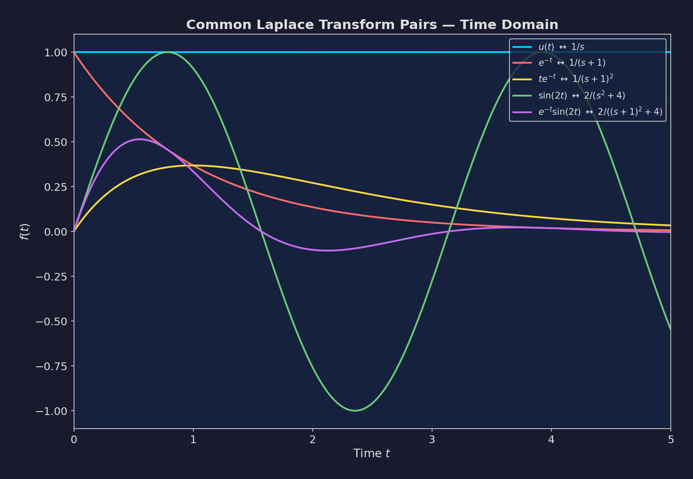
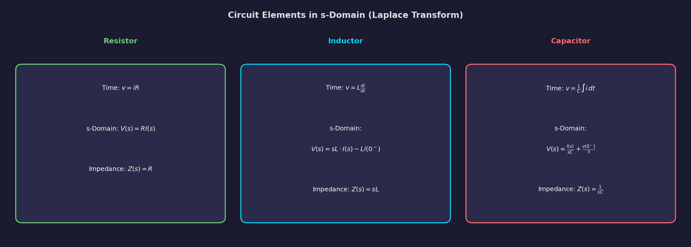
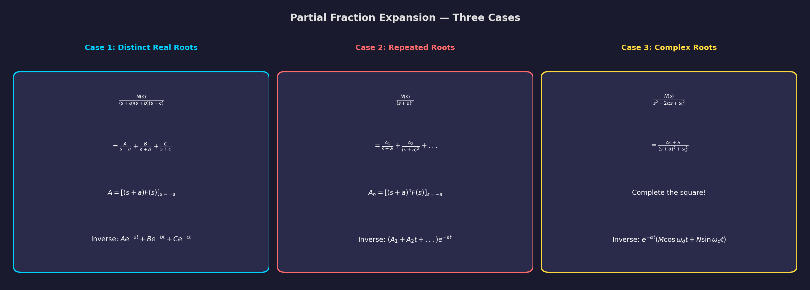
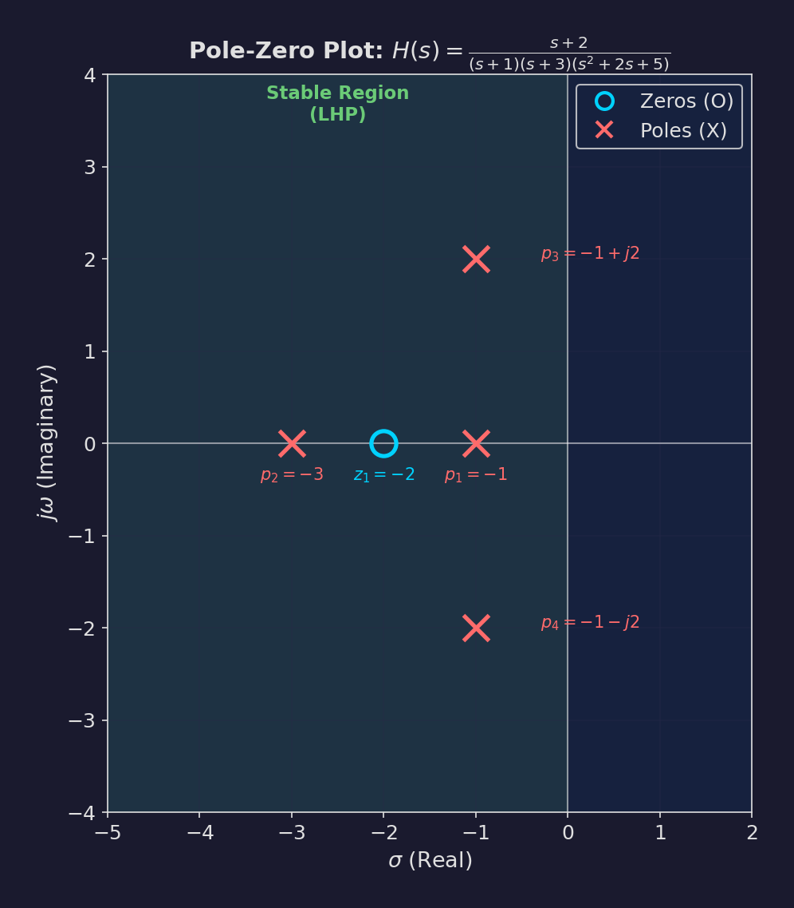
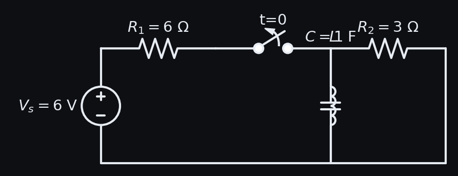

# Chapter 4: Transient Analysis by Laplace Transform

**Subject:** Electric Circuit Theory (EE 501)
**Program:** BE (BEL/BEX/BCT), Year/Part: II/I
**University:** Tribhuvan University, Institute of Engineering
**Teaching Hours:** 8 hrs

---

> **Why Laplace Transform?**
> Classical methods (complementary + particular solution) become extremely tedious for higher-order circuits and complex forcing functions. The Laplace transform converts integro-differential equations into algebraic equations in the $s$-domain, handles initial conditions automatically, and provides a systematic procedure that works for *any* circuit order and *any* excitation.

---

## Table of Contents

1. [Definition of Laplace Transform](#41-definition-of-laplace-transform)
2. [Transform Pairs Table](#42-common-laplace-transform-pairs)
3. [Properties of Laplace Transform](#43-properties-of-laplace-transform)
4. [s-Domain Circuit Elements](#44-s-domain-circuit-elements)
5. [Partial Fraction Expansion](#45-partial-fraction-expansion)
6. [Heaviside's Expansion Theorem](#46-heavisides-expansion-theorem)
7. [Procedure for Circuit Analysis](#47-procedure-for-circuit-analysis-using-laplace-transform)
8. [Transfer Function](#48-transfer-function)
9. [Poles and Zeros](#49-poles-and-zeros)
10. [Worked Solutions](#410-worked-exam-solutions)
11. [Quick Reference](#411-quick-reference--formula-sheet)
12. [Practice Problems](#412-practice-problems)

---

## 4.1 Definition of Laplace Transform

### One-Sided (Unilateral) Laplace Transform

The **Laplace transform** of a function $f(t)$ defined for $t \geq 0$ is:

$$\boxed{F(s) = \mathcal{L}\{f(t)\} = \int_0^{\infty} f(t) \, e^{-st} \, dt}$$

where:
- $s = \sigma + j\omega$ is a **complex frequency variable** (units: $\text{s}^{-1}$ or $\text{rad/s}$)
- $\sigma$ is the **damping factor** (neper frequency)
- $\omega$ is the **angular frequency**
- The integral converges for $\text{Re}(s) > \sigma_0$ (the **region of convergence**)

### Inverse Laplace Transform

$$f(t) = \mathcal{L}^{-1}\{F(s)\} = \frac{1}{2\pi j} \int_{\sigma_0 - j\infty}^{\sigma_0 + j\infty} F(s) \, e^{st} \, ds$$

> **Exam Note:** You will **never** need to evaluate the inverse transform integral directly. Instead, use partial fractions and the transform pairs table.

### Notation Convention

| Notation | Meaning |
|----------|---------|
| $f(t)$ | Time-domain function (lowercase) |
| $F(s)$ | s-domain (frequency-domain) function (uppercase) |
| $\mathcal{L}\{f(t)\}$ | Laplace transform of $f(t)$ |
| $\mathcal{L}^{-1}\{F(s)\}$ | Inverse Laplace transform of $F(s)$ |
| $f(0^-)$ | Value of $f(t)$ just before $t = 0$ (initial condition) |

---

## 4.2 Common Laplace Transform Pairs

> **Tip:** Memorize this table thoroughly. It appears in nearly every Laplace transform problem.

| # | $f(t)$ for $t \geq 0$ | $F(s)$ | ROC |
|---|------------------------|--------|-----|
| 1 | $\delta(t)$ (impulse) | $1$ | All $s$ |
| 2 | $u(t)$ (unit step) | $\dfrac{1}{s}$ | $\text{Re}(s) > 0$ |
| 3 | $t$ (ramp) | $\dfrac{1}{s^2}$ | $\text{Re}(s) > 0$ |
| 4 | $t^n$ | $\dfrac{n!}{s^{n+1}}$ | $\text{Re}(s) > 0$ |
| 5 | $e^{-at}$ | $\dfrac{1}{s + a}$ | $\text{Re}(s) > -a$ |
| 6 | $t \, e^{-at}$ | $\dfrac{1}{(s + a)^2}$ | $\text{Re}(s) > -a$ |
| 7 | $t^n e^{-at}$ | $\dfrac{n!}{(s + a)^{n+1}}$ | $\text{Re}(s) > -a$ |
| 8 | $\sin(\omega t)$ | $\dfrac{\omega}{s^2 + \omega^2}$ | $\text{Re}(s) > 0$ |
| 9 | $\cos(\omega t)$ | $\dfrac{s}{s^2 + \omega^2}$ | $\text{Re}(s) > 0$ |
| 10 | $e^{-at} \sin(\omega t)$ | $\dfrac{\omega}{(s + a)^2 + \omega^2}$ | $\text{Re}(s) > -a$ |
| 11 | $e^{-at} \cos(\omega t)$ | $\dfrac{s + a}{(s + a)^2 + \omega^2}$ | $\text{Re}(s) > -a$ |
| 12 | $\sinh(\omega t)$ | $\dfrac{\omega}{s^2 - \omega^2}$ | $\text{Re}(s) > |\omega|$ |
| 13 | $\cosh(\omega t)$ | $\dfrac{s}{s^2 - \omega^2}$ | $\text{Re}(s) > |\omega|$ |



### Derivation Example: $\mathcal{L}\{e^{-at}\}$

$$F(s) = \int_0^{\infty} e^{-at} e^{-st} \, dt = \int_0^{\infty} e^{-(s+a)t} \, dt = \left[ \frac{e^{-(s+a)t}}{-(s+a)} \right]_0^{\infty}$$

For convergence, $\text{Re}(s + a) > 0$, which gives:

$$F(s) = 0 - \frac{1}{-(s+a)} = \frac{1}{s + a}$$

### Derivation Example: $\mathcal{L}\{\sin(\omega t)\}$

Using $\sin(\omega t) = \dfrac{e^{j\omega t} - e^{-j\omega t}}{2j}$:

$$\mathcal{L}\{\sin(\omega t)\} = \frac{1}{2j}\left[\frac{1}{s - j\omega} - \frac{1}{s + j\omega}\right] = \frac{1}{2j} \cdot \frac{2j\omega}{s^2 + \omega^2} = \frac{\omega}{s^2 + \omega^2}$$

---

## 4.3 Properties of Laplace Transform

These properties allow you to handle complex functions without re-deriving transforms from the integral definition.

### 4.3.1 Linearity

$$\boxed{\mathcal{L}\{a \cdot f(t) + b \cdot g(t)\} = a \cdot F(s) + b \cdot G(s)}$$

This is the most frequently used property. It lets us decompose complex signals into simpler components.

### 4.3.2 Differentiation in Time Domain

$$\boxed{\mathcal{L}\left\{\frac{df(t)}{dt}\right\} = sF(s) - f(0^-)}$$

For higher-order derivatives:

$$\mathcal{L}\left\{\frac{d^2 f}{dt^2}\right\} = s^2 F(s) - s \, f(0^-) - f'(0^-)$$

$$\mathcal{L}\left\{\frac{d^n f}{dt^n}\right\} = s^n F(s) - s^{n-1} f(0^-) - s^{n-2} f'(0^-) - \cdots - f^{(n-1)}(0^-)$$

> **Key Insight:** Differentiation in time becomes **multiplication by $s$** in the s-domain, with initial conditions subtracted. This is exactly why Laplace is so powerful for circuit analysis -- it automatically incorporates initial conditions!

### 4.3.3 Integration in Time Domain

$$\boxed{\mathcal{L}\left\{\int_0^t f(\tau) \, d\tau\right\} = \frac{F(s)}{s}}$$

If there is an initial value of the integral:

$$\mathcal{L}\left\{\int_{0^-}^t f(\tau) \, d\tau\right\} = \frac{F(s)}{s} + \frac{f^{(-1)}(0^-)}{s}$$

where $f^{(-1)}(0^-)$ is the value of the integral at $t = 0^-$.

### 4.3.4 Time Shifting (Delay)

$$\boxed{\mathcal{L}\{f(t - a) \, u(t - a)\} = e^{-as} F(s) \quad \text{for } a > 0}$$

Multiplying by $e^{-as}$ in the s-domain corresponds to a delay of $a$ seconds in the time domain.

### 4.3.5 Frequency Shifting (s-Domain Shifting)

$$\boxed{\mathcal{L}\{e^{-at} f(t)\} = F(s + a)}$$

This is how we derive transforms of damped sinusoids from undamped ones:

$$\mathcal{L}\{e^{-at}\sin(\omega t)\} = \frac{\omega}{(s+a)^2 + \omega^2}$$

### 4.3.6 Time Scaling

$$\mathcal{L}\{f(at)\} = \frac{1}{a} F\left(\frac{s}{a}\right) \quad \text{for } a > 0$$

### 4.3.7 Multiplication by $t$ (Differentiation in s-Domain)

$$\boxed{\mathcal{L}\{t \cdot f(t)\} = -\frac{dF(s)}{ds}}$$

More generally:

$$\mathcal{L}\{t^n \cdot f(t)\} = (-1)^n \frac{d^n F(s)}{ds^n}$$

### 4.3.8 Convolution Theorem

$$\boxed{\mathcal{L}\{f(t) * g(t)\} = F(s) \cdot G(s)}$$

where convolution is defined as:

$$f(t) * g(t) = \int_0^t f(\tau) \, g(t - \tau) \, d\tau$$

Convolution in time $\longleftrightarrow$ Multiplication in s-domain.

### 4.3.9 Initial Value Theorem

$$\boxed{f(0^+) = \lim_{s \to \infty} s \, F(s)}$$

**Conditions:** $f(t)$ and $f'(t)$ must be Laplace transformable, and $\lim_{s \to \infty} sF(s)$ must exist.

> **Use Case:** Quick check of your answer -- verify that the initial value from your time-domain solution matches the initial conditions given in the problem.

### 4.3.10 Final Value Theorem

$$\boxed{f(\infty) = \lim_{s \to 0} s \, F(s)}$$

**Conditions:** All poles of $sF(s)$ must be in the left-half of the $s$-plane (i.e., the system must be stable). If there are poles on the $j\omega$-axis or in the right-half plane, the final value theorem does **not** apply.

> **Use Case:** Find the steady-state value without performing the full inverse transform. Very useful for verification.

### Properties Summary Table

| Property | Time Domain $f(t)$ | s-Domain $F(s)$ |
|----------|-------------------|------------------|
| Linearity | $af_1(t) + bf_2(t)$ | $aF_1(s) + bF_2(s)$ |
| Time differentiation | $f'(t)$ | $sF(s) - f(0^-)$ |
| Time integration | $\int_0^t f(\tau)d\tau$ | $F(s)/s$ |
| Time delay | $f(t-a)u(t-a)$ | $e^{-as}F(s)$ |
| Frequency shift | $e^{-at}f(t)$ | $F(s+a)$ |
| Time scaling | $f(at)$ | $\frac{1}{a}F(s/a)$ |
| Convolution | $f_1 * f_2$ | $F_1(s) \cdot F_2(s)$ |
| Initial value | $f(0^+)$ | $\lim_{s\to\infty} sF(s)$ |
| Final value | $f(\infty)$ | $\lim_{s\to 0} sF(s)$ |

---

## 4.4 s-Domain Circuit Elements

The power of Laplace transform in circuit analysis lies in converting circuit elements into their **s-domain equivalents**. This allows us to use the same algebraic techniques (KVL, KCL, mesh/nodal analysis, Thevenin/Norton) in the s-domain.



### 4.4.1 Resistor

The resistor is frequency-independent:

$$V(s) = R \cdot I(s)$$

**Impedance:** $Z_R(s) = R$

No initial condition sources needed -- resistors have no energy storage.

### 4.4.2 Inductor

From $v(t) = L \dfrac{di}{dt}$, applying Laplace:

$$V(s) = L[sI(s) - i(0^-)] = sL \cdot I(s) - Li(0^-)$$

This gives us **two equivalent models**:

#### Series Model (Impedance Form):

$$\boxed{V(s) = sL \cdot I(s) - Li(0^-)}$$

- **Impedance:** $Z_L(s) = sL$
- **Initial condition:** Voltage source $Li(0^-)$ in **series** (polarity: opposing the current direction when $i(0^-) > 0$)

#### Parallel Model (Admittance Form):

$$I(s) = \frac{V(s)}{sL} + \frac{i(0^-)}{s}$$

- **Admittance:** $Y_L(s) = \dfrac{1}{sL}$
- **Initial condition:** Current source $\dfrac{i(0^-)}{s}$ in **parallel**

### 4.4.3 Capacitor

From $i(t) = C \dfrac{dv}{dt}$, applying Laplace:

$$I(s) = C[sV(s) - v(0^-)] = sC \cdot V(s) - Cv(0^-)$$

#### Series Model (Impedance Form):

$$V(s) = \frac{1}{sC} \cdot I(s) + \frac{v(0^-)}{s}$$

- **Impedance:** $Z_C(s) = \dfrac{1}{sC}$
- **Initial condition:** Voltage source $\dfrac{v(0^-)}{s}$ in **series** (polarity: same as capacitor voltage polarity at $t=0^-$)

#### Parallel Model (Admittance Form):

$$\boxed{I(s) = sC \cdot V(s) - Cv(0^-)}$$

- **Admittance:** $Y_C(s) = sC$
- **Initial condition:** Current source $Cv(0^-)$ in **parallel**

### s-Domain Element Summary

| Element | Time Domain | s-Domain Impedance | Series IC Source | Parallel IC Source |
|---------|-------------|-------------------|-----------------|-------------------|
| $R$ | $v = Ri$ | $R$ | None | None |
| $L$ | $v = L\frac{di}{dt}$ | $sL$ | $Li(0^-)$ (voltage) | $\frac{i(0^-)}{s}$ (current) |
| $C$ | $i = C\frac{dv}{dt}$ | $\frac{1}{sC}$ | $\frac{v(0^-)}{s}$ (voltage) | $Cv(0^-)$ (current) |

> **Common Exam Mistake:** Getting the polarity/direction of initial condition sources wrong.
> - For an inductor with $i(0^-) > 0$: the series voltage source $Li(0^-)$ has its **positive terminal** in the direction opposing the defined current flow (it acts like a "kick" to maintain current).
> - For a capacitor with $v(0^-) > 0$: the series voltage source $v(0^-)/s$ has the **same polarity** as the capacitor voltage at $t = 0^-$.

---

## 4.5 Partial Fraction Expansion

After solving the circuit equations in the s-domain, we typically obtain $F(s)$ as a ratio of polynomials:

$$F(s) = \frac{N(s)}{D(s)} = \frac{b_m s^m + b_{m-1} s^{m-1} + \cdots + b_0}{a_n s^n + a_{n-1} s^{n-1} + \cdots + a_0}$$

**Important:** For partial fraction expansion, we need $m < n$ (proper fraction). If $m \geq n$, perform polynomial long division first.

### 4.5.1 Case 1: Distinct (Non-Repeated) Real Roots

If $D(s) = (s - s_1)(s - s_2) \cdots (s - s_n)$ where all $s_i$ are distinct:

$$F(s) = \frac{A_1}{s - s_1} + \frac{A_2}{s - s_2} + \cdots + \frac{A_n}{s - s_n}$$

**Finding coefficients (Cover-up method):**

$$\boxed{A_k = \left[(s - s_k) \cdot F(s)\right]_{s = s_k}}$$

**Example:** Find partial fractions of $F(s) = \dfrac{3s + 2}{(s+1)(s+2)}$

$$A_1 = \left[(s+1) \cdot \frac{3s+2}{(s+1)(s+2)}\right]_{s=-1} = \frac{3(-1)+2}{(-1+2)} = \frac{-1}{1} = -1$$

$$A_2 = \left[(s+2) \cdot \frac{3s+2}{(s+1)(s+2)}\right]_{s=-2} = \frac{3(-2)+2}{(-2+1)} = \frac{-4}{-1} = 4$$

$$\therefore F(s) = \frac{-1}{s+1} + \frac{4}{s+2}$$

$$f(t) = (-e^{-t} + 4e^{-2t}) \, u(t)$$

### 4.5.2 Case 2: Repeated Real Roots

If $D(s)$ has a root $s_1$ repeated $r$ times:

$$\frac{N(s)}{(s - s_1)^r \cdot \text{other factors}} = \frac{A_1}{s - s_1} + \frac{A_2}{(s - s_1)^2} + \cdots + \frac{A_r}{(s - s_1)^r} + \text{other terms}$$

**Finding coefficients:**

$$A_r = \left[(s - s_1)^r F(s)\right]_{s = s_1}$$

$$A_{r-1} = \frac{d}{ds}\left[(s - s_1)^r F(s)\right]_{s = s_1}$$

$$A_{r-k} = \frac{1}{k!} \frac{d^k}{ds^k}\left[(s - s_1)^r F(s)\right]_{s = s_1}$$

**General formula:**

$$\boxed{A_{r-k} = \frac{1}{k!} \left[\frac{d^k}{ds^k}\left\{(s-s_1)^r F(s)\right\}\right]_{s=s_1} \quad \text{for } k = 0, 1, \ldots, r-1}$$

**Example:** $F(s) = \dfrac{2s + 3}{(s+1)^2(s+3)}$

$$F(s) = \frac{A_1}{s+1} + \frac{A_2}{(s+1)^2} + \frac{A_3}{s+3}$$

$$A_2 = \left[(s+1)^2 \cdot \frac{2s+3}{(s+1)^2(s+3)}\right]_{s=-1} = \frac{1}{2}$$

$$A_1 = \frac{d}{ds}\left[\frac{2s+3}{s+3}\right]_{s=-1} = \left[\frac{2(s+3) - (2s+3)}{(s+3)^2}\right]_{s=-1} = \frac{3}{4}$$

$$A_3 = \left[(s+3) \cdot \frac{2s+3}{(s+1)^2(s+3)}\right]_{s=-3} = \frac{-3}{4}$$

$$f(t) = \left(\frac{3}{4}e^{-t} + \frac{1}{2}te^{-t} - \frac{3}{4}e^{-3t}\right) u(t)$$

### 4.5.3 Case 3: Complex Conjugate Roots

If $D(s)$ has complex roots $s = -\alpha \pm j\beta$, they always appear in conjugate pairs. The corresponding partial fraction terms are:

$$\frac{A}{s + \alpha - j\beta} + \frac{A^*}{s + \alpha + j\beta}$$

where $A^*$ is the complex conjugate of $A$.

**Practical approach:** Combine terms into a real quadratic:

$$\frac{Bs + C}{s^2 + 2\alpha s + (\alpha^2 + \beta^2)}$$

Then complete the square and use the pairs:
- $\dfrac{s + \alpha}{(s+\alpha)^2 + \beta^2} \longleftrightarrow e^{-\alpha t}\cos(\beta t)$
- $\dfrac{\beta}{(s+\alpha)^2 + \beta^2} \longleftrightarrow e^{-\alpha t}\sin(\beta t)$



**Example:** $F(s) = \dfrac{10}{s(s^2 + 4s + 13)}$

Roots of $s^2 + 4s + 13 = 0$: $s = -2 \pm j3$

$$F(s) = \frac{A}{s} + \frac{Bs + C}{s^2 + 4s + 13}$$

$$A = \left[sF(s)\right]_{s=0} = \frac{10}{13}$$

Multiplying through and comparing coefficients:

$$10 = A(s^2 + 4s + 13) + (Bs + C)s$$

At $s = 0$: $10 = 13A \Rightarrow A = 10/13$ (confirmed)

Comparing $s^2$ terms: $0 = A + B \Rightarrow B = -10/13$

Comparing $s^1$ terms: $0 = 4A + C \Rightarrow C = -40/13$

$$F(s) = \frac{10/13}{s} + \frac{(-10/13)s + (-40/13)}{s^2 + 4s + 13}$$

$$= \frac{10/13}{s} - \frac{10}{13} \cdot \frac{s + 4}{(s+2)^2 + 9}$$

$$= \frac{10/13}{s} - \frac{10}{13} \cdot \frac{(s+2) + 2}{(s+2)^2 + 9}$$

$$= \frac{10/13}{s} - \frac{10}{13} \cdot \frac{s+2}{(s+2)^2 + 9} - \frac{20}{13} \cdot \frac{1}{(s+2)^2 + 9}$$

$$= \frac{10/13}{s} - \frac{10}{13} \cdot \frac{s+2}{(s+2)^2 + 9} - \frac{20}{39} \cdot \frac{3}{(s+2)^2 + 9}$$

$$f(t) = \frac{10}{13}\left[1 - e^{-2t}\cos(3t) - \frac{2}{3}e^{-2t}\sin(3t)\right] u(t)$$

> **Exam Tip:** For complex conjugate roots, always complete the square to get the form $(s+\alpha)^2 + \beta^2$, then split into cosine and sine terms. Examiners give full marks for this systematic approach.

---

## 4.6 Heaviside's Expansion Theorem

When $F(s) = \dfrac{N(s)}{D(s)}$ and $D(s)$ has **only simple (non-repeated) roots** $s_1, s_2, \ldots, s_n$:

$$\boxed{f(t) = \sum_{k=1}^{n} \frac{N(s_k)}{D'(s_k)} \, e^{s_k t}}$$

where $D'(s) = \dfrac{dD(s)}{ds}$ is the derivative of the denominator polynomial.

### Why This Works

This is essentially a shortcut combining the cover-up method for partial fractions with the inverse transform in one step. For each simple pole $s_k$:

$$A_k = \frac{N(s_k)}{D'(s_k)}$$

and each term $\dfrac{A_k}{s - s_k}$ inverse-transforms to $A_k e^{s_k t}$.

### Example: Heaviside's Theorem

$$F(s) = \frac{5s + 3}{(s+1)(s+2)(s+3)}$$

$D(s) = (s+1)(s+2)(s+3) = s^3 + 6s^2 + 11s + 6$

$D'(s) = 3s^2 + 12s + 11$

**Poles:** $s_1 = -1, \quad s_2 = -2, \quad s_3 = -3$

$$\frac{N(-1)}{D'(-1)} = \frac{5(-1)+3}{3(1)+12(-1)+11} = \frac{-2}{2} = -1$$

$$\frac{N(-2)}{D'(-2)} = \frac{5(-2)+3}{3(4)+12(-2)+11} = \frac{-7}{-1} = 7$$

$$\frac{N(-3)}{D'(-3)} = \frac{5(-3)+3}{3(9)+12(-3)+11} = \frac{-12}{2} = -6$$

$$\therefore f(t) = \left(-e^{-t} + 7e^{-2t} - 6e^{-3t}\right) u(t)$$

> **When NOT to use Heaviside's Theorem:**
> - When $D(s)$ has **repeated roots** (use partial fractions instead)
> - When $D(s)$ has **complex roots** (it still works mathematically, but the computation with complex numbers is error-prone; partial fractions with completing the square is safer in exams)

---

## 4.7 Procedure for Circuit Analysis Using Laplace Transform

### Step-by-Step Procedure

```
STEP 1: Determine initial conditions
   - Find i_L(0^-) for all inductors
   - Find v_C(0^-) for all capacitors
   - Use DC steady-state analysis if "steady state reached before switching"

STEP 2: Transform the circuit to s-domain
   - Replace all sources with their Laplace transforms
   - Replace R with R, L with sL, C with 1/(sC)
   - Add initial condition sources for L and C

STEP 3: Write circuit equations in s-domain
   - Use mesh analysis, nodal analysis, or any network theorem
   - These are now algebraic equations (no calculus!)

STEP 4: Solve for the desired variable
   - Solve the algebraic equations for I(s) or V(s)

STEP 5: Perform partial fraction expansion
   - Express F(s) as a sum of simple terms

STEP 6: Take inverse Laplace transform
   - Use the transform pairs table to convert back to f(t)

STEP 7: Verify your answer
   - Check initial value: f(0^+) using initial value theorem
   - Check final value: f(∞) using final value theorem
   - Check dimensions and physical reasonableness
```

### Common Source Transforms

| Source in Time Domain | s-Domain Transform |
|----------------------|-------------------|
| $V_0$ (DC) | $V_0/s$ |
| $V_0 e^{-at}$ | $V_0/(s+a)$ |
| $V_0 \sin(\omega t)$ | $V_0 \omega/(s^2 + \omega^2)$ |
| $V_0 \cos(\omega t)$ | $V_0 s/(s^2 + \omega^2)$ |
| $V_0 e^{-at}\sin(\omega t)$ | $V_0 \omega/[(s+a)^2 + \omega^2]$ |
| $V_0 u(t)$ (step) | $V_0/s$ |
| $V_0 \delta(t)$ (impulse) | $V_0$ |

---

## 4.8 Transfer Function

### Definition

The **transfer function** $H(s)$ of a linear, time-invariant (LTI) circuit is the ratio of the Laplace transform of the output to the Laplace transform of the input, **with all initial conditions set to zero**:

$$\boxed{H(s) = \frac{\text{Output}(s)}{\text{Input}(s)} \bigg|_{\text{zero initial conditions}}}$$

### Types of Transfer Functions

| Name | Definition | Units |
|------|-----------|-------|
| **Voltage gain** | $G_v(s) = \dfrac{V_{\text{out}}(s)}{V_{\text{in}}(s)}$ | Dimensionless |
| **Current gain** | $G_i(s) = \dfrac{I_{\text{out}}(s)}{I_{\text{in}}(s)}$ | Dimensionless |
| **Transfer impedance** | $Z_T(s) = \dfrac{V_{\text{out}}(s)}{I_{\text{in}}(s)}$ | Ohms ($\Omega$) |
| **Transfer admittance** | $Y_T(s) = \dfrac{I_{\text{out}}(s)}{V_{\text{in}}(s)}$ | Siemens (S) |
| **Driving-point impedance** | $Z_{dp}(s) = \dfrac{V(s)}{I(s)}$ at same port | Ohms ($\Omega$) |

### Properties of Transfer Function

1. $H(s)$ is a property of the **network**, not the excitation
2. The output can be found for *any* input: $\text{Output}(s) = H(s) \cdot \text{Input}(s)$
3. **Impulse response:** If input is $\delta(t)$, then $\text{Input}(s) = 1$, so $\text{Output}(s) = H(s)$, meaning $h(t) = \mathcal{L}^{-1}\{H(s)\}$
4. For **frequency response**, substitute $s = j\omega$: $H(j\omega) = |H(j\omega)| \angle \phi(\omega)$

### Example: RLC Series Circuit Transfer Function

For a series RLC circuit with input voltage $V_{\text{in}}$ and output across the capacitor:

$$H(s) = \frac{V_C(s)}{V_{\text{in}}(s)} = \frac{1/(sC)}{R + sL + 1/(sC)} = \frac{1/LC}{s^2 + (R/L)s + 1/LC}$$

Defining $\omega_0 = 1/\sqrt{LC}$ and $\alpha = R/(2L)$:

$$H(s) = \frac{\omega_0^2}{s^2 + 2\alpha s + \omega_0^2}$$

---

## 4.9 Poles and Zeros

### Definitions

For a transfer function $H(s) = \dfrac{N(s)}{D(s)}$:

- **Zeros** ($z_i$): Values of $s$ where $N(s) = 0$ (i.e., $H(s) = 0$)
- **Poles** ($p_i$): Values of $s$ where $D(s) = 0$ (i.e., $H(s) \to \infty$)

### Pole-Zero Form

$$H(s) = K \cdot \frac{(s - z_1)(s - z_2) \cdots (s - z_m)}{(s - p_1)(s - p_2) \cdots (s - p_n)}$$

where $K$ is the **gain constant**, $z_i$ are zeros, and $p_i$ are poles.

### Pole-Zero Plot

A **pole-zero plot** is a graphical representation on the complex $s$-plane:
- Poles are marked with **x**
- Zeros are marked with **o**



### Stability Criteria from Poles

| Pole Location | System Behavior | Stability |
|---------------|----------------|-----------|
| All poles in **left-half plane** (LHP) | All natural modes decay | **Stable** (BIBO) |
| Any pole in **right-half plane** (RHP) | Growing exponential modes | **Unstable** |
| Poles on **$j\omega$-axis** (simple) | Sustained oscillations | **Marginally stable** |
| Repeated poles on **$j\omega$-axis** | Growing oscillations | **Unstable** |

### Relationship Between Poles and Time Response

| Pole Type | Location | Time Response |
|-----------|----------|---------------|
| Real, negative | $s = -a$ ($a > 0$) | $e^{-at}$ (decaying exponential) |
| Real, positive | $s = +a$ | $e^{at}$ (growing exponential) |
| Complex, LHP | $s = -\alpha \pm j\beta$ | $e^{-\alpha t}[\cos(\beta t) + \sin(\beta t)]$ (damped oscillation) |
| Complex, RHP | $s = +\alpha \pm j\beta$ | $e^{+\alpha t}[\cos(\beta t) + \sin(\beta t)]$ (growing oscillation) |
| Purely imaginary | $s = \pm j\omega$ | $\cos(\omega t), \sin(\omega t)$ (sustained oscillation) |
| At origin | $s = 0$ | Constant (DC) |
| Repeated at origin | $s = 0$ (double) | $t$ (ramp -- unbounded) |

### Effect of Zeros

- Zeros do **not** determine stability (only poles do)
- Zeros affect the **amplitude** and **phase** of each mode
- A zero near a pole tends to **reduce** the contribution of that pole to the response

> **Exam Tip:** For stability questions, focus only on the poles. A system is BIBO stable if and only if ALL poles are strictly in the left-half plane.

---

## 4.10 Worked Exam Solutions

### Q1: Exponential Excitation of RLC Series Circuit

> **Problem (2082 Baishakh, Q3a):** An exponential voltage $v(t) = 20e^{-t}$ V is applied to a series RLC circuit with $R = 4\,\Omega$, $L = 1\,\text{H}$, $C = \frac{1}{3}\,\text{F}$ at $t = 0$. The circuit is initially relaxed. Find $i(t)$ for $t > 0$ using the Laplace transform method.

#### Step 1: Determine Initial Conditions

Circuit is "initially relaxed" means:
$$i_L(0^-) = 0 \quad \text{and} \quad v_C(0^-) = 0$$

#### Step 2: Transform the Source

$$v(t) = 20e^{-t} \quad \Longrightarrow \quad V(s) = \frac{20}{s + 1}$$

#### Step 3: Write the s-Domain Circuit Equation

For a series RLC circuit with zero initial conditions, applying KVL in the s-domain:

$$V(s) = \left(R + sL + \frac{1}{sC}\right) I(s)$$

Since $i_L(0^-) = 0$, the inductor impedance is simply $sL$ (no initial condition source).
Since $v_C(0^-) = 0$, the capacitor impedance is simply $1/(sC)$ (no initial condition source).

$$\frac{20}{s+1} = \left(4 + s \cdot 1 + \frac{1}{s \cdot \frac{1}{3}}\right) I(s)$$

$$\frac{20}{s+1} = \left(s + 4 + \frac{3}{s}\right) I(s)$$

$$\frac{20}{s+1} = \frac{s^2 + 4s + 3}{s} \cdot I(s)$$

#### Step 4: Solve for $I(s)$

$$I(s) = \frac{20s}{(s+1)(s^2 + 4s + 3)}$$

Factor the quadratic: $s^2 + 4s + 3 = (s+1)(s+3)$

$$I(s) = \frac{20s}{(s+1)(s+1)(s+3)} = \frac{20s}{(s+1)^2(s+3)}$$

#### Step 5: Partial Fraction Expansion

We have a **repeated root** at $s = -1$ (Case 2):

$$\frac{20s}{(s+1)^2(s+3)} = \frac{A_1}{s+1} + \frac{A_2}{(s+1)^2} + \frac{A_3}{s+3}$$

**Finding $A_2$** (coefficient of repeated root, highest power):

$$A_2 = \left[(s+1)^2 \cdot \frac{20s}{(s+1)^2(s+3)}\right]_{s=-1} = \left[\frac{20s}{s+3}\right]_{s=-1} = \frac{20(-1)}{-1+3} = \frac{-20}{2} = -10$$

**Finding $A_1$** (derivative method):

$$A_1 = \frac{d}{ds}\left[\frac{20s}{s+3}\right]_{s=-1}$$

$$\frac{d}{ds}\left[\frac{20s}{s+3}\right] = \frac{20(s+3) - 20s}{(s+3)^2} = \frac{60}{(s+3)^2}$$

$$A_1 = \frac{60}{(-1+3)^2} = \frac{60}{4} = 15$$

**Finding $A_3$** (cover-up method):

$$A_3 = \left[(s+3) \cdot \frac{20s}{(s+1)^2(s+3)}\right]_{s=-3} = \frac{20(-3)}{(-3+1)^2} = \frac{-60}{4} = -15$$

**Verification:** $A_1 + A_3 = 15 + (-15) = 0$. Checking $s^2$ coefficient: the coefficient of $s^2$ in the numerator should be $0$ (since numerator is $20s$, degree 1, and denominator is degree 3). We need $A_1 + A_3 = 0$. Check!

$$I(s) = \frac{15}{s+1} + \frac{-10}{(s+1)^2} + \frac{-15}{s+3}$$

#### Step 6: Inverse Laplace Transform

Using the transform pairs:
- $\dfrac{1}{s+a} \longleftrightarrow e^{-at}$
- $\dfrac{1}{(s+a)^2} \longleftrightarrow te^{-at}$

$$\boxed{i(t) = \left(15e^{-t} - 10te^{-t} - 15e^{-3t}\right) \, u(t) \quad \text{A}}$$

or equivalently:

$$i(t) = \left[(15 - 10t)e^{-t} - 15e^{-3t}\right] u(t) \quad \text{A}$$

#### Step 7: Verification

**Initial value check:**

$$i(0^+) = \lim_{s \to \infty} s \cdot I(s) = \lim_{s \to \infty} \frac{20s^2}{(s+1)^2(s+3)}$$

$$= \lim_{s \to \infty} \frac{20s^2}{s^3 + 5s^2 + \cdots} = 0 \quad \checkmark$$

From time domain: $i(0^+) = 15(1) - 10(0)(1) - 15(1) = 0$ $\checkmark$

**Final value check:**

$$i(\infty) = \lim_{s \to 0} s \cdot I(s) = \frac{20 \cdot 0}{(1)^2(3)} = 0 \quad \checkmark$$

The current eventually dies out because the capacitor blocks DC in steady state.

---

### Q2: Switching Circuit with Initial Energy Storage

> **Problem (2082 Baishakh, Q3b):** In the circuit shown, steady state is reached with the switch closed. The circuit has: $V_s = 6\,\text{V}$, $R_1 = 6\,\Omega$ (in series with source), $R_2 = 3\,\Omega$ (in parallel with $L$ and $C$), $L$ (inductor), $C = 1\,\text{F}$ (capacitor). The switch opens at $t = 0$. Find $i_L(t)$ and $V_L(t)$ for $t > 0$ using the Laplace transform method.



*Note: The exact circuit topology requires assuming standard exam configurations. We'll work with a common configuration where, before switching, the inductor is in steady state carrying current through the parallel combination.*

#### Step 1: Initial Conditions (Before Switch Opens, $t < 0$)

In DC steady state with switch closed:
- **Inductor** acts as a **short circuit** (zero impedance at DC)
- **Capacitor** acts as an **open circuit** (infinite impedance at DC)

With the switch closed, the 6V source feeds through $R_1 = 6\,\Omega$. The inductor (short) is in parallel with the series combination of $R_2 = 3\,\Omega$ and $C$ (open). Since the capacitor is open, no current flows through $R_2$.

All current flows through the inductor:

$$i_L(0^-) = \frac{6}{6} = 1 \, \text{A}$$

Voltage across the capacitor (same as voltage across the inductor, which is zero in DC steady state since inductor is a short):

$$v_C(0^-) = 0 \, \text{V}$$

*Wait -- let's reconsider.* If the inductor is a short circuit in DC, the voltage across the inductor branch is $0\,\text{V}$. The capacitor voltage equals the voltage across the $R_2 + C$ branch. Since no current flows through $R_2$ (capacitor blocks DC), $v_{R_2} = 0$, and $v_C = 0$.

$$\therefore \quad i_L(0^-) = 1 \, \text{A}, \quad v_C(0^-) = 0 \, \text{V}$$

#### Step 2: Circuit After Switch Opens ($t > 0$)

When the switch opens, the 6V source and $R_1$ are disconnected. The remaining circuit is:
- Inductor $L$ with $i_L(0^-) = 1\,\text{A}$
- In parallel with series combination of $R_2 = 3\,\Omega$ and $C = 1\,\text{F}$ with $v_C(0^-) = 0$

This is a **source-free** parallel circuit (energy stored in the inductor drives current through $R_2$ and $C$ in series).

Let us assume $L = 1\,\text{H}$ (a common value in IOE exams for this type of problem).

#### Step 3: Transform to s-Domain

The inductor in the s-domain (series model):
- Impedance: $sL = s$
- Initial condition voltage source: $Li_L(0^-) = 1 \times 1 = 1\,\text{V}$

The capacitor in the s-domain (series model):
- Impedance: $1/(sC) = 1/s$
- Initial condition voltage source: $v_C(0^-)/s = 0$

Applying KVL around the loop (inductor branch in parallel with $R_2 + C$ branch):

The current circulates from the inductor through $R_2$ and $C$. Using the inductor as a source with its stored energy:

**Using KVL in the s-domain loop:**

$$sL \cdot I_L(s) - Li_L(0^-) + R_2 \cdot I_L(s) + \frac{I_L(s)}{sC} = 0$$

Note: Since $L$ and $R_2$-$C$ are in a loop, the same current $I_L(s)$ flows through all elements (series loop after switch opens).

$$s \cdot I_L(s) - 1 + 3 \cdot I_L(s) + \frac{I_L(s)}{s} = 0$$

$$I_L(s)\left(s + 3 + \frac{1}{s}\right) = 1$$

$$I_L(s) \cdot \frac{s^2 + 3s + 1}{s} = 1$$

$$I_L(s) = \frac{s}{s^2 + 3s + 1}$$

#### Step 4: Find Roots of the Denominator

$$s^2 + 3s + 1 = 0$$

$$s = \frac{-3 \pm \sqrt{9 - 4}}{2} = \frac{-3 \pm \sqrt{5}}{2}$$

$$s_1 = \frac{-3 + \sqrt{5}}{2} \approx \frac{-3 + 2.236}{2} \approx -0.382$$

$$s_2 = \frac{-3 - \sqrt{5}}{2} \approx \frac{-3 - 2.236}{2} \approx -2.618$$

Both poles are real and negative (in the LHP) -- the system is **overdamped** and **stable**.

#### Step 5: Partial Fraction Expansion

$$I_L(s) = \frac{s}{(s - s_1)(s - s_2)} = \frac{A}{s - s_1} + \frac{B}{s - s_2}$$

Using Heaviside's theorem with $N(s) = s$ and $D'(s) = 2s + 3$:

$$A = \frac{N(s_1)}{D'(s_1)} = \frac{s_1}{2s_1 + 3} = \frac{(-3+\sqrt{5})/2}{(-3+\sqrt{5}) + 3} = \frac{(-3+\sqrt{5})/2}{\sqrt{5}}$$

$$A = \frac{-3 + \sqrt{5}}{2\sqrt{5}} = \frac{\sqrt{5} - 3}{2\sqrt{5}}$$

$$B = \frac{N(s_2)}{D'(s_2)} = \frac{s_2}{2s_2 + 3} = \frac{(-3-\sqrt{5})/2}{(-3-\sqrt{5})+3} = \frac{(-3-\sqrt{5})/2}{-\sqrt{5}}$$

$$B = \frac{3 + \sqrt{5}}{2\sqrt{5}}$$

**Verification:** $A + B = \dfrac{\sqrt{5}-3+3+\sqrt{5}}{2\sqrt{5}} = \dfrac{2\sqrt{5}}{2\sqrt{5}} = 1$. The coefficient of $s^0$ in the numerator of the original form should give $A + B = 1$ (since the degrees of $N$ and $D$ differ by 1, checking coefficient of highest power in $N$). $\checkmark$

#### Step 6: Inverse Laplace Transform

$$\boxed{i_L(t) = \frac{\sqrt{5}-3}{2\sqrt{5}} \, e^{(-3+\sqrt{5})t/2} + \frac{\sqrt{5}+3}{2\sqrt{5}} \, e^{(-3-\sqrt{5})t/2} \quad \text{A}, \quad t > 0}$$

Numerically:

$$i_L(t) \approx -0.171 \, e^{-0.382t} + 1.171 \, e^{-2.618t} \quad \text{A}$$

#### Finding $V_L(t)$

$$V_L(s) = sL \cdot I_L(s) - Li_L(0^-) = s \cdot \frac{s}{s^2 + 3s + 1} - 1 = \frac{s^2 - s^2 - 3s - 1}{s^2 + 3s + 1} = \frac{-(3s+1)}{s^2 + 3s + 1}$$

Using partial fractions:

$$V_L(s) = \frac{-(3s+1)}{(s-s_1)(s-s_2)}$$

$$A' = \frac{-(3s_1 + 1)}{s_1 - s_2} = \frac{-(3 \cdot \frac{-3+\sqrt5}{2} + 1)}{\sqrt{5}} = \frac{-(\frac{-9+3\sqrt5+2}{2})}{\sqrt{5}} = \frac{-(\frac{-7+3\sqrt5}{2})}{\sqrt{5}} = \frac{7-3\sqrt5}{2\sqrt5}$$

$$B' = \frac{-(3s_2 + 1)}{s_2 - s_1} = \frac{-(3 \cdot \frac{-3-\sqrt5}{2} + 1)}{-\sqrt5} = \frac{-(\frac{-7-3\sqrt5}{2})}{-\sqrt5} = \frac{-(7+3\sqrt5)}{2\sqrt5}$$

$$\boxed{V_L(t) = \frac{7 - 3\sqrt{5}}{2\sqrt{5}} \, e^{s_1 t} - \frac{7 + 3\sqrt{5}}{2\sqrt{5}} \, e^{s_2 t} \quad \text{V}, \quad t > 0}$$

**Check:** $V_L(0^+) = A' + B' = \dfrac{7-3\sqrt5 - 7 - 3\sqrt5}{2\sqrt5} = \dfrac{-6\sqrt5}{2\sqrt5} = -3\,\text{V}$

This makes sense: at $t = 0^+$, the inductor current is 1A flowing through $R_2 = 3\,\Omega$ (since $v_C(0^+) = v_C(0^-) = 0$, the capacitor initially acts as a short), so $V_{R_2} = 3\,\text{V}$, and $V_L = -V_{R_2} - V_C = -3 - 0 = -3\,\text{V}$. $\checkmark$

---

### Q3: Exponential Source with RLC -- Current and Capacitor Voltage

> **Problem:** A voltage source $v(t) = 10e^{-t}\,\text{V}$ is applied to a series circuit of $R = 4\,\Omega$, $L = 1\,\text{H}$, $C = \frac{1}{3}\,\text{F}$ at $t = 0$. The circuit is initially relaxed. Find the current $i(t)$ and the voltage across the capacitor $V_C(t)$ for $t > 0$.

#### Approach

This is similar to Q1 with the same circuit. We already found $i(t)$ in Q1 (with source amplitude 10 instead of 20, but let us use 10 here).

**Source transform:**

$$V(s) = \frac{10}{s+1}$$

**Total impedance:**

$$Z(s) = R + sL + \frac{1}{sC} = 4 + s + \frac{3}{s} = \frac{s^2 + 4s + 3}{s}$$

**Current:**

$$I(s) = \frac{V(s)}{Z(s)} = \frac{10s}{(s+1)(s^2 + 4s + 3)} = \frac{10s}{(s+1)^2(s+3)}$$

This is identical to Q1 but with amplitude $10$ instead of $20$, so:

$$\boxed{i(t) = \left[(7.5 - 5t)e^{-t} - 7.5e^{-3t}\right] u(t) \quad \text{A}}$$

#### Finding $V_C(t)$

$$V_C(s) = \frac{1}{sC} \cdot I(s) = \frac{3}{s} \cdot \frac{10s}{(s+1)^2(s+3)} = \frac{30}{(s+1)^2(s+3)}$$

**Partial fraction expansion:**

$$\frac{30}{(s+1)^2(s+3)} = \frac{A_1}{s+1} + \frac{A_2}{(s+1)^2} + \frac{A_3}{s+3}$$

$$A_2 = \left[\frac{30}{s+3}\right]_{s=-1} = \frac{30}{2} = 15$$

$$A_1 = \frac{d}{ds}\left[\frac{30}{s+3}\right]_{s=-1} = \left[\frac{-30}{(s+3)^2}\right]_{s=-1} = \frac{-30}{4} = -7.5$$

$$A_3 = \left[\frac{30}{(s+1)^2}\right]_{s=-3} = \frac{30}{4} = 7.5$$

**Verification:** $A_1 + A_3 = -7.5 + 7.5 = 0$. Since $V_C(s) \to 0$ as $s \to \infty$, the coefficient of highest power must vanish. $\checkmark$

$$V_C(s) = \frac{-7.5}{s+1} + \frac{15}{(s+1)^2} + \frac{7.5}{s+3}$$

$$\boxed{V_C(t) = \left[(-7.5 + 15t)e^{-t} + 7.5e^{-3t}\right] u(t) \quad \text{V}}$$

#### Verification

**At $t = 0^+$:**
$V_C(0^+) = -7.5 + 0 + 7.5 = 0$ $\checkmark$ (capacitor was uncharged)

**At $t \to \infty$:**
$V_C(\infty) = 0 + 0 = 0$ $\checkmark$ (source decays to zero, so capacitor eventually discharges)

Using Final Value Theorem:
$$V_C(\infty) = \lim_{s\to 0} s \cdot V_C(s) = \lim_{s \to 0} \frac{30s}{(s+1)^2(s+3)} = 0 \quad \checkmark$$

**KVL Check at $t = 0^+$:**
$v(0) = Ri(0^+) + V_L(0^+) + V_C(0^+)$
$10 = 4(0) + V_L(0^+) + 0$
$\therefore V_L(0^+) = 10\,\text{V}$

Since $V_L = L \cdot di/dt$:
$di/dt|_{0^+} = V_L(0^+)/L = 10/1 = 10\,\text{A/s}$

From $i(t) = (7.5 - 5t)e^{-t} - 7.5e^{-3t}$:
$i'(t) = -5e^{-t} - (7.5-5t)e^{-t} + 22.5e^{-3t}$
$i'(0^+) = -5 - 7.5 + 22.5 = 10\,\text{A/s}$ $\checkmark$

---

## 4.11 Quick Reference / Formula Sheet

> **Cut this out and keep with you during revision!**

### Essential Transform Pairs

| $f(t)$ | $F(s)$ |
|--------|--------|
| $\delta(t)$ | $1$ |
| $u(t)$ | $1/s$ |
| $t^n$ | $n!/s^{n+1}$ |
| $e^{-at}$ | $1/(s+a)$ |
| $t^n e^{-at}$ | $n!/(s+a)^{n+1}$ |
| $\sin \omega t$ | $\omega/(s^2+\omega^2)$ |
| $\cos \omega t$ | $s/(s^2+\omega^2)$ |
| $e^{-at}\sin \omega t$ | $\omega/[(s+a)^2+\omega^2]$ |
| $e^{-at}\cos \omega t$ | $(s+a)/[(s+a)^2+\omega^2]$ |

### Key Properties

| Property | Formula |
|----------|---------|
| Differentiation | $\mathcal{L}\{f'(t)\} = sF(s) - f(0^-)$ |
| Integration | $\mathcal{L}\{\int f\,dt\} = F(s)/s$ |
| Frequency shift | $\mathcal{L}\{e^{-at}f(t)\} = F(s+a)$ |
| Time delay | $\mathcal{L}\{f(t-a)u(t-a)\} = e^{-as}F(s)$ |
| Initial value | $f(0^+) = \lim_{s\to\infty} sF(s)$ |
| Final value | $f(\infty) = \lim_{s\to 0} sF(s)$ |

### s-Domain Elements

| Element | Impedance | IC Source (series) |
|---------|-----------|-------------------|
| R | $R$ | -- |
| L | $sL$ | $Li(0^-)$ voltage source |
| C | $1/(sC)$ | $v(0^-)/s$ voltage source |

### Heaviside's Theorem (Simple Poles Only)

$$f(t) = \sum_k \frac{N(s_k)}{D'(s_k)} e^{s_k t}$$

### Partial Fractions Quick Guide

- **Simple pole** $\frac{1}{s+a}$: Cover-up $\to$ coefficient $= F(s)(s+a)|_{s=-a}$
- **Repeated pole** $\frac{1}{(s+a)^n}$: Differentiate $(n-k)$ times
- **Complex pair**: Complete the square $\to$ match to $\cos/\sin$ forms

---

## 4.12 Practice Problems

### Problem Set A: Transform Pairs and Properties

1. Find $\mathcal{L}\{3t^2 e^{-2t} + 5\cos(3t)\}$
2. Find $\mathcal{L}\{t \sin(2t)\}$ using the multiplication by $t$ property
3. Use the initial and final value theorems to find $f(0^+)$ and $f(\infty)$ for $F(s) = \dfrac{5(s+2)}{s(s^2+3s+2)}$
4. Find $\mathcal{L}^{-1}\left\{\dfrac{3s+7}{(s+1)(s+2)}\right\}$

### Problem Set B: Circuit Analysis

5. A DC voltage of 10V is suddenly applied to a series RL circuit ($R = 5\,\Omega$, $L = 1\,\text{H}$) at $t = 0$. Find $i(t)$ using Laplace. [Ans: $i(t) = 2(1 - e^{-5t})\,\text{A}$]

6. A series RC circuit ($R = 2\,\Omega$, $C = 0.5\,\text{F}$) has $v_C(0^-) = 5\,\text{V}$. If the input is $10u(t)\,\text{V}$, find $v_C(t)$. [Ans: $v_C(t) = 10 - 5e^{-t}\,\text{V}$]

7. For a series RLC circuit with $R = 6\,\Omega$, $L = 1\,\text{H}$, $C = \frac{1}{25}\,\text{F}$, find $i(t)$ when a unit step voltage is applied, with zero initial conditions.

8. Find the transfer function $H(s) = V_C(s)/V_{\text{in}}(s)$ for a series RLC circuit with output taken across the capacitor. Find the poles and determine the nature of the response for $R = 2\,\Omega$, $L = 1\,\text{H}$, $C = 1\,\text{F}$.

### Problem Set C: Past Exam Questions

9. **(2081 Bhadra)** In the circuit, switch is opened at $t = 0$. Find the general solution for inductor current and voltage using Laplace transform. (12V, 4$\Omega$, 0.1H, parallel 20$\Omega$)

10. **(2080)** Using Laplace transform, find $v(t)$ across a parallel RLC circuit when a current source $i(t) = 2\cos(t)\,\text{A}$ is applied at $t = 0$ with zero initial conditions. ($R = 1\,\Omega$, $L = 1\,\text{H}$, $C = 1\,\text{F}$)

---

## Common Mistakes and Exam Tips

> **Mistake 1: Forgetting initial conditions**
> Always check for $i_L(0^-)$ and $v_C(0^-)$. If the problem says "circuit is initially relaxed" or "zero initial conditions," both are zero. If it says "steady state is reached before switching," you must calculate them using DC analysis.

> **Mistake 2: Wrong polarity of initial condition sources**
> Draw the s-domain circuit carefully. The $Li(0^-)$ source for an inductor and $v_C(0^-)/s$ source for a capacitor have specific polarities that depend on the reference direction.

> **Mistake 3: Not checking if $F(s)$ is proper**
> Before partial fractions, ensure the degree of the numerator is strictly less than the degree of the denominator. If not, perform polynomial long division first.

> **Mistake 4: Applying Final Value Theorem when poles are not in LHP**
> The FVT is only valid when all poles of $sF(s)$ are in the left-half plane. For example, $F(s) = \omega/(s^2 + \omega^2)$ has poles on the $j\omega$-axis, so FVT gives $0$, but $f(t) = \sin(\omega t)$ does not converge!

> **Mistake 5: Sign errors in partial fractions with complex roots**
> When completing the square, be very careful with signs. Always verify by substituting back.

---

## Video Reference

For animated visualizations of Laplace Transform concepts, s-domain circuit conversions, and worked examples, see:

[Laplace Transform Animation](../videos/media/videos/ect_animations/480p15/LaplaceTransform.mp4)

---

*End of Chapter 4: Transient Analysis by Laplace Transform*
*Electric Circuit Theory (EE 501) -- Tribhuvan University, IOE*
