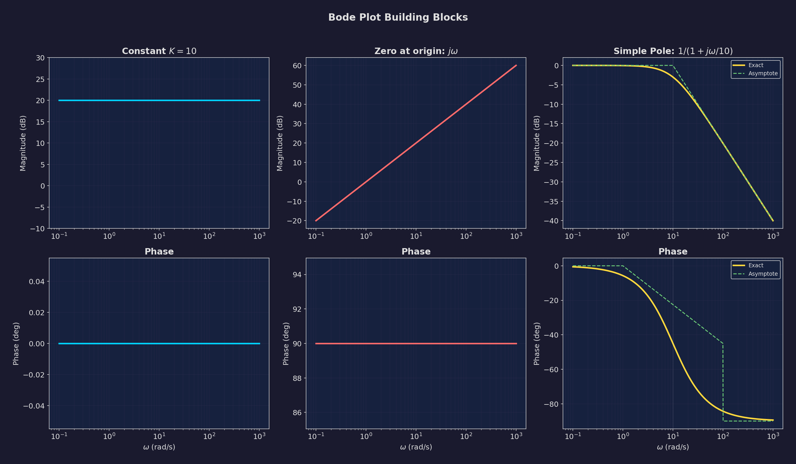
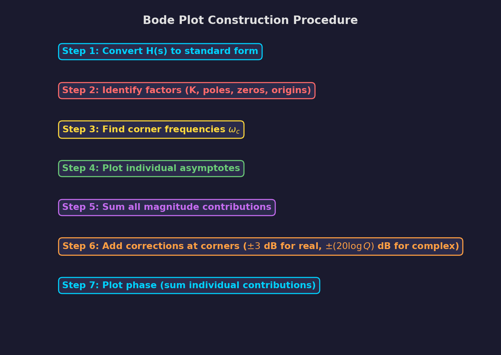
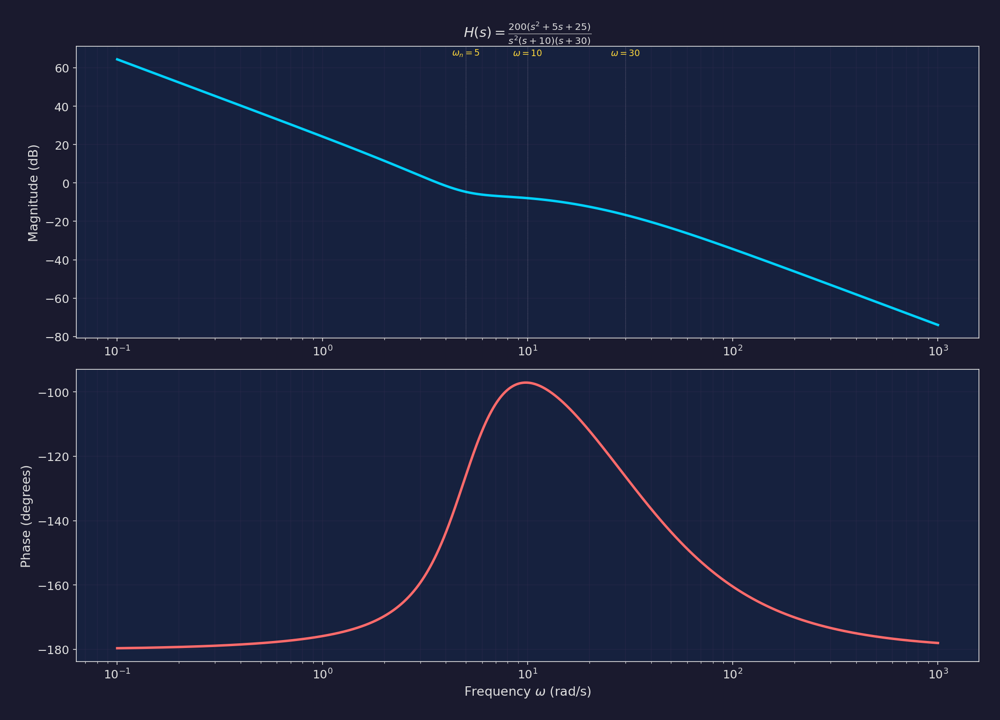
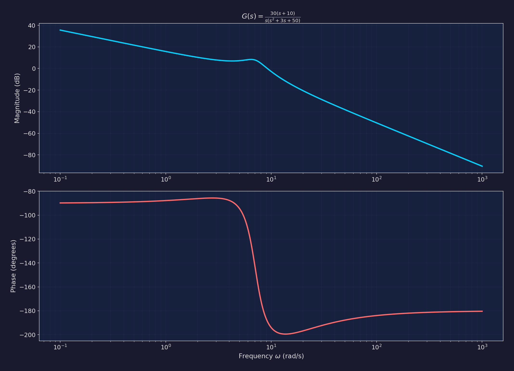

# Chapter 5: Frequency Response and Bode Plots

**Subject:** Electric Circuit Theory (EE 501)
**Program:** BE (BEL/BEX/BCT), Year/Part: II/I
**University:** Tribhuvan University, Institute of Engineering
**Teaching Hours:** 6 hrs

---

> **Why Study Frequency Response?**
> Every practical signal (speech, music, digital data, power line noise) is a combination of sinusoids at different frequencies. The frequency response tells us how a circuit treats each frequency component -- which frequencies pass through, which are amplified, and which are attenuated. This is the foundation of filter design, amplifier analysis, communication systems, and stability analysis of feedback systems.

---

## Table of Contents

1. [Frequency Response Concept](#51-frequency-response-concept)
2. [Bode Diagram Basics](#52-bode-diagram-basics)
3. [Bode Plot Building Blocks](#53-bode-plot-building-blocks)
4. [Step-by-Step Bode Plot Procedure](#54-step-by-step-bode-plot-procedure)
5. [Gain and Phase Margins](#55-gain-and-phase-margins)
6. [Worked Exam Solutions](#56-worked-exam-solutions)
7. [Quick Reference](#57-quick-reference--formula-sheet)
8. [Practice Problems](#58-practice-problems)

---

## 5.1 Frequency Response Concept

### From Transfer Function to Frequency Response

Given a transfer function $H(s)$, the **frequency response** is obtained by substituting $s = j\omega$:

$$\boxed{H(j\omega) = H(s)\big|_{s = j\omega}}$$

This is a **complex-valued function** of the real variable $\omega$:

$$H(j\omega) = |H(j\omega)| \, e^{j\phi(\omega)} = \text{Re}\{H(j\omega)\} + j\,\text{Im}\{H(j\omega)\}$$

where:
- $|H(j\omega)|$ is the **magnitude response** (gain at each frequency)
- $\phi(\omega) = \angle H(j\omega)$ is the **phase response** (phase shift at each frequency)

### Physical Interpretation

For a sinusoidal input $v_{\text{in}}(t) = V_m \sin(\omega t)$, the **steady-state output** of a linear system is:

$$v_{\text{out}}(t) = V_m |H(j\omega)| \sin\!\big(\omega t + \phi(\omega)\big)$$

- The output is a sinusoid at the **same frequency** $\omega$
- The amplitude is scaled by $|H(j\omega)|$
- The phase is shifted by $\phi(\omega)$

> **Key Insight:** A linear system cannot create new frequencies -- it can only modify the amplitude and phase of existing frequency components.

### Example: RC Low-Pass Filter

For a simple RC circuit with output across the capacitor:

$$H(s) = \frac{1/sC}{R + 1/sC} = \frac{1}{1 + sRC}$$

Substituting $s = j\omega$ and letting $\tau = RC$:

$$H(j\omega) = \frac{1}{1 + j\omega\tau}$$

**Magnitude:**

$$|H(j\omega)| = \frac{1}{\sqrt{1 + (\omega\tau)^2}}$$

**Phase:**

$$\phi(\omega) = -\arctan(\omega\tau)$$

| Frequency | $|H(j\omega)|$ | $\phi$ | Behavior |
|-----------|----------------|--------|----------|
| $\omega = 0$ | 1 | $0^\circ$ | Full pass |
| $\omega = 1/\tau$ | $1/\sqrt{2} \approx 0.707$ | $-45^\circ$ | Corner (cutoff) |
| $\omega \gg 1/\tau$ | $\approx 1/(\omega\tau)$ | $\to -90^\circ$ | Attenuated |

The frequency $\omega_c = 1/\tau = 1/(RC)$ is the **cutoff frequency** or **corner frequency** (also called the **-3 dB frequency** or **half-power frequency**).

---

## 5.2 Bode Diagram Basics

### What is a Bode Plot?

A **Bode plot** (or Bode diagram) is a pair of graphs:

1. **Magnitude plot:** $20\log_{10}|H(j\omega)|$ in dB vs. $\log_{10}(\omega)$
2. **Phase plot:** $\angle H(j\omega)$ in degrees vs. $\log_{10}(\omega)$

Both plots use a **logarithmic frequency axis** (horizontal axis).

### Why Logarithmic Scales?

1. **Wide frequency range:** Circuits often operate over many decades of frequency (e.g., 1 Hz to 1 MHz). A linear scale cannot show this.
2. **Multiplication becomes addition:** In dB, $|H_1 \cdot H_2|_{\text{dB}} = |H_1|_{\text{dB}} + |H_2|_{\text{dB}}$. This means cascaded stages can simply be **added** on the Bode plot.
3. **Straight-line approximations:** The asymptotic behavior of each factor gives straight lines, making hand-plotting feasible.

### Decibel (dB) Scale

$$\boxed{|H|_{\text{dB}} = 20\log_{10}|H(j\omega)|}$$

| $|H|$ | dB |
|-------|-----|
| 1 | 0 dB |
| 2 | 6.02 dB |
| $\sqrt{2}$ | 3.01 dB |
| $1/\sqrt{2}$ | -3.01 dB |
| 10 | 20 dB |
| 100 | 40 dB |
| 0.1 | -20 dB |
| 0.01 | -40 dB |

### Frequency Terminology

- **Decade:** A factor of 10 in frequency (e.g., from 10 rad/s to 100 rad/s)
- **Octave:** A factor of 2 in frequency (e.g., from 100 rad/s to 200 rad/s)
- **Corner frequency** ($\omega_c$): The frequency where the slope of the magnitude plot changes; also called **break frequency**

> **Conversion:** 20 dB/decade $\approx$ 6 dB/octave

---

## 5.3 Bode Plot Building Blocks

Any rational transfer function can be written in **standard Bode form**:

$$H(j\omega) = K \cdot \frac{(j\omega)^{\pm N_1} \cdot \prod\left(1 + j\omega/\omega_{z_i}\right) \cdot \prod\left(1 + j2\zeta_{z_k}(j\omega/\omega_{nz_k}) + (j\omega/\omega_{nz_k})^2\right)}{(j\omega)^{\pm N_2} \cdot \prod\left(1 + j\omega/\omega_{p_i}\right) \cdot \prod\left(1 + j2\zeta_{p_k}(j\omega/\omega_{np_k}) + (j\omega/\omega_{np_k})^2\right)}$$

Each factor in this product is a **building block** whose Bode plot contribution is known.



### 5.3.1 Constant Gain $K$

$$H(j\omega) = K$$

**Magnitude:**

$$|H|_{\text{dB}} = 20\log_{10}|K| \quad \text{(constant, independent of } \omega\text{)}$$

**Phase:**

$$\phi = \begin{cases} 0^\circ & \text{if } K > 0 \\ -180^\circ & \text{if } K < 0 \end{cases}$$

The constant shifts the entire magnitude plot up or down.

---

### 5.3.2 Zero at the Origin: $(j\omega)^N$

$$H(j\omega) = (j\omega)^N$$

**Magnitude:**

$$|H|_{\text{dB}} = 20N \log_{10}\omega$$

This is a straight line through $0\,\text{dB}$ at $\omega = 1\,\text{rad/s}$ with a slope of $+20N\,\text{dB/decade}$.

**Phase:**

$$\phi = +90^\circ \times N$$

| $N$ | Slope | Phase |
|-----|-------|-------|
| 1 | +20 dB/dec | +90 degrees |
| 2 | +40 dB/dec | +180 degrees |

---

### 5.3.3 Pole at the Origin: $1/(j\omega)^N$

$$H(j\omega) = \frac{1}{(j\omega)^N}$$

**Magnitude:**

$$|H|_{\text{dB}} = -20N \log_{10}\omega$$

Straight line through $0\,\text{dB}$ at $\omega = 1\,\text{rad/s}$ with slope $-20N\,\text{dB/decade}$.

**Phase:**

$$\phi = -90^\circ \times N$$

> **Memory Aid:** Zeros at origin have positive slope and positive phase; poles at origin have negative slope and negative phase.

---

### 5.3.4 Simple Zero: $(1 + j\omega/\omega_z)$

$$H(j\omega) = 1 + \frac{j\omega}{\omega_z}$$

**Magnitude:**

$$|H|_{\text{dB}} = 20\log_{10}\sqrt{1 + \left(\frac{\omega}{\omega_z}\right)^2}$$

**Asymptotic approximation:**

$$|H|_{\text{dB}} \approx \begin{cases} 0\,\text{dB} & \omega \ll \omega_z \\ +20\,\text{dB/decade} & \omega \gg \omega_z \end{cases}$$

**Exact value at corner frequency** ($\omega = \omega_z$):

$$|H|_{\text{dB}} = 20\log_{10}\sqrt{2} = +3.01\,\text{dB}$$

The maximum error between the asymptotic and exact curves is **3 dB** at the corner frequency.

**Phase:**

$$\phi = \arctan\left(\frac{\omega}{\omega_z}\right)$$

**Asymptotic approximation (piecewise linear):**

$$\phi \approx \begin{cases} 0^\circ & \omega \leq \omega_z/10 \\ +45^\circ/\text{decade} & \omega_z/10 < \omega < 10\omega_z \\ +90^\circ & \omega \geq 10\omega_z \end{cases}$$

At $\omega = \omega_z$: $\phi = +45^\circ$ (exact)

---

### 5.3.5 Simple Pole: $1/(1 + j\omega/\omega_p)$

$$H(j\omega) = \frac{1}{1 + j\omega/\omega_p}$$

**Magnitude:**

$$|H|_{\text{dB}} = -20\log_{10}\sqrt{1 + \left(\frac{\omega}{\omega_p}\right)^2}$$

**Asymptotic approximation:**

$$|H|_{\text{dB}} \approx \begin{cases} 0\,\text{dB} & \omega \ll \omega_p \\ -20\,\text{dB/decade} & \omega \gg \omega_p \end{cases}$$

At the corner frequency $\omega = \omega_p$: $|H|_{\text{dB}} = -3.01\,\text{dB}$

**Phase:**

$$\phi = -\arctan\left(\frac{\omega}{\omega_p}\right)$$

**Asymptotic approximation:**

$$\phi \approx \begin{cases} 0^\circ & \omega \leq \omega_p/10 \\ -45^\circ/\text{decade} & \omega_p/10 < \omega < 10\omega_p \\ -90^\circ & \omega \geq 10\omega_p \end{cases}$$

At $\omega = \omega_p$: $\phi = -45^\circ$

---

### 5.3.6 Simple Zero and Pole -- Side-by-Side Comparison

| Feature | Simple Zero $(1 + j\omega/\omega_z)$ | Simple Pole $1/(1 + j\omega/\omega_p)$ |
|---------|--------------------------------------|----------------------------------------|
| Low frequency ($\omega \ll \omega_c$) | 0 dB, $0^\circ$ | 0 dB, $0^\circ$ |
| At corner frequency | +3 dB, $+45^\circ$ | -3 dB, $-45^\circ$ |
| High frequency ($\omega \gg \omega_c$) | +20 dB/dec, $+90^\circ$ | -20 dB/dec, $-90^\circ$ |
| Slope change at corner | $0 \to +20$ dB/dec | $0 \to -20$ dB/dec |

> **Exam Tip:** Poles contribute negative slopes and negative phase; zeros contribute positive slopes and positive phase. This rule applies universally.

---

### 5.3.7 Quadratic (Complex Conjugate) Zero

$$H(j\omega) = 1 + j2\zeta\frac{\omega}{\omega_n} + \left(\frac{j\omega}{\omega_n}\right)^2 = 1 - \frac{\omega^2}{\omega_n^2} + j\frac{2\zeta\omega}{\omega_n}$$

where $\zeta$ is the **damping ratio** and $\omega_n$ is the **natural frequency**.

**Magnitude (asymptotic):**

$$|H|_{\text{dB}} \approx \begin{cases} 0\,\text{dB} & \omega \ll \omega_n \\ +40\,\text{dB/decade} & \omega \gg \omega_n \end{cases}$$

**Phase (asymptotic):**

$$\phi \approx \begin{cases} 0^\circ & \omega \ll \omega_n \\ +90^\circ & \omega = \omega_n \\ +180^\circ & \omega \gg \omega_n \end{cases}$$

**Exact at $\omega = \omega_n$:**

$$|H(j\omega_n)|_{\text{dB}} = 20\log_{10}(2\zeta)$$

| $\zeta$ | Peak/Dip at $\omega_n$ (dB) | Sharpness |
|----------|------------------------------|-----------|
| 0.05 | -26 dB (dip for pole) | Very sharp resonance |
| 0.1 | -14 dB | Sharp |
| 0.3 | -7.4 dB | Moderate |
| 0.5 | -6.0 dB | Moderate |
| 0.707 | -3.0 dB | Flat (no peak for pole) |
| 1.0 | 0 dB | Overdamped (two real poles) |

---

### 5.3.8 Quadratic (Complex Conjugate) Pole

$$H(j\omega) = \frac{1}{1 + j2\zeta(\omega/\omega_n) + (j\omega/\omega_n)^2}$$

**Magnitude (asymptotic):**

$$|H|_{\text{dB}} \approx \begin{cases} 0\,\text{dB} & \omega \ll \omega_n \\ -40\,\text{dB/decade} & \omega \gg \omega_n \end{cases}$$

**Phase (asymptotic):**

$$\phi \approx \begin{cases} 0^\circ & \omega \ll \omega_n \\ -90^\circ & \omega = \omega_n \\ -180^\circ & \omega \gg \omega_n \end{cases}$$

**Exact magnitude at $\omega = \omega_n$:**

$$|H(j\omega_n)| = \frac{1}{2\zeta}$$

$$|H(j\omega_n)|_{\text{dB}} = -20\log_{10}(2\zeta)$$

**Resonant peak:** For $\zeta < 1/\sqrt{2} \approx 0.707$, the magnitude plot has a **resonant peak** at:

$$\omega_r = \omega_n\sqrt{1 - 2\zeta^2}$$

$$|H|_{\text{peak}} = \frac{1}{2\zeta\sqrt{1 - \zeta^2}}$$

> **Important:** When $\zeta < 0.707$, the asymptotic plot underestimates the actual peak. You should indicate the peak correction on your Bode plot. When $\zeta \geq 0.707$, the quadratic factor can be factored into two real poles.

> **Exam Tip:** For most IOE problems, if a quadratic factor cannot be factored into real terms (discriminant is negative), treat it as a complex conjugate pair with $\omega_n$ and $\zeta$ computed from the coefficients.

---

### Building Blocks Summary Table

| Factor | Magnitude Slope | Phase Change | Corner/Break |
|--------|----------------|-------------|-------------|
| $K$ | 0 (flat) | $0^\circ$ or $180^\circ$ | -- |
| $(j\omega)^N$ | $+20N$ dB/dec | $+90N^\circ$ | Through $\omega=1$ |
| $1/(j\omega)^N$ | $-20N$ dB/dec | $-90N^\circ$ | Through $\omega=1$ |
| $(1 + j\omega/\omega_z)$ | $0 \to +20$ dB/dec | $0^\circ \to +90^\circ$ | At $\omega_z$ |
| $1/(1 + j\omega/\omega_p)$ | $0 \to -20$ dB/dec | $0^\circ \to -90^\circ$ | At $\omega_p$ |
| Quadratic zero | $0 \to +40$ dB/dec | $0^\circ \to +180^\circ$ | At $\omega_n$ |
| Quadratic pole | $0 \to -40$ dB/dec | $0^\circ \to -180^\circ$ | At $\omega_n$ |

---

## 5.4 Step-by-Step Bode Plot Procedure

### The Systematic Approach

```
STEP 1: Convert H(s) to Standard Bode Form
   - Factor out constants so each factor is of the form (1 + s/ω_c)
   - Express quadratic factors in standard form with ω_n and ζ
   - Compute the overall gain constant K_B (the Bode gain)

STEP 2: Identify All Corner Frequencies
   - List all zeros (ω_z1, ω_z2, ...) including multiplicity
   - List all poles (ω_p1, ω_p2, ...) including multiplicity
   - Note any poles/zeros at the origin

STEP 3: Draw Magnitude Plot
   a) Start at the lowest frequency (well below smallest corner)
   b) Compute starting magnitude from K_B and origin terms
   c) At each corner frequency, change the slope:
      - Zero: slope increases by +20 dB/dec
      - Pole: slope decreases by -20 dB/dec
      - Quadratic zero: slope increases by +40 dB/dec
      - Quadratic pole: slope decreases by -40 dB/dec
   d) Mark the 3 dB corrections at each corner

STEP 4: Draw Phase Plot
   a) Start with phase from K_B and origin terms
   b) Each simple zero/pole changes phase by ±90° over 2 decades
      (centered at corner frequency)
   c) Each quadratic factor changes phase by ±180° over ~2 decades
   d) Sum all phase contributions at each frequency

STEP 5: Mark Key Points
   - Corner frequencies with exact values
   - Slopes in dB/decade
   - Phase at important frequencies
   - Gain and phase margins (if applicable)
```



### Converting to Standard Bode Form

**Critical Step:** The transfer function must be rewritten so that each first-order factor has the form $(1 + j\omega/\omega_c)$, not $(s + \omega_c)$.

**Example:**

$$H(s) = \frac{100(s + 5)}{s(s + 20)(s + 50)}$$

Factor out the corner frequencies from each term:

$$H(s) = \frac{100 \cdot 5 \cdot (1 + s/5)}{s \cdot 20 \cdot (1 + s/20) \cdot 50 \cdot (1 + s/50)}$$

$$= \frac{100 \cdot 5}{20 \cdot 50} \cdot \frac{(1 + s/5)}{s(1 + s/20)(1 + s/50)}$$

$$= \frac{500}{1000} \cdot \frac{(1 + s/5)}{s(1 + s/20)(1 + s/50)}$$

$$= \frac{0.5(1 + s/5)}{s(1 + s/20)(1 + s/50)}$$

So the **Bode gain** is $K_B = 0.5$, and the corner frequencies are $\omega_{z1} = 5$, $\omega_{p1} = 20$, $\omega_{p2} = 50$ rad/s.

> **Common Mistake:** Students often forget to extract the corner frequencies from the factors before computing $K_B$. The form $(s + 5)$ is NOT the Bode form -- you must write it as $5(1 + s/5)$.

### Determining the Starting Point

At the lowest frequency of interest:

1. **No pole/zero at origin:** Start at $20\log_{10}|K_B|$ dB with zero slope
2. **Single pole at origin ($1/s$):** Start with $-20\,\text{dB/dec}$ slope, passing through $20\log_{10}|K_B|$ dB at $\omega = 1\,\text{rad/s}$
3. **Double pole at origin ($1/s^2$):** Start with $-40\,\text{dB/dec}$ slope, etc.
4. **Zero at origin ($s$):** Start with $+20\,\text{dB/dec}$ slope

### Phase Computation at Key Points

For a quick check, the **total phase** at any frequency $\omega$ is:

$$\phi_{\text{total}}(\omega) = \phi_K + \sum_{\text{zeros}} \arctan\left(\frac{\omega}{\omega_{z_i}}\right) - \sum_{\text{poles}} \arctan\left(\frac{\omega}{\omega_{p_i}}\right) + 90^\circ \times (\text{zeros at origin}) - 90^\circ \times (\text{poles at origin})$$

where $\phi_K = 0^\circ$ if $K > 0$ and $\phi_K = -180^\circ$ if $K < 0$.

---

## 5.5 Gain and Phase Margins

### Definitions

**Gain Crossover Frequency** ($\omega_{gc}$): The frequency where $|H(j\omega)| = 1$ (i.e., $0\,\text{dB}$).

**Phase Crossover Frequency** ($\omega_{pc}$): The frequency where $\angle H(j\omega) = -180^\circ$.

**Gain Margin (GM):**

$$\boxed{GM = -20\log_{10}|H(j\omega_{pc})| \quad \text{dB}}$$

or equivalently:

$$GM = \frac{1}{|H(j\omega_{pc})|}$$

This is the additional gain (in dB) that can be added before the system becomes unstable.

**Phase Margin (PM):**

$$\boxed{PM = 180^\circ + \angle H(j\omega_{gc})}$$

This is how far the phase is from $-180^\circ$ at the gain crossover frequency.

### Stability Interpretation

| Condition | System Status |
|-----------|---------------|
| $GM > 0\,\text{dB}$ and $PM > 0^\circ$ | **Stable** |
| $GM = 0\,\text{dB}$ or $PM = 0^\circ$ | **Marginally stable** |
| $GM < 0\,\text{dB}$ or $PM < 0^\circ$ | **Unstable** |

### Typical Design Requirements

- $GM \geq 6\,\text{dB}$ (factor of 2 safety margin)
- $PM \geq 45^\circ$ (good transient response)
- $PM \geq 60^\circ$ (conservative, well-damped response)

### Reading Margins from Bode Plot

1. **For Gain Margin:**
   - Find $\omega_{pc}$ where the phase plot crosses $-180^\circ$
   - Read the magnitude at $\omega_{pc}$
   - $GM$ is the distance (in dB) between that magnitude and $0\,\text{dB}$
   - If the magnitude is below $0\,\text{dB}$, $GM$ is positive (stable)

2. **For Phase Margin:**
   - Find $\omega_{gc}$ where the magnitude plot crosses $0\,\text{dB}$
   - Read the phase at $\omega_{gc}$
   - $PM = 180^\circ + \phi(\omega_{gc})$
   - If the phase is above $-180^\circ$, $PM$ is positive (stable)

> **Exam Tip:** When drawing the Bode plot, always mark the gain and phase crossover frequencies clearly and indicate the margins. Examiners specifically look for this.

---

## 5.6 Worked Exam Solutions

### Q1: Bode Plot with Quadratic Zero and Multiple Poles

> **Problem (2082 Baishakh, Q4b):** Draw the approximate Bode plot of:
>
> $$H(s) = \frac{200(s^2 + 5s + 25)}{s^2(s + 10)(s + 30)}$$

#### Step 1: Convert to Standard Bode Form

First, identify the factors:
- Numerator: $200 \times (s^2 + 5s + 25)$
- Denominator: $s^2 \times (s+10) \times (s+30)$

**Quadratic factor analysis:** $s^2 + 5s + 25$

Compare with standard form $\omega_n^2\left[1 + 2\zeta(s/\omega_n) + (s/\omega_n)^2\right]$:

$$\omega_n^2 = 25 \implies \omega_n = 5 \,\text{rad/s}$$

$$2\zeta\omega_n = 5 \implies \zeta = \frac{5}{2 \times 5} = 0.5$$

So: $s^2 + 5s + 25 = 25\left[1 + \dfrac{s}{5} + \left(\dfrac{s}{5}\right)^2\right] = 25\left[1 + j2(0.5)\dfrac{\omega}{5} + \left(\dfrac{j\omega}{5}\right)^2\right]$

Wait, let me be more careful. In standard form:

$$s^2 + 5s + 25 = 25\left[\frac{s^2}{25} + \frac{s}{5} + 1\right] = 25\left[1 + \frac{s}{5} + \frac{s^2}{25}\right]$$

Comparing with $\omega_n^2\left[1 + 2\zeta\frac{s}{\omega_n} + \frac{s^2}{\omega_n^2}\right]$, we get $\omega_n = 5$, $2\zeta/\omega_n = 1/5$, so $\zeta = \omega_n/(2 \times 5) = 5/10 = 0.5$.

Now convert the pole factors:

$$(s + 10) = 10\left(1 + \frac{s}{10}\right), \qquad (s + 30) = 30\left(1 + \frac{s}{30}\right)$$

Putting it all together:

$$H(s) = \frac{200 \times 25 \times \left[1 + s/5 + s^2/25\right]}{s^2 \times 10(1 + s/10) \times 30(1 + s/30)}$$

$$= \frac{200 \times 25}{10 \times 30} \cdot \frac{\left[1 + s/5 + s^2/25\right]}{s^2(1 + s/10)(1 + s/30)}$$

$$= \frac{5000}{300} \cdot \frac{\left[1 + s/5 + s^2/25\right]}{s^2(1 + s/10)(1 + s/30)}$$

$$\boxed{K_B = \frac{50}{3} \approx 16.67}$$

$$20\log_{10}(50/3) = 20\log_{10}(16.67) \approx 24.44\,\text{dB}$$

#### Step 2: Identify Corner Frequencies

| Factor | Type | Corner Frequency | Slope Change |
|--------|------|-----------------|-------------|
| $s^2$ | Double pole at origin | -- | $-40$ dB/dec (initial) |
| Quadratic zero ($\zeta=0.5, \omega_n=5$) | Complex zero pair | $\omega_n = 5$ rad/s | $+40$ dB/dec |
| $1/(1+s/10)$ | Simple pole | $\omega_p = 10$ rad/s | $-20$ dB/dec |
| $1/(1+s/30)$ | Simple pole | $\omega_p = 30$ rad/s | $-20$ dB/dec |

**Corner frequencies in order:** $\omega_n = 5$, $\omega_{p1} = 10$, $\omega_{p2} = 30$ rad/s

#### Step 3: Magnitude Plot Construction

**Starting point:** We have a double pole at the origin ($1/s^2$), so the initial slope is $-40\,\text{dB/decade}$.

At $\omega = 1\,\text{rad/s}$:

$$|H|_{\text{dB}} = 20\log_{10}(K_B) + 20 \times (-2) \times \log_{10}(1) = 24.44 + 0 = 24.44\,\text{dB}$$

Actually, for a transfer function with poles at the origin, let's be more careful. We need to find the magnitude at a reference frequency.

The magnitude on the asymptotic plot is determined by the $1/\omega^2$ term from the origin poles. At $\omega = 1$:

$$|H(j\omega)|_{\text{dB}} \approx 20\log_{10}\left(\frac{K_B}{\omega^2}\right) = 20\log_{10}(K_B) - 40\log_{10}(\omega)$$

At $\omega = 1$: $|H|_{\text{dB}} = 20\log_{10}(16.67) \approx 24.44\,\text{dB}$

**Tracing the magnitude plot:**

| Frequency Range | Slope | Cumulative |
|----------------|-------|------------|
| $\omega < 5$ | $-40$ dB/dec | From double pole at origin |
| $5 < \omega < 10$ | $-40 + 40 = 0$ dB/dec | Quadratic zero adds +40 |
| $10 < \omega < 30$ | $0 - 20 = -20$ dB/dec | Pole at 10 adds -20 |
| $\omega > 30$ | $-20 - 20 = -40$ dB/dec | Pole at 30 adds -20 |

**Key magnitude values:**

At $\omega = 1$: $24.44\,\text{dB}$

At $\omega = 5$ (tracing from $\omega = 1$ with $-40\,\text{dB/dec}$):

$$24.44 - 40\log_{10}(5/1) = 24.44 - 40(0.699) = 24.44 - 27.96 = -3.52\,\text{dB}$$

**Correction at $\omega = 5$** (quadratic zero with $\zeta = 0.5$):

$$\text{Correction} = 20\log_{10}(2\zeta) = 20\log_{10}(1.0) = 0\,\text{dB}$$

So the exact value at $\omega = 5$ is approximately $-3.52 + 0 = -3.52\,\text{dB}$.

At $\omega = 10$ (tracing from $\omega = 5$ with $0\,\text{dB/dec}$ slope):

$$-3.52 + 0 = -3.52\,\text{dB}$$

**Correction at $\omega = 10$** (simple pole): $-3\,\text{dB}$, so exact $\approx -6.52\,\text{dB}$

At $\omega = 30$ (tracing from $\omega = 10$ with $-20\,\text{dB/dec}$):

$$-3.52 - 20\log_{10}(30/10) = -3.52 - 20(0.477) = -3.52 - 9.54 = -13.06\,\text{dB}$$

**Correction at $\omega = 30$**: $-3\,\text{dB}$, so exact $\approx -16.06\,\text{dB}$

At $\omega = 100$ (tracing from $\omega = 30$ with $-40\,\text{dB/dec}$):

$$-13.06 - 40\log_{10}(100/30) = -13.06 - 40(0.523) = -13.06 - 20.92 = -33.98\,\text{dB}$$

#### Step 4: Phase Plot Construction

**Phase contributions:**

1. **Constant $K_B > 0$:** $0^\circ$
2. **Double pole at origin:** $-180^\circ$ (constant)
3. **Quadratic zero** ($\omega_n = 5$, $\zeta = 0.5$): $0^\circ \to +180^\circ$ transition centered around $\omega = 5$
4. **Simple pole at 10:** $0^\circ \to -90^\circ$ transition centered at $\omega = 10$
5. **Simple pole at 30:** $0^\circ \to -90^\circ$ transition centered at $\omega = 30$

**Phase at key frequencies:**

At $\omega \to 0$: $\phi = 0 + (-180) + 0 + 0 + 0 = -180^\circ$

At $\omega = 5$: $\phi \approx 0 + (-180) + 90 + (-\arctan(0.5)) + (-\arctan(5/30))$
$= -180 + 90 - 26.6 - 9.5 = -126.1^\circ$

At $\omega = 10$: $\phi \approx 0 + (-180) + \arctan\left(\frac{2(0.5)(10/5)}{1-(10/5)^2}\right)^\dagger + (-45) + (-\arctan(10/30))$

For the quadratic zero at $\omega = 10$: The phase is $\arctan\left(\frac{2\zeta(\omega/\omega_n)}{1 - (\omega/\omega_n)^2}\right)$

$$= \arctan\left(\frac{2(0.5)(2)}{1-4}\right) = \arctan\left(\frac{2}{-3}\right) = 180^\circ - 33.7^\circ = 146.3^\circ$$

(Note: since $\omega > \omega_n$ and denominator is negative, we are in the second quadrant, so phase is between $90^\circ$ and $180^\circ$.)

$\phi(10) = 0 - 180 + 146.3 - 45 - 18.4 = -97.1^\circ$

At $\omega = 30$: Quadratic zero phase $\approx 170^\circ$, pole at 10 gives $-71.6^\circ$, pole at 30 gives $-45^\circ$

$\phi(30) \approx 0 - 180 + 170 - 71.6 - 45 = -126.6^\circ$

At $\omega \to \infty$: $\phi = 0 + (-180) + 180 + (-90) + (-90) = -180^\circ$



#### Summary of Asymptotic Bode Plot

**Magnitude:**
- Starts at $-40\,\text{dB/dec}$ slope
- At $\omega = 5$: slope changes to $0\,\text{dB/dec}$
- At $\omega = 10$: slope changes to $-20\,\text{dB/dec}$
- At $\omega = 30$: slope changes to $-40\,\text{dB/dec}$

**Phase:**
- Starts at $-180^\circ$
- Transitions through the quadratic zero and two poles
- Ends at $-180^\circ$

---

### Q2: Bode Plot with Complex Pole Pair

> **Problem:** Draw the Bode plot for:
>
> $$G(s) = \frac{30(s + 10)}{s(s^2 + 3s + 50)}$$

#### Step 1: Convert to Standard Bode Form

**Analyze the quadratic factor:** $s^2 + 3s + 50$

$$\omega_n^2 = 50 \implies \omega_n = \sqrt{50} = 5\sqrt{2} \approx 7.07\,\text{rad/s}$$

$$2\zeta\omega_n = 3 \implies \zeta = \frac{3}{2 \times 7.07} = \frac{3}{14.14} \approx 0.212$$

Since $\zeta < 0.707$, there will be a **resonant peak** in the magnitude plot.

**Standard Bode form:**

$$G(s) = \frac{30 \times 10 \times (1 + s/10)}{s \times 50 \times \left[1 + \frac{3s}{50} + \frac{s^2}{50}\right]}$$

$$= \frac{300}{50} \cdot \frac{(1 + s/10)}{s\left[1 + \frac{3s}{50} + \frac{s^2}{50}\right]}$$

$$K_B = 6$$

$$20\log_{10}(6) = 15.56\,\text{dB}$$

#### Step 2: Identify Corner Frequencies

| Factor | Type | Corner | Slope Change |
|--------|------|--------|-------------|
| $s$ | Pole at origin | -- | $-20$ dB/dec (initial) |
| $1 + s/10$ | Simple zero | $\omega_z = 10$ | $+20$ dB/dec |
| Quadratic pole ($\zeta = 0.212, \omega_n = 7.07$) | Complex pole pair | $\omega_n = 7.07$ | $-40$ dB/dec |

**Ordered:** $\omega_n = 7.07$, $\omega_z = 10$

#### Step 3: Magnitude Plot

**Starting slope:** $-20\,\text{dB/dec}$ (single pole at origin)

At $\omega = 1$: $|G|_{\text{dB}} = 20\log_{10}(K_B/\omega) = 20\log_{10}(6) = 15.56\,\text{dB}$

**Tracing:**

| Frequency Range | Slope | Notes |
|----------------|-------|-------|
| $\omega < 7.07$ | $-20$ dB/dec | Only origin pole active |
| $7.07 < \omega < 10$ | $-20 - 40 = -60$ dB/dec | Quadratic pole kicks in |
| $\omega > 10$ | $-60 + 20 = -40$ dB/dec | Zero at 10 adds +20 |

**Key values:**

At $\omega = 7.07$:

$$\text{Asymptotic} = 15.56 - 20\log_{10}(7.07) = 15.56 - 16.99 = -1.43\,\text{dB}$$

**Resonant peak correction** ($\zeta = 0.212$):

$$\text{Peak at } \omega_n = \frac{1}{2\zeta} = \frac{1}{0.424} = 2.358$$

$$20\log_{10}(2.358) = 7.45\,\text{dB} \text{ above asymptote}$$

So the actual magnitude near $\omega_n$: $-1.43 + 7.45 = 6.02\,\text{dB}$

Actually, the correction is:

$$|G(j\omega_n)| \text{ (exact)} = K_B \cdot \frac{|1 + j\omega_n/10|}{|\omega_n| \cdot |2\zeta|}$$

Let me compute more carefully at $\omega = \omega_n = 7.07$:

$$|1 + j(7.07)/10| = |1 + j0.707| = \sqrt{1 + 0.5} = 1.225$$

$$|G(j7.07)| = \frac{6 \times 1.225}{7.07 \times 2(0.212)} = \frac{7.35}{3.0} = 2.45$$

$$20\log_{10}(2.45) = 7.78\,\text{dB}$$

At $\omega = 10$:

Asymptotic (continuing $-60\,\text{dB/dec}$ from $\omega = 7.07$):

$$-1.43 - 60\log_{10}(10/7.07) = -1.43 - 60(0.15) = -1.43 - 9.03 = -10.46\,\text{dB}$$

**Simple zero correction at $\omega = 10$:** $+3\,\text{dB}$, so exact $\approx -7.46\,\text{dB}$

At $\omega = 100$:

$$-10.46 - 40\log_{10}(100/10) = -10.46 - 40 = -50.46\,\text{dB}$$

#### Step 4: Phase Plot

**Phase contributions at key frequencies:**

At $\omega \to 0$:
$\phi = -90^\circ$ (from pole at origin only; all other factors at $0^\circ$)

At $\omega = 7.07$ ($\omega_n$):
- Origin pole: $-90^\circ$
- Quadratic pole at $\omega_n$: $-90^\circ$
- Simple zero at 10: $+\arctan(7.07/10) = +35.3^\circ$

$\phi = -90 - 90 + 35.3 = -144.7^\circ$

At $\omega = 10$:
- Origin pole: $-90^\circ$
- Quadratic pole: $\approx -128^\circ$ (computed from $\arctan\frac{2\zeta(\omega/\omega_n)}{1-(\omega/\omega_n)^2}$)
  
  $\omega/\omega_n = 10/7.07 = 1.414$
  
  Numerator: $2(0.212)(1.414) = 0.6$
  
  Denominator: $1 - 2 = -1$
  
  $\theta = 180^\circ - \arctan(0.6) = 180^\circ - 31^\circ = 149^\circ$
  
  Phase contribution of pole: $-149^\circ$

- Simple zero at 10: $+45^\circ$

$\phi = -90 - 149 + 45 = -194^\circ$

Wait, this indicates that the phase crosses $-180^\circ$ near $\omega = 10$, which is important for stability analysis.

At $\omega \to \infty$:
$\phi = -90 - 180 + 90 = -180^\circ$



#### Key Observations

1. The **resonant peak** at $\omega \approx 7$ rad/s is very pronounced ($\zeta = 0.212$ is quite underdamped)
2. The phase drops rapidly near the quadratic pole frequency
3. The final high-frequency slope is $-40\,\text{dB/dec}$ (one pole at origin + quadratic pole - one zero = $-1 - 2 + 1 = -2$ net poles)
4. The final phase is $-180^\circ$ ($-90 - 180 + 90 = -180$)

---

### Q3: Frequency Response with Multiple Factors

> **Problem:** Explain the significance of frequency response. Draw the Bode plot for:
>
> $$G(j\omega) = \frac{15\left(1 + \frac{j\omega}{10}\right)}{j\omega\left(1 + \frac{j\omega}{2}\right)\left(1 + j0.6\frac{j\omega}{50} + \left(\frac{j\omega}{50}\right)^2\right)}$$

#### Significance of Frequency Response

Frequency response is the steady-state response of a system to sinusoidal inputs across all frequencies. Its significance includes:

1. **System characterization:** Completely characterizes an LTI system's behavior
2. **Filter design:** Determines which frequencies pass and which are rejected
3. **Stability analysis:** Gain and phase margins can be directly read from Bode plots
4. **Bandwidth determination:** Defines the useful frequency range of the system
5. **Resonance identification:** Peaks in magnitude reveal resonant frequencies
6. **Experimental measurement:** Can be measured directly without knowing the system's internal structure

#### Bode Plot Construction Approach

The transfer function is already in standard Bode form. Let us identify the factors:

**Gain constant:** $K_B = 15$

$$20\log_{10}(15) = 23.52\,\text{dB}$$

**Quadratic factor analysis:** $1 + j0.6\dfrac{j\omega}{50} + \left(\dfrac{j\omega}{50}\right)^2$

$$= 1 + j\frac{2\zeta \cdot \omega}{\omega_n} + \left(\frac{j\omega}{\omega_n}\right)^2$$

Comparing: $\omega_n = 50\,\text{rad/s}$, and $\dfrac{2\zeta}{\omega_n} = \dfrac{0.6}{50}$, so $2\zeta = 0.6$, hence $\zeta = 0.3$.

Wait, let me re-read the problem. The quadratic is written as $1 + j0.6\frac{j\omega}{50} + \left(\frac{j\omega}{50}\right)^2$.

This is a bit ambiguous. The standard form is $1 + j2\zeta\frac{\omega}{\omega_n} + \left(\frac{j\omega}{\omega_n}\right)^2$.

Let me interpret the coefficient $0.6$ as $2\zeta$. Then $\zeta = 0.3$ and $\omega_n = 50$.

Actually, re-reading more carefully: $1 + j0.6\frac{j\omega}{50} + \left(\frac{j\omega}{50}\right)^2 = 1 + j \cdot 0.6 \cdot \frac{j\omega}{50} + \frac{(j\omega)^2}{2500}$.

Hmm, the $j \cdot 0.6 \cdot \frac{j\omega}{50} = \frac{0.6 j^2 \omega}{50} = \frac{-0.6\omega}{50}$. That would give a real term, not the standard form.

This seems to be a formatting issue in the problem statement. The most likely intended form is:

$$1 + j\frac{2\zeta\omega}{\omega_n} + \left(\frac{j\omega}{\omega_n}\right)^2 \quad \text{with } 2\zeta = 0.6, \; \omega_n = 50$$

So $\zeta = 0.3$ and $\omega_n = 50$ rad/s. Since $\zeta < 0.707$, expect a resonant peak.

#### Corner Frequencies

| Factor | Type | Corner |
|--------|------|--------|
| $j\omega$ | Pole at origin | -- |
| $(1 + j\omega/10)$ | Simple zero | $\omega_z = 10$ |
| $(1 + j\omega/2)$ | Simple pole | $\omega_p = 2$ |
| Quadratic pole ($\zeta=0.3, \omega_n=50$) | Complex pole pair | $\omega_n = 50$ |

**Ordered:** $\omega_p = 2$, $\omega_z = 10$, $\omega_n = 50$

#### Magnitude Slope Tracking

| Frequency Range | Slope |
|----------------|-------|
| $\omega < 2$ | $-20$ dB/dec (origin pole) |
| $2 < \omega < 10$ | $-20 - 20 = -40$ dB/dec |
| $10 < \omega < 50$ | $-40 + 20 = -20$ dB/dec |
| $\omega > 50$ | $-20 - 40 = -60$ dB/dec |

#### Starting Value

At $\omega = 1$: $|G|_{\text{dB}} = 20\log_{10}(15/1) = 23.52\,\text{dB}$

#### Key Magnitude Values

At $\omega = 2$: $23.52 - 20\log_{10}(2) = 23.52 - 6.02 = 17.5\,\text{dB}$

At $\omega = 10$: $17.5 - 40\log_{10}(10/2) = 17.5 - 40(0.699) = 17.5 - 27.96 = -10.46\,\text{dB}$

At $\omega = 50$: $-10.46 - 20\log_{10}(50/10) = -10.46 - 20(0.699) = -10.46 - 13.98 = -24.44\,\text{dB}$

**Correction at $\omega_n = 50$ with $\zeta = 0.3$:**
Peak correction = $20\log_{10}(1/(2 \times 0.3)) = 20\log_{10}(1.667) = 4.44\,\text{dB}$ above asymptote

Exact at $\omega = 50$: $\approx -24.44 + 4.44 = -20.0\,\text{dB}$

#### Phase

At $\omega \to 0$: $\phi = -90^\circ$

At $\omega = 2$: $\phi = -90 - 45 + \arctan(2/10) + 0 = -90 - 45 + 11.3 = -123.7^\circ$

At $\omega = 10$: $\phi = -90 - \arctan(10/2) + 45 - \text{(small quad contribution)}$
$= -90 - 78.7 + 45 - 5.9 = -129.6^\circ$

At $\omega = 50$: $\phi = -90 - \arctan(50/2) + \arctan(50/10) - 90$
$= -90 - 87.7 + 78.7 - 90 = -189^\circ$

At $\omega \to \infty$: $\phi = -90 - 90 + 90 - 180 = -270^\circ$

#### Final High-Frequency Slope

Net excess poles = (1 + 2) - 1 = 2 additional poles beyond zeros, plus 1 at origin = 3 net poles

Final slope = $-60\,\text{dB/decade}$

Final phase = $-270^\circ$ = $-90 \times 3$

---

## 5.7 Quick Reference / Formula Sheet

> **Keep this summary handy during exam preparation!**

### Decibel Conversions

| Value | dB |
|-------|-----|
| 1 | 0 dB |
| 2 | 6 dB |
| 5 | 14 dB |
| 10 | 20 dB |
| 100 | 40 dB |
| 0.5 | -6 dB |
| 0.1 | -20 dB |
| $1/\sqrt{2}$ | -3 dB |

### Slope Summary

| Factor | Magnitude Slope Change | Phase Change |
|--------|----------------------|--------------|
| Constant $K > 0$ | 0 | $0^\circ$ |
| Constant $K < 0$ | 0 | $-180^\circ$ |
| $(j\omega)$ | +20 dB/dec | $+90^\circ$ |
| $1/(j\omega)$ | -20 dB/dec | $-90^\circ$ |
| $(1+j\omega/\omega_z)$ | 0 to +20 at $\omega_z$ | $0^\circ$ to $+90^\circ$ |
| $1/(1+j\omega/\omega_p)$ | 0 to -20 at $\omega_p$ | $0^\circ$ to $-90^\circ$ |
| Quadratic zero | 0 to +40 at $\omega_n$ | $0^\circ$ to $+180^\circ$ |
| Quadratic pole | 0 to -40 at $\omega_n$ | $0^\circ$ to $-180^\circ$ |

### Correction at Corner Frequency

| Factor Type | Magnitude Correction |
|-------------|---------------------|
| Simple zero/pole | $\pm 3$ dB |
| Quadratic ($\zeta$) | $\pm 20\log_{10}(2\zeta)$ dB |

### Phase Transition Rule

- Simple zero/pole: Phase changes by $\pm 90^\circ$ over **2 decades** (from $\omega_c/10$ to $10\omega_c$)
- Quadratic: Phase changes by $\pm 180^\circ$ over approximately **2 decades** centered at $\omega_n$
- Exact phase at corner: $\pm 45^\circ$ (simple), $\pm 90^\circ$ (quadratic)

### Stability Margins

$$GM = -|H(j\omega_{pc})|_{\text{dB}} \quad \text{(at phase crossover)}$$

$$PM = 180^\circ + \angle H(j\omega_{gc}) \quad \text{(at gain crossover)}$$

**Stable if:** $GM > 0\,\text{dB}$ **AND** $PM > 0^\circ$

### Standard Bode Form Conversion

Given: $H(s) = \dfrac{K_0 \prod(s + z_i)}{\prod(s + p_j)}$

Bode form: $H(s) = K_B \cdot \dfrac{\prod(1 + s/z_i)}{\prod(1 + s/p_j)}$

where $K_B = K_0 \cdot \dfrac{\prod z_i}{\prod p_j}$

### Quadratic Factor Identification

Given $s^2 + bs + c$:

$$\omega_n = \sqrt{c}, \qquad \zeta = \frac{b}{2\omega_n} = \frac{b}{2\sqrt{c}}$$

Standard form: $\omega_n^2 \left[1 + 2\zeta\dfrac{s}{\omega_n} + \left(\dfrac{s}{\omega_n}\right)^2\right]$

---

## 5.8 Practice Problems

### Problem Set A: Basic Bode Plots

1. **Simple first-order system:** Draw the Bode plot for $H(s) = \dfrac{10}{s + 10}$.
   - Identify the corner frequency, starting magnitude, and slopes.
   - [Ans: Corner at $\omega = 10$, starting at 0 dB, then $-20$ dB/dec]

2. **First-order with zero:** Draw the Bode plot for $H(s) = \dfrac{s + 1}{s + 100}$.
   - [Hint: $K_B = 1/100 = 0.01$, $-40\,\text{dB}$ at low frequencies]

3. **Two poles:** Draw the Bode plot for $H(s) = \dfrac{1000}{(s+10)(s+100)}$.

### Problem Set B: Multi-Factor Systems

4. Draw the Bode plot for $H(s) = \dfrac{10(s+1)}{s(s+10)}$.
   Find the gain crossover frequency and phase margin.

5. Draw the Bode plot for $H(s) = \dfrac{50(s+5)}{s(s+1)(s+25)}$.

6. For $H(s) = \dfrac{100}{s(s+2)(s+5)}$, draw the Bode plot and determine the gain and phase margins.

### Problem Set C: Quadratic Factors

7. Draw the Bode plot for $H(s) = \dfrac{100}{s^2 + 2s + 100}$.
   - Identify $\omega_n$ and $\zeta$. Is there a resonant peak?
   - [Ans: $\omega_n = 10$, $\zeta = 0.1$, yes -- large peak of 14 dB]

8. Draw the Bode plot for $H(s) = \dfrac{500(s^2 + 4s + 100)}{s(s+5)(s+50)}$.

### Problem Set D: Past Exam Questions

9. **(2082 Baishakh, Q4b)** Draw the approximate Bode plot for:
   $H(s) = \dfrac{200(s^2 + 5s + 25)}{s^2(s+10)(s+30)}$ [Solved in Q1 above]

10. **(2081 Bhadra)** For the transfer function $G(s) = \dfrac{30(s+10)}{s(s^2+3s+50)}$, draw the Bode magnitude and phase plots. [Solved in Q2 above]

11. Draw the Bode plot and find the gain and phase margins for:
    $G(s) = \dfrac{20}{s(1 + 0.1s)(1 + 0.05s)}$

12. A system has the open-loop transfer function $G(s) = \dfrac{K}{s(s+2)(s+10)}$. Find the value of $K$ for which the gain margin is exactly 6 dB.

---

## Common Mistakes and Exam Tips

> **Mistake 1: Not converting to standard Bode form**
> You MUST factor out corner frequencies so each term looks like $(1 + s/\omega_c)$ before computing $K_B$. The factor $(s + 10)$ is NOT in Bode form -- it should be $10(1 + s/10)$.

> **Mistake 2: Wrong initial slope**
> The initial slope is determined by the pole/zero at the origin. One pole at origin = $-20$ dB/dec. Two poles = $-40$ dB/dec. No poles at origin = $0$ dB/dec (flat). Getting this wrong shifts the entire plot.

> **Mistake 3: Forgetting the phase of negative $K$**
> If $K_B < 0$, add $-180^\circ$ to the phase. Some students forget this and get the wrong starting phase.

> **Mistake 4: Not marking corrections at corner frequencies**
> The asymptotic plot has a 3 dB error at each simple corner and a potentially large error at quadratic corners (especially for small $\zeta$). Examiners expect you to at least note these corrections.

> **Mistake 5: Confusing $\omega_n$ with the resonant peak frequency**
> For a quadratic pole, $\omega_n$ is the natural frequency (where the asymptotic slope changes). The actual resonant peak occurs at $\omega_r = \omega_n\sqrt{1 - 2\zeta^2}$, which is slightly below $\omega_n$ when $\zeta < 0.707$.

> **Mistake 6: Phase plot errors with quadratic factors**
> For quadratic poles/zeros with small $\zeta$, the phase transition is very steep near $\omega_n$. The approximate piecewise linear phase is less accurate than for simple poles/zeros. When in doubt, calculate the exact phase at a few key points.

> **Exam Strategy:**
> 1. Always start by converting to standard Bode form and computing $K_B$
> 2. List all corner frequencies in ascending order
> 3. Build a table of slopes and compute magnitudes at each corner
> 4. Draw magnitude plot first (it's more mechanical)
> 5. Then draw phase plot using the transition rules
> 6. Mark GM and PM if asked
> 7. Double-check: final slope = $-20 \times (\text{net excess poles})$ dB/dec

---

## Relationship Between Chapter 4 and Chapter 5

The **transfer function** $H(s)$ from Chapter 4 is the foundation for frequency response in Chapter 5:

$$H(s) \xrightarrow{s = j\omega} H(j\omega) = |H(j\omega)|\angle\phi(\omega) \xrightarrow{\text{plot}} \text{Bode Diagram}$$

The **poles** from Chapter 4 directly determine the corner frequencies and slopes of the Bode plot:

| Chapter 4 Concept | Chapter 5 Application |
|-------------------|----------------------|
| Poles of $H(s)$ | Corner frequencies of magnitude plot |
| Pole in LHP | Stable; magnitude rolls off |
| Complex pole pair | Resonant peak in Bode plot |
| Damping ratio $\zeta$ | Sharpness of resonant peak |
| Zeros of $H(s)$ | Corners where slope increases |

This connection is frequently tested in IOE exams, where a single problem may ask you to find the transfer function (Chapter 4) and then draw its Bode plot (Chapter 5).

---

## Video Reference

For animated visualizations of Bode plot construction, building blocks, and step-by-step examples, see:

[Bode Plot Construction Animation](../videos/media/videos/ect_animations/480p15/BodePlotConstruction.mp4)

---

*End of Chapter 5: Frequency Response and Bode Plots*
*Electric Circuit Theory (EE 501) -- Tribhuvan University, IOE*
