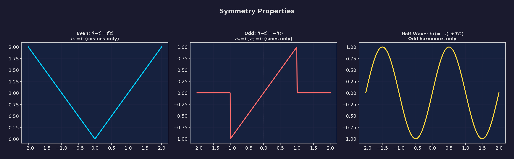
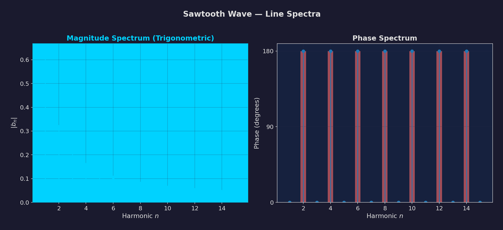
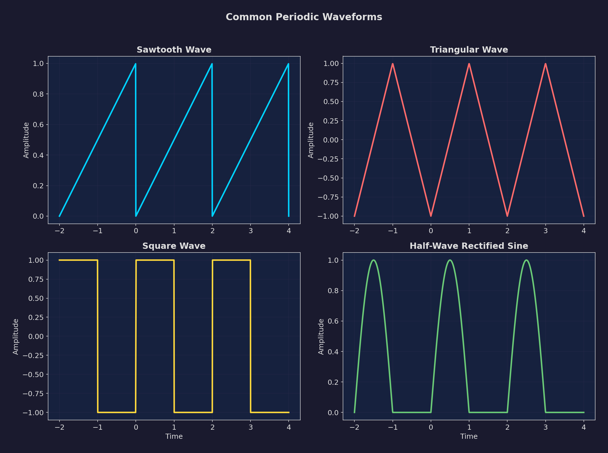
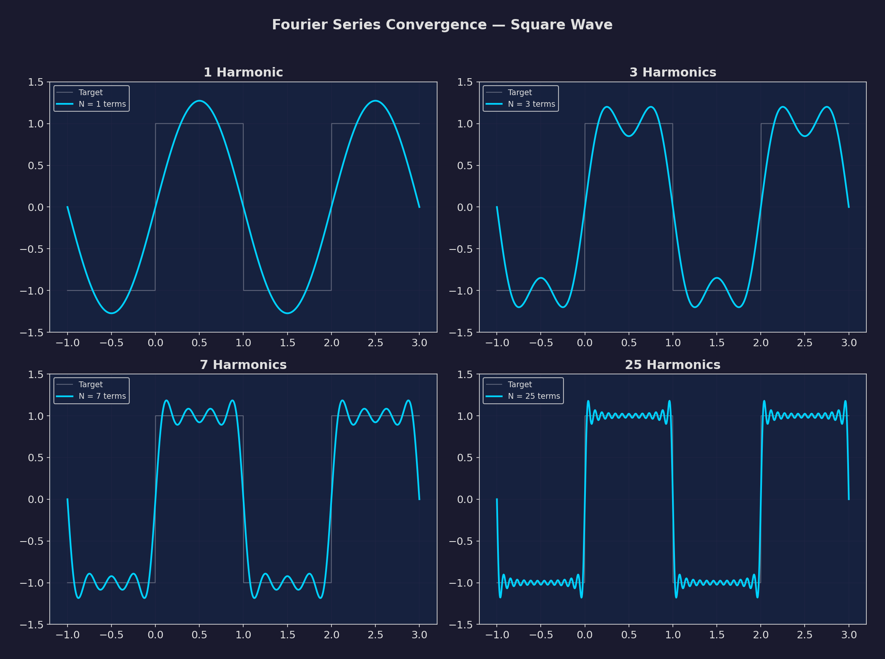
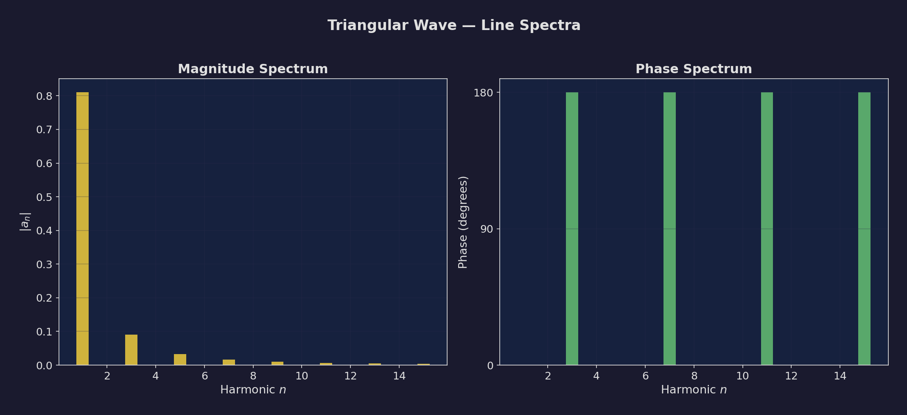

# Chapter 6: Fourier Series

> **Electric Circuit Theory (EE 501) -- Tribhuvan University, IOE**
> **Allocated Hours: 6 hrs**

---

## Table of Contents

1. [Introduction](#1-introduction)
2. [Trigonometric Fourier Series](#2-trigonometric-fourier-series)
3. [Symmetry Properties](#3-symmetry-properties)
4. [Polar (Compact Trigonometric) Form](#4-polar-compact-trigonometric-form)
5. [Exponential (Complex) Fourier Series](#5-exponential-complex-fourier-series)
6. [Relationship Between Forms](#6-relationship-between-forms)
7. [Line Spectra](#7-line-spectra)
8. [Parseval's Theorem](#8-parsevals-theorem)
9. [Common Waveforms Reference](#9-common-waveforms-reference)
10. [Worked Solutions](#10-worked-solutions)
11. [Formula Quick-Reference](#11-formula-quick-reference)
12. [Exam Tips and Common Mistakes](#12-exam-tips-and-common-mistakes)

---

## 1. Introduction

Any periodic signal $f(t)$ with period $T$ (i.e., $f(t) = f(t + T)$ for all $t$) that satisfies the **Dirichlet conditions** can be decomposed into a sum of sinusoidal components at integer multiples of the fundamental frequency.

### 1.1 Why Fourier Series Matters in Circuit Theory

In electric circuit analysis, Fourier series allows us to:

- Decompose a complex periodic input into simple sinusoidal components.
- Apply **superposition** -- analyze the circuit response to each harmonic separately using phasor techniques.
- Sum the individual responses to obtain the total steady-state response.
- Understand power distribution across harmonics (spectral analysis).

### 1.2 Dirichlet Conditions

A periodic function $f(t)$ has a Fourier series representation if it satisfies:

1. $f(t)$ is single-valued everywhere.
2. $f(t)$ has a finite number of discontinuities in one period.
3. $f(t)$ has a finite number of maxima and minima in one period.
4. The integral $\int_0^T |f(t)|\,dt$ is finite.

> **Note:** All physically realizable signals in circuit theory satisfy these conditions.

### 1.3 Fundamental Definitions

- **Period:** $T$ (seconds)
- **Fundamental frequency:** $f_0 = \dfrac{1}{T}$ (Hz)
- **Fundamental angular frequency:** $\omega_0 = \dfrac{2\pi}{T} = 2\pi f_0$ (rad/s)
- **$n$-th harmonic frequency:** $n\omega_0$ (rad/s), $nf_0$ (Hz)

---

## 2. Trigonometric Fourier Series

### 2.1 General Form

The trigonometric Fourier series of a periodic function $f(t)$ with period $T$ is:

$$f(t) = \frac{a_0}{2} + \sum_{n=1}^{\infty} \left[ a_n \cos(n\omega_0 t) + b_n \sin(n\omega_0 t) \right]$$

where:

- $\dfrac{a_0}{2}$ is the **DC component** (average value of $f(t)$)
- $a_n \cos(n\omega_0 t)$ are the **cosine harmonics**
- $b_n \sin(n\omega_0 t)$ are the **sine harmonics**
- $n = 1$ gives the **fundamental** component
- $n = 2, 3, 4, \ldots$ give the **2nd, 3rd, 4th, ...** harmonics

### 2.2 Fourier Coefficients

The coefficients are computed by integrating over one complete period:

$$a_0 = \frac{2}{T} \int_0^{T} f(t)\,dt$$

$$a_n = \frac{2}{T} \int_0^{T} f(t) \cos(n\omega_0 t)\,dt, \quad n = 1, 2, 3, \ldots$$

$$b_n = \frac{2}{T} \int_0^{T} f(t) \sin(n\omega_0 t)\,dt, \quad n = 1, 2, 3, \ldots$$

> **Important:** The integration can be performed over *any* complete period, e.g., from $-T/2$ to $T/2$, from $0$ to $T$, or from $t_0$ to $t_0 + T$. Choose the interval that simplifies the computation.

### 2.3 Physical Meaning of Coefficients

| Coefficient | Meaning |
|---|---|
| $a_0 / 2$ | DC (average) value of the signal |
| $a_n$ | Amplitude of the $n$-th cosine harmonic |
| $b_n$ | Amplitude of the $n$-th sine harmonic |

### 2.4 Orthogonality Relations

The Fourier series works because of the **orthogonality** of sinusoidal functions over a complete period:

$$\int_0^T \cos(m\omega_0 t)\cos(n\omega_0 t)\,dt = \begin{cases} 0 & m \neq n \\ T/2 & m = n \neq 0 \\ T & m = n = 0 \end{cases}$$

$$\int_0^T \sin(m\omega_0 t)\sin(n\omega_0 t)\,dt = \begin{cases} 0 & m \neq n \\ T/2 & m = n \neq 0 \end{cases}$$

$$\int_0^T \cos(m\omega_0 t)\sin(n\omega_0 t)\,dt = 0 \quad \text{for all } m, n$$

---

## 3. Symmetry Properties

Exploiting symmetry can dramatically reduce the computation required to find Fourier coefficients. **Always check for symmetry before computing integrals.**

### 3.1 Even Function Symmetry

A function is **even** if $f(t) = f(-t)$ (symmetric about the vertical axis).

**Consequences:**
- $b_n = 0$ for all $n$ (no sine terms)
- The series contains **only cosine terms and DC**:

$$f(t) = \frac{a_0}{2} + \sum_{n=1}^{\infty} a_n \cos(n\omega_0 t)$$

- Coefficients simplify to integration over half-period:

$$a_0 = \frac{4}{T} \int_0^{T/2} f(t)\,dt$$

$$a_n = \frac{4}{T} \int_0^{T/2} f(t) \cos(n\omega_0 t)\,dt$$

**Examples:** Triangular wave (centered), rectangular pulse (centered), $|\cos(\omega_0 t)|$

### 3.2 Odd Function Symmetry

A function is **odd** if $f(-t) = -f(t)$ (anti-symmetric about the vertical axis).

**Consequences:**
- $a_0 = 0$ (zero average)
- $a_n = 0$ for all $n$ (no cosine terms)
- The series contains **only sine terms**:

$$f(t) = \sum_{n=1}^{\infty} b_n \sin(n\omega_0 t)$$

- Coefficients simplify to:

$$b_n = \frac{4}{T} \int_0^{T/2} f(t) \sin(n\omega_0 t)\,dt$$

**Examples:** Sawtooth wave (centered at origin), square wave (centered at origin)

### 3.3 Half-Wave Symmetry

A function has **half-wave symmetry** if:

$$f(t) = -f\!\left(t \pm \frac{T}{2}\right)$$

This means the negative half-cycle is a mirror image of the positive half-cycle shifted by $T/2$.

**Consequences:**
- $a_0 = 0$ (zero DC component)
- **Only odd harmonics exist** ($n = 1, 3, 5, \ldots$)
- All even harmonic coefficients are zero: $a_n = b_n = 0$ for $n = 2, 4, 6, \ldots$
- Coefficients for odd $n$:

$$a_n = \frac{4}{T} \int_0^{T/2} f(t) \cos(n\omega_0 t)\,dt, \quad n = 1, 3, 5, \ldots$$

$$b_n = \frac{4}{T} \int_0^{T/2} f(t) \sin(n\omega_0 t)\,dt, \quad n = 1, 3, 5, \ldots$$

**Examples:** Square wave, full sawtooth wave, triangular wave

### 3.4 Quarter-Wave Symmetry

When a function has **both** even (or odd) symmetry **and** half-wave symmetry, it has **quarter-wave symmetry**. Integration reduces to one quarter of the period:

**Even + Half-wave:**
$$a_n = \frac{8}{T} \int_0^{T/4} f(t) \cos(n\omega_0 t)\,dt, \quad n = 1, 3, 5, \ldots$$

**Odd + Half-wave:**
$$b_n = \frac{8}{T} \int_0^{T/4} f(t) \sin(n\omega_0 t)\,dt, \quad n = 1, 3, 5, \ldots$$

### 3.5 Summary of Symmetry Properties

| Symmetry | $a_0$ | $a_n$ | $b_n$ | Harmonics Present |
|---|---|---|---|---|
| None | Compute | Compute | Compute | All |
| Even: $f(t) = f(-t)$ | Compute | Compute | $0$ | All (cosines only) |
| Odd: $f(-t) = -f(t)$ | $0$ | $0$ | Compute | All (sines only) |
| Half-wave: $f(t) = -f(t \pm T/2)$ | $0$ | Compute | Compute | Odd only |
| Even + Half-wave | $0$ | Compute | $0$ | Odd cosines only |
| Odd + Half-wave | $0$ | $0$ | Compute | Odd sines only |

*Figure 6.1: Examples of waveforms exhibiting different symmetry types.*

> **Exam Tip:** Symmetry identification is the first thing you should do when finding a Fourier series. It can eliminate half (or more) of the required integration work. Examiners often test whether you recognize symmetry.

---

## 4. Polar (Compact Trigonometric) Form

### 4.1 Derivation

Each harmonic pair $a_n \cos(n\omega_0 t) + b_n \sin(n\omega_0 t)$ can be combined into a single cosine (or sine) with amplitude and phase.

Using the identity $A\cos\theta + B\sin\theta = C\cos(\theta - \phi)$, where $C = \sqrt{A^2 + B^2}$ and $\phi = \tan^{-1}(B/A)$:

$$f(t) = C_0 + \sum_{n=1}^{\infty} C_n \cos(n\omega_0 t + \phi_n)$$

where:

$$C_0 = \frac{a_0}{2} \quad \text{(DC component)}$$

$$C_n = \sqrt{a_n^2 + b_n^2} \quad \text{(amplitude of } n\text{-th harmonic)}$$

$$\phi_n = -\tan^{-1}\!\left(\frac{b_n}{a_n}\right) \quad \text{(phase angle of } n\text{-th harmonic)}$$

### 4.2 Alternative Sine Form

The polar form can also be written using sine:

$$f(t) = C_0 + \sum_{n=1}^{\infty} C_n \sin(n\omega_0 t + \theta_n)$$

where:

$$\theta_n = \tan^{-1}\!\left(\frac{a_n}{b_n}\right)$$

> **Note:** Be careful with the quadrant of the phase angle. Use the signs of $a_n$ and $b_n$ to determine the correct quadrant.

### 4.3 Advantages of Polar Form

- Each harmonic is described by just **two numbers**: amplitude $C_n$ and phase $\phi_n$.
- Directly corresponds to **line spectra** (magnitude and phase plots).
- More intuitive for circuit analysis -- each harmonic is a single sinusoid.

---

## 5. Exponential (Complex) Fourier Series

### 5.1 Definition

Using Euler's formula $e^{j\theta} = \cos\theta + j\sin\theta$, the Fourier series can be written as:

$$f(t) = \sum_{n=-\infty}^{\infty} c_n \, e^{jn\omega_0 t}$$

where the complex Fourier coefficients are:

$$c_n = \frac{1}{T} \int_0^T f(t)\, e^{-jn\omega_0 t}\,dt, \quad n = 0, \pm 1, \pm 2, \ldots$$

### 5.2 Key Properties

- The summation runs from $n = -\infty$ to $+\infty$ (includes negative frequencies).
- $c_0 = a_0/2$ is the DC component.
- For **real-valued** $f(t)$: $c_{-n} = c_n^*$ (complex conjugate symmetry).
- $|c_n| = |c_{-n}|$ (magnitude spectrum is even).
- $\angle c_n = -\angle c_{-n}$ (phase spectrum is odd).

### 5.3 Computation

For any periodic signal, compute $c_n$ by direct integration:

$$c_n = \frac{1}{T} \int_0^T f(t)\, e^{-jn\omega_0 t}\,dt$$

Alternatively, expand $e^{-jn\omega_0 t} = \cos(n\omega_0 t) - j\sin(n\omega_0 t)$:

$$c_n = \frac{1}{T} \int_0^T f(t)\cos(n\omega_0 t)\,dt - \frac{j}{T} \int_0^T f(t)\sin(n\omega_0 t)\,dt$$

$$\boxed{c_n = \frac{1}{2}(a_n - jb_n)}$$

---

## 6. Relationship Between Forms

### 6.1 Trigonometric to Exponential

$$c_0 = \frac{a_0}{2}$$

$$c_n = \frac{1}{2}(a_n - jb_n), \quad n \geq 1$$

$$c_{-n} = \frac{1}{2}(a_n + jb_n) = c_n^*, \quad n \geq 1$$

### 6.2 Exponential to Trigonometric

$$a_0 = 2c_0$$

$$a_n = c_n + c_{-n} = 2\,\text{Re}(c_n)$$

$$b_n = j(c_n - c_{-n}) = -2\,\text{Im}(c_n)$$

### 6.3 Polar to Exponential

$$|c_n| = \frac{C_n}{2} = \frac{1}{2}\sqrt{a_n^2 + b_n^2}, \quad n \geq 1$$

$$|c_0| = C_0 = \frac{a_0}{2}$$

$$\angle c_n = \phi_n = -\tan^{-1}\!\left(\frac{b_n}{a_n}\right)$$

### 6.4 Master Conversion Table

| Quantity | Trigonometric | Polar | Exponential |
|---|---|---|---|
| DC component | $a_0/2$ | $C_0$ | $c_0$ |
| $n$-th harmonic amplitude | $\sqrt{a_n^2 + b_n^2}$ | $C_n$ | $2|c_n|$ |
| $n$-th harmonic phase | $-\tan^{-1}(b_n/a_n)$ | $\phi_n$ | $\angle c_n$ |

---

## 7. Line Spectra

### 7.1 Definition

The **line spectrum** (or **discrete spectrum**) of a periodic signal is a plot of the harmonic amplitudes and phases versus frequency. Because only discrete frequencies $n\omega_0$ (or $nf_0$) are present, the spectrum consists of vertical lines.

### 7.2 Types of Line Spectra

**1. One-Sided (Polar Form) Spectrum:**
- **Magnitude spectrum:** Plot $C_n$ vs. $n\omega_0$ for $n = 0, 1, 2, \ldots$
- **Phase spectrum:** Plot $\phi_n$ vs. $n\omega_0$ for $n = 1, 2, 3, \ldots$
- Only non-negative frequencies appear.

**2. Two-Sided (Exponential Form) Spectrum:**
- **Magnitude spectrum:** Plot $|c_n|$ vs. $n\omega_0$ for $n = 0, \pm 1, \pm 2, \ldots$
- **Phase spectrum:** Plot $\angle c_n$ vs. $n\omega_0$ for $n = \pm 1, \pm 2, \ldots$
- Both positive and negative frequencies appear.
- Magnitude spectrum is **even** ($|c_n| = |c_{-n}|$).
- Phase spectrum is **odd** ($\angle c_n = -\angle c_{-n}$).

### 7.3 Properties of Line Spectra

1. **Spectral lines occur only at** $n\omega_0$ -- no spectral content between harmonics.
2. **Higher harmonics generally have smaller amplitudes** -- energy concentrates at lower harmonics.
3. **Bandwidth** is theoretically infinite but practically limited to a finite number of significant harmonics.
4. The **envelope** of the spectral lines often follows a $\text{sinc}$ function for rectangular-type waveforms.

### 7.4 One-Sided vs. Two-Sided Relationship

$$|c_n| = \frac{C_n}{2} \quad (n \neq 0), \qquad |c_0| = C_0$$

The two-sided spectrum "splits" each one-sided amplitude equally between positive and negative frequencies, except for DC.

*Figure 6.2: One-sided and two-sided line spectra of a sawtooth waveform.*

---

## 8. Parseval's Theorem

### 8.1 Statement

Parseval's theorem relates the **average power** of a periodic signal to its Fourier coefficients. For a signal $f(t)$ with period $T$:

$$P_{avg} = \frac{1}{T} \int_0^T |f(t)|^2\,dt = \sum_{n=-\infty}^{\infty} |c_n|^2$$

### 8.2 In Terms of Trigonometric Coefficients

$$P_{avg} = \left(\frac{a_0}{2}\right)^2 + \frac{1}{2}\sum_{n=1}^{\infty}\left(a_n^2 + b_n^2\right)$$

### 8.3 In Terms of Polar Coefficients

$$P_{avg} = C_0^2 + \frac{1}{2}\sum_{n=1}^{\infty} C_n^2$$

### 8.4 Physical Interpretation

- The average power of a periodic signal equals the **sum of the average powers of each harmonic**.
- This confirms that harmonics do not interact in terms of power delivery (orthogonality).
- Useful for computing power dissipation in circuits excited by non-sinusoidal sources.
- The $n$-th harmonic contributes power $\dfrac{C_n^2}{2} = 2|c_n|^2$ to the total.

> **Exam Tip:** Parseval's theorem is often used as a check. After finding the Fourier series, verify that the sum of harmonic powers matches the directly computed average power of the original waveform.

---

## 9. Common Waveforms Reference

*Figure 6.3: Standard periodic waveforms and their Fourier series.*

### 9.1 Sawtooth Wave

**Definition:** $f(t) = \dfrac{V_0}{T}\,t$ for $0 < t < T$, with period $T$.

(This is a ramp from $0$ to $V_0$ that resets to $0$ every period.)

**Fourier series:**

$$f(t) = \frac{V_0}{2} - \frac{V_0}{\pi}\sum_{n=1}^{\infty} \frac{1}{n}\sin(n\omega_0 t)$$

**Key features:**
- DC value: $V_0/2$
- Only sine terms (after shifting to standard form) or both sine and cosine depending on centering.
- Amplitudes decay as $1/n$.
- If centered at origin: $f(t) = \dfrac{2V_0}{\pi}\displaystyle\sum_{n=1}^{\infty} \dfrac{(-1)^{n+1}}{n}\sin(n\omega_0 t)$ (odd function, no DC, no cosines).

### 9.2 Triangular Wave

**Definition (centered, symmetric):** 

$$f(t) = \begin{cases} \dfrac{4V_0}{T}\,t & 0 \leq t \leq T/4 \\ 2V_0 - \dfrac{4V_0}{T}\,t & T/4 \leq t \leq 3T/4 \\ \dfrac{4V_0}{T}\,t - 4V_0 & 3T/4 \leq t \leq T \end{cases}$$

**Fourier series (even + half-wave symmetry):**

$$f(t) = \frac{8V_0}{\pi^2}\sum_{n=1,3,5,\ldots} \frac{(-1)^{(n-1)/2}}{n^2}\cos(n\omega_0 t)$$

**Key features:**
- Only odd cosine harmonics (even + half-wave symmetry).
- Amplitudes decay as $1/n^2$ (faster convergence than sawtooth).
- No DC component.

### 9.3 Rectangular (Square) Wave

**Definition (50% duty cycle, centered):**

$$f(t) = \begin{cases} V_0 & 0 < t < T/2 \\ -V_0 & T/2 < t < T \end{cases}$$

**Fourier series (odd + half-wave symmetry):**

$$f(t) = \frac{4V_0}{\pi}\sum_{n=1,3,5,\ldots} \frac{1}{n}\sin(n\omega_0 t)$$

**Key features:**
- Only odd sine harmonics.
- Amplitudes decay as $1/n$.
- Classic waveform showing Gibbs phenomenon at discontinuities.

### 9.4 Rectangular Pulse Train

**Definition:** Pulse amplitude $V_0$, pulse width $\tau$, period $T$.

$$f(t) = \begin{cases} V_0 & 0 < t < \tau \\ 0 & \tau < t < T \end{cases}$$

**Fourier coefficients:**

$$a_0 = \frac{2V_0 \tau}{T}$$

$$a_n = \frac{2V_0}{n\pi}\sin\!\left(\frac{n\pi\tau}{T}\right)$$

$$b_n = \frac{2V_0}{n\pi}\left[1 - \cos\!\left(\frac{n\pi\tau}{T}\right)\right]$$

**Exponential form:**

$$c_n = \frac{V_0 \tau}{T}\,\text{sinc}\!\left(\frac{n\tau}{T}\right)\, e^{-jn\omega_0 \tau/2}$$

where $\text{sinc}(x) = \dfrac{\sin(\pi x)}{\pi x}$.

**Key features:**
- Spectral envelope follows a sinc function.
- First null at $n = T/\tau$.
- As $\tau/T$ decreases (narrower pulses), spectrum spreads out.

### 9.5 Half-Wave Rectified Cosine

**Definition:**

$$f(t) = \begin{cases} V_0\cos(\omega_0 t) & -T/4 \leq t \leq T/4 \\ 0 & T/4 < |t| < T/2 \end{cases}$$

**Fourier series:**

$$f(t) = \frac{V_0}{\pi} + \frac{V_0}{2}\cos(\omega_0 t) + \frac{2V_0}{\pi}\sum_{n=2,4,6,\ldots} \frac{(-1)^{n/2+1}}{n^2-1}\cos(n\omega_0 t)$$

**Key features:**
- Even function, only cosine terms.
- Contains both DC and even harmonics, plus the fundamental.

*Figure 6.4: Convergence of Fourier series approximation (showing N = 1, 3, 5, 15 terms).*

---

## 10. Worked Solutions

### Worked Solution Q1: Sawtooth Signal -- Polar Form and Line Spectra

> **Problem:** A sawtooth waveform is defined as $f(t) = \dfrac{A}{T}\,t$ for $0 \leq t \leq T$ (ramp from $0$ to $A$, then resets), with period $T$. Find the exponential Fourier series, convert to polar form, and draw the one-sided line spectra. Use $A = 10$ V, $T = 2\pi$ s.

---

#### Step 1: Find the Exponential Fourier Coefficients $c_n$

The exponential Fourier coefficient formula:

$$c_n = \frac{1}{T} \int_0^T f(t)\,e^{-jn\omega_0 t}\,dt$$

With $f(t) = \dfrac{A}{T}\,t$, $\omega_0 = \dfrac{2\pi}{T}$:

$$c_n = \frac{1}{T} \int_0^T \frac{A}{T}\,t\,e^{-jn\omega_0 t}\,dt = \frac{A}{T^2} \int_0^T t\,e^{-jn\omega_0 t}\,dt$$

**For $n = 0$ (DC component):**

$$c_0 = \frac{A}{T^2} \int_0^T t\,dt = \frac{A}{T^2} \cdot \frac{T^2}{2} = \frac{A}{2}$$

**For $n \neq 0$:**

Use integration by parts: $\int t\,e^{-j\alpha t}\,dt = \dfrac{e^{-j\alpha t}}{(-j\alpha)}\,t - \dfrac{e^{-j\alpha t}}{(-j\alpha)^2}$

Let $\alpha = n\omega_0$:

$$\int_0^T t\,e^{-jn\omega_0 t}\,dt = \left[\frac{t\,e^{-jn\omega_0 t}}{-jn\omega_0} + \frac{e^{-jn\omega_0 t}}{(jn\omega_0)^2}\right]_0^T$$

Evaluate at $t = T$: Since $e^{-jn\omega_0 T} = e^{-jn \cdot 2\pi} = 1$:

$$= \frac{T \cdot 1}{-jn\omega_0} + \frac{1}{-n^2\omega_0^2} - \left(0 + \frac{1}{-n^2\omega_0^2}\right)$$

$$= \frac{T}{-jn\omega_0} + \frac{1}{-n^2\omega_0^2} + \frac{1}{n^2\omega_0^2} = \frac{T}{-jn\omega_0}$$

Therefore:

$$c_n = \frac{A}{T^2} \cdot \frac{T}{-jn\omega_0} = \frac{A}{T(-jn\omega_0)} = \frac{A}{-jn \cdot 2\pi}$$

Since $\omega_0 T = 2\pi$:

$$\boxed{c_n = \frac{A}{-j2\pi n} = \frac{jA}{2\pi n}, \quad n \neq 0}$$

#### Step 2: Find Magnitude and Phase

$$|c_n| = \frac{A}{2\pi|n|}$$

For the phase of $c_n = \dfrac{jA}{2\pi n}$:

- For $n > 0$: $c_n = \dfrac{A}{2\pi n}\,e^{j\pi/2}$, so $\angle c_n = +90^\circ = +\dfrac{\pi}{2}$

- For $n < 0$: $c_n = \dfrac{A}{2\pi|n|}\,e^{-j\pi/2}$, so $\angle c_n = -90^\circ = -\dfrac{\pi}{2}$

#### Step 3: Trigonometric Coefficients

From $c_n = \dfrac{1}{2}(a_n - jb_n)$:

$$c_n = \frac{jA}{2\pi n} = 0 + j\frac{A}{2\pi n}$$

So: $a_n = 2\,\text{Re}(c_n) = 0$ and $b_n = -2\,\text{Im}(c_n) = -\dfrac{A}{\pi n}$

The trigonometric series:

$$f(t) = \frac{A}{2} - \frac{A}{\pi}\sum_{n=1}^{\infty} \frac{1}{n}\sin(n\omega_0 t)$$

#### Step 4: Polar Form

Since $a_n = 0$:

$$C_0 = \frac{A}{2}, \quad C_n = |b_n| = \frac{A}{\pi n}$$

$$\phi_n = -\tan^{-1}\!\left(\frac{b_n}{a_n}\right) = -\tan^{-1}\!\left(\frac{-A/(\pi n)}{0}\right) = +90^\circ$$

Polar form (using sine):

$$f(t) = \frac{A}{2} + \sum_{n=1}^{\infty} \frac{A}{\pi n}\cos\!\left(n\omega_0 t + 90^\circ\right)$$

Or equivalently:

$$f(t) = \frac{A}{2} - \sum_{n=1}^{\infty} \frac{A}{\pi n}\sin(n\omega_0 t)$$

#### Step 5: Numerical Values ($A = 10$ V, $T = 2\pi$ s)

| $n$ | $C_n$ (V) | $\phi_n$ |
|---|---|---|
| 0 | 5.000 | -- |
| 1 | 3.183 | $+90^\circ$ |
| 2 | 1.592 | $+90^\circ$ |
| 3 | 1.061 | $+90^\circ$ |
| 4 | 0.796 | $+90^\circ$ |
| 5 | 0.637 | $+90^\circ$ |

#### Step 6: Line Spectra

**One-Sided Magnitude Spectrum:**
- Vertical lines at $n\omega_0 = 0, \omega_0, 2\omega_0, 3\omega_0, \ldots$
- Heights: $5.0, 3.183, 1.592, 1.061, 0.796, 0.637, \ldots$
- Envelope decays as $1/n$.

**One-Sided Phase Spectrum:**
- All harmonics have phase $+90^\circ$ (constant).

**Two-Sided Magnitude Spectrum:**
- $|c_0| = 5.0$, $|c_{\pm 1}| = 1.592$, $|c_{\pm 2}| = 0.796$, $|c_{\pm 3}| = 0.531$, ...
- Symmetric about $n = 0$.

**Two-Sided Phase Spectrum:**
- $\angle c_n = +90^\circ$ for $n > 0$, $\angle c_n = -90^\circ$ for $n < 0$.
- Anti-symmetric (odd function of $n$).

*Figure 6.5: Line spectra of the sawtooth waveform.*

#### Verification using Parseval's Theorem

Direct computation of average power:

$$P_{avg} = \frac{1}{T}\int_0^T \left(\frac{At}{T}\right)^2 dt = \frac{A^2}{T^3}\cdot\frac{T^3}{3} = \frac{A^2}{3}$$

For $A = 10$: $P_{avg} = \dfrac{100}{3} = 33.33$ W (across a 1 $\Omega$ resistor).

From Fourier coefficients:

$$P = |c_0|^2 + 2\sum_{n=1}^{\infty}|c_n|^2 = 25 + 2\sum_{n=1}^{\infty}\frac{25}{\pi^2 n^2}$$

Using $\sum_{n=1}^{\infty}\frac{1}{n^2} = \frac{\pi^2}{6}$:

$$P = 25 + \frac{50}{\pi^2}\cdot\frac{\pi^2}{6} = 25 + \frac{50}{6} = 25 + 8.33 = 33.33 \text{ W} \checkmark$$

---

### Worked Solution Q2: Triangular Wave -- Trigonometric Fourier Series

> **Problem:** A triangular wave oscillates between $+V_0$ and $-V_0$ with period $T$, defined as:
>
> $$f(t) = \begin{cases} \dfrac{4V_0}{T}\,t & 0 \leq t \leq T/4 \\ 2V_0 - \dfrac{4V_0}{T}\,t & T/4 \leq t \leq 3T/4 \\ \dfrac{4V_0}{T}\,t - 4V_0 & 3T/4 \leq t \leq T \end{cases}$$
>
> Find the trigonometric Fourier series and sketch the one-sided line spectrum.

---

#### Step 1: Identify Symmetry

Examining $f(t)$:

1. **Even symmetry?** If we shift the origin to $t = 0$ at the peak, $f(t) = f(-t)$ -- **Yes, even function** (provided we center the waveform appropriately). The given definition has the peak at $t = T/4$. Shifting origin to the peak:

   Let us redefine with the peak at $t=0$: $g(t) = f(t + T/4)$. Then $g(t) = g(-t)$ -- **even**.

2. **Half-wave symmetry?** $f(t + T/2) = -f(t)$? Check: $f(0) = 0$, $f(T/2) = 2V_0 - 2V_0 = 0$. $f(T/4) = V_0$, $f(3T/4) = -V_0$. Yes -- **half-wave symmetry**.

3. **Conclusion:** Even + half-wave = **quarter-wave symmetry**. Only **odd cosine harmonics** exist.

With the waveform centered so it is even (peak at origin), we use the quarter-wave formula. Let us work with the centered version $g(t)$:

$$g(t) = V_0 - \frac{4V_0}{T}|t|, \quad -T/2 \leq t \leq T/2$$

Or equivalently, for $0 \leq t \leq T/4$: $g(t) = V_0 - \dfrac{4V_0}{T}\,t$

#### Step 2: Compute Coefficients

Since the function is even with half-wave symmetry:
- $b_n = 0$ for all $n$
- $a_n = 0$ for even $n$
- For odd $n$:

$$a_n = \frac{8}{T}\int_0^{T/4} g(t)\cos(n\omega_0 t)\,dt, \quad n = 1, 3, 5, \ldots$$

$$a_n = \frac{8}{T}\int_0^{T/4}\left(V_0 - \frac{4V_0}{T}\,t\right)\cos(n\omega_0 t)\,dt$$

Split into two integrals:

$$a_n = \frac{8V_0}{T}\int_0^{T/4}\cos(n\omega_0 t)\,dt - \frac{32V_0}{T^2}\int_0^{T/4} t\cos(n\omega_0 t)\,dt$$

**First integral:**

$$\int_0^{T/4}\cos(n\omega_0 t)\,dt = \left[\frac{\sin(n\omega_0 t)}{n\omega_0}\right]_0^{T/4} = \frac{\sin(n\pi/2)}{n\omega_0}$$

So:

$$\frac{8V_0}{T} \cdot \frac{\sin(n\pi/2)}{n\omega_0} = \frac{8V_0}{T} \cdot \frac{\sin(n\pi/2)}{n \cdot 2\pi/T} = \frac{4V_0\sin(n\pi/2)}{n\pi}$$

**Second integral** (integration by parts):

$$\int_0^{T/4} t\cos(n\omega_0 t)\,dt = \left[\frac{t\sin(n\omega_0 t)}{n\omega_0} + \frac{\cos(n\omega_0 t)}{n^2\omega_0^2}\right]_0^{T/4}$$

$$= \frac{T}{4}\cdot\frac{\sin(n\pi/2)}{n\omega_0} + \frac{\cos(n\pi/2)}{n^2\omega_0^2} - \frac{1}{n^2\omega_0^2}$$

For odd $n$: $\cos(n\pi/2) = 0$, so:

$$= \frac{T\sin(n\pi/2)}{4n\omega_0} - \frac{1}{n^2\omega_0^2}$$

Substituting back:

$$\frac{32V_0}{T^2}\left[\frac{T\sin(n\pi/2)}{4n\omega_0} - \frac{1}{n^2\omega_0^2}\right] = \frac{8V_0\sin(n\pi/2)}{Tn\omega_0} - \frac{32V_0}{T^2 n^2\omega_0^2}$$

$$= \frac{4V_0\sin(n\pi/2)}{n\pi} - \frac{8V_0}{n^2\pi^2}$$

**Combining:**

$$a_n = \frac{4V_0\sin(n\pi/2)}{n\pi} - \frac{4V_0\sin(n\pi/2)}{n\pi} + \frac{8V_0}{n^2\pi^2}$$

$$\boxed{a_n = \frac{8V_0}{n^2\pi^2}, \quad n = 1, 3, 5, \ldots \text{ (before sign adjustment)}}$$

Now, for the alternating sign: $\sin(n\pi/2) = +1$ for $n = 1, 5, 9, \ldots$ and $\sin(n\pi/2) = -1$ for $n = 3, 7, 11, \ldots$

The correct general form is:

$$\boxed{a_n = \frac{8V_0}{\pi^2 n^2}(-1)^{(n-1)/2}, \quad n = 1, 3, 5, \ldots}$$

#### Step 3: Write the Fourier Series

$$\boxed{f(t) = \frac{8V_0}{\pi^2}\left[\cos(\omega_0 t) - \frac{1}{9}\cos(3\omega_0 t) + \frac{1}{25}\cos(5\omega_0 t) - \frac{1}{49}\cos(7\omega_0 t) + \cdots\right]}$$

$$f(t) = \frac{8V_0}{\pi^2}\sum_{n=1,3,5,\ldots} \frac{(-1)^{(n-1)/2}}{n^2}\cos(n\omega_0 t)$$

#### Step 4: Polar Form

Since only cosine terms exist with no sine terms:

$$C_n = |a_n| = \frac{8V_0}{\pi^2 n^2}$$

$$\phi_n = \begin{cases} 0^\circ & n = 1, 5, 9, \ldots \\ 180^\circ & n = 3, 7, 11, \ldots \end{cases}$$

#### Step 5: Numerical Values and Spectrum

For $V_0 = 1$ V:

| $n$ | $C_n = 8/(\pi^2 n^2)$ (V) | $\phi_n$ |
|---|---|---|
| 1 | 0.8106 | $0^\circ$ |
| 3 | 0.0901 | $180^\circ$ |
| 5 | 0.0324 | $0^\circ$ |
| 7 | 0.0165 | $180^\circ$ |
| 9 | 0.0100 | $0^\circ$ |

**Key observation:** The amplitudes decay as $1/n^2$, much faster than the sawtooth ($1/n$). After just the 3rd harmonic, the triangular wave is already well approximated. This rapid convergence is because the triangular wave is *continuous* (no discontinuities), unlike the sawtooth.

*Figure 6.6: One-sided line spectrum of the triangular wave.*

---

### Worked Solution Q3: Rectangular Pulse -- Trigonometric Fourier Series

> **Problem:** A periodic rectangular pulse waveform has amplitude $10$ V, pulse width $\tau = \pi$ s, and period $T = 2\pi$ s. Find the trigonometric Fourier series and sketch the line spectra.

---

#### Step 1: Define the Waveform

$$f(t) = \begin{cases} 10 & 0 < t < \pi \\ 0 & \pi < t < 2\pi \end{cases}$$

with period $T = 2\pi$, so $\omega_0 = \dfrac{2\pi}{T} = 1$ rad/s.

Note: The duty cycle is $\tau/T = \pi/(2\pi) = 1/2 = 50\%$.

#### Step 2: Symmetry Check

This waveform is **neither even nor odd** as defined. It does not have half-wave symmetry either (the average is not zero -- it is $5$ V). We must compute all coefficients.

However, if we subtract the DC and shift vertically by $-5$V, the result is a standard square wave with half-wave symmetry. We can use this insight or compute directly.

#### Step 3: Compute $a_0$

$$a_0 = \frac{2}{T}\int_0^T f(t)\,dt = \frac{2}{2\pi}\int_0^{\pi} 10\,dt = \frac{1}{\pi}\cdot 10\pi = 10$$

$$\frac{a_0}{2} = 5 \text{ V (DC component)}$$

#### Step 4: Compute $a_n$

$$a_n = \frac{2}{T}\int_0^T f(t)\cos(nt)\,dt = \frac{2}{2\pi}\int_0^{\pi} 10\cos(nt)\,dt$$

$$= \frac{10}{\pi}\left[\frac{\sin(nt)}{n}\right]_0^{\pi} = \frac{10}{\pi}\cdot\frac{\sin(n\pi)}{n} = 0 \quad \text{for all } n \geq 1$$

Since $\sin(n\pi) = 0$ for all integers $n$, we get $a_n = 0$ for all $n \geq 1$.

#### Step 5: Compute $b_n$

$$b_n = \frac{2}{T}\int_0^T f(t)\sin(nt)\,dt = \frac{10}{\pi}\int_0^{\pi}\sin(nt)\,dt$$

$$= \frac{10}{\pi}\left[-\frac{\cos(nt)}{n}\right]_0^{\pi} = \frac{10}{\pi n}\left[1 - \cos(n\pi)\right]$$

$$= \frac{10}{\pi n}\left[1 - (-1)^n\right]$$

This gives:
- $b_n = 0$ for even $n$ (since $(-1)^n = 1$)
- $b_n = \dfrac{20}{n\pi}$ for odd $n$ (since $(-1)^n = -1$)

#### Step 6: Write the Fourier Series

$$\boxed{f(t) = 5 + \frac{20}{\pi}\left[\sin(t) + \frac{1}{3}\sin(3t) + \frac{1}{5}\sin(5t) + \frac{1}{7}\sin(7t) + \cdots\right]}$$

$$f(t) = 5 + \frac{20}{\pi}\sum_{n=1,3,5,\ldots} \frac{1}{n}\sin(nt)$$

#### Step 7: Polar Form

Since $a_n = 0$ for $n \geq 1$:

$$C_0 = 5 \text{ V}$$

$$C_n = |b_n| = \frac{20}{n\pi}, \quad n = 1, 3, 5, \ldots$$

$$\phi_n = -\tan^{-1}\!\left(\frac{b_n}{0}\right) = -90^\circ \quad \text{(since } b_n > 0 \text{)}$$

#### Step 8: Numerical Line Spectrum Data

| $n$ | $C_n$ (V) | $\phi_n$ |
|---|---|---|
| 0 | 5.000 | -- |
| 1 | 6.366 | $-90^\circ$ |
| 2 | 0 | -- |
| 3 | 2.122 | $-90^\circ$ |
| 4 | 0 | -- |
| 5 | 1.273 | $-90^\circ$ |
| 6 | 0 | -- |
| 7 | 0.909 | $-90^\circ$ |

**Spectrum characteristics:**
- Spectral lines occur only at odd harmonics (plus DC).
- The magnitude envelope decays as $1/n$.
- All non-zero harmonics have the same phase ($-90^\circ$), corresponding to pure sine terms.
- The spectral envelope follows a sinc pattern: for the general pulse train, the envelope is $|V_0\tau\,\text{sinc}(nf_0\tau)|$. Here $\tau = T/2$, so nulls occur where $\text{sinc}(n/2) = 0$, i.e., at $n = 2, 4, 6, \ldots$ -- consistent with our result.

> **Note:** The spectral envelope of a rectangular pulse train with duty cycle $d = \tau/T$ has nulls at $n = k/d$ for integer $k$. Here $d = 0.5$, so nulls at $n = 2, 4, 6, \ldots$

---

## 11. Formula Quick-Reference

> **Tear-out reference card for exam preparation**

### Trigonometric Fourier Series

$$f(t) = \frac{a_0}{2} + \sum_{n=1}^{\infty}\left[a_n\cos(n\omega_0 t) + b_n\sin(n\omega_0 t)\right]$$

$$a_0 = \frac{2}{T}\int_0^T f(t)\,dt, \quad a_n = \frac{2}{T}\int_0^T f(t)\cos(n\omega_0 t)\,dt, \quad b_n = \frac{2}{T}\int_0^T f(t)\sin(n\omega_0 t)\,dt$$

### Polar (Compact) Form

$$f(t) = C_0 + \sum_{n=1}^{\infty} C_n\cos(n\omega_0 t + \phi_n)$$

$$C_0 = \frac{a_0}{2}, \quad C_n = \sqrt{a_n^2 + b_n^2}, \quad \phi_n = -\tan^{-1}\!\left(\frac{b_n}{a_n}\right)$$

### Exponential (Complex) Form

$$f(t) = \sum_{n=-\infty}^{\infty} c_n\,e^{jn\omega_0 t}, \quad c_n = \frac{1}{T}\int_0^T f(t)\,e^{-jn\omega_0 t}\,dt$$

### Conversions

$$c_n = \frac{a_n - jb_n}{2}, \quad |c_n| = \frac{C_n}{2} \,(n \neq 0), \quad \angle c_n = \phi_n$$

$$a_n = 2\,\text{Re}(c_n), \quad b_n = -2\,\text{Im}(c_n)$$

### Parseval's Theorem

$$\frac{1}{T}\int_0^T |f(t)|^2\,dt = \sum_{n=-\infty}^{\infty}|c_n|^2 = \left(\frac{a_0}{2}\right)^2 + \frac{1}{2}\sum_{n=1}^{\infty}(a_n^2 + b_n^2)$$

### Key Integration Results

$$\int t\,e^{-j\alpha t}\,dt = \frac{e^{-j\alpha t}}{-j\alpha}\,t - \frac{e^{-j\alpha t}}{(-j\alpha)^2} + C$$

$$\int t\cos(\alpha t)\,dt = \frac{\cos(\alpha t)}{\alpha^2} + \frac{t\sin(\alpha t)}{\alpha} + C$$

$$\int t\sin(\alpha t)\,dt = \frac{\sin(\alpha t)}{\alpha^2} - \frac{t\cos(\alpha t)}{\alpha} + C$$

### Useful Identities

$$\sin(n\pi) = 0, \quad \cos(n\pi) = (-1)^n, \quad \sin(n\pi/2) = \begin{cases} 0 & n \text{ even} \\ (-1)^{(n-1)/2} & n \text{ odd} \end{cases}$$

---

## 12. Exam Tips and Common Mistakes

### Tips for Success

1. **Always check symmetry first.** This is the single most important step. It can eliminate half your calculations and prevent sign errors.

2. **Choose the integration interval wisely.** You can integrate over any complete period. Pick the interval that makes $f(t)$ simplest (e.g., $-T/2$ to $T/2$ for even/odd functions).

3. **Verify with Parseval's theorem.** After finding the Fourier series, check that the power sum matches the directly computed average power.

4. **Know the standard waveforms.** Memorize (or know how to quickly derive) the Fourier series for sawtooth, triangular, and square waves. Many exam problems are variations of these.

5. **Draw the waveform before computing.** A sketch helps identify symmetry, DC offset, and the best integration interval.

6. **For line spectra questions:** Always label axes clearly -- frequency ($n\omega_0$ or $nf_0$) on horizontal, amplitude on vertical. Show at least 5 harmonics.

### Common Mistakes to Avoid

1. **Forgetting the $1/2$ factor in $a_0/2$.** The DC term is $a_0/2$, not $a_0$. This is the most frequent error.

2. **Wrong sign in polar form phase.** The phase $\phi_n = -\tan^{-1}(b_n/a_n)$, not $+\tan^{-1}(b_n/a_n)$. Watch the minus sign.

3. **Confusing one-sided and two-sided spectra.** In the two-sided spectrum, $|c_n| = C_n/2$ for $n \neq 0$. Don't forget to halve.

4. **Not checking the quadrant of $\phi_n$.** Use the signs of both $a_n$ and $b_n$ to determine the correct quadrant, not just $\tan^{-1}$.

5. **Applying symmetry formulas with wrong integration limits.** With half-wave symmetry, integrate from $0$ to $T/2$ (half-period). With quarter-wave symmetry, integrate from $0$ to $T/4$.

6. **Forgetting that half-wave symmetry eliminates even harmonics AND DC.** Both $a_0$ and all even-$n$ coefficients vanish.

7. **Mixing up $c_n$ and $C_n$.** Use lowercase $c_n$ for exponential (complex) coefficients and uppercase $C_n$ for polar (real amplitude) form. They differ by a factor of 2.

8. **Integration errors with $e^{-jn\omega_0 t}$.** Remember $e^{-jn\omega_0 T} = e^{-j2n\pi} = 1$ when evaluating at $t = T$.

### How Examiners Test This Topic

- **Direct computation:** Given a waveform, find the Fourier series in a specified form (trigonometric, polar, or exponential).
- **Symmetry identification:** Given a waveform, state what symmetries exist and what coefficients vanish.
- **Line spectra:** Draw magnitude and phase spectra (one-sided or two-sided).
- **Parseval's theorem application:** Compute average power or verify a Fourier series result.
- **Circuit response:** Given a Fourier series input and a circuit, find the steady-state output (often combined with phasor analysis).

---

## Reference Media

| Resource | Path |
|---|---|
| Common waveforms reference | `../plots/ch6_common_waveforms.png` |
| Sawtooth line spectrum | `../plots/ch6_sawtooth_spectrum.png` |
| Triangular wave spectrum | `../plots/ch6_triangular_spectrum.png` |
| Fourier approximation convergence | `../plots/ch6_fourier_approximation.png` |
| Symmetry property examples | `../plots/ch6_symmetry_examples.png` |
| Fourier series buildup animation | `../videos/media/videos/ect_animations/480p15/FourierSeriesBuildup.mp4` |

---

*End of Chapter 6 -- Fourier Series*
