# ECT (EE 501) — Exam Questions Bank

> **Complete collection of past exam questions (2078-2082) organized chapter-wise with frequency analysis.**
> Total: 50+ questions from 8 exam papers.

---

## Question Frequency Analysis

> Use this table to prioritize your study. Topics appearing more frequently are more likely to appear in your exam.

| Topic | Frequency | Priority |
|-------|-----------|----------|
| Initial conditions (switching circuits) | Every exam (Q1b always) | **MUST STUDY** |
| Resonance (series/parallel RLC) | Every exam (Q1a always) | **MUST STUDY** |
| Transient — Classical method | Every exam (Q2) | **MUST STUDY** |
| Transient — Laplace transform | Every exam (Q3) | **MUST STUDY** |
| Bode plot | Every exam (Q4b or Q5b) | **MUST STUDY** |
| Fourier series + line spectra | Every exam (Q4b or Q5a) | **MUST STUDY** |
| Two-port parameters (Z, Y, ABCD) | Every exam (Q5) | **MUST STUDY** |
| Transfer functions / Network functions | Most exams (Q4a) | HIGH |
| Mesh/Nodal analysis | Occasional (Q1a) | MEDIUM |
| Pole-zero plots | Occasional | MEDIUM |

---

## Exam Pattern (Standard Format)

| Question | Topic | Marks |
|----------|-------|-------|
| **Q1(a)** | Resonance / AC circuit analysis | 8 |
| **Q1(b)** | Initial conditions | 8 |
| **Q2(a)** | Transient — Classical method (1st order) | 8 |
| **Q2(b)** | Transient — Classical method (2nd order) | 8 |
| **Q3(a)** | Transient — Laplace transform | 8 |
| **Q3(b)** | Transient — Laplace transform | 8 |
| **Q4(a)** | Network functions / Transfer function | 6-8 |
| **Q4(b)** | Bode plot OR Fourier series | 8 |
| **Q5(a)** | Fourier series OR Two-port parameters | 6-8 |
| **Q5(b)** | Two-port parameters (Z, Y, ABCD, h) | 6-8 |

**Total: 80 marks | Pass: 32 | Time: 3 hours**

---

## Chapter 1: Network Analysis & Resonance

### Resonance Questions

**[2082 Baishakh Q1a]** Find the active and reactive component of the current taken by a series circuit consisting of a coil of inductance 0.11 H & resistance of 8 $\Omega$ and a capacitor of 120 $\mu$F, connected to a 240 V, 50 Hz supply main. Find the value of capacitor that has to be connected in parallel with the above circuit so that the power factor of the entire circuit is unity. **[2+6]**

**[2081 Bhadra Q1a]** Discuss the importance of bandwidth in resonance circuit. For the circuit shown in figure, find the frequency at which the whole circuit will be at resonance. If the capacitor and inductor are interchanged, what will be the value of resonance frequency? **[1+7]**

> _Figure not included — topology not determined from text. See IOE 2081 Bhadra paper for the canonical figure._

**[2081 Baishakh Q1a]** Define resonance in parallel R-L-C circuit with the help of phasor diagram. A 220 V, 100 Hz AC source supplies a series circuit with a capacitor and coil. If the coil has 50 $m\Omega$ resistance and 5 mH inductance, find the value of capacitor to create resonance. Also calculate: (i) voltage across R, L and C, (ii) Quality factor. **[8]**

**[2080 Bhadra Q1a]** What do you mean by resonance in RLC series circuit? Define half power frequencies and bandwidth in RLC series circuit and also obtain an expression for them. **[8]**

**[2080 Baishakh Q1a]** A 50 ohms resistor is connected in series with a coil having resistance R, inductance L and capacitor C supplied by 100 V variable frequency supply. At a frequency of 200 Hz, the maximum current of 0.7 A flows through the circuit and voltage across the capacitor is 200 V. Determine the value of R, L and C. **[8]**

**[2079 Bhadra Q1a]** What do you mean by resonance in RLC series circuit? Define half power frequencies and bandwidth in RLC series circuit and obtain expression for them. **[4+4]**

**[2079 Baishakh Q1a]** In the circuit shown in figure, find the value of "v", using node voltage method. **[8]**

> _Figure not included — topology not determined from text. See IOE 2079 Baishakh paper for the canonical figure._

### Mesh/Nodal Analysis Questions

**[2079 Baishakh Q1a]** In the circuit shown, find the value of "v" using node voltage method. 16 V source, 5 A current source, 8$\Omega$, 4$\Omega$, 2$\Omega$ resistors, $v_x$ Amp dependent source. **[8]**

> _Figure not included — topology not determined from text. See IOE 2079 Baishakh paper for the canonical figure._

---

## Chapter 2: Initial Conditions

**[2082 Baishakh Q1b]** In the given circuit, the switch is closed at $t = 0$. Obtain the value of $i_1$, $di_1/dt$, $di_2/dt$, and $d^2i_2/dt^2$ at $t = 0^+$. Assume $V_C(0^-) = 2$ V and inductor is de-energized. Circuit: 10 V, 1 H inductor, 10 $\Omega$ resistors, 1/10 $\Omega$, 1 F capacitor. **[8]**

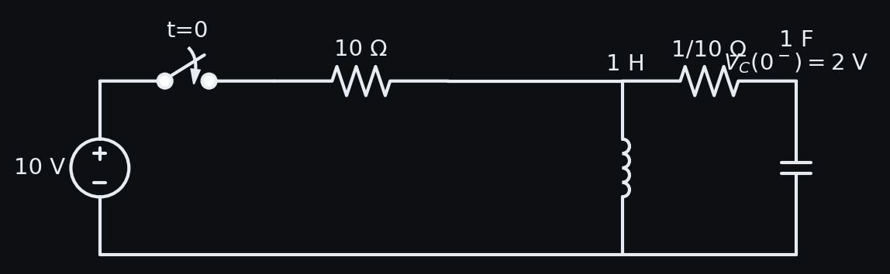

**[2081 Bhadra Q1b]** Switch is closed at $t = 0$. Determine initial and final values of $i_1$ and $i_2$. Find rate of change of current in inductor and rate of change of voltage in capacitor at $t = 0^+$. **[8]**

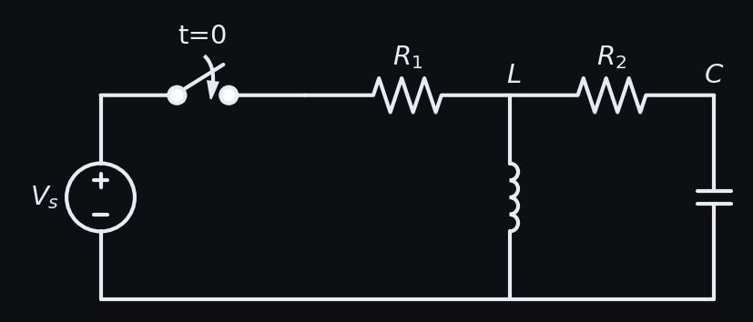

**[2081 Baishakh Q1b]** Obtain $i_1, i_2, di_1/dt, di_2/dt, d^2i_1/dt^2, d^2i_2/dt^2$ at $t = 0^+$, if switch closed at $t = 0$. Circuit: 10 V, 1 $\Omega$ resistors, 1 F capacitor, 3 H inductor. **[8]**

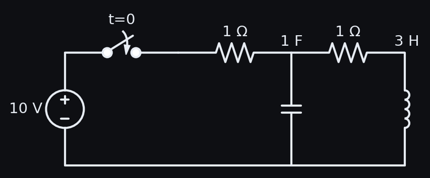

**[2080 Bhadra Q1b]** Determine $i_1, i_2, i_1', i_2', i_1''$ at $t = 0^+$. Circuit: 100 V, 10 $\Omega$, 2 H inductors, 20 $\Omega$, 2 F capacitor. **[8]**

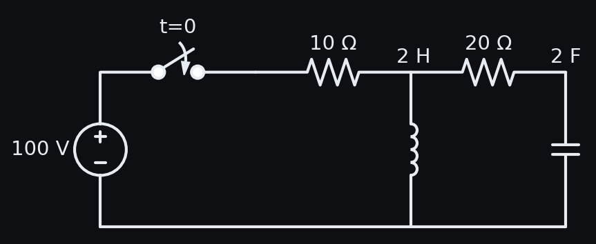

**[2080 Baishakh Q1b]** Obtain $i_1, i_2, di_1/dt, di_2/dt, d^2i_1/dt^2, d^2i_2/dt^2$ at $t = 0^+$. Circuit: $10e^{vt}$ V, 3 H inductor, 5 $\Omega$, 1 F capacitor. **[8]**

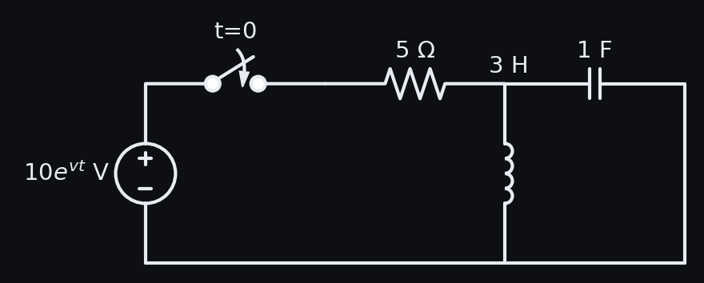

**[2079 Bhadra Q1b]** Find $i_1, i_2, di_1/dt, di_2/dt, d^2i_2/dt^2$ at $t = 0^+$. Circuit: 50 V, 2 $\mu$F, 10 $\Omega$, 2 mH inductor. **[8]**

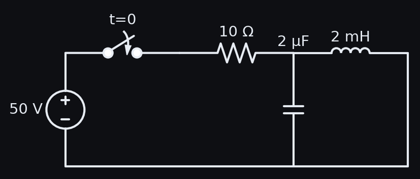

**[2079 Baishakh Q1b]** Two inductors $L_1 = 2$ mH, $L_2 = 6$ mH, $R_1 = 10$ k$\Omega$, $R_2 = 5$ k$\Omega$, $i(L_1)(0) = 2$ A. Solve for $i_1, i_2, di_1/dt, di_2/dt, d^2i_1/dt^2, d^2i_2/dt^2$ at $t = 0^+$. **[8]**

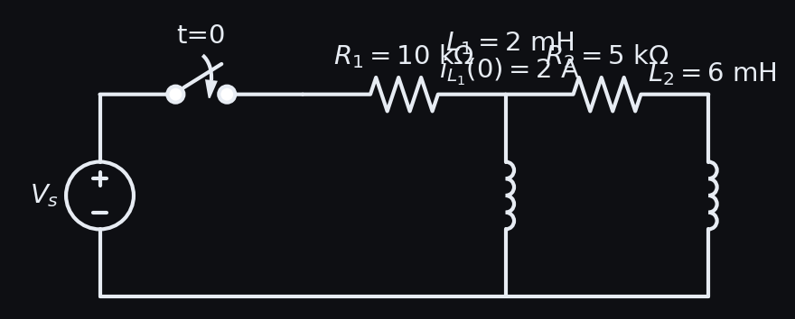

---

## Chapter 3: Transient Analysis — Classical/Direct Method

**[2082 Baishakh Q2a]** Switch is opened at $t = 0$. Find general solution for inductor current and voltage using classical method. Find both at $t = 50$ ms. Circuit: 12 V, 4 $\Omega$, 0.1 H, parallel 20 $\Omega$. **[8]**

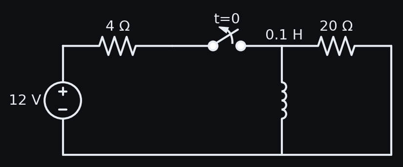

**[2082 Baishakh Q2b]** Find expression of current through inductor using direct solution method, switch closed at $t = 0$. Source: $10\sin(10^4t+60°)$ V, 2 $\Omega$, 0.01 H. **[8]**

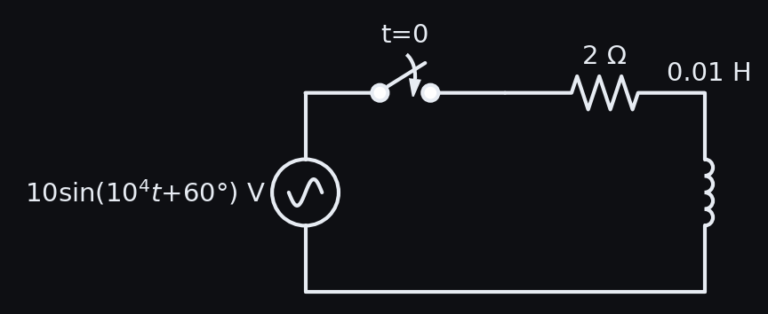

**[2081 Bhadra Q2b]** Exponential voltage $v(t) = V_0 e^{-at}$ applied to RC series circuit. Derive expression of current and charge for $t > 0$ using classical approach. **[8]**

**[2081 Bhadra Q3a]** Find $i_1(t)$ and $i_2(t)$ using classical approach when switch closed at $t = 0$. 10 V, 2 $\Omega$, 1 $\Omega$, 0.5 F capacitor. **[8]**

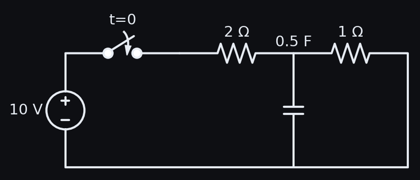

**[2081 Baishakh Q2a]** Switch closed at $t = 0$. Find current through and voltage across capacitor using classical method. Source: $25\sin(10t)$ V, 1 $\Omega$, 1 F. **[8]**

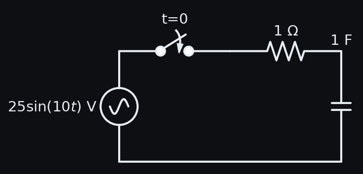

**[2081 Baishakh Q2b]** Find $V_c(t)$ using classical method. Source: $v = 6e^{-t}$ V, 5 $\Omega$, 1 H, 0.25 F. **[8]**

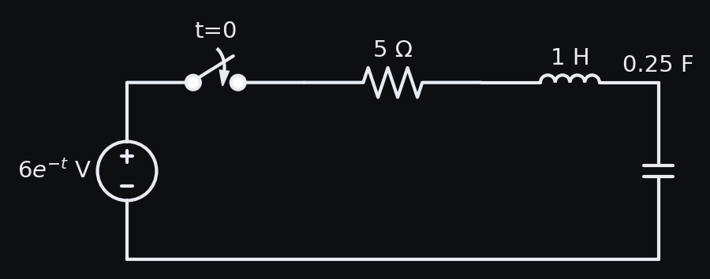

**[2080 Bhadra Q2a]** Two mesh network, switch closed at $t = 0$. Find mesh currents $i_1(t), i_2(t)$ using classical method. Also calculate capacitor voltage. 50 V, 10 $\Omega$, 2 $\mu$F. **[8]**

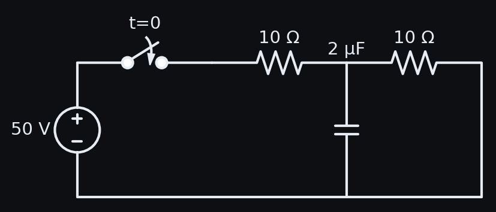

**[2080 Bhadra Q2b]** Switch closed for long time, opens at $t = 0$. Obtain current through inductor and voltage across capacitor for $t > 0$. 12 V, 1 H, 5 $\Omega$, 2 F. **[8]**

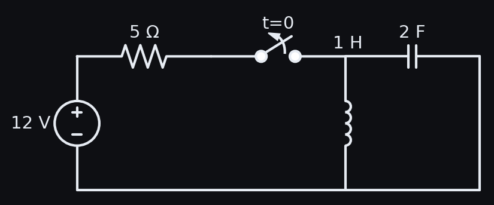

**[2080 Baishakh Q2a]** Find voltage across inductor $L_2$ using classical method. 100 V, 10 $\Omega$, $L_1 = 3$ H, 15 $\Omega$, $L_2 = 2$ H. **[8]**

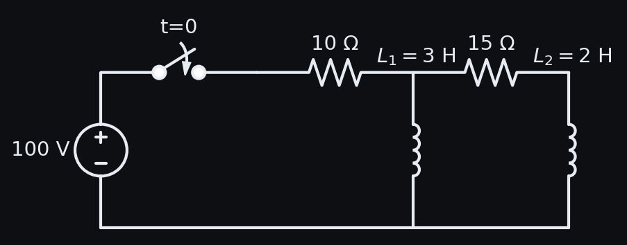

**[2080 Baishakh Q2b]** Calculate total current by source for $t > 0$ using classical method. 100 V, 20 $\Omega$, 10 $\Omega$, 10 mH, 100 F. **[8]**

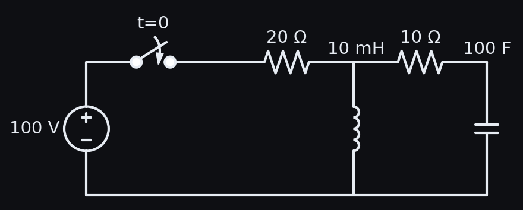

**[2079 Bhadra Q2a]** Find current and voltage across capacitor for $t > 0$ using classical method. 100 V, 20 $\Omega$ resistors, 10 $\Omega$, 20 $\mu$F. **[8]**

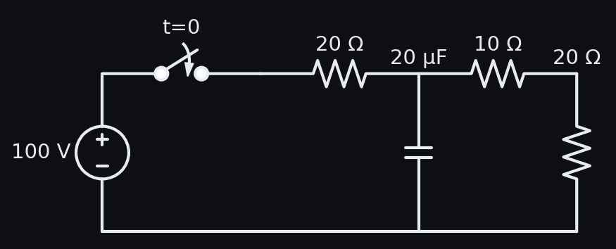

**[2079 Bhadra Q2b]** Find expression of current through inductor for $t > 0$, voltage across inductor at 10 ms. 20 V, 10 V sources, 30 $\Omega$, 70 $\Omega$, 0.5 H, 1 F. **[8]**

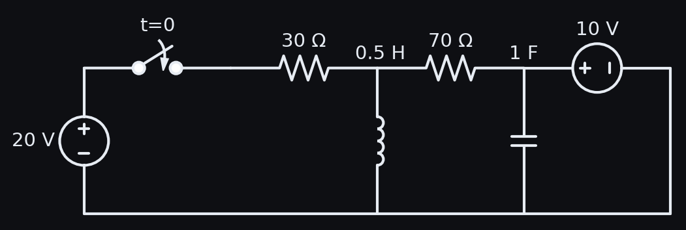

**[2079 Baishakh Q2a]** 3 F capacitor initially charged to 20 V, 6 F capacitor to 10 V. Switch closed at $t = 0$. Solve for $i(t)$ using classical method. **[8]**

> _Figure not included — topology not determined from text. See IOE 2079 Baishakh paper for the canonical figure._

**[2079 Baishakh Q2b]** Exponential current $i(t) = 20e^{5t}$ A applied to parallel RLC ($R = 1/10$ $\Omega$, $L = 10$ mH, $C = 2.5$ $\mu$F). Obtain complete particular solution for $v(t)$ by classical method. **[8]**

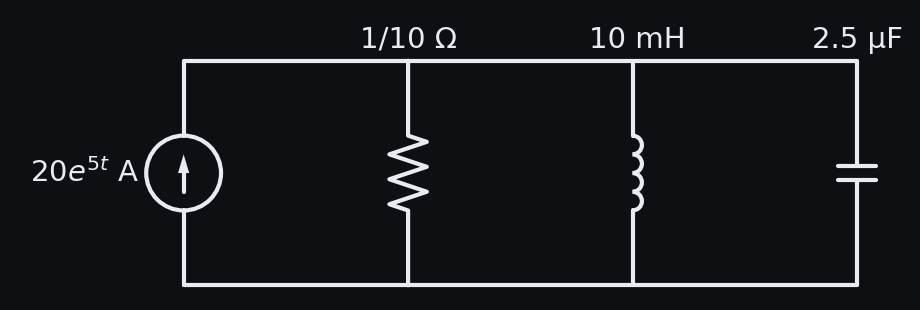

---

## Chapter 4: Transient Analysis — Laplace Transform

**[2082 Baishakh Q3a]** Exponential voltage $20e^{-t}$ applied to RLC series (4 $\Omega$, 1 H, 1/3 F) at $t = 0$. Obtain $i(t)$ using Laplace transform. **[8]**

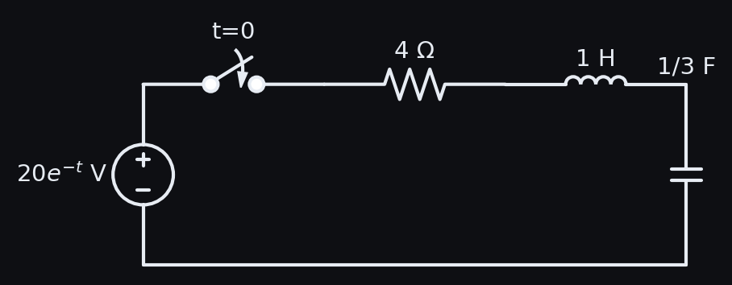

**[2082 Baishakh Q3b]** Steady state with switch closed. 6 V, 6 $\Omega$, 3 $\Omega$, inductor, 1 F cap. Switch opens at $t = 0$. Find $i_L(t)$ and $V_L(t)$ using Laplace. **[8]**

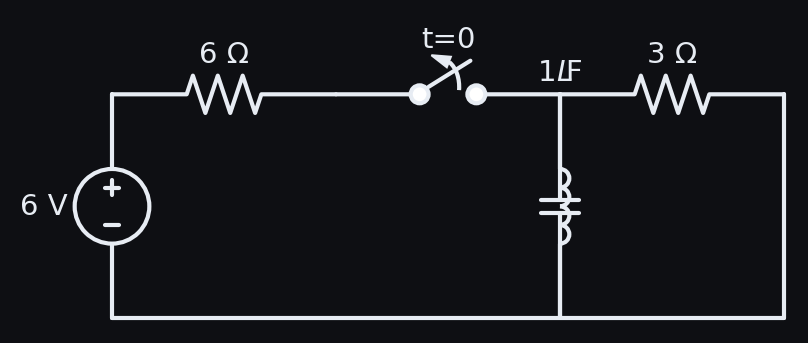

**[2081 Bhadra Q2a]** Switch opened at $t = 0$. Find expression for current and voltage across inductor for $t > 0$ using Laplace. Steady state before. 11 V, 1 H, 1 $\Omega$, 1/9 F. **[8]**

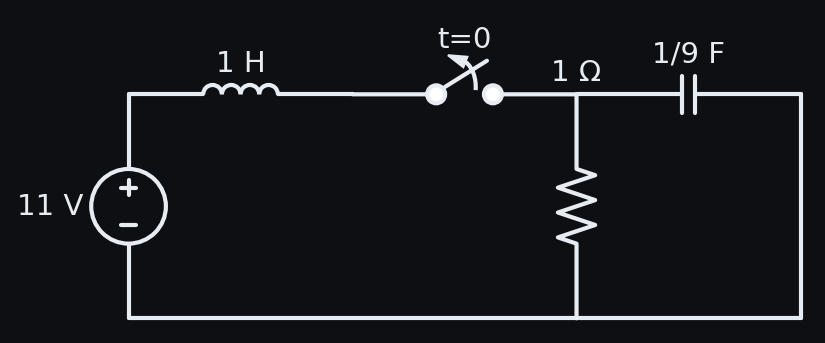

**[2081 Bhadra Q3b]** Determine $i_1(t)$ and $i_2(t)$ for $t > 0$ using Laplace. 60 V, resistors, 20 $\mu$F, 0.8 H. **[8]**

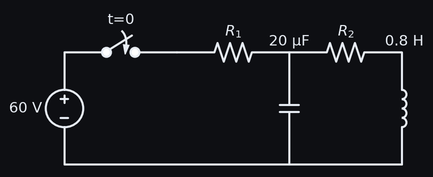

**[2081 Baishakh Q3a]** Switch moved from 1 to 2 at $t = 0$. Find capacitor voltage and current by Laplace. 24 V, 10 $\Omega$ (k=20), 12 $\Omega$, 6 $\Omega$, 1/36 F. **[8]**

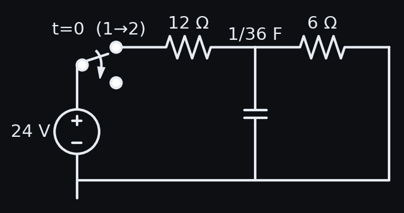

**[2081 Baishakh Q3b]** Switch opened at $t = 0$. Find $V_c(t)$ for $t > 0$ using Laplace. 12 V, 1 $\Omega$, 0.5 H, 5 $\Omega$, 2 F. **[8]**

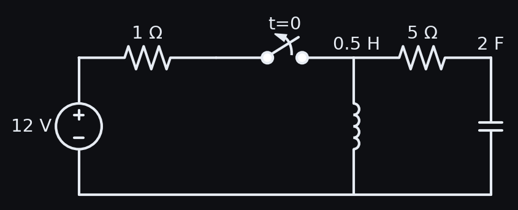

**[2080 Bhadra Q3a]** $s_1$ closed at $t = 0$, $s_2$ opened at $t = 4$ ms. Determine $i(t)$ using Laplace. 100 V, 50 $\Omega$, 100 $\Omega$, inductor. **[8]**

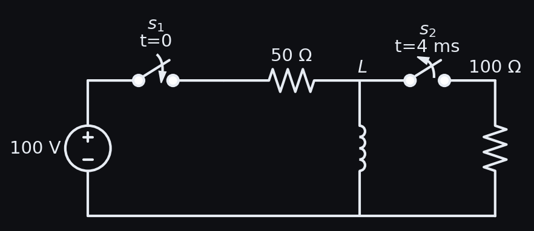

**[2080 Bhadra Q3b]** Parallel circuit, capacitor initial voltage 10 V. Switch closed at $t = 0$. Find $V(t)$ using Laplace. 1 F, 0.25 $\Omega$, 1/10 H. **[8]**

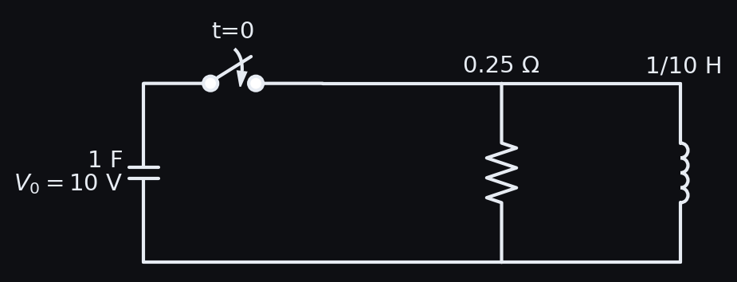

**[2080 Baishakh Q3a]** Find current and $V_C$ for $t > 0$ using Laplace. $v = 10e^{-t}$, 4 $\Omega$, 1 H, 1/3 F. **[8]**

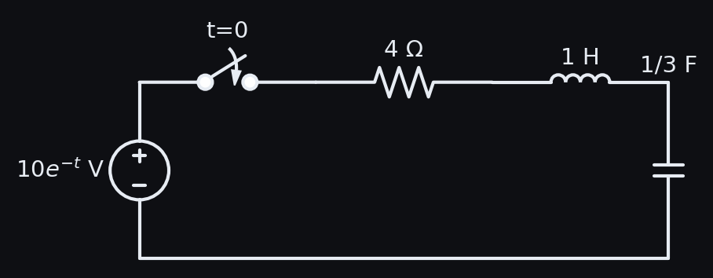

**[2080 Baishakh Q3b]** Find $v(t)$ for $t > 0$ using Laplace. 1 F (initial 10 V), 4 $\Omega$, 3 H. **[8]**

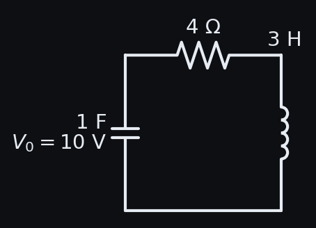

**[2079 Bhadra Q3a]** Find current and voltage across inductor using Laplace. $10e^{-7t}$ V, 10 $\Omega$, 1 H, 1/100 F. **[8]**

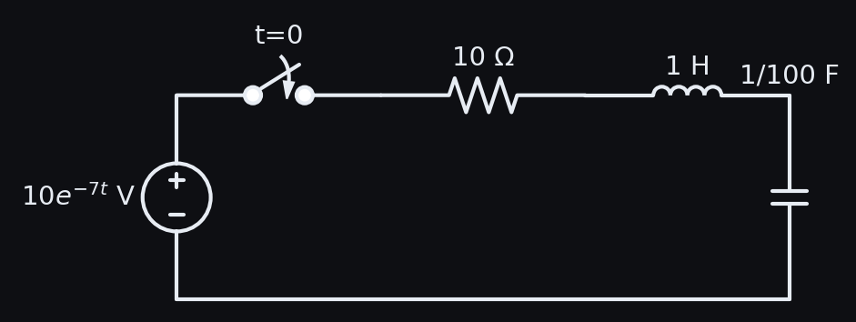

**[2079 Bhadra Q3b]** Find loop currents $i_1, i_2$ for $t > 0$ using Laplace. 10 V, 1 F, 1/6 H, 1/5 $\Omega$. **[8]**

**[2079 Baishakh Q3a]** Steady state with switch closed. Switch opens at $t = 0$. Find current through capacitor using Laplace. 100 V, 20 $\Omega$, 10 $\Omega$, 3 F. **[8]**

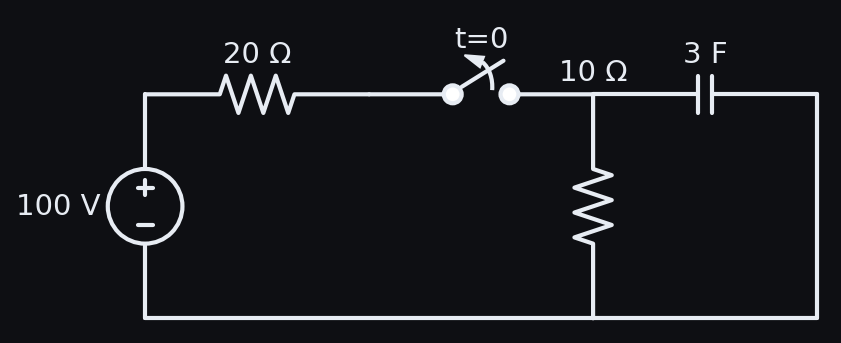

**[2079 Baishakh Q3b]** Steady state with switch open. Switch closed at $t = 0$. Write integrodifferential equations. Evaluate $i_1, i_2$ using Laplace. 100 V, $R_1=10$, $R_2=20$, $R_3=20$, $L=1$ H, $C=1$ $\mu$F. **[8]**

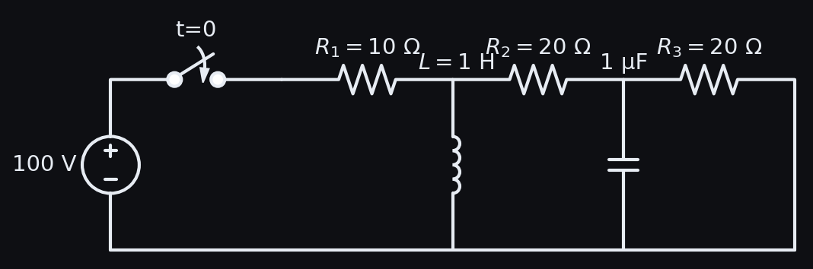

---

## Chapter 5: Frequency Response & Bode Plots

**[2082 Baishakh Q4b]** Draw approximate Bode plot: $H(s) = \frac{200(s^2+5s+25)}{s^2(s+10)(s+30)}$ **[8]**

**[2081 Bhadra Q4b]** Find and plot poles and zeros. Plot asymptotic Bode graph: $G(s) = \frac{5000(s+2)(s+1)}{s(s^2+11s+18)(s^2+5s+225)}$ **[2+8]**

**[2081 Baishakh Q5b]** Draw asymptotic Bode graph: $G(s) = \frac{1000(s+2)}{s(s^2+21s+20)(s^2+2s+100)}$ **[8]**

**[2080 Bhadra Q5b]** Plot frequency response as asymptotic Bode plot: $G(j\omega) = \frac{15(1+j\omega/10)}{j\omega(1+j\omega/2)(1+j0.6(j\omega/50)+(j\omega/50)^2)}$ **[8]**

**[2080 Baishakh Q4b]** Sketch Bode Plot: $G(s) = \frac{30(s+10)}{s(s^2+3s+50)}$ **[8]**

**[2079 Bhadra Q4b]** Draw asymptotic Bode plot: $G(s) = \frac{50(s+10)}{s(s+20)(s^2+2s+225)}$ **[8]**

**[2079 Baishakh Q4b]** Define frequency response. Draw Bode plot: $G(s) = \frac{s}{s(1+0.5s)(1+0.05s)}$ **[8]**

---

## Chapter 6: Fourier Series

**[2082 Baishakh Q5a]** Find Fourier series of sawtooth signal in Polar form and draw line spectra. **[8]**

**[2081 Baishakh Q4b]** Find trigonometric form of Fourier series for triangular wave, sketch line spectrum. Amplitude $V_0$ to $-V_0$, period $T$. **[8]**

**[2080 Bhadra Q4b]** Obtain Trigonometric Fourier Series of rectangular pulse waveform (10 V, period $2\pi$) and sketch line spectra. **[8]**

**[2080 Baishakh Q5b]** Obtain trigonometric Fourier series of trapezoidal waveform (amplitude 20, period $4\pi$), sketch line spectrum. **[8]**

**[2079 Bhadra Q5a]** Obtain trigonometric Fourier series of triangular voltage waveform ($-10$ to $10$, period 2), plot line spectra. **[8]**

**[2079 Baishakh Q5c]** Find trigonometric Fourier series for triangular/zigzag waveform (amplitude 100, period 4). **[6]**

---

## Chapter 7: Two-Port Network Parameters

**[2082 Baishakh Q5b]** Find Y and ABCD parameters of T-network (2 $\Omega$, j4 $\Omega$, 10 $\Omega$ series, j20 $\Omega$, $-j20$ $\Omega$ shunt). Is it reciprocal or symmetrical? **[8]**

**[2081 Bhadra Q5b]** Find Z and T parameters for Pi-network (2 $\Omega$ series, j4 $\Omega$ shunts). Check reciprocal/symmetrical. **[7]**

**[2081 Bhadra Q5c]** Derive equivalent T parameters of two cascaded TPNs. **[3]**

**[2081 Baishakh Q5a]** Two-port with dependent source. Obtain Z and T parameters. Check symmetrical? **[8]**

**[2080 Bhadra Q5a]** Determine T and Y-parameters of 2-port network (2 $\Omega$, 2 H, 1 $\Omega$, 3 $\Omega$ elements). **[8]**

**[2080 Baishakh Q5a]** Find Y and Z parameters for network with $3I_1$ dependent current source. **[8]**

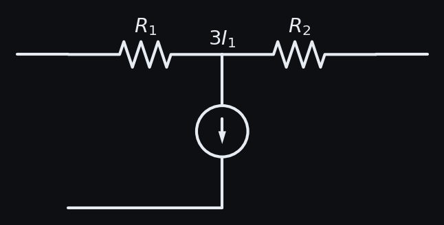

**[2079 Bhadra Q5b]** Calculate [Y] and [Z] parameters. Check reciprocity and symmetry. Network with $2V_1$ dependent source, $2I_2$ dependent source. **[8]**

**[2079 Baishakh Q5a]** Find y and g parameters. Check symmetricity and reciprocity. Network with $3V_1$ dependent voltage source. **[6]**

**[2079 Baishakh Q5b]** Show: Overall ABCD parameter matrix for cascaded network = matrix product of individual ABCD matrices. **[4]**

---

## Network Functions & Transfer Functions

**[2082 Baishakh Q4a]** Find transfer impedance $Z_{21}(s)$ and current ratio transfer function $\alpha_{21}(s)$. Two-port with 1 $\Omega$, 2 H, 2 $\Omega$ shunt. **[8]**

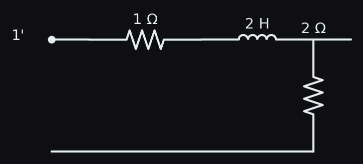

**[2081 Bhadra Q4a]** Find voltage ratio transfer function and transfer impedance when port 2 terminated with 5 $\Omega$. **[6]**

**[2081 Baishakh Q4a]** Find voltage ratio $G_{12}(s)$ and current ratio $\alpha_{21}(s)$. Two-port with 1 H inductors, 1 F cap, 1 $\Omega$ resistors. **[8]**

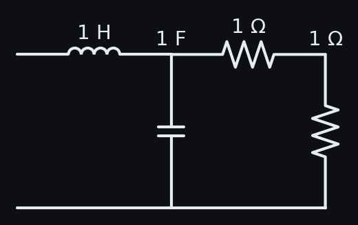

**[2080 Bhadra Q4a]** Determine driving point impedance. With port 2 terminated by 1/2 H inductor, find $Z_{21}(s)$, $Y_{21}(s)$, $\alpha_{21}(s)$. **[8]**

**[2080 Baishakh Q4a]** Find driving point impedance and voltage ratio transfer function. Ladder network: 1 H, 2 H, 1 $\Omega$, 2 $\Omega$. **[8]**

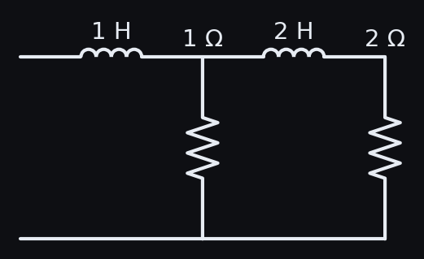

**[2079 Bhadra Q4a]** Find voltage ratio transfer function. Two-port with 3 $\Omega$, 1 $\Omega$, 2 F caps. **[8]**

**[2079 Baishakh Q4a]** Find voltage ratio transfer function with port 2 terminated by 2 H inductor. Ladder: 3 $\Omega$, 1 $\Omega$, 3 H, 2 F, 4 H. **[8]**

---

## Exam Tips

> **Time Management:**
> - Q1 (Resonance + Initial Conditions): ~30 min
> - Q2 (Classical Transient): ~35 min
> - Q3 (Laplace Transient): ~35 min
> - Q4 (Network Functions + Bode/Fourier): ~35 min
> - Q5 (Fourier/Two-Port): ~30 min
> - Buffer: ~15 min for review

> **High-Scoring Strategy:**
> 1. Start with Q1 — it's the most formulaic and guarantees marks
> 2. Attempt all parts — partial marks are awarded generously
> 3. Always draw circuit diagrams before solving
> 4. Show the s-domain equivalent circuit for Laplace problems
> 5. Label Bode plot corner frequencies, slopes, and critical values clearly
> 6. For two-port: always state which port is open/shorted for each parameter
> 7. Check reciprocity/symmetry — it's easy marks (just verify conditions)

> **Common Mistakes to Avoid:**
> - Forgetting initial conditions when writing Laplace equations
> - Wrong sign in mutual impedance (mesh) or mutual admittance (nodal)
> - Confusing series Q ($\omega_0 L/R$) with parallel Q ($R/\omega_0 L$)
> - Not converting to standard form before drawing Bode plot
> - Missing the $(-1)^n$ factor in Fourier coefficients
> - Forgetting the negative sign in ABCD: $V_1 = AV_2 - BI_2$ (note the minus!)
